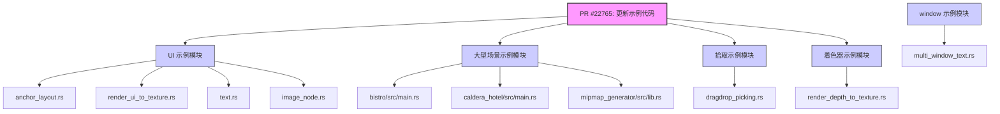

+++
title = "#22765 Use the shorthand functions to construct Vals and UiRects in examples"
date = "2026-02-03T00:00:00"
draft = false
template = "pull_request_page.html"
in_search_index = false

[extra]
current_language = "zh-cn"
available_languages = {"en" = { name = "English", url = "/pull_request/bevy/2026-02/pr-22765-en-20260203" }, "zh-cn" = { name = "中文", url = "/pull_request/bevy/2026-02/pr-22765-zh-cn-20260203" }}
+++

# 使用简写函数构造 Vals 和 UiRects：一次示例代码的现代化改进

## 基本信息
- **标题**: Use the shorthand functions to construct Vals and UiRects in examples
- **PR链接**: https://github.com/bevyengine/bevy/pull/22765
- **作者**: WaterWhisperer
- **状态**: 已合并
- **标签**: D-微小, C-示例, A-UI, S-准备最终审核
- **创建时间**: 2026-02-01T09:27:52Z
- **合并时间**: 2026-02-03T00:03:39Z
- **合并人**: alice-i-cecile

## 描述翻译

### 目标
- 修复 #22753

### 解决方案
- 在示例中将 `Val::Px` 和 `Val::Auto` 替换为 `px()` 和 `auto()`。

### 测试
- 无

## PR 故事：一次示例代码的现代化改进

这个PR的故事始于一个简单但重要的目标：提升Bevy示例代码库的一致性和可读性。作为游戏引擎，Bevy的示例（examples）是用户学习和理解API用法的首要参考。因此，保持示例代码的现代化并展示最佳实践至关重要。

**问题的核心**是代码风格的不一致。在Bevy的UI系统中，定义尺寸和位置有两种方式：一种是直接使用`Val`枚举的变体，如`Val::Px(10.0)`；另一种是使用更简洁的关联函数（associated functions），也称为简写函数，如`px(10.0)`。这两种方式在功能上是完全等价的，但后者提供了更清晰、更符合人体工程学（ergonomic）的API。问题#22753很可能指出了这种不一致性，或者开发者社区认为应该鼓励使用更简洁的写法。

**解决方案**非常直接且机械：在所有受影响的示例文件中，将显式的`Val::Px(...)`和`Val::Auto`构造替换为对应的`px(...)`和`auto()`函数调用。这个改动不涉及任何逻辑变更、性能优化或功能添加，纯粹是代码风格（code style）的改进。这种类型的修改对于大型开源项目很重要，它能确保新用户接触到的示例代码反映的是当前推荐和首选的API使用方式。

**从实现细节来看**，这个PR修改了10个示例文件，涵盖了UI、大场景、拾取（picking）和着色器等多个模块。变更的模式高度一致。以`examples/ui/layout/anchor_layout.rs`为例，修改前的代码像这样定义外边距：
```rust
margin: UiRect::vertical(Val::Auto),
```
修改后变为：
```rust
margin: UiRect::vertical(auto()),
```
同样，对于像素值，`Val::Px(10.0)`被替换为`px(10.0)`。另一个常见的模式是修改`UiRect::all(...)`的参数，例如在`examples/picking/dragdrop_picking.rs`中：
```rust
// 修改前
margin: UiRect::all(Val::Px(10.0)),
// 修改后
margin: UiRect::all(px(10.0)),
```
这些改动虽然微小，但累积起来显著减少了视觉噪音（visual noise）。`px(10.0)`比`Val::Px(10.0)`更短，让开发者能更快地识别出这是一个具体的像素值。`auto()`函数同样比`Val::Auto`更简洁。

**技术背景**：`Val`是Bevy UI布局系统中的一个枚举（enum），用于表示尺寸或位置的数值，可以是像素（Px）、百分比（Percent）、自动（Auto）等。`px()`和`auto()`是`Val`类型上定义的关联函数，它们只是返回对应枚举变体的便捷方法。这种设计模式在Rust生态中很常见，它通过提供简写来改善开发体验（DX, Developer Experience）。

**这次修改的影响**是积极的。首先，它统一了示例代码的风格，使其符合潜在的项目代码规范或社区共识。其次，它通过展示更简洁的语法，潜移默化地引导新用户采用这种更优的写法。最后，保持示例代码的现代化有助于维护项目的整体健康度，减少“历史包袱”。

从工程角度看，这是一个典型的“琐碎但重要”（trivial but important）的维护性任务。它不需要复杂的算法设计或架构调整，但对项目的长期可维护性和新用户体验有实际的贡献。此类PR通常由社区成员贡献，是参与开源项目很好的切入点。

## 视觉表示



## 关键文件变更

以下是本次PR中修改的几个代表性文件：

1.  **`examples/ui/render_ui_to_texture.rs` (+6/-7)**
    *   **修改说明**：这个示例展示了如何将UI渲染到纹理。修改涉及将`Val::Px`和`Val::Auto`替换为简写函数，包括在动态更新节点位置时使用`px()`函数。
    *   **代码片段**:
        ```rust
        // 修改前
        node.left = Val::Px(drag.pointer_location.position.x - computed.size.x / 2.0);
        node.top = Val::Px(drag.pointer_location.position.y - 50.0);
        // 修改后
        node.left = px(drag.pointer_location.position.x - computed.size.x / 2.0);
        node.top = px(drag.pointer_location.position.y - 50.0);
        ```

2.  **`examples/ui/layout/anchor_layout.rs` (+4/-4)**
    *   **修改说明**：此示例演示了UI节点的锚点布局。修改将`Val::Auto`在`UiRect`构造中的使用统一改为`auto()`函数。
    *   **代码片段**:
        ```rust
        // 修改前
        margin: UiRect::all(Val::Auto),
        // 修改后
        margin: UiRect::all(auto()),
        ```

3.  **`examples/picking/dragdrop_picking.rs` (+3/-3)**
    *   **修改说明**：这个示例实现了拖拽拾取功能。修改更新了按钮节点的尺寸和外边距的定义方式。
    *   **代码片段**:
        ```rust
        // 修改前
        width: Val::Px(BUTTON_WIDTH),
        height: Val::Px(BUTTON_HEIGHT),
        margin: UiRect::all(Val::Px(10.0)),
        // 修改后
        width: px(BUTTON_WIDTH),
        height: px(BUTTON_HEIGHT),
        margin: UiRect::all(px(10.0)),
        ```

4.  **`examples/ui/text/text.rs` (+3/-3)**
    *   **修改说明**：文字显示示例。修改了浮动提示框的外边距和位置值。
    *   **代码片段**:
        ```rust
        // 修改前
        margin: UiRect::all(Val::Px(12.0)),
        top: Val::Px(5.0),
        right: Val::Px(5.0),
        // 修改后
        margin: UiRect::all(px(12.0)),
        top: px(5.0),
        right: px(5.0),
        ```

5.  **`examples/large_scenes/bistro/src/main.rs` (+2/-2)**
    *   **修改说明**：大型场景示例的一部分。修改了一个覆盖层节点的位置定义。
    *   **代码片段**:
        ```rust
        // 修改前
        left: Val::Px(1.5),
        top: Val::Px(1.5),
        // 修改后
        left: px(1.5),
        top: px(1.5),
        ```

## 延伸阅读

1.  **Bevy UI 布局官方指南**: 深入了解`Val`类型、`Node`组件以及Bevy的整个UI布局系统。
2.  **Rust 关联函数（Associated Functions）**: 理解`px()`和`auto()`这类简写函数背后的语言特性。
3.  **Bevy `Val` 类型 API 文档**: 查看`Val`枚举的所有变体及其对应的便捷构造函数。