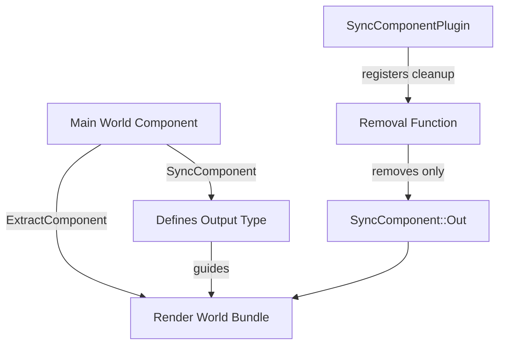

+++
title = "#22766 Refactor extraction to bypass the orphan rules"
date = "2026-02-06T00:00:00"
draft = false
template = "pull_request_page.html"
in_search_index = true

[taxonomies]
list_display = ["show"]

[extra]
current_language = "en"
available_languages = {"en" = { name = "English", url = "/pull_request/bevy/2026-02/pr-22766-en-20260206" }, "zh-cn" = { name = "中文", url = "/pull_request/bevy/2026-02/pr-22766-zh-cn-20260206" }}
labels = ["C-Bug", "A-Rendering", "C-Usability", "M-Migration-Guide"]
+++

# Title

## Basic Information
- **Title**: Refactor extraction to bypass the orphan rules
- **PR Link**: https://github.com/bevyengine/bevy/pull/22766
- **Author**: kristoff3r
- **Status**: MERGED
- **Labels**: C-Bug, A-Rendering, C-Usability, S-Ready-For-Final-Review, M-Migration-Guide
- **Created**: 2026-02-01T15:34:09Z
- **Merged**: 2026-02-06T21:50:10Z
- **Merged By**: alice-i-cecile

## Description Translation
# Objective

Fixes #18722, and allows `ExtractComponent` to be used for foreign types. 

## Solution

* Split the `Out` type from `ExtractComponent` to a `SyncComponent` trait. This allows types to use the synchronization logic without the extraction logic, and allows `SyncComponentPlugin` to correctly identify which components should be removed.
* Don't delete the entire entity but only the `Out` components in `SyncComponentPlugin`/`SyncWorldPlugin`, fixing #18722.
* Add marker types to `ExtractComponent` and `SyncComponent`, allowing them to be implemented for foreign types outside `bevy_render`. (Example: `DirectionalLight` is defined in `bevy_light` which doesn't depend on `bevy_render`, and used by `bevy_pbr`. Without the marker no crate is allowed to implement the trait.)

During some earlier render crate refactors by @atlv24, some uses of `ExtractComponent` was converted to manual implementations. I have not ported these back, that can be done in follow up PRs.

As a follow up it might be interesting  to make a derive macro for `SyncComponent`, and/or update the `ExtractComponent` macro to be able to customize the behavior around syncing.

## Testing

Ran a bunch of the examples. It would be good to test others, especially ones that toggle components.

~~A test case is in #22758. If that one gets merged first this PR should be updated to uncomment the relevant assert.~~ edit: the assert has been added.

## The Story of This Pull Request

The Bevy rendering system operates across two separate worlds: the main app world and the render world. Components need to be extracted from the main world and transferred to the render world for processing. This extraction is handled by the `ExtractComponent` trait and the `ExtractComponentPlugin`. However, the system had two significant technical problems that this PR addresses.

The first problem was Rust's orphan rules, which prevented implementing the `ExtractComponent` trait for types defined outside the `bevy_render` crate. For example, `DirectionalLight` is defined in `bevy_pbr` but needs to be extracted for rendering. Since `ExtractComponent` is defined in `bevy_render`, neither the trait nor the type is local to `bevy_pbr`, making it impossible to implement the trait directly.

The second problem was a bug (#18722) in component cleanup. When a component was removed from an entity in the main world, the synchronization system would delete the entire corresponding entity in the render world, not just the extracted components. This caused issues when other components were attached to the render world entity.

The solution involved restructuring the extraction system into two separate concerns: synchronization and extraction. Previously, `ExtractComponent` defined both the extraction logic and the output type. This PR splits that responsibility:

1. A new `SyncComponent` trait defines the output type that should be removed when the component is deleted
2. `ExtractComponent` now depends on `SyncComponent` and only handles the extraction logic
3. Marker types are added to both traits to bypass Rust's orphan rules

This architectural change allows foreign types to implement the traits by using a local marker type (typically the plugin type) as a parameter. For example, `DirectionalLight` in `bevy_pbr` can now implement `SyncComponent<PbrPlugin>`.

The implementation also fixes the cleanup bug. Previously, when a component was removed, the entire render world entity was despawned. Now, `SyncComponentPlugin` uses a removal function that only removes the components specified by `SyncComponent::Out`. This is more precise and preserves other components attached to the render world entity.

The changes required updates throughout the codebase where `ExtractComponent` was implemented. Each implementation now needs to provide both `SyncComponent` and `ExtractComponent` implementations, with `ExtractComponent` inheriting the `Out` type from `SyncComponent`.

## Visual Representation



## Key Files Changed

### `crates/bevy_render/src/extract_component.rs` (+21/-30)
This file contains the core refactoring of the extraction system. The `ExtractComponent` trait no longer defines an `Out` associated type, and now depends on `SyncComponent` for that information.

```rust
// Before:
pub trait ExtractComponent: Component {
    type QueryData: ReadOnlyQueryData;
    type QueryFilter: QueryFilter;
    type Out: Bundle<Effect: NoBundleEffect>;
    fn extract_component(item: QueryItem<'_, '_, Self::QueryData>) -> Option<Self::Out>;
}

// After:
pub trait ExtractComponent<Marker = ()>: SyncComponent {
    type QueryData: ReadOnlyQueryData;
    type QueryFilter: QueryFilter;
    fn extract_component(item: QueryItem<'_, '_, Self::QueryData>) -> Option<Self::Out>;
}
```

The `ExtractComponentPlugin` also changed to accommodate the marker type parameter, allowing foreign implementations.

### `crates/bevy_render/src/sync_component.rs` (+39/-9)
This new file (split from the extraction logic) defines the `SyncComponent` trait and its plugin. The key change is the removal function that now only removes the `Out` components instead of the entire entity.

```rust
// Before (in sync_world.rs):
EntityRecord::ComponentRemoved(main_entity) => {
    // ... despawn entire entity
}

// After:
EntityRecord::ComponentRemoved(main_entity, removal_function) => {
    if let Ok(render_world_entity) = render_world.get_entity_mut(render_entity.id()) {
        removal_function(render_world_entity); // Only removes SyncComponent::Out
    }
}
```

### `release-content/migration-guides/extract_refactor.md` (+41/-0)
A new migration guide explains how to update code using the old `ExtractComponent` pattern. It shows the before/after structure with clear code examples.

### `crates/bevy_pbr/src/lib.rs` (+22/-5)
This file demonstrates the pattern for implementing extraction for foreign types. Multiple light types now implement `SyncComponent<PbrPlugin>` with the plugin as a marker.

```rust
impl SyncComponent<PbrPlugin> for DirectionalLight {
    type Out = Self;
}
```

The plugin registrations also changed to include the marker type parameter.

### `crates/bevy_post_process/src/dof/mod.rs` (+13/-10)
This file shows the cleanup improvement. Instead of manually listing all components to remove, it now uses the `SyncComponent::Out` type.

```rust
// Before:
entity_commands.remove::<(
    DepthOfField,
    DepthOfFieldUniform,
    DepthOfFieldPipelines,
    AuxiliaryDepthOfFieldTexture,
    ViewDepthOfFieldBindGroupLayouts,
)>();

// After:
entity_commands.remove::<<DepthOfField as SyncComponent>::Out>();
```

## Further Reading

- [Rust Orphan Rules](https://doc.rust-lang.org/book/ch10-02-traits.html#implementing-a-trait-on-a-type) - Understanding the trait implementation restrictions
- [Bevy ECS Guide](https://bevyengine.org/learn/quick-start/ecs/) - Bevy's Entity Component System architecture
- [Extract Schedule Documentation](https://docs.rs/bevy_render/latest/bevy_render/extract_component/index.html) - How extraction works in Bevy's render pipeline