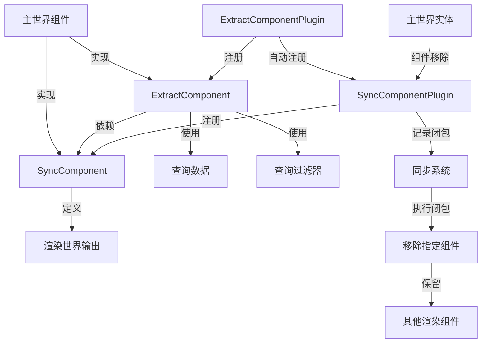

+++
title = "#22766 Refactor extraction to bypass the orphan rules"
date = "2026-02-06T00:00:00"
draft = false
template = "pull_request_page.html"
in_search_index = false

[extra]
current_language = "zh-cn"
available_languages = {"en" = { name = "English", url = "/pull_request/bevy/2026-02/pr-22766-en-20260206" }, "zh-cn" = { name = "中文", url = "/pull_request/bevy/2026-02/pr-22766-zh-cn-20260206" }}
+++

# Refactor extraction to bypass the orphan rules

## Basic Information
- **标题**: Refactor extraction to bypass the orphan rules
- **PR链接**: https://github.com/bevyengine/bevy/pull/22766
- **作者**: kristoff3r
- **状态**: 已合并
- **标签**: C-Bug, A-Rendering, C-Usability, S-Ready-For-Final-Review, M-Migration-Guide
- **创建时间**: 2026-02-01T15:34:09Z
- **合并时间**: 2026-02-06T21:50:10Z
- **合并者**: alice-i-cecile

## 描述翻译
**目标**

修复 #18722，并允许 `ExtractComponent` 用于外部类型。

**解决方案**

* 将 `ExtractComponent` 中的 `Out` 类型拆分为一个独立的 `SyncComponent` 特质。这允许类型在不使用提取逻辑的情况下使用同步逻辑，并允许 `SyncComponentPlugin` 正确识别应删除哪些组件。
* 在 `SyncComponentPlugin`/`SyncWorldPlugin` 中不删除整个实体，只删除 `Out` 组件，从而修复 #18722。
* 为 `ExtractComponent` 和 `SyncComponent` 添加标记类型，允许在 `bevy_render` 之外为外部类型实现这些特质。（例如：`DirectionalLight` 定义在不依赖 `bevy_render` 的 `bevy_light` 中，并被 `bevy_pbr` 使用。没有标记的话，任何 crate 都不能实现该特质。）

在早期由 @atlv24 进行的渲染 crate 重构中，一些 `ExtractComponent` 的使用被转换为手动实现。我尚未将这些改回来，这可以在后续的 PR 中完成。

作为后续工作，为 `SyncComponent` 制作一个派生宏，和/或更新 `ExtractComponent` 宏以能够自定义同步行为，可能会很有趣。

**测试**

运行了一堆示例。测试其他示例，特别是切换组件的示例，会很好。

~~测试用例在 #22758 中。如果那个先被合并，这个 PR 应该被更新以取消相关断言的注释。~~ 编辑：断言已被添加。

## 本次 Pull Request 的故事

Bevy 引擎中的渲染系统采用双世界架构：一个主世界（app world）用于逻辑更新，一个渲染世界（render world）用于渲染操作。在这两个世界之间同步组件数据是一个核心需求，`ExtractComponent` 特质长期以来一直扮演着这个角色。然而，它面临两个关键的技术限制：Rust 的孤儿规则（orphan rules）限制了为外部类型实现该特质，以及删除组件时会错误地清除整个渲染实体。PR #22766 系统地解决了这些问题，并对提取系统进行了重构。

**问题与上下文**

`ExtractComponent` 特质的设计将数据提取和组件同步两个关注点耦合在一起。每个实现必须定义三个关联类型：`QueryData`、`QueryFilter` 和 `Out`。这种设计在 Rust 的孤儿规则下产生了问题：由于 `ExtractComponent` 定义在 `bevy_render` crate 中，外部 crate 不能为它们自己的类型（如 `DirectionalLight`，定义在 `bevy_pbr`）实现该特质，因为 `bevy_pbr` 不依赖 `bevy_render`。这迫使开发者采用不理想的变通方案，如手动提取函数，破坏了系统的一致性。

更严重的是，`SyncComponentPlugin` 在处理组件删除时存在一个错误（#18722）。当某个组件从主世界实体中移除时，插件会删除整个对应的渲染世界实体，而不是只删除与移除的组件相关的 `Out` 组件。这会导致所有其他提取的组件也丢失，引起难以调试的渲染问题。

**解决方案方法**

开发者采用了分解（refactoring）的方法来解决这两个问题。核心洞察是：同步逻辑（识别哪些组件需要被删除）与提取逻辑（如何从主世界组件生成渲染世界组件）本质上是不同的关注点。因此，解决方案将原来的 `ExtractComponent::Out` 关联类型拆分到一个新的独立特质 `SyncComponent` 中。`SyncComponent` 只关心组件与渲染世界输出的映射关系，而 `ExtractComponent` 现在扩展（或依赖）`SyncComponent`，专注于提取过程本身。

为了绕过孤儿规则，两个特质都引入了可选的标记类型参数（marker type）。这利用了 Rust 的"本地特质"规则：即使特质和类型都定义在外部 crate，只要特质实现中涉及了本地类型（标记类型），就可以实现该特质。

对于组件删除问题，解决方案是修改 `SyncComponentPlugin` 的行为。它不再删除整个实体，而是根据 `SyncComponent::Out` 类型只移除相关的组件。这是通过向 `EntityRecord::ComponentRemoved` 变体添加一个闭包函数来实现的，该闭包知道如何删除特定组件的输出。

**实现详情**

这次重构触及了多个 crate，但核心变化集中在 `bevy_render` 中。新的 `SyncComponent` 特质定义了 `Out` 关联类型，表示在渲染世界中应该被同步的组件或组件集合（bundle）。

```rust
// crates/bevy_render/src/sync_component.rs
pub trait SyncComponent<Marker = ()>: Component {
    type Out: Bundle<Effect: NoBundleEffect>;
}
```

`ExtractComponent` 特质现在扩展了 `SyncComponent`，不再定义自己的 `Out` 类型：

```rust
// crates/bevy_render/src/extract_component.rs
pub trait ExtractComponent<Marker = ()>: SyncComponent {
    type QueryData: ReadOnlyQueryData;
    type QueryFilter: QueryFilter;
    
    fn extract_component(item: QueryItem<'_, '_, Self::QueryData>) -> Option<Self::Out>;
}
```

关键的变化发生在 `SyncComponentPlugin` 的组件移除处理中。之前，当组件被移除时，它会记录 `EntityRecord::ComponentRemoved(context.entity)`，导致整个实体被删除。现在，它记录一个包含删除函数的变体：

```rust
// crates/bevy_render/src/sync_component.rs
on_remove(|mut world, context| {
    let mut pending = world.resource_mut::<PendingSyncEntity>();
    pending.push(EntityRecord::ComponentRemoved(
        context.entity,
        |mut entity| {
            entity.remove::<C::Out>();
        },
    ));
});
```

这个闭包在同步系统（`entity_sync_system`）中被调用，精确地移除 `Out` 组件，而不是整个实体。

为了保持向后兼容性，`ExtractComponentPlugin` 自动注册 `SyncComponentPlugin`，确保同步逻辑被启用。此外，`bevy_render` 的 `derive_extract_component` 宏被更新，自动为结构体生成 `SyncComponent` 实现。

**技术洞察**

这次重构展示了几个重要的 Rust 设计模式：

1. **关注点分离**：将同步映射（`SyncComponent`）与提取逻辑（`ExtractComponent`）分离，使得每个特质更单一、更可重用。
2. **孤儿规则规避**：使用标记类型参数是 Rust 中绕过孤儿规则的常见技术。通过要求实现者指定一个本地类型作为标记，我们创建了一个"本地上下文"，允许为外部类型实现外部特质。
3. **闭包驱动的清理**：将清理逻辑封装在闭包中，允许类型安全的组件删除，无需动态类型检查或反射。

性能方面，这个变化应该是中性的或略有正面影响，因为减少了不必要的实体删除和重新创建。架构上，它为未来的扩展奠定了基础，比如为 `SyncComponent` 创建派生宏，或者为 `ExtractComponent` 添加更复杂的同步行为定制。

**影响**

这次重构解决了两个长期存在的问题：
1. **外部类型支持**：现在，像 `DirectionalLight` 这样的类型可以在 `bevy_pbr` 中直接实现 `ExtractComponent`，无需手动提取函数。
2. **正确的组件删除**：当组件被移除时，只有相关的渲染组件被删除，其他提取的组件保持不变。

迁移相对简单：对于现有的 `ExtractComponent` 实现，只需将 `type Out` 移动到新的 `SyncComponent` 实现中。迁移指南（`extract_refactor.md`）提供了清晰的示例。

对于 Bevy 生态系统来说，这次变化提高了渲染系统的健壮性和可扩展性，减少了潜在的错误，并为更复杂的提取模式打开了大门。

## 可视化表示



## 关键文件更改

**`crates/bevy_render/src/extract_component.rs` (+21/-30)**
这个文件包含了 `ExtractComponent` 特质的重定义。主要变化是移除了 `Out` 关联类型，并使其扩展新的 `SyncComponent` 特质。
```rust
// Before:
pub trait ExtractComponent: Component {
    type QueryData: ReadOnlyQueryData;
    type QueryFilter: QueryFilter;
    type Out: Bundle<Effect: NoBundleEffect>;
    fn extract_component(item: QueryItem<'_, '_, Self::QueryData>) -> Option<Self::Out>;
}

// After:
pub trait ExtractComponent<Marker = ()>: SyncComponent {
    type QueryData: ReadOnlyQueryData;
    type QueryFilter: QueryFilter;
    fn extract_component(item: QueryItem<'_, '_, Self::QueryData>) -> Option<Self::Out>;
}
```

**`crates/bevy_render/src/sync_component.rs` (+39/-9)**
新文件定义了 `SyncComponent` 特质和相关的插件。关键部分是 `on_remove` 钩子中闭包的使用。
```rust
// 新增的trait定义
pub trait SyncComponent<Marker = ()>: Component {
    type Out: Bundle<Effect: NoBundleEffect>;
}

// 组件移除处理
on_remove(|mut world, context| {
    let mut pending = world.resource_mut::<PendingSyncEntity>();
    pending.push(EntityRecord::ComponentRemoved(
        context.entity,
        |mut entity| {
            entity.remove::<C::Out>();  // 只删除相关组件
        },
    ));
});
```

**`release-content/migration-guides/extract_refactor.md` (+41/-0)**
新增的迁移指南，展示了如何将现有的 `ExtractComponent` 实现迁移到新的结构。
```rust
// 迁移前:
impl ExtractComponent for MyComponent {
    type QueryData = ();
    type QueryFilter = ();
    type Out = Self;
    fn extract_component(item: QueryItem<'_, '_, Self::QueryData>) -> Option<Self::Out> {
        Some(*item)
    }
}

// 迁移后:
impl SyncComponent for MyComponent {
    type Out = Self;
}

impl ExtractComponent for MyComponent {
    type QueryData = ();
    type QueryFilter = ();
    fn extract_component(item: QueryItem<'_, '_, Self::QueryData>) -> Option<Self::Out> {
        Some(*item)
    }
}
```

**`crates/bevy_pbr/src/lib.rs` (+22/-5)**
展示了如何使用标记类型为外部类型（如 `DirectionalLight`）实现 `SyncComponent`。通过使用 `PbrPlugin` 作为标记，`bevy_pbr` 可以为这些类型实现特质。
```rust
impl SyncComponent<PbrPlugin> for DirectionalLight {
    type Out = Self;
}
// 类似的实现还有 PointLight, SpotLight, AmbientLight, ShadowFilteringMethod
```

**`crates/bevy_post_process/src/dof/mod.rs` (+13/-10)**
展示了如何利用新的 `SyncComponent::Out` 类型来简化组件清理代码。
```rust
// Before:
entity_commands.remove::<(
    DepthOfField,
    DepthOfFieldUniform,
    DepthOfFieldPipelines,
    AuxiliaryDepthOfFieldTexture,
    ViewDepthOfFieldBindGroupLayouts,
)>();

// After:
entity_commands.remove::<<DepthOfField as SyncComponent>::Out>();
```

## 进一步阅读

1. **Rust 孤儿规则**：
   - [The Rust Programming Language - Trait Implementation Rules](https://doc.rust-lang.org/book/ch10-02-traits.html#implementing-a-trait-on-a-type)
   - [Rust RFC 1023 - Rebalancing Coherence](https://github.com/rust-lang/rfcs/blob/master/text/1023-rebalancing-coherence.md)

2. **Bevy 提取系统**：
   - [Bevy Render Graph Documentation](https://docs.rs/bevy_render/latest/bevy_render/render_graph/index.html)
   - [Bevy ECS System Scheduling](https://bevyengine.org/learn/quick-start/ecs-intro/#system-scheduling)

3. **软件设计模式**：
   - 关注点分离（Separation of Concerns）
   - 策略模式（Strategy Pattern）通过特质实现
   - 依赖注入（Dependency Injection）在插件系统中的体现

4. **相关 PR 和 Issues**：
   - Issue #18722: 组件删除时错误地清除整个实体
   - 早期渲染重构 PRs，展示了手动提取的演变过程