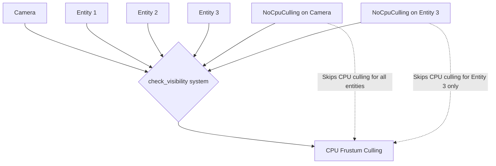

+++
title = "#22767 Add per-entity NoCpuCulling"
date = "2026-02-04T00:00:00"
draft = false
template = "pull_request_page.html"
in_search_index = true

[taxonomies]
list_display = ["show"]

[extra]
current_language = "en"
available_languages = {"en" = { name = "English", url = "/pull_request/bevy/2026-02/pr-22767-en-20260204" }, "zh-cn" = { name = "中文", url = "/pull_request/bevy/2026-02/pr-22767-zh-cn-20260204" }}
labels = ["C-Feature", "A-Rendering", "D-Straightforward"]
+++

# Title
Add per-entity NoCpuCulling

## Basic Information
- **Title**: Add per-entity NoCpuCulling
- **PR Link**: https://github.com/bevyengine/bevy/pull/22767
- **Author**: Lampan-git
- **Status**: MERGED
- **Labels**: C-Feature, A-Rendering, S-Ready-For-Final-Review, D-Straightforward
- **Created**: 2026-02-01T17:12:34Z
- **Merged**: 2026-02-04T17:02:11Z
- **Merged By**: alice-i-cecile

## Description Translation

# Objective

- I use a compute shader to update the transforms and write them to MeshInput directly for some entities and doesn't readback to the CPU. This has the unfortunate side-effect of making the main world transform positions always being (0,0) and then being frustum culled on the CPU side. There is no way to disable CPU culling per entity, hence this PR. 

## Solution

- Use the same `Has<NoCpuCulling>` for visible_aabb_query as view_query

## Testing

I checked in RenderDoc for VkDrawIndexedIndirectCommand's instanceCount, which results in the same number as without NoCpuCulling, and lower number than with NoFrustumCulling. It also works when looking away from the center. 

Note that this is my first real contribution and I have no real rendering experience. 

## The Story of This Pull Request

The developer faced a specific rendering challenge where they were using compute shaders to update entity transforms on the GPU side. They were writing transforms directly to `MeshInput` without reading back to the CPU, which created a disconnect: the GPU had accurate transform data for rendering, but the CPU-side world transform positions remained at (0,0,0). This stale CPU data caused the frustum culling system to incorrectly cull these entities, even when they should have been visible.

The existing `NoCpuCulling` component was designed to address similar issues, but it had a limitation - it could only be applied at the camera level. When attached to a camera, it would disable CPU-side culling for all entities rendered by that camera. This was too broad for the developer's use case, where only specific entities (those with GPU-updated transforms) needed CPU culling disabled.

The solution implemented in this PR is straightforward but effective: extend the `NoCpuCulling` component to work on a per-entity basis, not just per-camera. The implementation modifies the `check_visibility` system to check for `NoCpuCulling` on both cameras and individual entities.

Here's how the logic works in practice: when the system processes entities for visibility determination, it now checks three conditions before performing CPU-side frustum culling:
1. Whether the entity has `NoFrustumCulling` (disables all frustum culling)
2. Whether the camera has `NoCpuCulling` (existing behavior)
3. Whether the entity has `NoCpuCulling` (new behavior)

The key change is in the condition check within `check_visibility`:

```rust
// Before:
if !no_frustum_culling && !no_cpu_culling && let Some(model_aabb) = maybe_model_aabb

// After:
if !no_frustum_culling && !no_cpu_culling_camera && !no_cpu_culling_entity && let Some(model_aabb) = maybe_model_aabb
```

This change allows for more granular control over the culling behavior. Entities with GPU-updated transforms can now be marked with `NoCpuCulling` to prevent incorrect culling based on stale CPU-side transform data, while other entities in the same scene continue to benefit from CPU-side culling optimizations.

The PR also improves the documentation for `NoCpuCulling` to clarify its dual usage:
- Disabling CPU culling completely for a camera (using only GPU culling)
- Handling cases where transforms are overwritten on the GPU side (like the author's compute shader scenario)

This implementation maintains backward compatibility - existing code using `NoCpuCulling` on cameras continues to work unchanged. The addition of per-entity support doesn't break the existing API while providing the necessary flexibility for advanced rendering techniques.

From a technical perspective, this change highlights the importance of considering both CPU and GPU data consistency in rendering pipelines. When transforms are managed exclusively on the GPU (through compute shaders or other GPU-driven rendering techniques), the CPU-side systems need mechanisms to opt-out of operations that depend on accurate CPU-side transform data.

## Visual Representation



## Key Files Changed

### `crates/bevy_camera/src/visibility/mod.rs` (+12/-2)

This file contains the core visibility and culling logic for Bevy's camera system. The changes are minimal but significant:

1. **Documentation enhancement**: Added comprehensive documentation to the `NoCpuCulling` component struct, explaining its dual usage for both cameras and individual entities.

```rust
// Added documentation explaining the component's purpose:
/// Use this component to opt-out of the built-in CPU frustum culling, see
/// [`Frustum`]. This can be attached to a [`Camera`] or to individual entities.
///
/// It can be used for example:
/// - disabling CPU culling completely for a [`Camera`], using only GPU culling.
/// - when overwriting a [`Mesh`]'s transform on the GPU side (e.g. overwriting `MeshInputUniform`'s
///   `world_from_local`), resulting in stale CPU-side positions.
#[derive(Component, Default)]
pub struct NoCpuCulling;
```

2. **Query modification**: Added `Has<NoCpuCulling>` to the `visible_aabb_query` to enable per-entity checking.

```rust
// In the check_visibility function's parameter declaration:
visible_aabb_query: Query<
    (
        Entity,
        &ViewVisibility,
        &mut ComputedVisibility,
        Option<&Aabb>,
        Option<&RenderLayers>,
        &GlobalTransform,
        Has<NoFrustumCulling>,
        Has<VisibilityRange>,
        Has<NoCpuCulling>,  // Added this component check for entities
    ),
    Without<NoCpuCulling>,
>,
```

3. **Logic update**: Modified the frustum culling condition to check for `NoCpuCulling` on both the camera and the entity.

```rust
// Before the change:
if !no_frustum_culling && !no_cpu_culling && let Some(model_aabb) = maybe_model_aabb

// After the change:
if !no_frustum_culling
    && !no_cpu_culling_camera
    && !no_cpu_culling_entity
    && let Some(model_aabb) = maybe_model_aabb
```

The changes are minimal and focused, adding only what's necessary to support the new per-entity functionality without overcomplicating the implementation.

## Further Reading

1. **Bevy Visibility System**: The official Bevy documentation on visibility and culling systems provides context for how these components interact.
2. **GPU-Driven Rendering**: For understanding the use case that motivated this change, resources on GPU-driven rendering pipelines and compute shader transform updates would be helpful.
3. **Frustum Culling Algorithms**: Background on different frustum culling techniques (both CPU and GPU-based) can help understand the trade-offs between performance and accuracy.
4. **Entity Component System Patterns**: This PR demonstrates a common ECS pattern where components can be attached to different entity types (cameras and regular entities) with consistent querying logic.