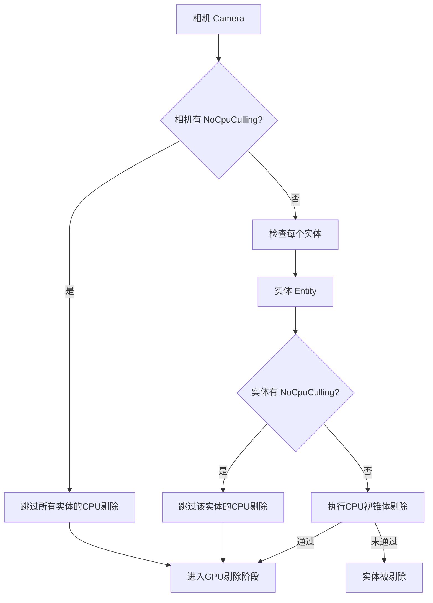

+++
title = "#22767 Add per-entity NoCpuCulling"
date = "2026-02-04T00:00:00"
draft = false
template = "pull_request_page.html"
in_search_index = false

[extra]
current_language = "zh-cn"
available_languages = {"en" = { name = "English", url = "/pull_request/bevy/2026-02/pr-22767-en-20260204" }, "zh-cn" = { name = "中文", url = "/pull_request/bevy/2026-02/pr-22767-zh-cn-20260204" }}
+++

# 为实体添加 NoCpuCulling 组件

## 基本信息
- **标题**: Add per-entity NoCpuCulling
- **PR 链接**: https://github.com/bevyengine/bevy/pull/22767
- **作者**: Lampan-git
- **状态**: 已合并
- **标签**: C-Feature, A-Rendering, S-Ready-For-Final-Review, D-Straightforward
- **创建时间**: 2026-02-01T17:12:34Z
- **合并时间**: 2026-02-04T17:02:11Z
- **合并者**: alice-i-cecile

## 描述翻译

# 目标

- 我使用计算着色器（compute shader）更新某些实体的变换（transforms）并直接将其写入 MeshInput，而不回读（readback）到 CPU。这导致了一个副作用：主世界中的变换位置始终为 (0,0)，然后在 CPU 侧被视锥体剔除（frustum culled）。目前无法为每个实体禁用 CPU 剔除，因此有了这个 PR。

## 解决方案

- 在 visible_aabb_query 中使用与 view_query 相同的 `Has<NoCpuCulling>`

## 测试

我在 RenderDoc 中检查了 VkDrawIndexedIndirectCommand 的 instanceCount，结果显示与不使用 NoCpuCulling 时数量相同，且低于使用 NoFrustumCulling 时的数量。在远离中心观察时也能正常工作。

请注意，这是我第一次真正的贡献，并且我没有实际的渲染经验。

## 这个 Pull Request 的故事

这个 PR 源于一个具体的技术需求：开发者使用计算着色器直接在 GPU 上更新实体变换，绕过 CPU 的数据流。这种优化方法在避免 CPU-GPU 数据传输开销的同时，也带来了一个副作用：CPU 侧的变换数据变得陈旧，导致错误的视锥体剔除。

问题出现在渲染系统的可见性检查环节。Bevy 的渲染管线默认会在 CPU 侧执行视锥体剔除，以优化 GPU 的绘制调用。然而，当实体变换完全在 GPU 上计算时（例如通过计算着色器直接写入 MeshInputUniform 的 world_from_local），CPU 侧的变换数据（存储在 GlobalTransform 组件中）就不再反映真实情况。这些陈旧的变换数据通常是初始值（如 (0,0,0)），导致实体在视锥体检查中被错误地剔除，即使它们在 GPU 上是正确变换并可见的。

为了解决这个问题，PR 作者选择扩展现有的 NoCpuCulling 组件功能。原本这个组件只能附加到相机（Camera）上，禁用该相机视角下所有实体的 CPU 侧剔除。现在，通过将这个组件也附加到单个实体上，开发者可以更精细地控制哪些实体需要跳过 CPU 剔除。

从技术实现角度看，这个改动很小但很有针对性。核心思路是修改 `check_visibility` 函数中的两个查询（queries）：

1. **view_query**：已经包含了相机的 NoCpuCulling 状态
2. **visible_aabb_query**：现在也包含实体的 NoCpuCulling 状态

关键的变化逻辑在视锥体检查的条件判断中。原来的代码只检查相机的 NoCpuCulling 状态：

```rust
if !no_frustum_culling
    && !no_cpu_culling
    && let Some(model_aabb) = maybe_model_aabb
{
    // 执行视锥体剔除
}
```

现在增加了对实体 NoCpuCulling 状态的检查：

```rust
if !no_frustum_culling
    && !no_cpu_culling_camera
    && !no_cpu_culling_entity
    && let Some(model_aabb) = maybe_model_aabb
{
    // 执行视锥体剔除
}
```

这意味着如果相机或实体中的任何一个拥有 NoCpuCulling 组件，该实体就会跳过 CPU 侧的视锥体剔除。这种设计保持了向后兼容性：现有的仅将 NoCpuCulling 附加到相机的用法继续有效，同时为需要更精细控制的场景提供了新选项。

这个实现体现了 Bevy ECS 系统的灵活性。通过将 NoCpuCulling 作为标记组件（marker component），系统可以高效地查询和过滤实体。`Has<NoCpuCulling>` 查询确保只有拥有该组件的实体才会被标记，避免了不必要的存储开销。

从架构角度看，这个改动符合 Bevy 的设计哲学：通过组件组合来实现功能。NoCpuCulling 组件现在可以在两个层级上工作：
- 相机层级：影响该相机视野内的所有实体
- 实体层级：仅影响特定实体

这种分层控制为开发者提供了更大的灵活性。例如，一个场景可以有一个禁用所有 CPU 剔除的调试相机，同时让游戏相机只对 GPU 变换的实体禁用 CPU 剔除。

性能方面，这个改动的影响很小。增加的只是一个简单的布尔检查，而可见性检查已经是渲染管线中相对昂贵的部分（需要计算轴对齐边界框和视锥体相交测试）。对于使用 GPU 变换的实体，跳过 CPU 剔除避免了错误剔除导致的渲染问题，这可能实际上提高了性能，因为原本会被错误剔除的实体现在能够正确渲染。

值得注意的是，PR 作者在描述中提到的测试方法很专业：使用 RenderDoc 检查 VkDrawIndexedIndirectCommand 的 instanceCount。这是验证渲染正确性的有效方法，因为 instanceCount 直接反映了最终被绘制的实例数量，可以确认实体是否被正确剔除或保留。

## 可视化表示



## 关键文件更改

### `crates/bevy_camera/src/visibility/mod.rs` (+12/-2)

这个文件包含了 Bevy 的可见性系统，负责管理相机、实体可见性和各种剔除技术。

**主要更改：**

1. 为 `NoCpuCulling` 组件添加了文档注释，说明其现在可以附加到相机或单个实体上
2. 修改 `check_visibility` 系统，使实体级别的 NoCpuCulling 能够工作

**代码片段：**

```rust
// 文档注释添加：
/// Use this component to opt-out of the built-in CPU frustum culling, see
/// [`Frustum`]. This can be attached to a [`Camera`] or to individual entities.
///
/// It can be used for example:
/// - disabling CPU culling completely for a [`Camera`], using only GPU culling.
/// - when overwriting a [`Mesh`]'s transform on the GPU side (e.g. overwriting `MeshInputUniform`'s
///   `world_from_local`), resulting in stale CPU-side positions.
#[derive(Component, Default)]
pub struct NoCpuCulling;
```

```rust
// 查询修改：为实体查询添加 Has<NoCpuCulling>
// Before:
(
    &GlobalTransform,
    Has<NoFrustumCulling>,
    Has<VisibilityRange>,
)

// After:
(
    &GlobalTransform,
    Has<NoFrustumCulling>,
    Has<VisibilityRange>,
    Has<NoCpuCulling>,
)
```

```rust
// 可见性检查逻辑修改：
// Before:
if !no_frustum_culling
    && !no_cpu_culling
    && let Some(model_aabb) = maybe_model_aabb
{
    // frustum culling logic
}

// After:
if !no_frustum_culling
    && !no_cpu_culling_camera  // 相机级别的检查
    && !no_cpu_culling_entity  // 实体级别的检查
    && let Some(model_aabb) = maybe_model_aabb
{
    // frustum culling logic
}
```

## 进一步阅读

1. **Bevy 渲染管线文档**：了解 Bevy 的渲染架构和可见性系统
2. **GPU 驱动的渲染技术**：学习如何使用计算着色器进行变换更新
3. **视锥体剔除算法**：理解各种剔除技术的原理和实现
4. **现代图形 API（Vulkan/DirectX 12）**：了解间接绘制命令（indirect draw commands）和 GPU 剔除
5. **Bevy ECS 查询系统**：掌握 Bevy 的组件查询和过滤机制