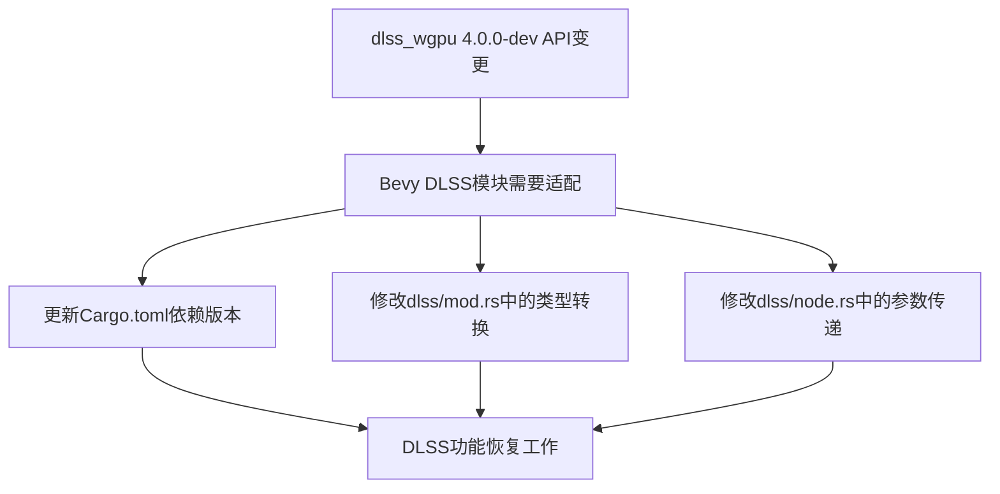

+++
title = "#22768 Fix DLSS by upgrading dlss_wgpu to 4.0.0-dev"
date = "2026-02-01T00:00:00"
draft = false
template = "pull_request_page.html"
in_search_index = false

[extra]
current_language = "zh-cn"
available_languages = {"en" = { name = "English", url = "/pull_request/bevy/2026-02/pr-22768-en-20260201" }, "zh-cn" = { name = "中文", url = "/pull_request/bevy/2026-02/pr-22768-zh-cn-20260201" }}
+++

# 标题

## 基本信息
- **标题**: Fix DLSS by upgrading dlss_wgpu to 4.0.0-dev
- **PR链接**: https://github.com/bevyengine/bevy/pull/22768
- **作者**: JMS55
- **状态**: 已合并
- **标签**: C-Bug, D-Trivial, A-Rendering, S-Ready-For-Final-Review
- **创建时间**: 2026-02-01T20:40:48Z
- **合并时间**: 2026-02-01T21:32:47Z
- **合并者**: alice-i-cecile

## 描述翻译
实际上修复了 #22707！

## 这个Pull Request的故事

这个PR解决了一个由依赖项API变化引起的DLSS（Deep Learning Super Sampling，深度学习超采样）功能中断问题。DLSS是NVIDIA的AI驱动的超采样技术，通过在较低分辨率下渲染游戏然后使用AI模型进行升级，来提高游戏性能同时保持视觉质量。

问题出现在`dlss_wgpu`crate从3.x版本升级到4.0.0-dev版本时，其API发生了变化。新的API开始期望使用数组类型（`[u32; 2]`和`[f32; 2]`）而不是Bevy的向量类型（`UVec2`和`Vec2`）。这种类型不匹配导致编译错误和DLSS功能无法正常工作。

开发者采取的直接解决方案是更新`dlss_wgpu`的依赖版本，并相应调整代码以适应新的API。这涉及到在多个地方添加`.to_array()`调用和`.into()`转换。具体来说：

1. **依赖版本更新**：将`dlss_wgpu`从版本"3"升级到"4.0.0-dev"，这是修复的基础。

2. **API适配**：在新版本的`dlss_wgpu`中，涉及分辨率、偏移量和缩放因子的方法现在都期望数组类型而不是向量类型。因此，所有传递`UVec2`和`Vec2`参数的地方都需要转换为数组。

例如，在`dlss/mod.rs`中，`upscaled_resolution()`和`render_resolution()`方法现在返回数组类型，所以需要添加`.into()`来转换为Bevy的`UVec2`类型：
```rust
// 修改前
fn upscaled_resolution(context: &Self::Context) -> UVec2 {
    context.upscaled_resolution()
}

// 修改后  
fn upscaled_resolution(context: &Self::Context) -> UVec2 {
    context.upscaled_resolution().into()
}
```

类似地，接受分辨率参数的方法现在需要数组类型：
```rust
// 修改前
fn suggested_mip_bias(context: &Self::Context, render_resolution: UVec2) -> f32 {
    context.suggested_mip_bias(render_resolution)
}

// 修改后
fn suggested_mip_bias(context: &Self::Context, render_resolution: UVec2) -> f32 {
    context.suggested_mip_bias(render_resolution.to_array())
}
```

3. **渲染节点更新**：在`dlss/node.rs`中，传递给`evaluate`函数的参数也需要进行类似的转换。例如，抖动偏移量、部分纹理大小和运动矢量缩放现在都需要数组格式：
```rust
// 修改前
jitter_offset: -temporal_jitter.offset,
partial_texture_size: Some(render_resolution),

// 修改后
jitter_offset: (-temporal_jitter.offset).to_array(),
partial_texture_size: Some(render_resolution.to_array()),
```

这种修复展示了处理外部依赖API变化的标准方法。当上游crate改变其API时，下游代码需要进行相应的适配。在这种情况下，变化相对较小且机械：主要是类型转换。然而，这种变化可能影响DLSS功能的正确性，因为不正确的参数传递可能导致渲染问题或性能下降。

值得注意的是，这个PR同时修复了两个DLSS变体：`DlssSuperResolution`（DLSS超分辨率）和`DlssRayReconstruction`（DLSS光线重建）。这两种技术共享相同的底层接口，因此需要相同的修改。

从工程角度看，这个PR是一个很好的例子，展示了如何：
1. 快速响应上游依赖的变化
2. 系统性地更新所有相关代码路径
3. 保持向后兼容性（通过类型转换）
4. 确保相关功能的所有变体都得到更新

## 视觉表示



## 关键文件变更

### 1. `crates/bevy_anti_alias/Cargo.toml`
**变更描述**: 更新`dlss_wgpu`依赖版本从3到4.0.0-dev，这是修复的基础。

**代码片段**:
```toml
# 修改前:
dlss_wgpu = { version = "3", optional = true }

# 修改后:
dlss_wgpu = { version = "4.0.0-dev", optional = true }
```

### 2. `crates/bevy_anti_alias/src/dlss/mod.rs`
**变更描述**: 适配`dlss_wgpu`新API的类型要求，将所有向量参数转换为数组。

**关键修改示例**:
```rust
// 修改前:
fn upscaled_resolution(context: &Self::Context) -> UVec2 {
    context.upscaled_resolution()
}

fn suggested_jitter(
    context: &Self::Context,
    frame_number: u32,
    render_resolution: UVec2,
) -> Vec2 {
    context.suggested_jitter(frame_number, render_resolution)
}

// 修改后:
fn upscaled_resolution(context: &Self::Context) -> UVec2 {
    context.upscaled_resolution().into()
}

fn suggested_jitter(
    context: &Self::Context,
    frame_number: u32,
    render_resolution: UVec2,
) -> Vec2 {
    context
        .suggested_jitter(frame_number, render_resolution.to_array())
        .into()
}
```

### 3. `crates/bevy_anti_alias/src/dlss/node.rs`
**变更描述**: 更新渲染节点中的参数传递，将向量参数转换为数组以适应新API。

**关键修改示例**:
```rust
// 修改前:
jitter_offset: -temporal_jitter.offset,
partial_texture_size: Some(render_resolution),
motion_vector_scale: Some(-render_resolution.as_vec2()),

// 修改后:
jitter_offset: (-temporal_jitter.offset).to_array(),
partial_texture_size: Some(render_resolution.to_array()),
motion_vector_scale: Some((-render_resolution.as_vec2()).to_array()),
```

## 扩展阅读

1. **DLSS技术文档**: [NVIDIA DLSS技术概述](https://developer.nvidia.com/dlss)
2. **wgpu图形API**: [wgpu文档](https://docs.rs/wgpu/latest/wgpu/)
3. **Rust crate版本管理**: [Cargo语义化版本控制](https://doc.rust-lang.org/cargo/reference/semver.html)
4. **Bevy渲染架构**: [Bevy渲染系统文档](https://bevyengine.org/learn/book/getting-started/rendering/)