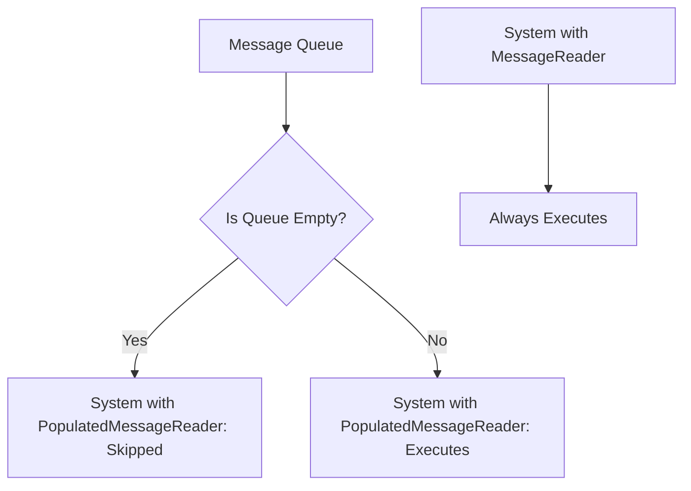

+++
title = "#22772 Feature/populated message reader"
date = "2026-02-03T00:00:00"
draft = false
template = "pull_request_page.html"
in_search_index = true

[taxonomies]
list_display = ["show"]

[extra]
current_language = "en"
available_languages = {"en" = { name = "English", url = "/pull_request/bevy/2026-02/pr-22772-en-20260203" }, "zh-cn" = { name = "中文", url = "/pull_request/bevy/2026-02/pr-22772-zh-cn-20260203" }}
labels = ["C-Feature", "A-ECS", "X-Contentious"]
+++

# Feature/populated message reader

## Basic Information
- **Title**: Feature/populated message reader
- **PR Link**: https://github.com/bevyengine/bevy/pull/22772
- **Author**: Person-93
- **Status**: MERGED
- **Labels**: C-Feature, A-ECS, S-Ready-For-Final-Review, X-Contentious
- **Created**: 2026-02-02T05:05:52Z
- **Merged**: 2026-02-03T01:54:21Z
- **Merged By**: alice-i-cecile

## Description Translation

# Objective

Offer a way to skip a system that reads messages if there are no messages that need to be read.

## Solution

Add a `SystemParam`: `PopulatedMessageReader`.

## Testing

I added a test case

## The Story of This Pull Request

This PR addresses a specific optimization need in Bevy's ECS message system. When working with message-driven architectures, developers often write systems that process messages from queues. However, in many cases, these systems run even when their message queues are empty, which wastes CPU cycles and reduces overall performance.

The existing `MessageReader<T>` SystemParam allows systems to read messages of type `T`, but it always runs the system regardless of whether there are messages to process. This creates inefficiencies, especially for systems that perform expensive computations or have side effects that should only occur when messages are present.

The developer recognized this limitation and implemented a new SystemParam called `PopulatedMessageReader<T>`. This wrapper around `MessageReader<T>` adds conditional execution logic: if the message queue is empty, the system is skipped entirely. The implementation leverages Bevy's existing `SystemParamValidationError` mechanism, which provides a clean way to conditionally skip systems during schedule validation.

The core technical challenge was ensuring that `PopulatedMessageReader` could reuse most of `MessageReader`'s implementation while adding the empty queue check. The solution uses Rust's Deref traits to delegate functionality to the underlying `MessageReader`, then overrides the `validate_param` method to perform the queue emptiness check. When validation detects an empty queue, it returns a `SystemParamValidationError` with a "skipped" status, preventing the system from executing.

This approach maintains consistency with Bevy's existing patterns while providing a clear performance optimization. The PR also properly documents when to use `PopulatedMessageReader` versus the existing `on_message` run condition, clarifying that `on_message` is for skipping systems based on messages they don't read, while `PopulatedMessageReader` is for messages they do read.

The test case demonstrates the expected behavior: systems with `PopulatedMessageReader` are skipped when the queue is empty but execute when messages are present. This validation ensures the optimization works correctly and won't break existing functionality.

From an architectural perspective, this change fits well within Bevy's ECS design. It provides a more granular control mechanism for system execution without requiring complex conditional logic within the systems themselves. Developers can now choose between always-running message readers and conditionally-executing ones based on their specific performance requirements.

## Visual Representation



## Key Files Changed

1. **crates/bevy_ecs/src/message/message_reader.rs** (+124/-1)
   This file contains the main implementation of `PopulatedMessageReader`. The new struct wraps `MessageReader` and adds validation logic to skip systems when the message queue is empty.

   Key code snippet showing the validation logic:
   ```rust
   unsafe fn validate_param(
       state: &mut Self::State,
       system_meta: &crate::system::SystemMeta,
       world: crate::world::unsafe_world_cell::UnsafeWorldCell,
   ) -> Result<(), SystemParamValidationError> {
       // SAFETY: requirements are upheld by MessageReader's implementation
       unsafe { MessageReader::<M>::validate_param(state, system_meta, world) }?;

       // SAFETY: requirements are upheld by MessageReader's implementation
       let reader =
           unsafe { MessageReader::get_param(state, system_meta, world, world.change_tick()) };
       if reader.is_empty() {
           Err(SystemParamValidationError::skipped::<Self>(
               "message queue is empty",
           ))
       } else {
           Ok(())
       }
   }
   ```

2. **crates/bevy_ecs/src/lib.rs** (+3/-1)
   This file adds `PopulatedMessageReader` to the public prelude, making it easily accessible to Bevy users.

   Code snippet showing the export:
   ```rust
   pub mod prelude {
       // ...
       message::{
           Message, MessageMutator, MessageReader, MessageWriter, Messages, PopulatedMessageReader,
       },
       // ...
   }
   ```

3. **crates/bevy_ecs/src/schedule/condition.rs** (+2/-0)
   This file updates documentation for the `on_message` run condition to clarify when to use `PopulatedMessageReader` instead.

   Code snippet showing the documentation update:
   ```rust
   /// A [`SystemCondition`]-satisfying system that returns `true`
   /// if there are any new messages of the given type since it was last called.
   ///
   /// To skip a system based on messages that it reads, use [`PopulatedMessageReader`](crate::prelude::PopulatedMessageReader) instead.
   ```

## Further Reading

- [Bevy ECS System Parameters Documentation](https://docs.rs/bevy_ecs/latest/bevy_ecs/system/trait.SystemParam.html) - Understanding how SystemParams work in Bevy
- [Bevy Message System Guide](https://bevy-cheatbook.github.io/programming/messages.html) - How to use messages in Bevy
- [Rust Deref Trait Documentation](https://doc.rust-lang.org/std/ops/trait.Deref.html) - Understanding the delegation pattern used in this implementation
- [Conditional System Execution in Bevy](https://bevy-cheatbook.github.io/programming/conditions.html) - Other ways to conditionally execute systems in Bevy