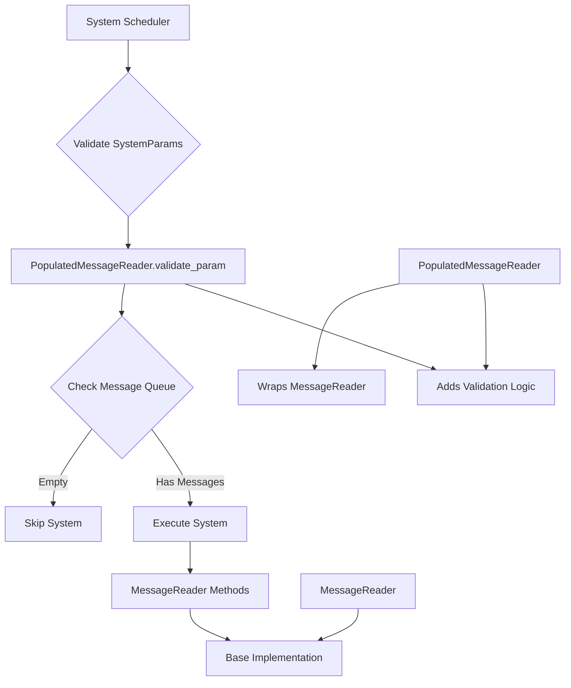

+++
title = "#22772 Feature/populated message reader"
date = "2026-02-03T00:00:00"
draft = false
template = "pull_request_page.html"
in_search_index = false

[extra]
current_language = "zh-cn"
available_languages = {"en" = { name = "English", url = "/pull_request/bevy/2026-02/pr-22772-en-20260203" }, "zh-cn" = { name = "中文", url = "/pull_request/bevy/2026-02/pr-22772-zh-cn-20260203" }}
labels = ["C-Feature", "A-ECS", "X-Contentious"]
+++

# Title: Feature/populated message reader

## Basic Information
- **Title**: Feature/populated message reader
- **PR Link**: https://github.com/bevyengine/bevy/pull/22772
- **Author**: Person-93
- **Status**: MERGED
- **Labels**: C-Feature, A-ECS, S-Ready-For-Final-Review, X-Contentious
- **Created**: 2026-02-02T05:05:52Z
- **Merged**: 2026-02-03T01:54:21Z
- **Merged By**: alice-i-cecile

## Description Translation
目标

提供一种方法，当没有需要读取的消息时，跳过读取消息的系统。

解决方案

添加一个`SystemParam`：`PopulatedMessageReader`。

测试

我添加了一个测试用例

## The Story of This Pull Request

在ECS（实体组件系统）框架中，系统调度是性能优化的关键环节。Bevy引擎的消息系统允许不同系统之间进行通信，但现有的`MessageReader<T>`参数有一个设计上的限制：即使消息队列为空，系统仍然会执行。这导致了不必要的CPU开销，因为系统需要被调用、参数需要被获取，但实际没有任何工作要做。

这个问题的核心在于`SystemParam`的验证机制。在Bevy中，系统参数可以通过`validate_param`方法在调度前进行检查，如果检查失败，系统可以被跳过。现有的`MessageReader<T>`没有利用这个机制来优化空队列的情况。

开发者Person-93识别到了这个优化机会，并提出了一个直接的解决方案：创建一个新的`PopulatedMessageReader<T>`类型，它在`MessageReader<T>`的基础上添加了队列非空的验证逻辑。

技术实现上，`PopulatedMessageReader<T>`采用了组合模式，内部包装了一个`MessageReader<T>`实例，并通过Deref trait提供相同的接口。这使得所有`MessageReader<T>`的方法对`PopulatedMessageReader<T>`都可用，保持了API的一致性。

```rust
#[derive(Debug)]
pub struct PopulatedMessageReader<'w, 's, M: Message>(MessageReader<'w, 's, M>);

impl<'w, 's, M: Message> core::ops::Deref for PopulatedMessageReader<'w, 's, M> {
    type Target = MessageReader<'w, 's, M>;

    fn deref(&self) -> &Self::Target {
        &self.0
    }
}
```

关键的创新在于`SystemParam` trait的实现，特别是`validate_param`方法。这个方法在系统调度前被调用，用于决定系统是否应该执行：

```rust
unsafe fn validate_param(
    state: &mut Self::State,
    system_meta: &crate::system::SystemMeta,
    world: crate::world::unsafe_world_cell::UnsafeWorldCell,
) -> Result<(), SystemParamValidationError> {
    // SAFETY: requirements are upheld by MessageReader's implementation
    unsafe { MessageReader::<M>::validate_param(state, system_meta, world) }?;

    // SAFETY: requirements are upheld by MessageReader's implementation
    let reader =
        unsafe { MessageReader::get_param(state, system_meta, world, world.change_tick()) };
    if reader.is_empty() {
        Err(SystemParamValidationError::skipped::<Self>(
            "message queue is empty",
        ))
    } else {
        Ok(())
    }
}
```

当`validate_param`检查到消息队列为空时，它返回一个`SystemParamValidationError::skipped`错误，这会导致调度器跳过该系统的执行。这种设计避免了在运行时检查队列状态的开销，将优化提前到调度阶段。

这个实现有几个值得注意的技术点：
1. **安全代码的正确使用**：所有的unsafe代码都正确标记了安全前提条件，并遵循了Bevy的安全惯例
2. **最小化代码重复**：通过委托给`MessageReader<T>`的实现，避免了大量重复代码
3. **清晰的错误消息**：当系统被跳过时，提供了明确的错误信息"message queue is empty"

测试用例验证了功能的核心逻辑：
```rust
#[test]
fn test_populated_message_reader() {
    let system_ran = Arc::new(AtomicBool::new(false));

    let mut world = World::new();
    MessageRegistry::register_message::<TheMessage>(&mut world);

    let mut schedule = Schedule::default();
    schedule.add_systems({
        let system_ran = system_ran.clone();
        move |mut _reader: PopulatedMessageReader<TheMessage>| {
            system_ran.store(true, Ordering::SeqCst);
        }
    });

    schedule.run(&mut world);
    assert!(
        !system_ran.load(Ordering::SeqCst),
        "system with PopulatedMessageReader should have been skipped"
    );

    world.write_message(TheMessage);
    schedule.run(&mut world);
    assert!(
        system_ran.load(Ordering::SeqCst),
        "system with PopulatedMessageReader should NOT have been skipped"
    );
}
```

测试验证了两个关键场景：当消息队列为空时系统被跳过，当有消息时系统正常执行。

这个PR还更新了文档，明确指出`PopulatedMessageReader<T>`和现有的`on_message`运行条件之间的区别。`on_message`用于基于系统不读取的消息来跳过系统，而`PopulatedMessageReader<T>`用于基于系统实际读取的消息来跳过系统。

从性能角度看，这个优化对于消息处理频繁但有时为空系统的系统特别有价值。它减少了不必要的系统调用开销，特别是当这些系统包含昂贵的初始化或参数获取逻辑时。

然而，这个设计也有一个权衡：它引入了额外的类型，增加了API的复杂性。开发者现在需要在`MessageReader<T>`（总是执行）和`PopulatedMessageReader<T>`（只在有消息时执行）之间做出选择。文档的更新有助于指导这个选择。

总的来说，这个PR提供了一个优雅的解决方案，通过扩展Bevy的`SystemParam`机制来实现性能优化。它展示了如何利用现有的框架特性（参数验证）来实现新的行为，同时保持向后兼容性和API一致性。

## Visual Representation



## Key Files Changed

### 1. `crates/bevy_ecs/src/message/message_reader.rs` (+124/-1)
这个文件添加了`PopulatedMessageReader`结构体及其完整实现。

主要变更包括：
- 添加了`PopulatedMessageReader`结构体定义
- 实现了Deref和DerefMut traits以委托给内部的`MessageReader`
- 实现了`SystemParam` trait，重点是`validate_param`方法
- 添加了完整的测试用例

```rust
// 关键代码：PopulatedMessageReader的定义
#[derive(Debug)]
pub struct PopulatedMessageReader<'w, 's, M: Message>(MessageReader<'w, 's, M>);

// 关键代码：验证逻辑
if reader.is_empty() {
    Err(SystemParamValidationError::skipped::<Self>(
        "message queue is empty",
    ))
} else {
    Ok(())
}
```

### 2. `crates/bevy_ecs/src/lib.rs` (+3/-1)
更新了prelude模块，将`PopulatedMessageReader`添加到公共API中。

```rust
// 变更：在prelude中导出PopulatedMessageReader
pub mod prelude {
    // ...
    message::{
        Message, MessageMutator, MessageReader, MessageWriter, Messages, PopulatedMessageReader,
    },
    // ...
}
```

### 3. `crates/bevy_ecs/src/schedule/condition.rs` (+2/-0)
更新了`on_message`运行条件的文档，明确指出它与`PopulatedMessageReader`的区别。

```rust
/// To skip a system based on messages that it reads, use [`PopulatedMessageReader`](crate::prelude::PopulatedMessageReader) instead.
```

## Further Reading

1. **Bevy ECS SystemParam文档**：了解SystemParam trait的完整功能和验证机制
   - https://docs.rs/bevy_ecs/latest/bevy_ecs/system/trait.SystemParam.html

2. **Bevy消息系统指南**：深入理解Bevy中的消息传递模式
   - https://bevyengine.org/learn/quick-start/ecs/messages/

3. **条件系统执行**：了解Bevy中系统跳过和运行条件的其他方法
   - https://docs.rs/bevy_ecs/latest/bevy_ecs/schedule/common_conditions/index.html

4. **Rust的Deref trait**：理解如何通过Deref实现智能指针和委托模式
   - https://doc.rust-lang.org/std/ops/trait.Deref.html