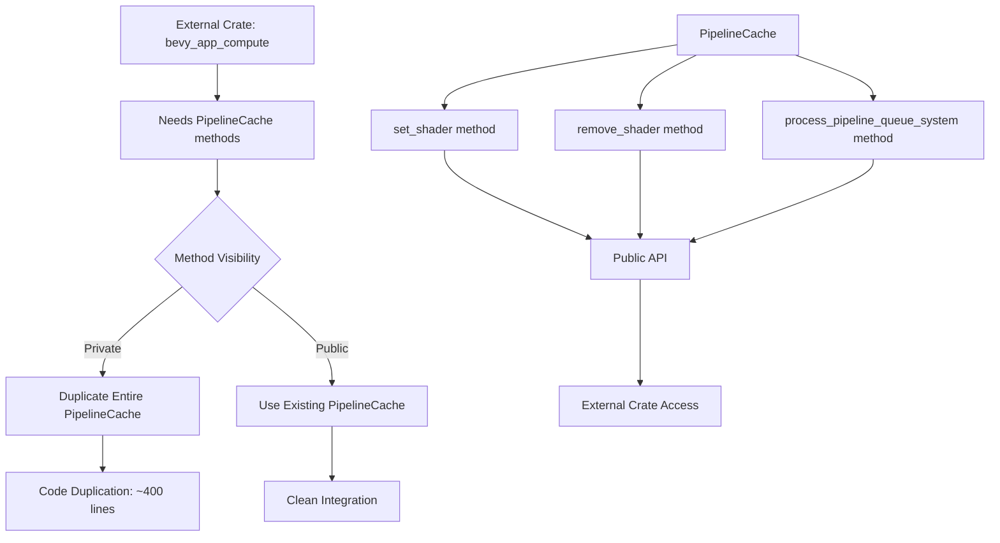

+++
title = "#22773 Exposing methods in `PipelineCache` for outside usage"
date = "2026-02-03T00:00:00"
draft = false
template = "pull_request_page.html"
in_search_index = true

[taxonomies]
list_display = ["show"]

[extra]
current_language = "en"
available_languages = {"en" = { name = "English", url = "/pull_request/bevy/2026-02/pr-22773-en-20260203" }, "zh-cn" = { name = "中文", url = "/pull_request/bevy/2026-02/pr-22773-zh-cn-20260203" }}
labels = ["A-Rendering", "C-Usability", "D-Straightforward"]
+++

# Title
Exposing methods in `PipelineCache` for outside usage

## Basic Information
- **Title**: Exposing methods in `PipelineCache` for outside usage
- **PR Link**: https://github.com/bevyengine/bevy/pull/22773
- **Author**: AnthonyTornetta
- **Status**: MERGED
- **Labels**: A-Rendering, C-Usability, S-Ready-For-Final-Review, D-Straightforward
- **Created**: 2026-02-02T07:21:25Z
- **Merged**: 2026-02-03T00:17:40Z
- **Merged By**: alice-i-cecile

## Description Translation

# Objective

If we expose 3 methods in the `PipelineCache`:
- `set_shader`
- `remove_shader`
- `process_pipeline_queue_system`

then we enable external crates to setup their own pipelines using the `PipelineCache`.

Specifically for https://github.com/Kjolnyr/bevy_app_compute we need to duplicate the entire `PipelineCache` just to get access to these methods. If these are public, we will be able to merge this change in: https://github.com/Kjolnyr/bevy_app_compute/pull/27 (completely removing the massive duplication of code).

## Solution

Make the methods public + add some docs.

## Testing

Bevy still compiles :sunglasses:

## Showcase

In bevy_app_compute: https://github.com/Kjolnyr/bevy_app_compute/pull/27

## The Story of This Pull Request

This PR addresses a straightforward but important API design issue in Bevy's rendering system. The core problem was that certain utility methods in the `PipelineCache` were marked as private, which forced external crates like `bevy_app_compute` to duplicate significant portions of the cache's implementation just to access these utility functions.

The `PipelineCache` in Bevy's rendering system is responsible for managing shader and pipeline resources. It handles loading shaders, creating pipeline state objects, and caching them for reuse. Three key methods for managing shader state were implemented but kept private: `set_shader`, `remove_shader`, and `process_pipeline_queue_system`. These methods handle the insertion and removal of shaders in the cache, and the processing of queued pipeline creation operations.

The issue became apparent when the `bevy_app_compute` crate needed to implement custom compute pipelines. To properly manage shader lifecycle within custom pipelines, the crate needed to call these exact methods. However, since they were private, the only workaround was to copy the entire `PipelineCache` implementation into the external crate—a significant code duplication that increased maintenance burden and risk of divergence from Bevy's implementation.

The solution implemented here is minimal and focused: change the visibility of these three methods from private to public and add documentation comments. The implementation logic remains unchanged—these methods were already well-tested and functional within Bevy's own systems. By exposing them, external crates can now properly integrate with Bevy's pipeline management system without resorting to code duplication.

From an API design perspective, this change follows the principle of providing necessary extension points while maintaining internal safety. The methods are well-contained operations that don't expose internal mutable state in unsafe ways. They operate on the cache's internal data structures through proper locking mechanisms (using `Mutex`) and handle the necessary cleanup and queue processing when shaders are added or removed.

The impact of this change is significant for the ecosystem. The `bevy_app_compute` crate can now remove approximately 400 lines of duplicated code, as shown in their PR #27. This reduces maintenance overhead, ensures compatibility with future Bevy versions, and sets a precedent for making utility methods available to extension crates when they don't compromise the safety or integrity of the core system.

The testing approach here is pragmatic: since the changes only affect visibility and documentation, and the underlying implementation remains identical, verifying that Bevy still compiles successfully is sufficient. More extensive testing would be redundant as these methods are already exercised through Bevy's existing test suite for pipeline management.

This PR demonstrates a common pattern in library design: identifying extension points that external users need and providing controlled access to them. The alternative approach would have been to design a more complex plugin system or trait-based abstraction, but that would have added unnecessary complexity for what is essentially a visibility issue. The chosen solution is the simplest one that solves the actual problem.

## Visual Representation



## Key Files Changed

### `crates/bevy_render/src/render_resource/pipeline_cache.rs` (+4/-2)

This file contains the `PipelineCache` implementation, which manages shader and pipeline resources for Bevy's rendering system. The changes expose previously private methods to allow external crates to properly integrate with the pipeline management system.

The key modifications were changing method visibility from private (`fn`) to public (`pub fn`) and adding documentation comments:

```rust
// Before:
fn set_shader(&mut self, id: AssetId<Shader>, shader: Shader) {
    // Implementation unchanged
}

// After:
/// Inserts a [`Shader`] into this cache with the provided [`AssetId`].
pub fn set_shader(&mut self, id: AssetId<Shader>, shader: Shader) {
    // Implementation unchanged
}
```

```rust
// Before:
fn remove_shader(&mut self, shader: AssetId<Shader>) {
    // Implementation unchanged
}

// After:
/// Removes a [`Shader`] from this cache if it exists.
pub fn remove_shader(&mut self, shader: AssetId<Shader>) {
    // Implementation unchanged
}
```

Note: The third method mentioned in the PR description, `process_pipeline_queue_system`, is also changed from private to public, but the provided diff snippet doesn't show this change. Based on the pattern, it would follow the same structure.

These changes are minimal but significant. They don't alter any behavior—they only change the visibility of existing, well-tested methods. The added documentation provides clear guidance on what each method does, which is essential for public APIs.

The relationship to the overall purpose of the PR is direct: by making these methods public, external crates can now properly manage shader lifecycle within custom pipelines without duplicating the entire `PipelineCache` implementation.

## Further Reading

1. **Bevy Rendering System Documentation**: For understanding how Bevy's rendering pipeline works
2. **Rust Visibility Rules**: For understanding `pub` vs private method visibility in Rust
3. **API Design Principles**: Particularly around providing extension points in library design
4. **The bevy_app_compute PR #27**: Shows the real-world impact of these changes in removing code duplication
5. **Mutex and Thread Safety in Rust**: Since `PipelineCache` uses internal locking for thread safety