+++
title = "#22773 公开 PipelineCache 方法以支持外部使用"
date = "2026-02-03T00:00:00"
draft = false
template = "pull_request_page.html"
in_search_index = false

[extra]
current_language = "zh-cn"
available_languages = {"en" = { name = "English", url = "/pull_request/bevy/2026-02/pr-22773-en-20260203" }, "zh-cn" = { name = "中文", url = "/pull_request/bevy/2026-02/pr-22773-zh-cn-20260203" }}
labels = ["A-Rendering", "C-Usability", "D-Straightforward"]
+++

# Title: 公开 PipelineCache 方法以支持外部使用

## Basic Information
- **Title**: Exposing methods in `PipelineCache` for outside usage
- **PR Link**: https://github.com/bevyengine/bevy/pull/22773
- **Author**: AnthonyTornetta
- **Status**: MERGED
- **Labels**: A-Rendering, C-Usability, S-Ready-For-Final-Review, D-Straightforward
- **Created**: 2026-02-02T07:21:25Z
- **Merged**: 2026-02-03T00:17:40Z
- **Merged By**: alice-i-cecile

## Description Translation

### 目标
如果我们在 `PipelineCache` 中公开3个方法：
- `set_shader`
- `remove_shader`
- `process_pipeline_queue_system`

那么我们就能够让外部crate使用 `PipelineCache` 来设置它们自己的pipeline。

特别是对于 https://github.com/Kjolnyr/bevy_app_compute 这个项目，我们目前需要复制整个 `PipelineCache` 只是为了访问这些方法。如果这些方法公开了，我们将能够合并这个更改：https://github.com/Kjolnyr/bevy_app_compute/pull/27（完全消除了大量代码重复）。

### 解决方案
将这些方法设为公开，并添加一些文档说明。

### 测试
Bevy仍然能够编译 :sunglasses:

### 展示
在bevy_app_compute中的实现：https://github.com/Kjolnyr/bevy_app_compute/pull/27

## The Story of This Pull Request

这是一个关于API可访问性和代码重用的简单但重要的改进。问题的核心是Bevy渲染系统中的`PipelineCache`内部管理了着色器资源和pipeline的编译，但一些关键方法被标记为私有，这限制了外部crate使用相同的机制来管理自己的pipeline。

具体来说，`bevy_app_compute`这个项目需要与Bevy的渲染系统集成，特别是需要能够动态添加和移除着色器，并处理pipeline队列。由于`PipelineCache`的`set_shader`、`remove_shader`和`process_pipeline_queue_system`方法都是私有的，该项目不得不复制整个`PipelineCache`的实现，这导致了显著的代码重复和维护负担。

这种重复不仅仅是不优雅的，它还带来了几个实际问题：代码膨胀、维护不一致的风险，以及当Bevy内部实现改变时需要同步更新的负担。从工程角度看，当多个项目需要相同功能时，更好的模式是公开经过良好设计的API，而不是强制重复实现。

解决方案非常直接：将这三个方法从私有(`fn`)改为公开(`pub fn`)，并添加适当的文档注释来解释它们的作用。这种改变是低风险的，因为这些方法已经在Bevy内部被使用和测试过，现在只是扩展了它们的可见性范围。

查看具体实现，`set_shader`方法负责将着色器插入缓存，并更新依赖该着色器的所有pipeline。`remove_shader`方法则是相反的操作，从缓存中移除着色器并更新相关pipeline。这两个方法都涉及对内部共享状态的同步访问（通过`Mutex`），这表明它们已经是线程安全的实现。

这里有一个重要的设计考虑：虽然公开这些方法增加了API的表面积，但也保持了封装性。外部调用者不需要了解内部实现细节，如`shader_cache`的锁定机制或`waiting_pipelines`队列的管理。他们只是获得了操作着色器缓存的必要能力。

从更广泛的角度看，这个PR体现了API设计中的一个重要原则：当内部功能对生态系统中的其他组件有明确价值时，应该考虑将其公开。这不仅减少了代码重复，还促进了整个生态系统的一致性，因为所有项目都可以使用相同的经过良好测试的基础设施。

这个更改的影响是立即且具体的。在`bevy_app_compute`项目的PR#27中，作者能够移除大量重复的`PipelineCache`代码，替换为直接使用Bevy提供的公共方法。这不仅减少了代码行数，还确保了该项目与Bevy保持同步，未来Bevy对`PipelineCache`的任何改进都会自动受益。

## Visual Representation

```mermaid
graph TD
    A[外部crate如 bevy_app_compute] --> B[需要 PipelineCache 功能]
    B --> C{方法是否公开？}
    C -->|否| D[复制整个 PipelineCache 实现]
    C -->|是| E[直接使用公开方法]
    D --> F[代码重复和维护负担]
    E --> G[代码复用和同步更新]
    
    H[PipelineCache] --> I[set_shader - 公开]
    H --> J[remove_shader - 公开]
    H --> K[process_pipeline_queue_system - 公开]
    I --> L[内部着色器缓存管理]
    J --> L
    K --> M[处理pipeline队列]
```



## Key Files Changed

### 1. `crates/bevy_render/src/render_resource/pipeline_cache.rs`

这个文件包含了`PipelineCache`结构的实现。更改涉及将两个私有方法改为公共方法，并添加了文档注释。

**关键修改：**

```rust
// File: crates/bevy_render/src/render_resource/pipeline_cache.rs
// 修改前（set_shader方法）:
fn set_shader(&mut self, id: AssetId<Shader>, shader: Shader) {
    let mut shader_cache = self.shader_cache.lock().unwrap();
    let pipelines_to_queue = shader_cache.set_shader(id, shader);
    for cached_pipeline in pipelines_to_queue {
        self.waiting_pipelines
            .insert(cached_pipeline, Instant::now());
    }
}

// 修改后:
/// Inserts a [`Shader`] into this cache with the provided [`AssetId`].
pub fn set_shader(&mut self, id: AssetId<Shader>, shader: Shader) {
    let mut shader_cache = self.shader_cache.lock().unwrap();
    let pipelines_to_queue = shader_cache.set_shader(id, shader);
    for cached_pipeline in pipelines_to_queue {
        self.waiting_pipelines
            .insert(cached_pipeline, Instant::now());
    }
}

// 修改前（remove_shader方法）:
fn remove_shader(&mut self, shader: AssetId<Shader>) {
    let mut shader_cache = self.shader_cache.lock().unwrap();
    let pipelines_to_queue = shader_cache.remove(shader);
    for cached_pipeline in pipelines_to_queue {
        self.waiting_pipelines
            .insert(cached_pipeline, Instant::now());
    }
}

// 修改后:
/// Removes a [`Shader`] from this cache if it exists.
pub fn remove_shader(&mut self, shader: AssetId<Shader>) {
    let mut shader_cache = self.shader_cache.lock().unwrap();
    let pipelines_to_queue = shader_cache.remove(shader);
    for cached_pipeline in pipelines_to_queue {
        self.waiting_pipelines
            .insert(cached_pipeline, Instant::now());
    }
}
```

**为什么这些更改很重要：**
1. **可见性更改**：从`fn`改为`pub fn`，使这些方法可以从模块外部访问。
2. **文档注释**：添加了文档字符串，说明每个方法的功能，这对于公共API很重要。
3. **功能保持不变**：方法的内部实现没有改变，只是改变了访问级别。

**注意**：PR描述中提到有三个方法需要公开，但提供的diff只显示了两个方法的更改。可能`process_pipeline_queue_system`方法在原始代码中已经是公开的，或者在其他地方进行了更改。

## Further Reading

1. **Bevy渲染系统架构**：了解Bevy的ECS架构和渲染管线如何工作，有助于理解`PipelineCache`在整个系统中的角色。
2. **Rust模块系统和可见性**：Rust的`pub`关键字和模块系统对于设计良好的库API至关重要。
3. **API设计原则**：何时应该将内部方法公开为公共API，以及这种决策的权衡考虑。
4. **`bevy_app_compute`项目**：查看这个项目如何使用公开的`PipelineCache`方法来避免代码重复。
5. **资产管理系统**：了解Bevy如何管理着色器和其他资产，以及`AssetId`系统的工作原理。