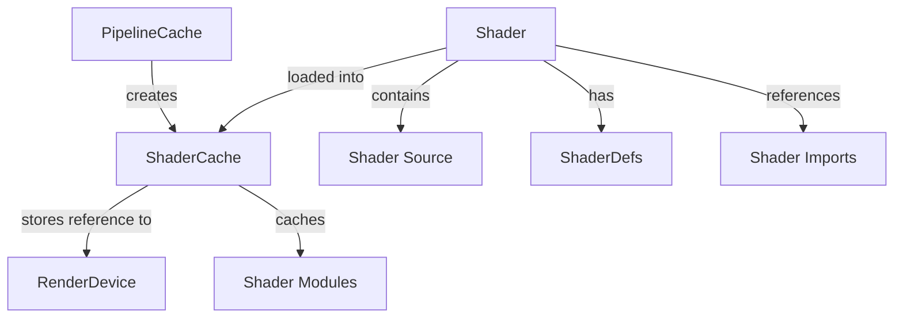

+++
title = "#22774 doc and clean up bevy_shader"
date = "2026-02-03T00:00:00"
draft = false
template = "pull_request_page.html"
in_search_index = true

[taxonomies]
list_display = ["show"]

[extra]
current_language = "en"
available_languages = {"en" = { name = "English", url = "/pull_request/bevy/2026-02/pr-22774-en-20260203" }, "zh-cn" = { name = "中文", url = "/pull_request/bevy/2026-02/pr-22774-zh-cn-20260203" }}
labels = ["C-Docs", "A-Rendering", "D-Straightforward", "C-Refinement"]
+++

# Title

## Basic Information
- **Title**: doc and clean up bevy_shader
- **PR Link**: https://github.com/bevyengine/bevy/pull/22774
- **Author**: atlv24
- **Status**: MERGED
- **Labels**: C-Docs, A-Rendering, S-Ready-For-Final-Review, D-Straightforward, C-Refinement
- **Created**: 2026-02-02T08:10:26Z
- **Merged**: 2026-02-03T00:19:25Z
- **Merged By**: alice-i-cecile

## Description Translation
# Objective

- murder mwriting monday's mortal menemy `#![expect(missing_docs, reason = "Not all docs are written yet, see #3492.")]`
- clean up bevy_shader

## Solution

- move RenderDevice param from `get` to `new`, because we will soon be in a Render Recovery world and need to ensure different render devices do not end up in the same shader cache.
- delete an unused enum
- delete some boilerplate getters
- document everything
- also document define_atomic_id macro

## Testing

- ci

## The Story of This Pull Request

This PR started with two straightforward objectives: eliminate the pesky missing documentation lint exception that had been lingering in the `bevy_shader` module, and perform general cleanup of that same module. The missing docs exception was a technical debt marker that signaled incomplete documentation, which the developer decided to address systematically.

The cleanup effort revealed several areas for improvement. First, the developer identified an architectural issue with the `ShaderCache` - it was receiving a `RenderDevice` parameter in its `get` method. This presented a problem for future development plans involving Render Recovery, where multiple render devices might exist. If different devices could access the same shader cache, it could lead to invalid shader modules being used with incompatible devices. The solution was straightforward: move the `RenderDevice` parameter to the `ShaderCache::new` constructor, ensuring each cache is associated with a specific device from creation.

During the code review, the developer found `ShaderReflectError`, an enum that wasn't being used anywhere in the codebase. This was dead code that could be safely removed. The PR also eliminated several boilerplate getter methods on the `Shader` struct. These getters were providing trivial access to public fields, creating unnecessary indirection without adding value. The fields were already public, so the getters were redundant.

The most substantial part of the work was comprehensive documentation. The developer went through the entire `bevy_shader` module, adding documentation for structs, enums, methods, and fields. This included explaining the purpose of the `Shader` struct, its fields, the `ShaderCache`, and how shader imports work. The documentation also clarified the `define_atomic_id` macro, which had previously been minimally documented.

One interesting technical insight emerged from the documentation process. In the `ShaderCache::get` method, the developer noted that the cache key includes `shader_defs`, but the ordering and potential redundancies in the shader definitions matter. Different ordering or redundant definitions won't result in cache hits, potentially causing unnecessary recomputation. While not changed in this PR, documenting this behavior helps future developers understand the performance characteristics.

The changes to the `PipelineCache` demonstrate how the `ShaderCache` API change propagates through the codebase. The `PipelineCache` now creates the `ShaderCache` with the device during initialization, and subsequent calls to `shader_cache.get` no longer need to pass the device. This simplifies the calling code and enforces the one-device-per-cache constraint at the type system level.

The impact of these changes is primarily improved code quality and maintainability. The documentation makes the module more accessible to new contributors, while the removal of dead code and redundant methods reduces cognitive load. The `RenderDevice` parameter change proactively prevents a class of bugs that could occur with multiple render devices, though it doesn't change current functionality since Bevy currently uses a single render device.

## Visual Representation



## Key Files Changed

### `crates/bevy_shader/src/shader.rs` (+28/-41)
This file saw significant documentation improvements and cleanup. The unused `ShaderReflectError` enum was removed, and numerous doc comments were added to structs, enums, and methods.

**Key changes:**
- Removed `ShaderReflectError` enum (dead code)
- Added comprehensive documentation for `Shader` struct and its fields
- Documented `Source` enum and its variants
- Added documentation for `ShaderLoader`, `ShaderLoaderError`, and `ShaderSettings`
- Documented `ShaderImport` enum and `ShaderRef` enum
- Removed boilerplate getter methods (`set_import_path`, `with_import_path`, `import_path`, `imports`)

```rust
// Before:
#[derive(Error, Debug)]
pub enum ShaderReflectError {
    #[error(transparent)]
    WgslParse(#[from] naga::front::wgsl::ParseError),
    // ... other variants
}

// After:
// (enum completely removed - was unused)
```

```rust
// Before:
pub fn import_path(&self) -> &ShaderImport {
    &self.import_path
}

// After:
// (method removed - field is public, so direct access is sufficient)
```

### `crates/bevy_shader/src/shader_cache.rs` (+59/-18)
This file received extensive documentation and the key architectural change moving `RenderDevice` from `get` to `new`.

**Key changes:**
- Added `device` field to `ShaderCache` struct
- Updated `new` method to accept `RenderDevice` parameter
- Removed `RenderDevice` parameter from `get` method
- Added comprehensive documentation for structs, methods, and fields
- Documented `ShaderCacheSource` enum and its purpose

```rust
// Before:
pub fn get(
    &mut self,
    render_device: &RenderDevice,  // Device passed here
    pipeline: CachedPipelineId,
    id: AssetId<Shader>,
    shader_defs: &[ShaderDefVal],
) -> Result<Arc<ShaderModule>, ShaderCacheError> {

// After:
pub fn get(
    &mut self,
    pipeline: CachedPipelineId,  // No device parameter
    id: AssetId<Shader>,
    shader_defs: &[ShaderDefVal],
) -> Result<Arc<ShaderModule>, ShaderCacheError> {
```

```rust
// Before:
pub struct ShaderCache<ShaderModule, RenderDevice> {
    data: HashMap<AssetId<Shader>, ShaderData<ShaderModule>>,
    // ... other fields

// After:
pub struct ShaderCache<ShaderModule, RenderDevice> {
    device: RenderDevice,  // Device stored as field
    data: HashMap<AssetId<Shader>, ShaderData<ShaderModule>>,
    // ... other fields
```

### `crates/bevy_render/src/render_resource/pipeline_cache.rs` (+7/-16)
This file updated to reflect the `ShaderCache` API changes, removing `RenderDevice` parameter from calls to `shader_cache.get`.

**Key changes:**
- Updated `PipelineCache::new` to pass device to `ShaderCache::new`
- Removed `&device` parameter from all `shader_cache.get` calls

```rust
// Before:
let vertex_module = match shader_cache.get(
    &device,  // Device passed here
    id,
    descriptor.vertex.shader.id(),
    &descriptor.vertex.shader_defs,
) {

// After:
let vertex_module = match shader_cache.get(
    id,  // No device parameter
    descriptor.vertex.shader.id(),
    &descriptor.vertex.shader_defs,
) {
```

### `crates/bevy_utils/src/atomic_id.rs` (+9/-1)
Added documentation for the `define_atomic_id` macro, explaining its purpose and limitations.

**Key changes:**
- Added documentation explaining that IDs are process-wide and unique via static atomics
- Added note about potential exhaustion of ID space

```rust
// Before:
/// Defines an id type which guarantees global uniqueness via atomics on a static global.

// After:
/// Defines a 32-bit id type which guarantees global uniqueness via atomics on a static global.
///
/// Note that this means the id space is process-wide, as such it may potentially be exhausted
/// by a combination of long-running processes and multiple bevy `World`s, at which point we panic.
```

### `release-content/migration-guides/bevy_shader.md` (+10/-0)
Added a new migration guide documenting the breaking changes for users upgrading their code.

**Key changes:**
- Documented removal of `ShaderReflectError`
- Documented `ShaderCache` API change (`RenderDevice` moved from `get` to `new`)
- Documented removal of `Shader` getter methods

## Further Reading

- [Bevy Shader Documentation](https://docs.rs/bevy_shader/latest/bevy_shader/) - Official documentation for the bevy_shader crate
- [WGSL Specification](https://www.w3.org/TR/WGSL/) - WebGPU Shading Language specification
- [Naga Documentation](https://docs.rs/naga/latest/naga/) - The shader translation library used by Bevy
- [Render Graph Architecture](https://bevyengine.org/learn/quick-start/getting-started/systems/) - Bevy's render graph system which uses shaders
- [Asset System Documentation](https://bevyengine.org/learn/quick-start/getting-started/assets/) - How Bevy handles assets including shaders