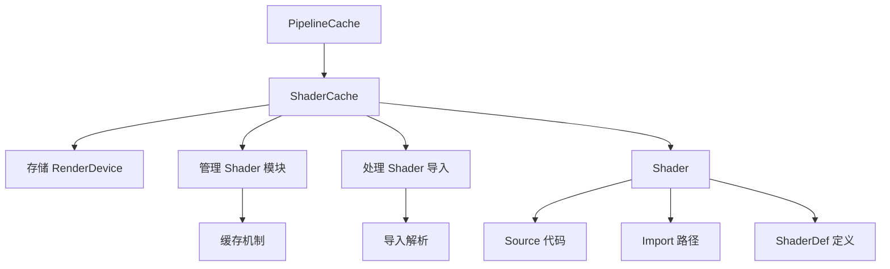

+++
title = "#22774 doc and clean up bevy_shader"
date = "2026-02-03T00:00:00"
draft = false
template = "pull_request_page.html"
in_search_index = false

[extra]
current_language = "zh-cn"
available_languages = {"en" = { name = "English", url = "/pull_request/bevy/2026-02/pr-22774-en-20260203" }, "zh-cn" = { name = "中文", url = "/pull_request/bevy/2026-02/pr-22774-zh-cn-20260203" }}
+++

# Title

## Basic Information
- **标题**: doc and clean up bevy_shader
- **PR链接**: https://github.com/bevyengine/bevy/pull/22774
- **作者**: atlv24
- **状态**: 已合并
- **标签**: C-Docs, A-Rendering, S-Ready-For-Final-Review, D-Straightforward, C-Refinement
- **创建时间**: 2026-02-02T08:10:26Z
- **合并时间**: 2026-02-03T00:19:25Z
- **合并者**: alice-i-cecile

## Description Translation

### 目标

- 解决缺失文档的警告：`#![expect(missing_docs, reason = "Not all docs are written yet, see #3492.")]`
- 清理 bevy_shader 模块

### 解决方案

- 将 `RenderDevice` 参数从 `get` 方法移动到 `new` 方法，因为我们将很快进入 Render Recovery 世界，需要确保不同的渲染设备不会最终进入同一个着色器缓存。
- 删除一个未使用的枚举
- 删除一些样板化的 getter 方法
- 为所有内容添加文档
- 同时为 `define_atomic_id` 宏添加文档

### 测试

- 通过 CI 测试

## The Story of This Pull Request

这个 PR 的主要目标是清理 bevy_shader 模块的代码并完善其文档。开发者在工作中遇到了编译器警告，提示模块缺少文档。同时，在审查代码时发现了一些可以简化的代码结构和需要更新的设计决策。

问题的核心在于 `ShaderCache` 的设计存在一个潜在问题：当前的 `get` 方法接受一个 `RenderDevice` 参数，这意味着同一个缓存实例可能被多个不同的渲染设备使用。在即将引入的 Render Recovery 世界中，这会导致严重的问题——不同的渲染设备可能会共享同一个着色器缓存，这在技术上是错误的，因为着色器模块是与特定设备绑定的 GPU 资源。

解决方案采用了直接的方法：首先将 `RenderDevice` 参数从 `get` 方法移动到 `new` 方法，确保每个 `ShaderCache` 实例只与一个特定的渲染设备关联。这个设计变更意味着 `ShaderCache` 现在在创建时就确定了它所属的渲染设备，避免了后续可能出现的设备混淆问题。

在实现这个主要变更的同时，开发者还进行了一系列代码清理工作。最明显的是删除了完全未使用的 `ShaderReflectError` 枚举——这个枚举原本用于着色器反射错误处理，但在当前代码库中没有任何地方使用它。删除未使用的代码减少了维护负担和潜在的混淆。

另一个重要的清理是移除了 `Shader` 结构体中的多个样板化 getter 方法。这些方法如 `set_import_path`、`with_import_path`、`import_path` 和 `imports` 只是简单地包装了对字段的访问，没有提供额外的逻辑或验证。在 Rust 的编码实践中，当 getter 方法只是直接返回字段值时，通常更倾向于直接公开字段或使用更简单的方式访问。删除这些方法简化了 API 并减少了不必要的抽象层。

文档方面，开发者为几乎所有的公共类型、方法和字段添加了详细的文档注释。这不仅解决了编译器警告，更重要的是提高了代码的可读性和可维护性。特别是在 `ShaderCache` 和 `Shader` 等核心类型上，文档现在清晰地解释了它们的作用、使用方式和设计考虑。

一个有趣的细节是 `ShaderCacheSource` 类型的文档。它被描述为与 `wgpu::ShaderSource` 类似，但具有更少的变化和更具体的类型。这个类型的目的是表示已经完全组合并应用了所有着色器定义（shader defs）的着色器模块源代码。文档明确指出，任何必要的着色器翻译（如从 WGSL 到 SPIR-V）必须由渲染器内部完成。

在 `define_atomic_id` 宏的文档中，开发者清楚地指出了其局限性：ID 空间是进程范围的（process-wide），这意味着在长时间运行的进程和多个 Bevy `World` 的组合下，ID 可能会耗尽，此时会触发 panic。这种明确的文档对于使用者理解潜在的风险非常重要。

从技术架构的角度看，这个 PR 展示了一个重要的设计原则：资源生命周期管理。通过将 `RenderDevice` 绑定到 `ShaderCache` 的创建时，而不是每次调用 `get` 时，确保了缓存中的着色器模块始终与正确的设备关联。这种模式在图形编程中很常见，因为 GPU 资源通常与特定的设备上下文紧密绑定。

实现中的另一个技术细节是 `ShaderCache` 的缓存键设计。文档明确指出，缓存键由 `id` 和 `shader_defs` 组成，这意味着以不同顺序提供相同的 `shader_defs` 或包含冗余项不会导致缓存命中，而是需要重新组合模块并再次调用 `load_module`。这个信息对于希望优化性能的开发者很有价值。

在代码质量方面，这个 PR 还展示了如何合理地使用 `#[expect]` 属性。在某些情况下，如 `Source` 枚举和 `ShaderCacheError` 枚举，开发者添加了 `#[expect(missing_docs)]` 并说明枚举变体是自解释的（self-explanatory）。这是一种平衡——为确实简单的变体避免冗余文档，同时为复杂类型提供完整文档。

最终，这个 PR 产生了一个更清晰、更健壮且更易维护的 `bevy_shader` 模块。虽然大多数变更都是改进而非功能添加，但这些改进为未来的功能开发（特别是 Render Recovery 相关的工作）奠定了更好的基础。代码现在更容易理解，设计决策更明确，潜在的错误来源更少。

## Visual Representation



## Key Files Changed

### `crates/bevy_shader/src/shader_cache.rs` (+59/-18)
这个文件包含了最重要的设计变更。`ShaderCache` 现在在创建时接收 `RenderDevice` 并存储它，而不是在每次 `get` 调用时传递。

```rust
// 修改前:
pub fn get(
    &mut self,
    render_device: &RenderDevice,  // 每次调用都传递
    pipeline: CachedPipelineId,
    id: AssetId<Shader>,
    shader_defs: &[ShaderDefVal],
) -> Result<Arc<ShaderModule>, ShaderCacheError>

// 修改后:
pub fn get(
    &mut self,
    pipeline: CachedPipelineId,
    id: AssetId<Shader>,
    shader_defs: &[ShaderDefVal],
) -> Result<Arc<ShaderModule>, ShaderCacheError>
```

```rust
// 新增: ShaderCache 现在存储 device
pub struct ShaderCache<ShaderModule, RenderDevice> {
    device: RenderDevice,  // 新增字段
    // ... 其他字段
}

// new 方法现在接收 device
pub fn new(
    device: RenderDevice,  // 新增参数
    features: Features,
    downlevel: DownlevelFlags,
    load_module: fn(...),
) -> Self
```

### `crates/bevy_shader/src/shader.rs` (+28/-41)
删除了未使用的 `ShaderReflectError` 枚举和多个样板化的 getter 方法，同时为所有公共接口添加了文档。

```rust
// 删除的未使用枚举:
#[derive(Error, Debug)]
pub enum ShaderReflectError {
    #[error(transparent)]
    WgslParse(#[from] naga::front::wgsl::ParseError),
    // ... 其他变体
}

// 删除的样板化 getter 方法:
pub fn set_import_path<P: Into<String>>(&mut self, import_path: P) { ... }
pub fn with_import_path<P: Into<String>>(mut self, import_path: P) -> Self { ... }
pub fn import_path(&self) -> &ShaderImport { ... }
pub fn imports(&self) -> impl ExactSizeIterator<Item = &ShaderImport> { ... }
```

### `crates/bevy_render/src/render_resource/pipeline_cache.rs` (+7/-16)
更新了 `PipelineCache` 中对 `ShaderCache` 的调用，以适配新的 API。

```rust
// 修改前:
let vertex_module = match shader_cache.get(
    &device,  // 传递 device
    id,
    descriptor.vertex.shader.id(),
    &descriptor.vertex.shader_defs,
)

// 修改后:
let vertex_module = match shader_cache.get(
    id,  // 不再传递 device
    descriptor.vertex.shader.id(),
    &descriptor.vertex.shader_defs,
)
```

### `crates/bevy_utils/src/atomic_id.rs` (+9/-1)
为 `define_atomic_id` 宏添加了详细文档，说明了其工作原理和限制。

```rust
/// Defines a 32-bit id type which guarantees global uniqueness via atomics on a static global.
///
/// Note that this means the id space is process-wide, as such it may potentially be exhausted
/// by a combination of long-running processes and multiple bevy `World`s, at which point we panic.
#[macro_export]
macro_rules! define_atomic_id {
    // ... 宏定义
}
```

### `release-content/migration-guides/bevy_shader.md` (+10/-0)
新增了迁移指南，记录了破坏性变更。

```markdown
`ShaderReflectError` has been deleted, as it was unused.

`ShaderCache::new` now accepts a `RenderDevice`, and `ShaderCache::get` does not. This is to reflect the fact that a `ShaderCache` must only be used with one `RenderDevice` for it to be valid.

The `set_import_path`, `with_import_path`, `import_path`, and `imports` methods on `Shader` have been removed. Just access the fields directly, these were superfluous getter methods.
```

## Further Reading

1. **wgpu ShaderModule 文档**: 了解 `wgpu::ShaderModule` 的创建和使用方式
2. **Rust 宏编程**: 学习如何编写和使用像 `define_atomic_id` 这样的声明式宏
3. **GPU 资源管理**: 理解为什么 GPU 资源需要与特定设备绑定
4. **Bevy ECS 中的 ID 系统**: 了解 Bevy 如何管理实体和组件的唯一标识符
5. **naga 着色器处理**: 研究 naga 库如何解析和处理不同着色器格式