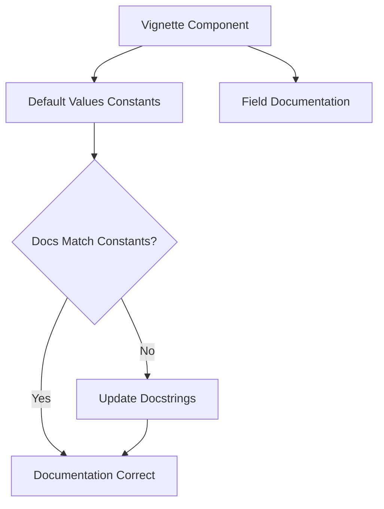

+++
title = "#22783 Fix vignette docstring to match default values"
date = "2026-02-03T00:00:00"
draft = false
template = "pull_request_page.html"
in_search_index = true

[taxonomies]
list_display = ["show"]

[extra]
current_language = "en"
available_languages = {"en" = { name = "English", url = "/pull_request/bevy/2026-02/pr-22783-en-20260203" }, "zh-cn" = { name = "中文", url = "/pull_request/bevy/2026-02/pr-22783-zh-cn-20260203" }}
labels = ["C-Docs", "D-Trivial", "A-Rendering"]
+++

# Fix vignette docstring to match default values

## Basic Information
- **Title**: Fix vignette docstring to match default values
- **PR Link**: https://github.com/bevyengine/bevy/pull/22783
- **Author**: glennDittmann
- **Status**: MERGED
- **Labels**: C-Docs, D-Trivial, A-Rendering, S-Ready-For-Final-Review
- **Created**: 2026-02-02T21:08:59Z
- **Merged**: 2026-02-03T00:45:33Z
- **Merged By**: alice-i-cecile

## Description Translation
# Objective
Update docstrings to match the actual default values defined as `const`s in the code. 

Fixes #22677 

## Solution
/

## Testing
/

## The Story of This Pull Request

This pull request addresses a documentation inconsistency in Bevy's post-processing system. The issue was straightforward: the docstrings for the `Vignette` component's fields didn't match the actual default values defined as constants in the code. While this might seem like a minor oversight, accurate documentation is crucial for a game engine like Bevy where developers rely on clear, correct API documentation to understand how to use features effectively.

The problem originated from the `Vignette` struct's field documentation stating incorrect default values. For example, the docstring for the `intensity` field said the default was 0.50, but the actual constant `DEFAULT_VIGNETTE_INTENSITY` was defined as 1.00. Similar mismatches existed for the `radius`, `smoothness`, `roundness`, and `edge_compensation` fields. This discrepancy could mislead developers about the expected behavior when they create a `Vignette` component without explicitly setting these values.

The solution implemented in this PR is direct and focused. The developer identified all the mismatched documentation strings and updated them to reflect the actual default values defined in the constants. Additionally, they standardized the formatting of floating-point constants by changing values like `1.00` to `1.0` for consistency with Rust conventions, though this formatting change doesn't affect the actual values.

The changes are minimal but important. When developers read documentation for the `Vignette` component, they now get accurate information about what values will be used by default. This prevents confusion and potential bugs where developers might assume different default behavior. The fix also improves the consistency of the codebase by ensuring that documentation always reflects the actual implementation.

From an engineering perspective, this PR demonstrates good attention to detail in maintaining documentation quality. While the changes are simple, they address a real usability issue where incorrect documentation could lead to developer frustration or incorrect assumptions about system behavior. The PR also shows the value of having constants defined for default values, as this makes it easier to identify and fix documentation mismatches.

The implementation approach is straightforward: update the docstrings to reference the correct constants. No architectural changes were needed, and the fix doesn't affect runtime behavior. The PR was properly labeled with documentation-related tags (C-Docs, D-Trivial) and rendering area tags (A-Rendering), and was reviewed and merged quickly, indicating consensus on the importance of accurate documentation.

## Visual Representation



## Key Files Changed

### `crates/bevy_post_process/src/effect_stack/vignette.rs` (+8/-8)

This file contains the `Vignette` component definition and its associated default value constants. The changes fix documentation mismatches between the field docstrings and the actual default values defined as constants.

**Key modifications:**

1. **Standardized constant formatting** - Changed `1.00` to `1.0` for consistency:
```rust
// Before:
const DEFAULT_VIGNETTE_INTENSITY: f32 = 1.00;
const DEFAULT_VIGNETTE_ROUNDNESS: f32 = 1.00;
const DEFAULT_VIGNETTE_EDGE_COMPENSATION: f32 = 1.00;

// After:
const DEFAULT_VIGNETTE_INTENSITY: f32 = 1.0;
const DEFAULT_VIGNETTE_ROUNDNESS: f32 = 1.0;
const DEFAULT_VIGNETTE_EDGE_COMPENSATION: f32 = 1.0;
```

2. **Updated field documentation** - Corrected docstrings to match actual default values:
```rust
// Before:
/// The default value is 0.50
pub intensity: f32,

/// The default value is 1.00  
pub radius: f32,

/// The default value is 0.50
pub smoothness: f32,

/// The default value is 0.75
pub roundness: f32,

/// The default value is 1.00
pub edge_compensation: f32,

// After:
/// The default value is 1.0
pub intensity: f32,

/// The default value is 0.75
pub radius: f32,

/// The default value is 5.0
pub smoothness: f32,

/// The default value is 1.0
pub roundness: f32,

/// The default value is 1.0
pub edge_compensation: f32,
```

The changes ensure that developers reading the documentation get accurate information about the default behavior of the `Vignette` component.

## Further Reading

- [Rust Documentation Comments](https://doc.rust-lang.org/rustdoc/how-to-write-documentation.html) - Best practices for writing documentation in Rust
- [Bevy Post-Processing Effects](https://bevyengine.org/learn/books/cookbook/2d/8-post-processing/) - How to use post-processing effects in Bevy
- [Constants in Rust](https://doc.rust-lang.org/book/ch03-01-variables-and-mutability.html#constants) - Using constants for default values in Rust
- [Issue #22677](https://github.com/bevyengine/bevy/issues/22677) - The original issue reporting the documentation mismatch

# Full Code Diff

```diff
diff --git a/crates/bevy_post_process/src/effect_stack/vignette.rs b/crates/bevy_post_process/src/effect_stack/vignette.rs
index 8c09023be65e4..cf96708b6c0df 100644
--- a/crates/bevy_post_process/src/effect_stack/vignette.rs
+++ b/crates/bevy_post_process/src/effect_stack/vignette.rs
@@ -11,7 +11,7 @@ use bevy_reflect::{std_traits::ReflectDefault, Reflect};
 use bevy_render::{extract_component::ExtractComponent, render_resource::ShaderType};
 
 /// The default vignette intensity amount.
-const DEFAULT_VIGNETTE_INTENSITY: f32 = 1.00;
+const DEFAULT_VIGNETTE_INTENSITY: f32 = 1.0;
 
 /// The default vignette radius amount.
 const DEFAULT_VIGNETTE_RADIUS: f32 = 0.75;
@@ -20,10 +20,10 @@ const DEFAULT_VIGNETTE_RADIUS: f32 = 0.75;
 const DEFAULT_VIGNETTE_SMOOTHNESS: f32 = 5.0;
 
 /// The default vignette roundness amount.
-const DEFAULT_VIGNETTE_ROUNDNESS: f32 = 1.00;
+const DEFAULT_VIGNETTE_ROUNDNESS: f32 = 1.0;
 
 /// The default vignette edge compensation
-const DEFAULT_VIGNETTE_EDGE_COMPENSATION: f32 = 1.00;
+const DEFAULT_VIGNETTE_EDGE_COMPENSATION: f32 = 1.0;
 
 /// Adds a gradual shading effect to the edges of the screen, drawing focus
 /// towards the center.
@@ -45,25 +45,25 @@ pub struct Vignette {
     ///
     /// Range: `0.0` (No effect) to `1.0` (Fully black corners)
     ///
-    /// The default value is 0.50
+    /// The default value is 1.0
     pub intensity: f32,
     /// The size of the unvignetted center area.
     ///
     /// Range: `0.0` (Tiny center) to `2.0+` (Large center)
     ///
-    /// The default value is 1.00
+    /// The default value is 0.75
     pub radius: f32,
     /// The softness of the edge between the clear and dark areas.
     ///
     /// Range: `0.01` (Sharp edge) to `1.0+` (Very soft edge)
     ///
-    /// The default value is 0.50
+    /// The default value is 5.0
     pub smoothness: f32,
     /// The shape of the vignette.
     ///
     /// `1.0` represents a perfect circle.
     ///
-    /// The default value is 0.75
+    /// The default value is 1.0
     pub roundness: f32,
     /// The center of the vignette in UV coordinates (0.0 to 1.0).
     ///
@@ -76,7 +76,7 @@ pub struct Vignette {
     ///
     /// Range: `0.0`(No fit) to `1.0` (Perfect fit)
     ///
-    /// The default value is 1.00
+    /// The default value is 1.0
     pub edge_compensation: f32,
     /// The color of the vignette.
     ///
```