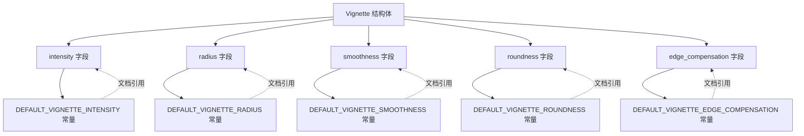

+++
title = "#22783 Fix vignette docstring to match default values"
date = "2026-02-03T00:00:00"
draft = false
template = "pull_request_page.html"
in_search_index = false

[extra]
current_language = "zh-cn"
available_languages = {"en" = { name = "English", url = "/pull_request/bevy/2026-02/pr-22783-en-20260203" }, "zh-cn" = { name = "中文", url = "/pull_request/bevy/2026-02/pr-22783-zh-cn-20260203" }}
labels = ["C-Docs", "D-Trivial", "A-Rendering"]
+++

# Title
## Fix vignette docstring to match default values

## Basic Information
- **Title**: Fix vignette docstring to match default values
- **PR Link**: https://github.com/bevyengine/bevy/pull/22783
- **Author**: glennDittmann
- **Status**: MERGED
- **Labels**: C-Docs, D-Trivial, A-Rendering, S-Ready-For-Final-Review
- **Created**: 2026-02-02T21:08:59Z
- **Merged**: 2026-02-03T00:45:33Z
- **Merged By**: alice-i-cecile

## Description Translation
### 目标
更新文档字符串以匹配代码中定义为 `const` 的实际默认值。

修复 #22677

### 解决方案
/

### 测试
/

## The Story of This Pull Request

这是一个关于文档一致性维护的简单但重要的修复。在开发过程中，当代码的实际实现与文档描述不一致时，会给开发者带来混淆和错误的使用预期。这个 PR 解决了一个具体问题：Vignette（暗角）后处理效果的文档字符串与实际默认值不匹配。

问题的根源在于代码中的常量定义已经更新，但对应的文档字符串没有同步更新。具体来说，`Vignette` 结构体有多个字段，每个字段都有默认值，这些默认值在代码中被定义为常量。然而，这些字段的文档注释（docstrings）中描述的默认值与实际常量值不一致，导致用户阅读文档时会得到错误信息。

从技术角度看，这种不一致性可能源于几个方面：
1. 代码重构时更新了常量值但忘记更新文档
2. 文档最初编写时就有错误
3. 不同贡献者对默认值的理解不同

这个问题虽然看起来很小，但实际上很重要。在图形编程中，后处理效果的参数调节通常需要精确的数值控制。如果文档提供了错误的默认值，开发者可能会基于错误的前提进行调试，浪费大量时间。

修复方案直接且明确：更新文档字符串以匹配实际的常量值。这个 PR 做了两件事：
1. 将一些常量的数值表示从 `1.00` 简化为 `1.0`，这是 Rust 中浮点数常量的常见写法
2. 更新了 `Vignette` 结构体字段的文档注释，使其与实际的默认值常量保持一致

例如，`intensity` 字段的文档从 "The default value is 0.50" 改为 "The default value is 1.0"，这反映了 `DEFAULT_VIGNETTE_INTENSITY` 常量的实际值。

这种修复虽然不涉及功能变更，但对项目维护很重要。它体现了几个良好的软件开发实践：

1. **文档与代码同步**：确保文档始终反映代码的实际行为
2. **避免混淆**：为开发者提供准确的信息，减少调试时间
3. **维护一致性**：在整个代码库中保持统一的文档标准

对于 Bevy 这样的开源游戏引擎，准确的文档尤为重要，因为它有大量的用户和贡献者。错误的文档不仅会影响使用体验，还可能导致错误报告和不必要的 PR。

从工程角度看，这个 PR 还展示了 Rust 项目中常见的文档维护模式：
- 使用常量定义默认值，避免魔法数字
- 在结构体字段的文档中引用这些常量
- 保持常量和文档的同步

这种模式使得默认值在代码中只有一个来源（常量定义），便于维护。当需要修改默认值时，只需更新常量定义，然后确保文档同步即可。

## Visual Representation



## Key Files Changed

### `crates/bevy_post_process/src/effect_stack/vignette.rs`
这个文件包含了 Vignette 后处理效果的定义。修改包括更新常量的数值表示和修正文档字符串中的默认值描述。

**关键修改：**

1. **常量定义的数值简化**：
```rust
// 之前：
const DEFAULT_VIGNETTE_INTENSITY: f32 = 1.00;
const DEFAULT_VIGNETTE_ROUNDNESS: f32 = 1.00;
const DEFAULT_VIGNETTE_EDGE_COMPENSATION: f32 = 1.00;

// 之后：
const DEFAULT_VIGNETTE_INTENSITY: f32 = 1.0;
const DEFAULT_VIGNETTE_ROUNDNESS: f32 = 1.0;
const DEFAULT_VIGNETTE_EDGE_COMPENSATION: f32 = 1.0;
```

2. **文档字符串更新**：
```rust
// intensity 字段之前：
/// The default value is 0.50
pub intensity: f32,

// intensity 字段之后：
/// The default value is 1.0
pub intensity: f32,

// radius 字段之前：
/// The default value is 1.00
pub radius: f32,

// radius 字段之后：
/// The default value is 0.75
pub radius: f32,

// smoothness 字段之前：
/// The default value is 0.50
pub smoothness: f32,

// smoothness 字段之后：
/// The default value is 5.0
pub smoothness: f32,

// roundness 字段之前：
/// The default value is 0.75
pub roundness: f32,

// roundness 字段之后：
/// The default value is 1.0
pub roundness: f32,

// edge_compensation 字段之前：
/// The default value is 1.00
pub edge_compensation: f32,

// edge_compensation 字段之后：
/// The default value is 1.0
pub edge_compensation: f32,
```

这些修改确保了文档字符串准确反映了代码中定义的常量值。常量定义是事实上的默认值来源，文档应该与之一致。

## Further Reading

1. **Rust 文档注释规范**：[The Rust Programming Language - Documentation](https://doc.rust-lang.org/book/ch14-02-publishing-to-crates-io.html#making-useful-documentation-comments)
2. **Bevy 后处理系统**：[Bevy Post Processing](https://github.com/bevyengine/bevy/tree/main/crates/bevy_post_process)
3. **暗角效果在图形学中的应用**：[Vignetting in Computer Graphics](https://en.wikipedia.org/wiki/Vignetting#In_photography_and_optics)
4. **Rust 中的常量定义最佳实践**：[Rust by Example - Constants](https://doc.rust-lang.org/rust-by-example/custom_types/constants.html)

## Full Code Diff
```diff
diff --git a/crates/bevy_post_process/src/effect_stack/vignette.rs b/crates/bevy_post_process/src/effect_stack/vignette.rs
index 8c09023be65e4..cf96708b6c0df 100644
--- a/crates/bevy_post_process/src/effect_stack/vignette.rs
+++ b/crates/bevy_post_process/src/effect_stack/vignette.rs
@@ -11,7 +11,7 @@ use bevy_reflect::{std_traits::ReflectDefault, Reflect};
 use bevy_render::{extract_component::ExtractComponent, render_resource::ShaderType};
 
 /// The default vignette intensity amount.
-const DEFAULT_VIGNETTE_INTENSITY: f32 = 1.00;
+const DEFAULT_VIGNETTE_INTENSITY: f32 = 1.0;
 
 /// The default vignette radius amount.
 const DEFAULT_VIGNETTE_RADIUS: f32 = 0.75;
@@ -20,10 +20,10 @@ const DEFAULT_VIGNETTE_RADIUS: f32 = 0.75;
 const DEFAULT_VIGNETTE_SMOOTHNESS: f32 = 5.0;
 
 /// The default vignette roundness amount.
-const DEFAULT_VIGNETTE_ROUNDNESS: f32 = 1.00;
+const DEFAULT_VIGNETTE_ROUNDNESS: f32 = 1.0;
 
 /// The default vignette edge compensation
-const DEFAULT_VIGNETTE_EDGE_COMPENSATION: f32 = 1.00;
+const DEFAULT_VIGNETTE_EDGE_COMPENSATION: f32 = 1.0;
 
 /// Adds a gradual shading effect to the edges of the screen, drawing focus
 /// towards the center.
@@ -45,25 +45,25 @@ pub struct Vignette {
     ///
     /// Range: `0.0` (No effect) to `1.0` (Fully black corners)
     ///
-    /// The default value is 0.50
+    /// The default value is 1.0
     pub intensity: f32,
     /// The size of the unvignetted center area.
     ///
     /// Range: `0.0` (Tiny center) to `2.0+` (Large center)
     ///
-    /// The default value is 1.00
+    /// The default value is 0.75
     pub radius: f32,
     /// The softness of the edge between the clear and dark areas.
     ///
     /// Range: `0.01` (Sharp edge) to `1.0+` (Very soft edge)
     ///
-    /// The default value is 0.50
+    /// The default value is 5.0
     pub smoothness: f32,
     /// The shape of the vignette.
     ///
     /// `1.0` represents a perfect circle.
     ///
-    /// The default value is 0.75
+    /// The default value is 1.0
     pub roundness: f32,
     /// The center of the vignette in UV coordinates (0.0 to 1.0).
     ///
@@ -76,7 +76,7 @@ pub struct Vignette {
     ///
     /// Range: `0.0`(No fit) to `1.0` (Perfect fit)
     ///
-    /// The default value is 1.00
+    /// The default value is 1.0
     pub edge_compensation: f32,
     /// The color of the vignette.
     ///
```