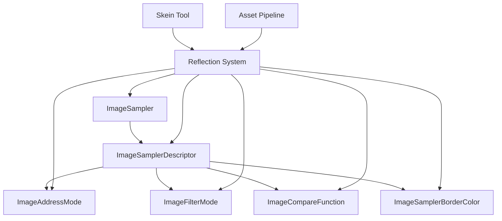

+++
title = "#22786 reflect imagesampler"
date = "2026-02-06T00:00:00"
draft = false
template = "pull_request_page.html"
in_search_index = true

[taxonomies]
list_display = ["show"]

[extra]
current_language = "en"
available_languages = {"en" = { name = "English", url = "/pull_request/bevy/2026-02/pr-22786-en-20260206" }, "zh-cn" = { name = "中文", url = "/pull_request/bevy/2026-02/pr-22786-zh-cn-20260206" }}
labels = ["A-Rendering", "A-Reflection", "D-Straightforward"]
+++

# Title
reflect imagesampler

## Basic Information
- **Title**: reflect imagesampler
- **PR Link**: https://github.com/bevyengine/bevy/pull/22786
- **Author**: ChristopherBiscardi
- **Status**: MERGED
- **Labels**: A-Rendering, S-Ready-For-Final-Review, A-Reflection, D-Straightforward
- **Created**: 2026-02-03T00:50:04Z
- **Merged**: 2026-02-06T20:39:03Z
- **Merged By**: alice-i-cecile

## Description Translation
# Objective

I'm working on `Handle<Image>` support for [skein](https://bevyskein.dev/). `ImageSampler` doesn't implement `Reflect`, so doesn't exist in the registry, but this is the definitive "what a sampler is" type for Bevy, and "Image" in Bevy is image data + sampler. So I want to allow people to define a real Bevy Sampler for their image data.

## Solution

`Reflect` `ImageSampler` to make it available to use.

## Testing

I ran the `3d_scene` to make sure it didn't crash, and the reflect/serialization example with `::default()` and `::nearest()`:

```json
{
    "bevy_image::image::ImageSampler": "Default"
}
```

```json
{
  "bevy_image::image::ImageSampler": {
    "Descriptor": {
      "label": null,
      "address_mode_u": "ClampToEdge",
      "address_mode_v": "ClampToEdge",
      "address_mode_w": "ClampToEdge",
      "mag_filter": "Nearest",
      "min_filter": "Nearest",
      "mipmap_filter": "Nearest",
      "lod_min_clamp": 0.0,
      "lod_max_clamp": 32.0,
      "compare": null,
      "anisotropy_clamp": 1,
      "border_color": null
    }
  }
}
```

## The Story of This Pull Request

ChristopherBiscardi was working on adding `Handle<Image>` support to Skein, a tool for building Bevy applications. They encountered a practical limitation: the `ImageSampler` type and its related enum types didn't implement the `Reflect` trait. This meant these types couldn't be registered in Bevy's type registry, making them unavailable for reflection-based operations like serialization, deserialization, and UI inspection.

The core issue was that `ImageSampler` represents a fundamental concept in Bevy's rendering system - it defines how texture sampling works, including addressing modes, filtering, and comparison functions. An `Image` in Bevy consists of both pixel data and a sampler configuration. Without reflection support, users couldn't define or manipulate Bevy's native sampler configurations through reflection-based tools.

The solution was straightforward: add the `Reflect` trait derivation to six key types in the image module:
1. `ImageSampler` (the main enum with `Default` and `Descriptor` variants)
2. `ImageAddressMode` (controls texture coordinate wrapping)
3. `ImageFilterMode` (controls minification/magnification filtering)
4. `ImageCompareFunction` (used for depth comparison)
5. `ImageSamplerBorderColor` (defines border colors for clamp-to-border addressing)
6. `ImageSamplerDescriptor` (contains all sampler configuration parameters)

The implementation approach used conditional compilation with `#[cfg_attr(feature = "bevy_reflect", ...)]` to ensure the reflection support only gets compiled when the `bevy_reflect` feature is enabled. This follows Bevy's established pattern for optional reflection support. For each type, appropriate trait bounds were specified using the `reflect()` attribute macro: `Default`, `Debug`, and `Clone` for most types, and just `Debug` and `Clone` for types that don't have a natural default value (`ImageCompareFunction` and `ImageSamplerBorderColor`).

The changes are minimal and focused - they only add the reflection derivation attributes without modifying any existing functionality. This maintains backward compatibility while extending the type's capabilities. The PR author tested the changes by running the `3d_scene` example to ensure no crashes, and verified serialization output in the reflect/serialization example, showing both the default variant and a custom nearest-neighbor sampler configuration.

From an engineering perspective, this change enables several practical use cases:
1. Tools like Skein can now expose sampler configuration through their UI
2. Sampler configurations can be serialized and deserialized through Bevy's reflection system
3. Sampler properties can be inspected and modified at runtime through reflection
4. Asset pipelines can define sampler configurations in data files that get loaded through the asset system

The implementation demonstrates good practice in maintaining feature gating - reflection support is optional and only included when the relevant feature is enabled. The use of `cfg_attr` keeps the code clean and avoids conditional compilation blocks that would make the code harder to read.

## Visual Representation



## Key Files Changed

**File: `crates/bevy_image/src/image.rs`**

This file contains the definitions for image-related types in Bevy. The changes add reflection support to six types that define texture sampler behavior.

Key modifications:

1. **ImageSampler enum** - Added reflection derivation with Default, Debug, and Clone traits:
```rust
#[cfg_attr(
    feature = "bevy_reflect",
    derive(Reflect),
    reflect(Default, Debug, Clone)
)]
pub enum ImageSampler {
    #[default]
    Default,
    Descriptor(ImageSamplerDescriptor),
}
```

2. **ImageAddressMode enum** - Added reflection derivation:
```rust
#[cfg_attr(
    feature = "bevy_reflect",
    derive(Reflect),
    reflect(Default, Debug, Clone)
)]
pub enum ImageAddressMode {
    #[default]
    ClampToEdge,
    // ... other variants
}
```

3. **ImageFilterMode enum** - Added reflection derivation:
```rust
#[cfg_attr(
    feature = "bevy_reflect",
    derive(Reflect),
    reflect(Default, Debug, Clone)
)]
pub enum ImageFilterMode {
    #[default]
    Nearest,
    Linear,
}
```

4. **ImageCompareFunction enum** - Added reflection derivation (without Default since it doesn't have a default variant):
```rust
#[cfg_attr(feature = "bevy_reflect", derive(Reflect), reflect(Debug, Clone))]
pub enum ImageCompareFunction {
    Never,
    // ... other variants
}
```

5. **ImageSamplerBorderColor enum** - Added reflection derivation (without Default):
```rust
#[cfg_attr(feature = "bevy_reflect", derive(Reflect), reflect(Debug, Clone))]
pub enum ImageSamplerBorderColor {
    TransparentBlack,
    // ... other variants
}
```

6. **ImageSamplerDescriptor struct** - Added reflection derivation:
```rust
#[cfg_attr(
    feature = "bevy_reflect",
    derive(Reflect),
    reflect(Default, Debug, Clone)
)]
pub struct ImageSamplerDescriptor {
    pub label: Option<String>,
    pub address_mode_u: ImageAddressMode,
    // ... other fields
}
```

These changes enable the entire sampler configuration hierarchy to be reflected, allowing tools and systems to work with sampler configurations through Bevy's reflection APIs.

## Further Reading

1. **Bevy Reflection System**: The [Bevy Reflection chapter](https://bevyengine.org/learn/book/reflection/) in the Bevy Book explains how reflection works in Bevy and how to use it.

2. **Texture Sampling Concepts**: Learn about texture sampling concepts like filtering and addressing modes in the [WebGPU specification](https://www.w3.org/TR/webgpu/#sampler-descriptor) or [Vulkan specification](https://www.khronos.org/registry/vulkan/specs/1.3-extensions/html/vkspec.html#samplers).

3. **Skein Tool**: The [Skein website](https://bevyskein.dev/) provides information about the tool that motivated this change.

4. **Conditional Compilation in Rust**: The [Rust Reference on conditional compilation](https://doc.rust-lang.org/reference/conditional-compilation.html) explains how `cfg` and `cfg_attr` work.

5. **Derive Macros**: The [Rust Derive Macros guide](https://doc.rust-lang.org/reference/procedural-macros.html#derive-macros) explains how derive macros like `Reflect` work.