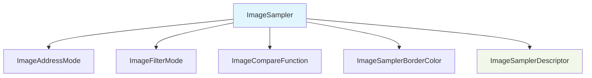

+++
title = "#22786 reflect imagesampler"
date = "2026-02-06T00:00:00"
draft = false
template = "pull_request_page.html"
in_search_index = false

[extra]
current_language = "zh-cn"
available_languages = {"en" = { name = "English", url = "/pull_request/bevy/2026-02/pr-22786-en-20260206" }, "zh-cn" = { name = "中文", url = "/pull_request/bevy/2026-02/pr-22786-zh-cn-20260206" }}
+++

# Title
reflect imagesampler

## 基本信息
- **标题**: reflect imagesampler
- **PR链接**: https://github.com/bevyengine/bevy/pull/22786
- **作者**: ChristopherBiscardi
- **状态**: 已合并
- **标签**: A-Rendering, S-Ready-For-Final-Review, A-Reflection, D-Straightforward
- **创建时间**: 2026-02-03T00:50:04Z
- **合并时间**: 2026-02-06T20:39:03Z
- **合并者**: alice-i-cecile

## 描述翻译
我正在为 [skein](https://bevyskein.dev/) 开发 `Handle<Image>` 支持。
`ImageSampler` 没有实现 `Reflect`，因此不存在于类型注册表中，但这是 Bevy 中定义 "采样器是什么" 的权威类型，而且 Bevy 中的 "Image" 是图像数据 + 采样器。所以我想允许用户为他们的图像数据定义一个真正的 Bevy 采样器。

### 解决方案
为 `ImageSampler` 实现 `Reflect`，使其可用。

### 测试
我运行了 `3d_scene` 示例以确保它不会崩溃，并使用 `::default()` 和 `::nearest()` 测试了反射/序列化示例：

```json
{
    "bevy_image::image::ImageSampler": "Default"
}
```

```json
{
  "bevy_image::image::ImageSampler": {
    "Descriptor": {
      "label": null,
      "address_mode_u": "ClampToEdge",
      "address_mode_v": "ClampToEdge",
      "address_mode_w": "ClampToEdge",
      "mag_filter": "Nearest",
      "min_filter": "Nearest",
      "mipmap_filter": "Nearest",
      "lod_min_clamp": 0.0,
      "lod_max_clamp": 32.0,
      "compare": null,
      "anisotropy_clamp": 1,
      "border_color": null
    }
  }
}
```

## 本次PR的技术解析

这个PR的核心问题是关于Bevy反射（Reflection）系统的一个缺失特性。开发者正在为skein工具开发`Handle<Image>`支持，发现`ImageSampler`类型——作为Bevy中定义纹理采样行为的核心类型——没有实现`Reflect` trait。

在Bevy中，反射系统允许类型在运行时被检查和操作，这对于编辑器工具、序列化和动态类型系统至关重要。当类型实现`Reflect`后，它会被自动注册到类型注册表中，从而可以被动态查询和操作。`ImageSampler`作为`Image`组件的一部分（图像数据+采样器设置），缺少反射支持意味着工具无法完整地处理和序列化图像资源。

开发者采取了一个直接而有效的解决方案：为`ImageSampler`及其相关的枚举类型添加`Reflect`派生宏。这些改动全部集中在`crates/bevy_image/src/image.rs`文件中，通过条件编译属性`#[cfg_attr(feature = "bevy_reflect", ...)]`确保只有在启用`bevy_reflect`功能时才会包含反射相关的代码。

实现细节上，开发者为以下类型添加了反射支持：
- `ImageSampler`：采样器的主要枚举，包含`Default`和`Descriptor`两个变体
- `ImageAddressMode`：纹理坐标寻址模式
- `ImageFilterMode`：纹理过滤模式
- `ImageCompareFunction`：深度比较函数
- `ImageSamplerBorderColor`：采样器边框颜色
- `ImageSamplerDescriptor`：采样器描述符结构体

每个类型都通过`reflect()`属性指定了需要反射的trait，如`Default`、`Debug`、`Clone`等。这种设计保持了代码的整洁性——反射支持被优雅地包裹在条件编译中，不影响核心渲染逻辑。

从技术角度看，这个PR展示了几个重要的Bevy模式：
1. **条件编译的反射支持**：使用`cfg_attr`确保反射代码只在需要时编译
2. **类型镜像**：`ImageSampler`相关类型是对底层wgpu类型的镜像，提供平台无关的抽象
3. **向后兼容性**：通过仅添加trait实现而不修改现有API，确保了完全向后兼容

测试结果显示反射系统正常工作：`ImageSampler::Default()`序列化为简单的字符串表示，而`ImageSampler::Descriptor`则序列化为完整的结构化数据，包含所有采样器参数。

这个改动虽然小，但对工具开发有重要意义。现在skein等编辑器工具可以完整地序列化和反序列化包含自定义采样器的图像资源，为更丰富的材质编辑和工作流提供了基础。这也为未来可能的运行时材质编辑或热重载功能奠定了基础。

## 可视化关系


## 关键文件变更

### `crates/bevy_image/src/image.rs` (+22/-0)
这个文件包含了`Image`和相关类型的定义。本次PR为多个类型添加了反射支持。

**主要变更：**
为`ImageSampler`、`ImageAddressMode`、`ImageFilterMode`、`ImageCompareFunction`、`ImageSamplerBorderColor`和`ImageSamplerDescriptor`添加了反射派生宏。

**代码示例：**
```rust
// ImageSampler 类型添加反射支持
#[derive(Debug, Default, Clone, PartialEq, Serialize, Deserialize)]
#[cfg_attr(
    feature = "bevy_reflect",
    derive(Reflect),
    reflect(Default, Debug, Clone)
)]
pub enum ImageSampler {
    #[default]
    Default,
    Descriptor(ImageSamplerDescriptor),
}

// ImageAddressMode 类型添加反射支持  
#[derive(Clone, Copy, Debug, Default, PartialEq, Serialize, Deserialize)]
#[cfg_attr(
    feature = "bevy_reflect",
    derive(Reflect),
    reflect(Default, Debug, Clone)
)]
pub enum ImageAddressMode {
    ClampToEdge,
    Repeat,
    MirrorRepeat,
}

// ImageSamplerDescriptor 结构体添加反射支持
#[derive(Clone, Debug, PartialEq, Serialize, Deserialize)]
#[cfg_attr(
    feature = "bevy_reflect",
    derive(Reflect),
    reflect(Default, Debug, Clone)
)]
pub struct ImageSamplerDescriptor {
    pub label: Option<String>,
    pub address_mode_u: ImageAddressMode,
    // ... 其他字段
}
```

**与PR目的的关系：**
这些改动使`ImageSampler`及其相关类型能够被Bevy的反射系统识别和处理，解决了工具开发中无法动态操作图像采样器的问题。

## 延伸阅读
- [Bevy Reflection 文档](https://docs.rs/bevy_reflect/latest/bevy_reflect/) - Bevy反射系统的详细说明
- [wgpu SamplerDescriptor](https://docs.rs/wgpu/latest/wgpu/struct.SamplerDescriptor.html) - 底层图形API的采样器描述符
- [条件编译在Rust中的应用](https://doc.rust-lang.org/reference/conditional-compilation.html) - `cfg`和`cfg_attr`属性的用法
- [Bevy ECS与反射](https://bevy-cheatbook.github.io/programming/reflection.html) - Bevy中ECS与反射系统的集成

## 完整代码差异
```diff
diff --git a/crates/bevy_image/src/image.rs b/crates/bevy_image/src/image.rs
index 64c55ec4ab680..a74ef77a75920 100644
--- a/crates/bevy_image/src/image.rs
+++ b/crates/bevy_image/src/image.rs
@@ -615,6 +615,11 @@ pub struct Image {
 /// [`ImageSampler::Default`], will read the sampler from the `ImagePlugin` at setup.
 /// Setting this to [`ImageSampler::Descriptor`] will override the global default descriptor for this [`Image`].
 #[derive(Debug, Default, Clone, PartialEq, Serialize, Deserialize)]
+#[cfg_attr(
+    feature = "bevy_reflect",
+    derive(Reflect),
+    reflect(Default, Debug, Clone)
+)]
 pub enum ImageSampler {
     /// Default image sampler, derived from the `ImagePlugin` setup.
     #[default]
@@ -660,6 +665,11 @@ impl ImageSampler {
 ///
 /// This type mirrors [`AddressMode`].
 #[derive(Clone, Copy, Debug, Default, PartialEq, Serialize, Deserialize)]
+#[cfg_attr(
+    feature = "bevy_reflect",
+    derive(Reflect),
+    reflect(Default, Debug, Clone)
+)]
 pub enum ImageAddressMode {
     /// Clamp the value to the edge of the texture.
     ///
@@ -689,6 +699,11 @@ pub enum ImageAddressMode {
 ///
 /// This type mirrors [`FilterMode`].
 #[derive(Clone, Copy, Debug, Default, PartialEq, Serialize, Deserialize)]
+#[cfg_attr(
+    feature = "bevy_reflect",
+    derive(Reflect),
+    reflect(Default, Debug, Clone)
+)]
 pub enum ImageFilterMode {
     /// Nearest neighbor sampling.
     ///
@@ -705,6 +720,7 @@ pub enum ImageFilterMode {
 ///
 /// This type mirrors [`CompareFunction`].
 #[derive(Clone, Copy, Debug, PartialEq, Serialize, Deserialize)]
+#[cfg_attr(feature = "bevy_reflect", derive(Reflect), reflect(Debug, Clone))]
 pub enum ImageCompareFunction {
     /// Function never passes
     Never,
@@ -732,6 +748,7 @@ pub enum ImageCompareFunction {
 ///
 /// This type mirrors [`SamplerBorderColor`].
 #[derive(Clone, Copy, Debug, PartialEq, Serialize, Deserialize)]
+#[cfg_attr(feature = "bevy_reflect", derive(Reflect), reflect(Debug, Clone))]
 pub enum ImageSamplerBorderColor {
     /// RGBA color `[0, 0, 0, 0]`.
     TransparentBlack,
@@ -755,6 +772,11 @@ pub enum ImageSamplerBorderColor {
 ///
 /// This types mirrors [`SamplerDescriptor`], but that might change in future versions.
 #[derive(Clone, Debug, PartialEq, Serialize, Deserialize)]
+#[cfg_attr(
+    feature = "bevy_reflect",
+    derive(Reflect),
+    reflect(Default, Debug, Clone)
+)]
 pub struct ImageSamplerDescriptor {
     pub label: Option<String>,
     /// How to deal with out of bounds accesses in the u (i.e. x) direction.
```