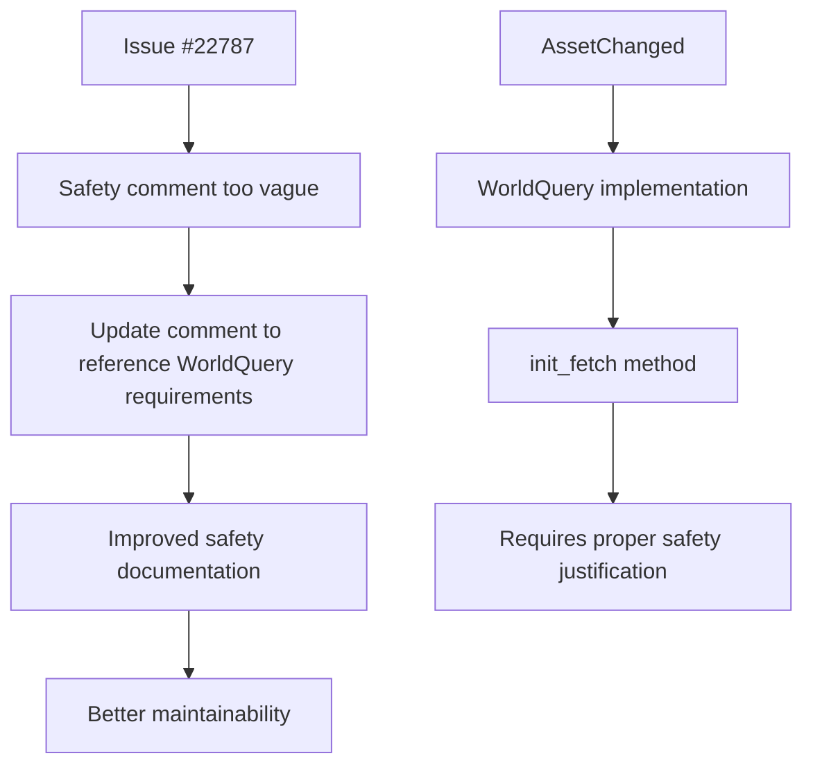

+++
title = "#22795 fix AssetChanged safety comment"
date = "2026-02-04T00:00:00"
draft = false
template = "pull_request_page.html"
in_search_index = true

[taxonomies]
list_display = ["show"]

[extra]
current_language = "en"
available_languages = {"en" = { name = "English", url = "/pull_request/bevy/2026-02/pr-22795-en-20260204" }, "zh-cn" = { name = "中文", url = "/pull_request/bevy/2026-02/pr-22795-zh-cn-20260204" }}
labels = ["C-Docs", "D-Trivial", "A-ECS", "S-Ready-For-For-Final-Review", "D-Unsafe"]
+++

# Title

## Basic Information
- **Title**: fix AssetChanged safety comment
- **PR Link**: https://github.com/bevyengine/bevy/pull/22795
- **Author**: ecoskey
- **Status**: MERGED
- **Labels**: C-Docs, D-Trivial, A-ECS, S-Ready-For-For-Final-Review, D-Unsafe
- **Created**: 2026-02-03T17:26:22Z
- **Merged**: 2026-02-04T00:49:06Z
- **Merged By**: alice-i-cecile

## Description Translation

# Objective

- Fix #22787

## Solution

- Refer more directly to the actual safety requirements on `WorldQuery`

## Testing

- N/A

## The Story of This Pull Request

This pull request addresses a documentation issue in the Bevy game engine's asset system. The problem was related to a safety comment in the `AssetChanged` type's implementation of the `WorldQuery` trait. Specifically, the existing safety comment in the `init_fetch` method was insufficiently detailed and didn't properly reference the safety guarantees required by the `WorldQuery` trait.

The issue (#22787) pointed out that the safety comment needed clarification. In Rust, unsafe code blocks require explicit justification for why the code is safe, and these justifications must be accurate and complete. The previous comment mentioned that `AssetChanges` was private and only accessed mutably in the `AssetEventSystems` system set, but this wasn't sufficiently precise about the actual safety invariants being upheld.

The solution involved updating the safety comment to more directly reference the actual safety requirements of the `WorldQuery` trait. The new comment explains two key points:

1. The `resource_id` was obtained from `world.init_resource::<AssetChanges<A::Asset>>()`, which ensures that the untyped pointer returned by `get_resource_by_id` can be safely dereferenced into that specific type.

2. The `update_component_access` method declares a read on `state.resource_id`, which makes it safe to read that resource in `init_fetch`. This directly references the trait-level safety comments on `WorldQuery` regarding readonly resource access in `init_fetch`.

This change doesn't modify any runtime behavior - it's purely a documentation fix. However, in Rust, safety documentation is critically important because it helps developers understand the invariants that must be maintained when working with unsafe code. Clear safety comments prevent misuse and make the codebase more maintainable.

The implementation is straightforward but addresses an important aspect of Rust development: when using unsafe blocks, the safety justifications must be precise and reference the actual safety requirements of the APIs being used. In this case, the previous comment was describing implementation details (privacy and system set restrictions) rather than the actual safety guarantees provided by the `WorldQuery` trait contract.

This PR serves as a good example of how safety documentation should reference the specific safety requirements of the traits and APIs being implemented, rather than relying on broader architectural patterns. It's a small but important fix that improves the clarity and correctness of the codebase's unsafe code documentation.

## Visual Representation



## Key Files Changed

**File:** `crates/bevy_asset/src/asset_changed.rs`

**Changes:** Updated the safety comment in the `init_fetch` method of the `WorldQuery` implementation for `AssetChanged<A>` to more accurately reference the safety requirements of the `WorldQuery` trait.

**Code Diff:**
```rust
// Before:
// SAFETY:
// - `AssetChanges` is private and only accessed mutably in the `AssetEventSystems` system set.
// - `resource_id` was obtained from the type ID of `AssetChanges<A::Asset>`.

// After:
// SAFETY:
// - `state.resource_id` was obtained from `world.init_resource::<AssetChanges<A::Asset>>()`,
//   so the untyped pointer returned by `get_resource_by_id` can safely be dereferenced into that type.
// - `update_component_access` declares a read on `state.resource_id`, so it is safe to
//   read that resource here (see trait-level safety comments on `WorldQuery`, regarding
//   readonly resource access in `init_fetch`)
```

**Why these changes matter:** The updated comment provides more precise safety justifications that directly reference the `WorldQuery` trait's safety requirements. This makes the unsafe code more understandable and maintainable by clearly explaining which safety invariants are being upheld.

## Further Reading

1. [Rustonomicon - Working with Unsafe](https://doc.rust-lang.org/nomicon/working-with-unsafe.html) - Comprehensive guide to unsafe Rust programming
2. [Bevy ECS Documentation](https://bevy-cheatbook.github.io/programming/ecs-intro.html) - Introduction to Bevy's Entity Component System
3. [Rust RFC 2585 - Safe Transmute](https://rust-lang.github.io/rfcs/2585-ptr-meta.html) - Background on pointer safety in Rust
4. [Bevy WorldQuery Trait Documentation](https://docs.rs/bevy-ecs/latest/bevy_ecs/query/trait.WorldQuery.html) - Official docs for the `WorldQuery` trait

# Full Code Diff
```
diff --git a/crates/bevy_asset/src/asset_changed.rs b/crates/bevy_asset/src/asset_changed.rs
index 31b00176c878a..32eb6f88c8ddc 100644
--- a/crates/bevy_asset/src/asset_changed.rs
+++ b/crates/bevy_asset/src/asset_changed.rs
@@ -166,8 +166,11 @@ unsafe impl<A: AsAssetId> WorldQuery for AssetChanged<A> {
         this_run: Tick,
     ) -> Self::Fetch<'w> {
         // SAFETY:
-        // - `AssetChanges` is private and only accessed mutably in the `AssetEventSystems` system set.
-        // - `resource_id` was obtained from the type ID of `AssetChanges<A::Asset>`.
+        // - `state.resource_id` was obtained from `world.init_resource::<AssetChanges<A::Asset>>()`,
+        //   so the untyped pointer returned by `get_resource_by_id` can safely be dereferenced into that type.
+        // - `update_component_access` declares a read on `state.resource_id`, so it is safe to
+        //   read that resource here (see trait-level safety comments on `WorldQuery`, regarding
+        //   readonly resource access in `init_fetch`)
         let Some(changes) = (unsafe {
             world
                 .get_resource_by_id(state.resource_id)
```