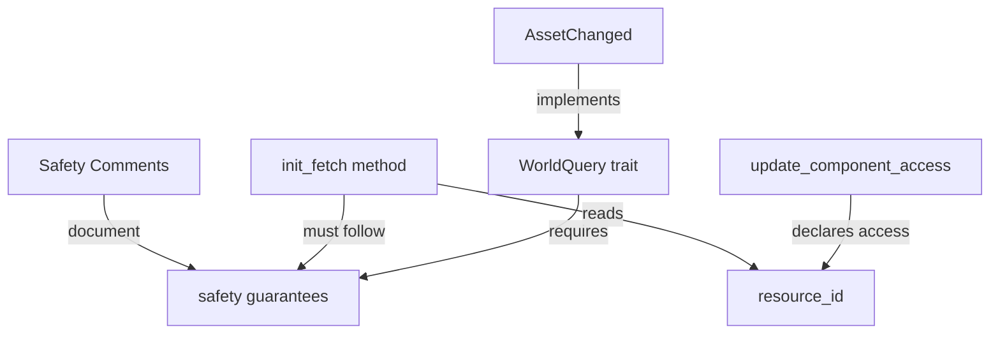

+++
title = "#22795 fix AssetChanged safety comment"
date = "2026-02-04T00:00:00"
draft = false
template = "pull_request_page.html"
in_search_index = false

[extra]
current_language = "zh-cn"
available_languages = {"en" = { name = "English", url = "/pull_request/bevy/2026-02/pr-22795-en-20260204" }, "zh-cn" = { name = "中文", url = "/pull_request/bevy/2026-02/pr-22795-zh-cn-20260204" }}
labels = ["C-Docs", "D-Trivial", "A-ECS", "D-Unsafe"]
+++

# Title
fix AssetChanged safety comment

## Basic Information
- **Title**: fix AssetChanged safety comment
- **PR Link**: https://github.com/bevyengine/bevy/pull/22795
- **Author**: ecoskey
- **Status**: MERGED
- **Labels**: C-Docs, D-Trivial, A-ECS, S-Ready-For-Final-Review, D-Unsafe
- **Created**: 2026-02-03T17:26:22Z
- **Merged**: 2026-02-04T00:49:06Z
- **Merged By**: alice-i-cecile

## Description Translation
目标

- 修复 #22787

解决方案

- 更直接地引用 `WorldQuery` 上实际的安全要求

测试

- 不适用

## The Story of This Pull Request

这个PR解决了一个关于不安全代码文档准确性的问题。在Bevy的资产系统中，`AssetChanged`是一个用于查询资产变更的`WorldQuery`实现，它包含不安全代码块，需要正确的安全注释来证明其正确性。

问题的核心在于原有注释不够精确。在`init_fetch`方法中，原来的安全注释提到了`AssetChanges`是私有的并且只在`AssetEventSystems`系统集中被可变访问，但这并没有直接关联到`WorldQuery`特性对不安全实现的要求。`WorldQuery`的安全性依赖于在`update_component_access`方法中正确声明数据访问，然后在`init_fetch`中只访问已声明的数据。

开发者将注释更新为更准确的形式。新注释明确了两点：首先，`resource_id`是从`world.init_resource::<AssetChanges<A::Asset>>()`获取的，因此通过`get_resource_by_id`返回的非类型化指针可以安全地解引用为该类型；其次，`update_component_access`方法声明了对`state.resource_id`的读取，因此在这里读取该资源是安全的。新注释直接引用了`WorldQuery`特性级别的安全要求，这使得代码的安全理由更加清晰和准确。

这是一个文档更改，不涉及功能修改，但它对于维护代码安全性很重要。不安全的代码块需要精确的注释来解释为什么这些操作是安全的，特别是当其他开发者审查或修改这段代码时。这种精确性对于防止内存安全问题至关重要。

## Visual Representation



## Key Files Changed

**crates/bevy_asset/src/asset_changed.rs** (+5/-2)

这个文件中的`AssetChanged<A>`结构体实现了`WorldQuery`特性。更改涉及`init_fetch`方法中的安全注释，使其更准确地反映实际的安全保证。

**更改前**：
```rust
// SAFETY:
// - `AssetChanges` is private and only accessed mutably in the `AssetEventSystems` system set.
// - `resource_id` was obtained from the type ID of `AssetChanges<A::Asset>`.
```

**更改后**：
```rust
// SAFETY:
// - `state.resource_id` was obtained from `world.init_resource::<AssetChanges<A::Asset>>()`,
//   so the untyped pointer returned by `get_resource_by_id` can safely be dereferenced into that type.
// - `update_component_access` declares a read on `state.resource_id`, so it is safe to
//   read that resource here (see trait-level safety comments on `WorldQuery`, regarding
//   readonly resource access in `init_fetch`)
```

主要变化是：
1. 明确说明了`resource_id`的来源（通过`init_resource`初始化）
2. 明确指出了`update_component_access`方法已经声明了对该资源的读取访问
3. 引用了`WorldQuery`特性级别的安全注释作为依据

## Further Reading

- [Rustonomicon: Working with Unsafe](https://doc.rust-lang.org/nomicon/working-with-unsafe.html) - Rust中不安全代码的详细指南
- [Bevy ECS: WorldQuery](https://docs.rs/bevy-ecs/latest/bevy_ecs/query/trait.WorldQuery.html) - `WorldQuery`特性的官方文档
- [Bevy Assets: Asset System](https://bevyengine.org/learn/books/bevy-cheatbook/assets/index.html) - Bevy资产系统概述