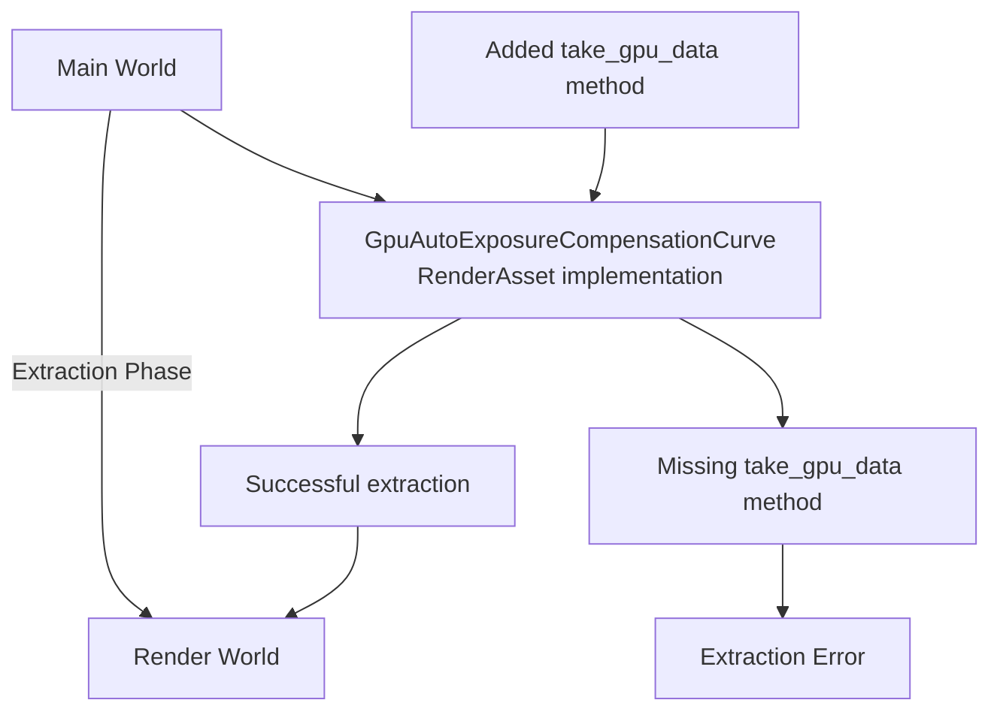

+++
title = "#22803 Fix asset extraction for `GpuAutoExposureCompensationCurve`"
date = "2026-02-06T00:00:00"
draft = false
template = "pull_request_page.html"
in_search_index = true

[taxonomies]
list_display = ["show"]

[extra]
current_language = "en"
available_languages = {"en" = { name = "English", url = "/pull_request/bevy/2026-02/pr-22803-en-20260206" }, "zh-cn" = { name = "中文", url = "/pull_request/bevy/2026-02/pr-22803-zh-cn-20260206" }}
labels = ["C-Bug", "A-Rendering", "D-Straightforward"]
+++

# Title: Fix asset extraction for `GpuAutoExposureCompensationCurve`

## Basic Information
- **Title**: Fix asset extraction for `GpuAutoExposureCompensationCurve`
- **PR Link**: https://github.com/bevyengine/bevy/pull/22803
- **Author**: Breakdown-Dog
- **Status**: MERGED
- **Labels**: C-Bug, A-Rendering, S-Ready-For-Final-Review, D-Straightforward
- **Created**: 2026-02-04T07:57:19Z
- **Merged**: 2026-02-06T19:50:36Z
- **Merged By**: alice-i-cecile

## Description Translation

# Objective

- When I am running the example `auto_exposure` on the main branch. I get errors, and the auto exposure effect does not work correctly.
```
2026-02-04T05:36:29.462198Z ERROR bevy_render::render_asset: bevy_post_process::auto_exposure::compensation_curve::GpuAutoExposureCompensationCurve with RenderAssetUsages == RENDER_WORLD cannot be extracted: The asset type does not support extraction. To clone the asset to the renderworld, use `RenderAssetUsages::default()`
2026-02-04T05:36:29.462407Z ERROR bevy_render::render_asset: bevy_post_process::auto_exposure::compensation_curve::GpuAutoExposureCompensationCurve with RenderAssetUsages == RENDER_WORLD cannot be extracted: The asset type does not support extraction. To clone the asset to the renderworld, use `RenderAssetUsages::default()`
```

- I believe the reason is that` GpuAutoExposureCompensationCurve` is missing the `take_gpu_data` function from the `RenderAsset` trait.

- The code snippet that outputs error information `(crates\bevy_render\src\render_asset.rs)`.
``` rust
for id in needs_extracting.drain() {
  if let Some(asset) = assets.get(id) {
      let asset_usage = A::asset_usage(asset);
      if asset_usage.contains(RenderAssetUsages::RENDER_WORLD) {
          if asset_usage == RenderAssetUsages::RENDER_WORLD {
              if let Some(asset) = assets.get_mut_untracked(id) {
                  let previous_asset = maybe_render_assets.as_ref().and_then(|render_assets| render_assets.get(id));
                  match A::take_gpu_data(asset, previous_asset) {
                      Ok(gpu_data_asset) => {
                          extracted_assets.push((id, gpu_data_asset));
                          added.insert(id);
                      }
                      Err(e) => {
                          error!("{} with RenderAssetUsages == RENDER_WORLD cannot be extracted: {e}", core::any::type_name::<A>());
                      }
                  };
              }
          } else {
              extracted_assets.push((id, asset.clone()));
              added.insert(id);
          }
      }
  }
}
```

## Solution

- Add `take_gpu_data()` function. 

## Testing

- The example `auto_exposure` works correctly.
- CI

---

## The Story of This Pull Request

This PR addresses a specific but critical issue in Bevy's auto-exposure system where the `GpuAutoExposureCompensationCurve` asset fails to extract to the render world, breaking the auto-exposure post-processing effect. The problem manifests when running the `auto_exposure` example, producing error messages about unsupported extraction and causing the visual effect to fail.

The issue stems from Bevy's render asset extraction pipeline. When an asset has `RenderAssetUsages::RENDER_WORLD` as its only usage (not combined with other usages), the extraction system calls the `take_gpu_data` method from the `RenderAsset` trait. This method is responsible for transferring asset data from the main world to the render world. The error occurs because `GpuAutoExposureCompensationCurve` implements the `RenderAsset` trait but doesn't provide this required method.

Looking at the error handling code in `crates\bevy_render\src\render_asset.rs`, we can see the exact failure point. When `asset_usage == RenderAssetUsages::RENDER_WORLD`, the system calls `A::take_gpu_data(asset, previous_asset)`. If this method doesn't exist or returns an error, the system logs the error we see. This is a safety mechanism that prevents assets from being incorrectly transferred between worlds.

The fix is straightforward: implement the missing `take_gpu_data` method. For `GpuAutoExposureCompensationCurve`, the implementation simply clones the source asset. This approach is appropriate because the compensation curve data is relatively small and doesn't need complex GPU preparation logic. The method signature matches the trait definition, taking a mutable reference to the source asset and an optional previous GPU asset, returning either the extracted asset or an error.

The implementation follows the pattern established by other render assets in the codebase. The `take_gpu_data` method returns `Ok(source.clone())`, which creates a new instance of the asset for use in the render world. This cloning approach works well for this type of asset because it contains primarily configuration data for the auto-exposure compensation curve.

This fix is minimal but important because it enables the auto-exposure system to function correctly. Without it, the compensation curve data never reaches the render world, so the post-processing shader can't apply the correct exposure adjustments. The change demonstrates how Bevy's render asset system requires complete trait implementations even for relatively simple assets.

## Visual Representation



## Key Files Changed

### `crates/bevy_post_process/src/auto_exposure/compensation_curve.rs` (+8/-1)

This file contains the implementation of `GpuAutoExposureCompensationCurve` and its `RenderAsset` trait implementation. The change adds the missing `take_gpu_data` method to make the asset extractable to the render world.

**Before:**
```rust
impl RenderAsset for GpuAutoExposureCompensationCurve {
    type SourceAsset = GpuAutoExposureCompensationCurve;
    type Param = SRes<RenderDevice>;

    fn asset_usage(_asset: &Self::SourceAsset) -> RenderAssetUsages {
        RenderAssetUsages::RENDER_WORLD
    }

    // Missing take_gpu_data method here

    fn prepare_asset(
        source: Self::SourceAsset,
        _: AssetId<Self::SourceAsset>,
        render_device: &mut SystemParamItem<'_, '_, Self::Param>,
    ) -> Result<Self, PrepareAssetError<Self::SourceAsset>> {
        // ... existing preparation code ...
    }
}
```

**After:**
```rust
impl RenderAsset for GpuAutoExposureCompensationCurve {
    type SourceAsset = GpuAutoExposureCompensationCurve;
    type Param = SRes<RenderDevice>;

    fn asset_usage(_asset: &Self::SourceAsset) -> RenderAssetUsages {
        RenderAssetUsages::RENDER_WORLD
    }

    fn take_gpu_data(
        source: &mut Self::SourceAsset,
        _previous_gpu_asset: Option<&Self>,
    ) -> Result<Self::SourceAsset, AssetExtractionError> {
        Ok(source.clone())
    }

    fn prepare_asset(
        source: Self::SourceAsset,
        _: AssetId<Self::SourceAsset>,
        render_device: &mut SystemParamItem<'_, '_, Self::Param>,
    ) -> Result<Self, PrepareAssetError<Self::SourceAsset>> {
        // ... existing preparation code ...
    }
}
```

The key addition is the `take_gpu_data` method that simply clones the source asset. This allows the asset extraction system to transfer the compensation curve data to the render world when `RenderAssetUsages::RENDER_WORLD` is specified as the asset's usage.

## Further Reading

1. Bevy Render Assets documentation: https://bevyengine.org/learn/quick-start/assets/render-assets/
2. RenderAsset trait reference: https://docs.rs/bevy/latest/bevy/render/render_asset/trait.RenderAsset.html
3. Auto Exposure in Computer Graphics: https://en.wikipedia.org/wiki/Auto_exposure
4. Bevy Post-Processing examples: https://github.com/bevyengine/bevy/tree/main/examples/3d

---

# Full Code Diff
```
diff --git a/crates/bevy_post_process/src/auto_exposure/compensation_curve.rs b/crates/bevy_post_process/src/auto_exposure/compensation_curve.rs
index c7c4fcbecb174..8e60bbb2b0ce8 100644
--- a/crates/bevy_post_process/src/auto_exposure/compensation_curve.rs
+++ b/crates/bevy_post_process/src/auto_exposure/compensation_curve.rs
@@ -3,7 +3,7 @@ use bevy_ecs::system::{lifetimeless::SRes, SystemParamItem};
 use bevy_math::{cubic_splines::CubicGenerator, FloatExt, Vec2};
 use bevy_reflect::prelude::*;
 use bevy_render::{
-    render_asset::RenderAsset,
+    render_asset::{AssetExtractionError, RenderAsset},
     render_resource::{
         Extent3d, ShaderType, TextureDescriptor, TextureDimension, TextureFormat, TextureUsages,
         TextureView, UniformBuffer,
@@ -192,6 +192,13 @@ impl RenderAsset for GpuAutoExposureCompensationCurve {
         RenderAssetUsages::RENDER_WORLD
     }
 
+    fn take_gpu_data(
+        source: &mut Self::SourceAsset,
+        _previous_gpu_asset: Option<&Self>,
+    ) -> Result<Self::SourceAsset, AssetExtractionError> {
+        Ok(source.clone())
+    }
+
     fn prepare_asset(
         source: Self::SourceAsset,
         _: AssetId<Self::SourceAsset>,
```