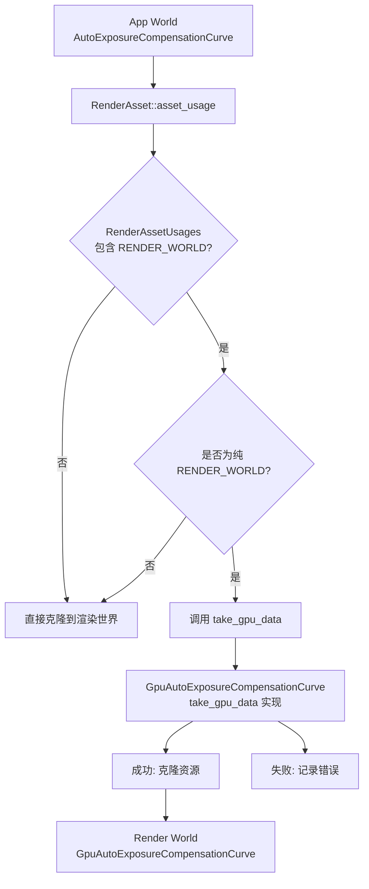

+++
title = "#22803 Fix asset extraction for `GpuAutoExposureCompensationCurve"
date = "2026-02-06T00:00:00"
draft = false
template = "pull_request_page.html"
in_search_index = false

[extra]
current_language = "zh-cn"
available_languages = {"en" = { name = "English", url = "/pull_request/bevy/2026-02/pr-22803-en-20260206" }, "zh-cn" = { name = "中文", url = "/pull_request/bevy/2026-02/pr-22803-zh-cn-20260206" }}
+++

# Title
PR #22803: 修复 `GpuAutoExposureCompensationCurve` 的资源提取问题

## 基本信息
- **标题**: Fix asset extraction for `GpuAutoExposureCompensationCurve`
- **PR 链接**: https://github.com/bevyengine/bevy/pull/22803
- **作者**: Breakdown-Dog
- **状态**: 已合并
- **标签**: C-Bug, A-Rendering, S-Ready-For-Final-Review, D-Straightforward
- **创建时间**: 2026-02-04T07:57:19Z
- **合并时间**: 2026-02-06T19:50:36Z
- **合并者**: alice-i-cecile

## 描述翻译

# 目标
- 当我在主分支上运行 `auto_exposure` 示例时，出现了错误，自动曝光效果无法正常工作。
```
2026-02-04T05:36:29.462198Z ERROR bevy_render::render_asset: bevy_post_process::auto_exposure::compensation_curve::GpuAutoExposureCompensationCurve with RenderAssetUsages == RENDER_WORLD cannot be extracted: The asset type does not support extraction. To clone the asset to the renderworld, use `RenderAssetUsages::default()`
2026-02-04T05:36:29.462407Z ERROR bevy_render::render_asset: bevy_post_process::auto_exposure::compensation_curve::GpuAutoExposureCompensationCurve with RenderAssetUsages == RENDER_WORLD cannot be extracted: The asset type does not support extraction. To clone the asset to the renderworld, use `RenderAssetUsages::default()`
```
- 我认为原因是 `GpuAutoExposureCompensationCurve` 缺少来自 `RenderAsset` trait 的 `take_gpu_data` 函数。
- 输出错误信息的代码片段 (`crates\bevy_render\src\render_asset.rs`)：
``` rust
for id in needs_extracting.drain() {
  if let Some(asset) = assets.get(id) {
      let asset_usage = A::asset_usage(asset);
      if asset_usage.contains(RenderAssetUsages::RENDER_WORLD) {
          if asset_usage == RenderAssetUsages::RENDER_WORLD {
              if let Some(asset) = assets.get_mut_untracked(id) {
                  let previous_asset = maybe_render_assets.as_ref().and_then(|render_assets| render_assets.get(id));
                  match A::take_gpu_data(asset, previous_asset) {
                      Ok(gpu_data_asset) => {
                          extracted_assets.push((id, gpu_data_asset));
                          added.insert(id);
                      }
                      Err(e) => {
                          error!("{} with RenderAssetUsages == RENDER_WORLD cannot be extracted: {e}", core::any::type_name::<A>());
                      }
                  };
              }
          } else {
              extracted_assets.push((id, asset.clone()));
              added.insert(id);
          }
      }
  }
}
```

## 解决方案
- 添加 `take_gpu_data()` 函数。

## 测试
- `auto_exposure` 示例现在可以正常工作。
- 通过了 CI 测试。

---

## 本次 PR 的技术分析

### 问题根源与背景

这个 PR 解决了一个在 Bevy 渲染管线中出现的资源提取问题。用户 Breakdown-Dog 在运行 `auto_exposure` 示例时遇到了错误，错误信息明确指出 `GpuAutoExposureCompensationCurve` 类型的资源无法被提取到渲染世界（render world）。

从错误日志可以看出，问题出现在资源提取阶段。当资源的使用方式（RenderAssetUsages）被标记为 `RENDER_WORLD` 时，渲染系统会尝试调用 `take_gpu_data` 方法来将资源数据转移到渲染世界。但 `GpuAutoExposureCompensationCurve` 这个结构体虽然实现了 `RenderAsset` trait，却缺少了这个必需的方法实现。

这是一个典型的 trait 实现不完整的问题。在 Bevy 的 ECS 架构中，渲染资源需要通过特定的方式在应用世界（app world）和渲染世界之间传递。`RenderAsset` trait 定义了这种传递的接口，而 `take_gpu_data` 是其中关键的方法之一，负责在资源需要被移动到渲染世界时提取其 GPU 数据。

### 解决方案实现

修复方案很简单直接：为 `GpuAutoExposureCompensationCurve` 实现缺失的 `take_gpu_data` 方法。从代码变更可以看出，这个方法的实现逻辑很简单：

```rust
fn take_gpu_data(
    source: &mut Self::SourceAsset,
    _previous_gpu_asset: Option<&Self>,
) -> Result<Self::SourceAsset, AssetExtractionError> {
    Ok(source.clone())
}
```

这里的实现有几个值得注意的技术点：

1. **简单的克隆操作**：由于 `GpuAutoExposureCompensationCurve` 的源资源（SourceAsset）类型就是 `AutoExposureCompensationCurve`，它实现了 `Clone` trait，所以这里可以直接使用 `clone()` 方法来复制数据。

2. **忽略 previous_gpu_asset 参数**：方法签名中的 `_previous_gpu_asset` 参数被忽略（使用下划线前缀表示）。这表明对于这种类型的资源，不需要考虑之前已经存在的 GPU 资源状态，每次都是全新的克隆。

3. **返回 Result 类型**：方法返回 `Result<Self::SourceAsset, AssetExtractionError>`，但在这个实现中总是返回 `Ok`。这表明提取过程不会失败，除非克隆操作本身失败（但 `Clone` trait 的实现通常不会失败）。

这种实现模式在 Bevy 中很常见，特别是对于那些不需要复杂状态管理的渲染资源。它遵循了最小化实现的原则，只提供必要的基础功能。

### 技术架构影响

从架构角度看，这个修复确保了 `GpuAutoExposureCompensationCurve` 完全符合 `RenderAsset` trait 的契约。在 Bevy 的渲染管线中：

1. **资源提取系统**（asset extraction system）现在可以正确处理这种类型的资源
2. **自动曝光后处理效果**现在可以正常工作了，因为其依赖的补偿曲线资源能够被正确提取到渲染世界
3. **类型系统完整性**得到了维护，所有的 `RenderAsset` 实现都提供了必需的方法

从错误处理代码可以看出，Bevy 的设计者已经预见到了这种实现不完整的情况，并提供了清晰的错误信息。这体现了良好的错误处理和用户体验设计。

### 潜在的技术考量

虽然这个修复很简单，但它揭示了一些重要的技术考量：

1. **trait 实现的完整性检查**：Rust 的编译器虽然能检查 trait 方法的存在性，但无法检查运行时行为是否符合预期。这里需要开发者确保所有的 `RenderAsset` 实现都正确处理了 `RENDER_WORLD` 使用场景。

2. **资源克隆的成本**：对于某些大型资源，简单的克隆可能不是最高效的解决方案。如果 `AutoExposureCompensationCurve` 包含大量数据，可能需要考虑更高效的资源管理策略。

3. **错误恢复机制**：从错误处理代码可以看出，当资源提取失败时，系统会记录错误但不会崩溃。这种设计确保了系统的健壮性。

## 可视化表示



## 关键文件变更

### `crates/bevy_post_process/src/auto_exposure/compensation_curve.rs` (+8/-1)

这是本次 PR 中唯一被修改的文件，修复了 `GpuAutoExposureCompensationCurve` 的 `RenderAsset` trait 实现。

**变更详情**：

1. **导入变更**：
   ```rust
   // 之前:
   use bevy_render::{
       render_asset::RenderAsset,
   ```
   ```rust
   // 之后:
   use bevy_render::{
       render_asset::{AssetExtractionError, RenderAsset},
   ```
   添加了 `AssetExtractionError` 的导入，这是 `take_gpu_data` 方法返回类型所需的。

2. **方法实现**：
   ```rust
   // 添加的新方法:
   fn take_gpu_data(
       source: &mut Self::SourceAsset,
       _previous_gpu_asset: Option<&Self>,
   ) -> Result<Self::SourceAsset, AssetExtractionError> {
       Ok(source.clone())
   }
   ```
   这是修复的核心：实现了缺失的 `take_gpu_data` 方法，通过克隆源资源来提取 GPU 数据。

这个简单的 8 行添加解决了整个问题，展示了在复杂系统中，有时最小的变更就能修复重要的功能缺陷。

## 扩展阅读

对于想要深入了解相关概念的开发者，建议阅读：

1. **Bevy 渲染资产系统**：
   - [Bevy 官方文档：RenderAsset trait](https://docs.rs/bevy_render/latest/bevy_render/render_asset/trait.RenderAsset.html)
   - 了解 `RenderAsset` trait 的设计和各个方法的作用

2. **资源提取机制**：
   - [Bevy 源码中的 extract_assets 系统](https://github.com/bevyengine/bevy/blob/main/crates/bevy_render/src/render_asset.rs)
   - 理解应用世界和渲染世界之间的资源传递机制

3. **自动曝光后处理**：
   - [Bevy 的自动曝光实现](https://github.com/bevyengine/bevy/tree/main/crates/bevy_post_process/src/auto_exposure)
   - 学习后处理效果如何集成到 Bevy 的渲染管线中

4. **Rust trait 设计模式**：
   - 《Rust 编程语言》中关于 trait 的章节
   - 学习如何设计完整且符合契约的 trait 实现

## 完整代码差异

```diff
diff --git a/crates/bevy_post_process/src/auto_exposure/compensation_curve.rs b/crates/bevy_post_process/src/auto_exposure/compensation_curve.rs
index c7c4fcbecb174..8e60bbb2b0ce8 100644
--- a/crates/bevy_post_process/src/auto_exposure/compensation_curve.rs
+++ b/crates/bevy_post_process/src/auto_exposure/compensation_curve.rs
@@ -3,7 +3,7 @@ use bevy_ecs::system::{lifetimeless::SRes, SystemParamItem};
 use bevy_math::{cubic_splines::CubicGenerator, FloatExt, Vec2};
 use bevy_reflect::prelude::*;
 use bevy_render::{
-    render_asset::RenderAsset,
+    render_asset::{AssetExtractionError, RenderAsset},
     render_resource::{
         Extent3d, ShaderType, TextureDescriptor, TextureDimension, TextureFormat, TextureUsages,
         TextureView, UniformBuffer,
@@ -192,6 +192,13 @@ impl RenderAsset for GpuAutoExposureCompensationCurve {
         RenderAssetUsages::RENDER_WORLD
     }
 
+    fn take_gpu_data(
+        source: &mut Self::SourceAsset,
+        _previous_gpu_asset: Option<&Self>,
+    ) -> Result<Self::SourceAsset, AssetExtractionError> {
+        Ok(source.clone())
+    }
+
     fn prepare_asset(
         source: Self::SourceAsset,
         _: AssetId<Self::SourceAsset>,
```