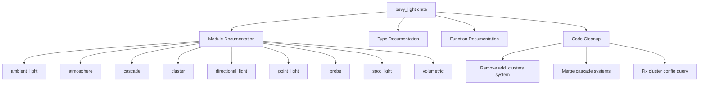

+++
title = "#22804 document bevy light"
date = "2026-02-04T00:00:00"
draft = false
template = "pull_request_page.html"
in_search_index = true

[taxonomies]
list_display = ["show"]

[extra]
current_language = "en"
available_languages = {"en" = { name = "English", url = "/pull_request/bevy/2026-02/pr-22804-en-20260204" }, "zh-cn" = { name = "中文", url = "/pull_request/bevy/2026-02/pr-22804-zh-cn-20260204" }}
labels = ["C-Docs", "A-Rendering", "D-Straightforward"]
+++

# Title
document bevy light

## Basic Information
- **Title**: document bevy light
- **PR Link**: https://github.com/bevyengine/bevy/pull/22804
- **Author**: atlv24
- **Status**: MERGED
- **Labels**: C-Docs, A-Rendering, S-Ready-For-Final-Review, D-Straightforward
- **Created**: 2026-02-04T09:00:10Z
- **Merged**: 2026-02-04T20:15:40Z
- **Merged By**: alice-i-cecile

## Description Translation
The original description was already in English, so it's included as-is:

# Objective

- yeet another `#![expect(missing_docs, reason = "Not all docs are written yet, see #3492.")]` from a rendering crate i extracted
- yeet some stale code

## Solution

- document

## Testing

- ran lighting, deferred, shadow_biases, and a couple other examples. looks fine.

note: review commit by commit

## The Story of This Pull Request

This PR addresses two straightforward but important tasks in the Bevy rendering codebase: improving documentation quality and removing stale code. The changes focus on the newly extracted `bevy_light` crate, which handles all lighting-related components and systems in Bevy.

The primary issue was that the crate had a blanket `expect` attribute suppressing documentation warnings, allowing many undocumented public APIs to accumulate. While the initial extraction was functionally complete, it lacked the necessary documentation for developers to understand and use the lighting system effectively. Additionally, during the extraction process, some code became redundant or was left behind without proper cleanup.

The approach taken is systematic and practical. For each module in the `bevy_light` crate, missing documentation was added to public types, fields, and functions. This includes:
- Module-level documentation explaining the purpose of each module
- Documentation for struct fields that were previously undocumented
- Documentation for constants and enum variants
- Clarification of parameter types and return values

Simultaneously, the PR identifies and removes stale code that's no longer needed. This includes cleaning up a cluster initialization system that had been made redundant by component registration changes, and simplifying cascade shadow building by merging two separate systems into one.

One notable technical decision was to remove the `add_clusters` system entirely. Analysis revealed that this system was inserting `Clusters` components on cameras, but the same functionality could be achieved more cleanly using Bevy's component registration system. By registering `Clusters` as a required component for `Camera3d`, the framework automatically ensures these components exist when needed, eliminating the need for a separate initialization system.

The cascade shadow system also received attention. Previously, two separate systems handled cascade management: `clear_directional_light_cascades` and `build_directional_light_cascades`. These were merged into a single system that handles both clearing and building in one pass, reducing system overhead and simplifying the execution graph.

Throughout the implementation, the developer maintained consistency with existing Bevy conventions. Documentation follows the established style, with technical terms preserved in English where they represent specific concepts (like "frustum", "cascade", "scattering medium"), while explanatory text provides necessary context.

The impact of these changes is primarily on developer experience and code maintainability. New developers exploring the lighting system will now find comprehensive documentation explaining what each component does and how to use it. The removal of stale code reduces cognitive load when reading the codebase and eliminates potential sources of bugs.

From an architectural perspective, the changes demonstrate good practices in evolving a codebase: documenting as you go, cleaning up after refactoring, and simplifying system graphs where possible. The PR also shows how Bevy's component registration system can replace custom initialization logic, leveraging the engine's built-in capabilities.

## Visual Representation



## Key Files Changed

### `crates/bevy_light/src/lib.rs` (+26/-25)
This file serves as the main entry point for the lighting crate. The changes remove the blanket documentation suppression and add comprehensive documentation throughout.

**Key Changes:**
1. Removed the `expect` attribute that was suppressing documentation warnings
2. Added module-level documentation explaining the crate's purpose
3. Added documentation for the `gizmos` module when the feature is enabled
4. Documented constants in the `light_consts` module
5. Added documentation for the `LightPlugin` struct
6. Simplified system scheduling by removing the `add_clusters` system and merging cascade systems
7. Added documentation for visibility checking systems

```rust
// Before:
#![expect(missing_docs, reason = "Not all docs are written yet, see #3492.")]

// After:
//! Provides component types for lighting a bevy scene. This includes the usual
//! directional, point, and spot lights, as well as light probes, atmosphere,
//! other volumetrics, and shadow configuration.
```

### `crates/bevy_light/src/cluster/mod.rs` (+16/-30)
This module handles spatial clustering of lights and other renderable objects for performance optimization. The changes add documentation and remove stale code.

**Key Changes:**
1. Updated module documentation to better explain the purpose
2. Added documentation for `GlobalClusterSettings` struct
3. Documented fields in `ClusterConfig` enum variants
4. Added comprehensive documentation for `Clusters` struct and its fields
5. Removed the `add_clusters` system function which was made redundant by component registration

```rust
// Before:
pub fn add_clusters(
    mut commands: Commands,
    cameras: Query<(Entity, Option<&ClusterConfig>, &Camera), (Without<Clusters>, With<Camera3d>)>,
) {
    // ... initialization logic
}

// After:
// No add_clusters system - handled by component registration
```

### `crates/bevy_light/src/cascade.rs` (+16/-14)
This module handles shadow cascades for directional lights. The changes improve documentation and simplify the system architecture.

**Key Changes:**
1. Added module documentation
2. Added documentation for `Cascades` and `Cascade` structs
3. Removed the separate `clear_directional_light_cascades` system and merged its functionality into `build_directional_light_cascades`
4. Improved comments about matrix orthogonality in cascade building

```rust
// Before:
pub fn clear_directional_light_cascades(mut lights: Query<(&DirectionalLight, &mut Cascades)>) {
    // Clearing logic
}

pub fn build_directional_light_cascades(
    // Building logic without clearing
) {
    // ...
}

// After:
pub fn build_directional_light_cascades(
    // Building logic with clearing integrated
) {
    // Clear at the beginning
    cascades.cascades.clear();
    // ... rest of building logic
}
```

### `crates/bevy_light/src/atmosphere.rs` (+10/-5)
This module handles atmospheric lighting and scattering effects. The changes add missing documentation.

**Key Changes:**
1. Added module documentation
2. Documented the `earthlike` constructor for `Atmosphere`
3. Converted regular comments to doc comments for `ScatteringMedium` methods
4. Added documentation for `Falloff::sample` and `PhaseFunction::sample` methods

### `crates/bevy_pbr/src/lib.rs` (+2/-13)
This is the main Physically Based Rendering (PBR) crate. The changes remove redundant system set configuration now that the `LightPlugin` handles it.

**Key Changes:**
1. Removed system set configuration for cluster-related systems that are now handled by `LightPlugin`
2. This simplification ensures there's no duplication or conflict between plugins

```rust
// Before:
.configure_sets(
    PostUpdate,
    (
        SimulationLightSystems::AddClusters,
        SimulationLightSystems::AssignLightsToClusters,
    )
        .chain(),
);

// After:
// Configuration removed - handled by LightPlugin
```

## Further Reading

1. **Bevy Documentation Guidelines**: For understanding the documentation standards used in this PR
2. **Bevy Component Registration**: To understand how required component registration works
3. **Spatial Clustering in Graphics**: For background on why clustering is used for lighting performance
4. **Cascade Shadow Maps**: To understand the technical details of cascade shadow implementation
5. **Atmospheric Scattering**: For the physics and mathematics behind the atmosphere rendering techniques