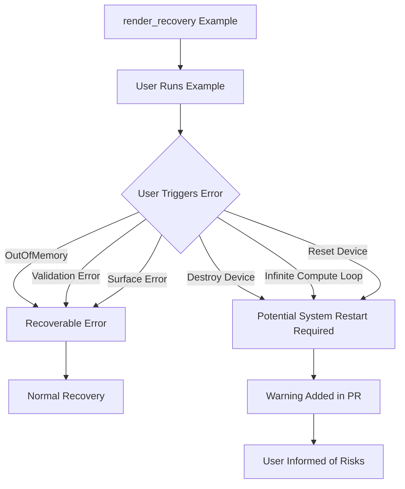

+++
title = "#22808 Warn About Risks of Crashing the Renderer"
date = "2026-02-05T00:00:00"
draft = false
template = "pull_request_page.html"
in_search_index = true

[taxonomies]
list_display = ["show"]

[extra]
current_language = "en"
available_languages = {"en" = { name = "English", url = "/pull_request/bevy/2026-02/pr-22808-en-20260205" }, "zh-cn" = { name = "中文", url = "/pull_request/bevy/2026-02/pr-22808-zh-cn-20260205" }}
labels = ["A-Rendering", "C-Examples"]
+++

# Title: Warn About Risks of Crashing the Renderer

## Basic Information
- **Title**: warn about risks of crashing the renderer
- **PR Link**: https://github.com/bevyengine/bevy/pull/22808
- **Author**: mockersf
- **Status**: MERGED
- **Labels**: A-Rendering, C-Examples, S-Ready-For-Final-Review
- **Created**: 2026-02-05T00:36:21Z
- **Merged**: 2026-02-05T01:28:37Z
- **Merged By**: alice-i-cecile

## Description Translation
The PR description is already in English:

# Objective

- The new render_recovery example can crash so hard that it's needed to restart to fully recover

## Solution

- Warn users about it

## The Story of This Pull Request

This PR addresses a practical concern with a testing example in the Bevy game engine. The `render_recovery.rs` example was recently added to demonstrate how Bevy handles renderer crashes and recovery scenarios, but it turns out some of these crashes can be severe enough to require a full system restart. This creates a user experience issue where developers running the example might not realize the potential consequences.

The problem was straightforward but important: when users run the `render_recovery` example, they can trigger various types of renderer errors including OutOfMemory errors, Validation errors, and device loss scenarios. Some of these, particularly device destruction and infinite compute shader loops, can cause the renderer to crash in ways that the operating system or driver may not recover from cleanly. In worst-case scenarios, users might need to restart their entire computer to fully restore graphics functionality.

The solution is minimal but effective - adding a clear warning message at the beginning of the example's help text. This approach follows the principle of least surprise and helps prevent frustration for developers who might otherwise run the example without understanding the risks. The warning is placed prominently as the first line of the text that appears when running the example, ensuring users see it before they interact with any of the potentially dangerous features.

Technically, this change modifies only the string literal in the example's setup function. The implementation is simple but important for user safety:

```rust
// Before:
Text::new(
    "Press O to trigger an OutOfMemory error\n\
     Press V to trigger a Validation error\n\
     Press D to Destroy the render device (causes device lost error)\n\
     Press L to Loop infinitely in a compute shader (causes device lost error)\n\
     Press R to Reset the render device (causes device lost error)\n\
     Press S to trigger a Surface error (causes swapchain invalid)"
)

// After:
Text::new(
    "Test at your own risk: you may need to restart your computer to fully recover\n\
     Press O to trigger an OutOfMemory error\n\
     Press V to trigger a Validation error\n\
     Press D to Destroy the render device (causes device lost error)\n\
     Press L to Loop infinitely in a compute shader (causes device lost error)\n\
     Press R to Reset the render device (causes device lost error)\n\
     Press S to trigger a Surface error (causes swapchain invalid)"
)
```

The key insight here is that while the `render_recovery` example serves an important educational purpose - showing developers how to handle graphics API errors and device loss - it also has real consequences when run. Graphics drivers, particularly on certain operating systems or with specific hardware, can enter unrecoverable states when certain low-level operations fail. This is especially true for operations that destroy render devices or create infinite loops in compute shaders, which can hang the GPU or cause driver timeouts that require system intervention.

The impact of this change is primarily on developer experience. By adding this warning, Bevy maintains transparency about the risks of its testing examples while still providing valuable tools for understanding renderer error handling. This approach balances educational value with user protection, ensuring that developers can learn about render recovery mechanisms without unexpected system instability.

From an engineering perspective, this PR demonstrates good practice in maintaining examples that interact with low-level systems: always warn users about potential side effects, especially when those effects could be system-wide. It also highlights the reality of working with graphics APIs - some operations can have consequences beyond the application itself, and responsible documentation should reflect this.

## Visual Representation



## Key Files Changed

**File**: `examples/app/render_recovery.rs`

**Change**: Added a warning message to the example's help text to inform users that some renderer crashes might require a system restart to fully recover.

**Code diff**:
```rust
// Before:
commands.spawn((
    Text::new(
        "Press O to trigger an OutOfMemory error\n\
         Press V to trigger a Validation error\n\
         Press D to Destroy the render device (causes device lost error)\n\
         Press L to Loop infinitely in a compute shader (causes device lost error)\n\
         Press R to Reset the render device (causes device lost error)\n\
         Press S to trigger a Surface error (causes swapchain invalid)"
    ),
    // ... other components
));

// After:
commands.spawn((
    Text::new(
        "Test at your own risk: you may need to restart your computer to fully recover\n\
         Press O to trigger an OutOfMemory error\n\
         Press V to trigger a Validation error\n\
         Press D to Destroy the render device (causes device lost error)\n\
         Press L to Loop infinitely in a compute shader (causes device lost error)\n\
         Press R to Reset the render device (causes device lost error)\n\
         Press S to trigger a Surface error (causes swapchain invalid)"
    ),
    // ... other components (unchanged)
));
```

**Relationship to PR purpose**: This single-line addition addresses the core issue by warning users about the potential severity of crashes before they interact with the example's error-triggering features.

## Further Reading

1. [Bevy Engine Documentation on Error Handling](https://bevyengine.org/learn/error-handling/)
2. [Graphics API Error Recovery Patterns](https://gpuopen.com/learn/error-handling-in-graphics-apis/)
3. [Vulkan Device Loss Recovery](https://www.khronos.org/registry/vulkan/specs/1.3-extensions/html/vkspec.html#devsandqueues-lost-device)
4. [DirectX 12 Device Removal Handling](https://docs.microsoft.com/en-us/windows/win32/direct3d12/handling-device-removal)
5. [WebGPU Error Handling](https://gpuweb.github.io/gpuweb/#error-handling)

# Full Code Diff
```
diff --git a/examples/app/render_recovery.rs b/examples/app/render_recovery.rs
index acdca3c1b9833..a79416f859e52 100644
--- a/examples/app/render_recovery.rs
+++ b/examples/app/render_recovery.rs
@@ -63,7 +63,8 @@ fn setup(
     // help text
     commands.spawn((
         Text::new(
-            "Press O to trigger an OutOfMemory error\n\
+            "Test at your own risk: you may need to restart your computer to fully recover\n\
+            Press O to trigger an OutOfMemory error\n\
             Press V to trigger a Validation error\n\
             Press D to Destroy the render device (causes device lost error)\n\
             Press L to Loop infinitely in a compute shader (causes device lost error)\n\
```