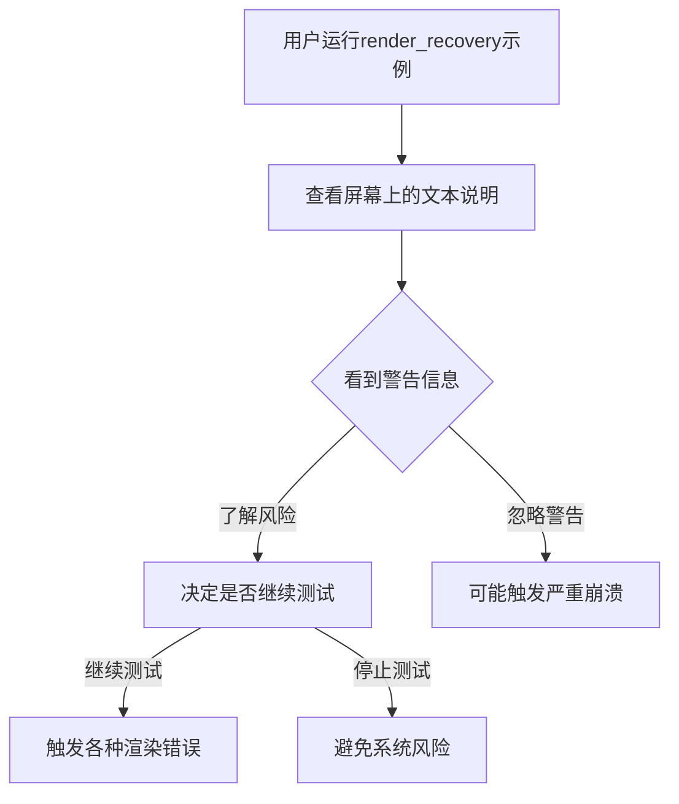

+++
title = "#22808 关于渲染器崩溃风险的警告：一个简单的但必要的示例改进"
date = "2026-02-05T00:00:00"
draft = false
template = "pull_request_page.html"
in_search_index = false

[extra]
current_language = "zh-cn"
available_languages = {"en" = { name = "English", url = "/pull_request/bevy/2026-02/pr-22808-en-20260205" }, "zh-cn" = { name = "中文", url = "/pull_request/bevy/2026-02/pr-22808-zh-cn-20260205" }}
+++

# Title: 关于渲染器崩溃风险的警告：一个简单的但必要的示例改进

## 基本资料
- **标题**: warn about risks of crashing the renderer
- **PR链接**: https://github.com/bevyengine/bevy/pull/22808
- **作者**: mockersf
- **状态**: 已合并
- **标签**: A-Rendering, C-Examples, S-Ready-For-Final-Review
- **创建时间**: 2026-02-05T00:36:21Z
- **合并时间**: 2026-02-05T01:28:37Z
- **合并者**: alice-i-cecile

## 描述翻译
# Objective（目标）
- 新的render_recovery示例可能会非常严重的崩溃，以至于需要重启才能完全恢复

## Solution（解决方案）
- 对用户发出警告

## 这个Pull Request的故事

这是一个非常直接明了的PR，关注的是Bevy引擎中一个特定示例的用户体验和安全警示问题。故事从理解`render_recovery`示例的用途开始。

**render_recovery示例的设计目的**

`render_recovery`示例是一个特殊的调试和测试工具，它允许开发者主动触发各种渲染器错误，以测试Bevy的错误恢复机制。从代码中的注释可以看出，这个示例设计用来触发以下几种错误：
- 内存不足错误（OutOfMemory）
- 验证错误（Validation error）
- 销毁渲染设备导致设备丢失错误
- 计算着色器中的无限循环导致设备丢失错误
- 触发panic

这些功能对于测试渲染管道的健壮性非常有价值，但它们也带来了实际的系统风险。

**问题识别**

在真实环境中测试这个示例时，开发者发现某些类型的渲染器崩溃可能异常严重。当渲染器（特别是底层图形API如Vulkan、DirectX等）发生严重错误时，可能会导致整个图形子系统不稳定，甚至影响到操作系统级别。这种情况下的"完全恢复"可能需要重启计算机，而不仅仅是重启应用程序。

这种风险的严重性可能被用户低估，特别是对于那些在重要工作环境中运行示例的开发者，或者是在集成测试中无意中触发了类似条件的情况。

**解决方案选择**

作者选择了最简单但最有效的解决方案：在示例的界面中添加明确的警告文本。这种方法有几个优点：
1. **成本最低**：只需修改文本字符串
2. **立即生效**：用户运行示例时第一时间就能看到警告
3. **清晰明确**：直接告知用户潜在的最坏情况

在工程决策中，这种"用最小的改动解决实际问题"的做法是典型的高效解决方案。没有引入复杂的配置选项，没有修改错误处理逻辑，只是确保用户知情。

**实现细节**

具体的修改非常简洁。在`examples/app/render_recovery.rs`文件的`setup`函数中，原来用于显示操作说明的文本被更新，在第一行添加了明确的警告信息。

从代码结构来看，这个示例使用Bevy的ECS系统和UI组件来创建一个简单的交互界面。文本实体通过`commands.spawn()`创建，使用`Text`组件显示操作说明。修改后的文本现在包含了两层信息：
1. 风险警告："Test at your own risk: you may need to restart your computer to fully recover"
2. 操作指南：原有的各种触发错误的按键说明

这种修改模式体现了良好的API设计——示例代码的清晰性和用户安全性的平衡。虽然示例本身是用来测试错误情况的，但提供适当的警告是负责任的做法。

**技术洞察**

这个PR反映了几个重要的软件工程原则：

1. **防御性文档（Defensive Documentation）**：当代码可能产生严重后果时，明确的文档和警告是必要的
2. **用户体验考虑**：即使是在测试和示例代码中，也需要考虑最终用户的实际体验
3. **最小化变更原则**：用最小的代码改动解决实际问题，降低引入新错误的风险

在图形编程中，渲染器崩溃是一个特别棘手的问题，因为：
- 图形驱动程序通常运行在特权级别较高的上下文中
- GPU状态可能无法完全重置而不重启
- 不同的操作系统和驱动程序对错误的处理方式不同

**影响和意义**

这个简单的改动带来了几个实际的改进：

1. **提高安全性**：用户现在清楚地知道潜在风险，可以做出更明智的决定
2. **改进开发者体验**：减少了开发者因为不了解风险而浪费时间调试系统级问题的可能性
3. **保持示例的教育价值**：示例仍然可以演示错误恢复机制，但增加了必要的安全边界

从更大的视角看，这个PR也体现了开源项目中社区贡献的价值。即使是一个单行修改的PR，只要解决了实际问题，就值得被接受。这种文化有助于创建更健壮、更用户友好的软件。

**潜在改进方向**

虽然当前解决方案足够有效，但未来可能考虑的其他改进包括：
- 在运行示例前显示确认对话框
- 添加命令行参数来抑制高风险操作
- 提供更详细的文档说明各种错误场景的实际影响

## 可视化表示



## 关键文件变更

**`examples/app/render_recovery.rs`** (+2/-1)

这个文件包含了render_recovery示例的主要逻辑，用于演示Bevy的渲染错误恢复机制。

**变更说明**：
在示例的文本提示中添加了明确的警告信息，告知用户测试可能导致需要重启计算机才能完全恢复的问题。

**代码对比**：
```rust
// 文件: examples/app/render_recovery.rs
// 之前:
Text::new(
    "Press O to trigger an OutOfMemory error\n\
     Press V to trigger a Validation error\n\
     Press D to Destroy the render device (causes device lost error)\n\
     Press L to Loop infinitely in a compute shader (causes device lost error)\n\
     Press P to trigger a Panic\n"
)

// 之后:
Text::new(
    "Test at your own risk: you may need to restart your computer to fully recover\n\
     Press O to trigger an OutOfMemory error\n\
     Press V to trigger a Validation error\n\
     Press D to Destroy the render device (causes device lost error)\n\
     Press L to Loop infinitely in a compute shader (causes device lost error)\n\
     Press P to trigger a Panic\n"
)
```

**与PR目标的关系**：
这个简单的文本修改直接解决了PR的核心目标——警告用户关于渲染器崩溃可能导致严重系统问题的风险。

## 进一步阅读

1. **Bevy渲染架构**：
   - [Bevy Render Book](https://bevyengine.org/learn/book/rendering/) - Bevy渲染系统的官方文档
   - [wgpu](https://github.com/gfx-rs/wgpu) - Bevy使用的底层图形抽象库

2. **图形API错误处理**：
   - [Vulkan Error Handling](https://vulkan-tutorial.com/Drawing_a_triangle/Drawing/Command_buffers#page_Error-handling) - Vulkan中的错误处理机制
   - [DirectX设备丢失处理](https://docs.microsoft.com/en-us/windows/win32/direct3d9/handling-device-lost-scenarios) - 处理DirectX设备丢失的方案

3. **防御性编程**：
   - 《代码大全》（Steve McConnell）中关于防御性编程和错误处理的章节
   - [The Pragmatic Programmer](https://pragprog.com/titles/tpp20/the-pragmatic-programmer-20th-anniversary-edition/) - 关于编写健壮软件的实践

4. **Bevy示例代码**：
   - [Bevy Examples](https://github.com/bevyengine/bevy/tree/main/examples) - 更多的Bevy示例代码，了解不同的使用模式

# Full Code Diff
```diff
diff --git a/examples/app/render_recovery.rs b/examples/app/render_recovery.rs
index acdca3c1b9833..a79416f859e52 100644
--- a/examples/app/render_recovery.rs
+++ b/examples/app/render_recovery.rs
@@ -63,7 +63,8 @@ fn setup(
     // help text
     commands.spawn((
         Text::new(
-            "Press O to trigger an OutOfMemory error\n\
+            "Test at your own risk: you may need to restart your computer to fully recover\n\
+            Press O to trigger an OutOfMemory error\n\
             Press V to trigger a Validation error\n\
             Press D to Destroy the render device (causes device lost error)\n\
             Press L to Loop infinitely in a compute shader (causes device lost error)\n\
```