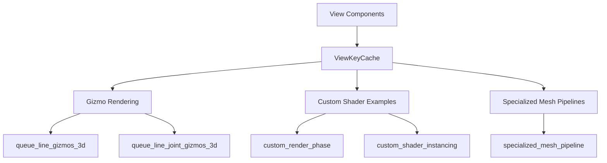

+++
title = "#22809 Reuse `ViewKeyCache` where possible"
date = "2026-02-06T00:00:00"
draft = false
template = "pull_request_page.html"
in_search_index = true

[taxonomies]
list_display = ["show"]

[extra]
current_language = "en"
available_languages = {"en" = { name = "English", url = "/pull_request/bevy/2026-02/pr-22809-en-20260206" }, "zh-cn" = { name = "中文", url = "/pull_request/bevy/2026-02/pr-22809-zh-cn-20260206" }}
labels = ["C-Docs", "A-Rendering", "C-Examples", "C-Usability"]
+++

# Title

## Basic Information
- **Title**: Reuse `ViewKeyCache` where possible
- **PR Link**: https://github.com/bevyengine/bevy/pull/22809
- **Author**: levydsa
- **Status**: MERGED
- **Labels**: C-Docs, A-Rendering, C-Examples, C-Usability, S-Ready-For-Final-Review
- **Created**: 2026-02-05T02:46:45Z
- **Merged**: 2026-02-06T19:50:36Z
- **Merged By**: alice-i-cecile

## Description Translation

## Objective

- Creating a `MeshPipelineKey` is tricky and can lead to easily avoidable errors: #21784
- We already cache the `MeshPipelineViewLayoutKey` part of `MeshPipelineKey` for each view in `ViewKeyCache` with the correct layout for any draw call that uses `SetMeshViewBindGroup`
 - Instruct users to use `ViewKeyCache` to properly setup the pipeline for any view features.
 
## Solution

- Reuse `ViewKeyCache` where possible in the engine and examples.
- Attempt at adding documentation for `ViewKeyCache`

## The Story of This Pull Request

This PR addresses a practical problem in Bevy's rendering system: creating `MeshPipelineKey` instances correctly is error-prone. The issue (#21784) highlighted how developers could easily make mistakes when manually constructing these keys, particularly when dealing with view-specific rendering features like prepasses, MSAA, HDR, and other view-dependent settings.

The core insight behind this fix is that Bevy already maintains a cache called `ViewKeyCache` that stores the `MeshPipelineViewLayoutKey` portion of `MeshPipelineKey` for each view. This cache is specifically designed for draw calls that use `SetMeshViewBindGroup`, ensuring the correct layout is available. However, several parts of the codebase were not leveraging this cache, instead manually reconstructing the same information through complex queries.

The developer took a straightforward approach: identify all places where `MeshPipelineKey` was being manually constructed for view-specific rendering and replace those constructions with a lookup from `ViewKeyCache`. This not only reduces code duplication but also ensures consistency and prevents the types of errors documented in issue #21784.

Looking at the implementation, the changes follow a consistent pattern. Previously, functions like `queue_line_gizmos_3d` would query multiple components and conditionally set flags on the `MeshPipelineKey`:

```rust
let mut view_key = MeshPipelineKey::from_msaa_samples(msaa.samples())
    | MeshPipelineKey::from_hdr(view.hdr);

if normal_prepass {
    view_key |= MeshPipelineKey::NORMAL_PREPASS;
}

if depth_prepass {
    view_key |= MeshPipelineKey::DEPTH_PREPASS;
}

// ... more conditionals for other features
```

This approach required developers to know about all possible view features and manually check for each component. It was verbose, prone to omission errors, and would require updates whenever new view features were added.

The new implementation is significantly simpler:

```rust
let Some(&view_key) = view_key_cache.get(&view.retained_view_entity) else {
    continue;
};
```

This single line replaces dozens of lines of manual key construction. The `ViewKeyCache` is populated elsewhere in the rendering system with the correct `MeshPipelineKey` for each view, including all relevant feature flags based on the view's actual configuration.

The changes affected multiple areas:
1. **Gizmo rendering**: Both `queue_line_gizmos_3d` and `queue_line_joint_gizmos_3d` in the gizmo renderer were updated to use the cache.
2. **Example code**: Three advanced shader examples were updated to demonstrate the correct pattern.
3. **Documentation**: Added clear documentation for `ViewKeyCache` to guide future developers.

From a technical perspective, this change improves maintainability in several ways. First, it centralizes the logic for determining view-specific pipeline keys. When new view features are added, they only need to be handled in the code that populates `ViewKeyCache`, not in every rendering system that might need the key. Second, it reduces boilerplate and cognitive load for developers writing new rendering systems. Third, it eliminates a class of bugs where features might be incorrectly enabled or disabled due to oversight in manual key construction.

The performance impact is likely neutral or slightly positive. While there's an additional hash map lookup, this replaces multiple component checks and bitwise operations. More importantly, it ensures that all systems use the same cached key, potentially improving cache locality.

One subtle but important aspect of this change is the simplification of the query parameters. Many functions no longer need to query for all the individual prepass and feature components, making the system signatures cleaner and reducing the complexity of the ECS queries.

The PR also serves as a documentation effort. By updating the examples to use `ViewKeyCache`, it establishes a clear best practice for developers implementing custom rendering systems. The added documentation for `ViewKeyCache` itself helps clarify its purpose and usage.

This change represents a step toward more declarative rendering systems in Bevy. Rather than each system imperatively constructing keys based on what it thinks the view configuration should be, systems now ask for the authoritative view key from a central cache. This aligns with broader software engineering principles of avoiding duplication and maintaining single sources of truth.

## Visual Representation



## Key Files Changed

### `crates/bevy_gizmos_render/src/pipeline_3d.rs` (+15/-90)
**Purpose**: Update gizmo rendering systems to use `ViewKeyCache` instead of manually constructing `MeshPipelineKey`.

**Key Changes**:
- Simplified queries by removing multiple component checks
- Replaced manual `MeshPipelineKey` construction with cache lookups
- Reduced code complexity and potential for errors

**Code Example**:
```rust
// Before: Manual construction with multiple conditionals
let mut view_key = MeshPipelineKey::from_msaa_samples(msaa.samples())
    | MeshPipelineKey::from_hdr(view.hdr);

if normal_prepass {
    view_key |= MeshPipelineKey::NORMAL_PREPASS;
}
// ... more conditionals for depth_prepass, motion_vector_prepass, etc.

// After: Simple cache lookup
let Some(&view_key) = view_key_cache.get(&view.retained_view_entity) else {
    continue;
};
```

### `crates/bevy_pbr/src/render/mesh.rs` (+2/-0)
**Purpose**: Add documentation for `ViewKeyCache` to clarify its purpose and usage.

**Code Example**:
```rust
/// This resource caches [`MeshPipelineKey`]s for each view with pre-enabled features needed to properly
/// setup the [`MeshViewBindGroup`] layout in specialized [`MeshPipeline`]s.
#[derive(Resource, Deref, DerefMut, Default, Debug, Clone)]
pub struct ViewKeyCache(HashMap<RetainedViewEntity, MeshPipelineKey>);
```

### `examples/shader_advanced/custom_render_phase.rs` (+7/-7)
**Purpose**: Update example to demonstrate correct usage of `ViewKeyCache`.

**Code Example**:
```rust
// Before: Manual key construction
let view_key = MeshPipelineKey::from_msaa_samples(msaa.samples())
    | MeshPipelineKey::from_hdr(view.hdr);

// After: Cache lookup
let Some(&view_key) = view_key_cache.get(&view.retained_view_entity) else {
    continue;
};
```

### `examples/shader_advanced/specialized_mesh_pipeline.rs` (+7/-6)
**Purpose**: Update specialized mesh pipeline example to use `ViewKeyCache`.

### `examples/shader_advanced/custom_shader_instancing.rs` (+7/-5)
**Purpose**: Update custom shader instancing example to use `ViewKeyCache`.

## Further Reading

1. [Bevy Rendering Documentation](https://bevyengine.org/learn/book/rendering/) - Official Bevy rendering guide
2. [Mesh Pipeline System](https://github.com/bevyengine/bevy/blob/main/crates/bevy_pbr/src/render/mesh.rs) - Source code for Bevy's mesh rendering system
3. [Issue #21784](https://github.com/bevyengine/bevy/issues/21784) - The original issue documenting problems with manual `MeshPipelineKey` construction
4. [ECS Queries in Bevy](https://bevyengine.org/learn/book/programming/ecs/queries/) - Understanding how to query components in Bevy's ECS