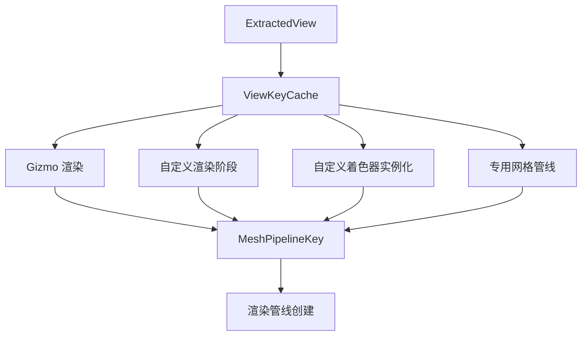

+++
title = "#22809 Reuse `ViewKeyCache` where possible"
date = "2026-02-06T00:00:00"
draft = false
template = "pull_request_page.html"
in_search_index = false

[extra]
current_language = "zh-cn"
available_languages = {"en" = { name = "English", url = "/pull_request/bevy/2026-02/pr-22809-en-20260206" }, "zh-cn" = { name = "中文", url = "/pull_request/bevy/2026-02/pr-22809-zh-cn-20260206" }}
+++

# Title: Reuse `ViewKeyCache` where possible

## Basic Information
- **Title**: Reuse `ViewKeyCache` where possible
- **PR Link**: https://github.com/bevyengine/bevy/pull/22809
- **作者**: levydsa
- **状态**: 已合并
- **标签**: C-Docs, A-Rendering, C-Examples, C-Usability, S-Ready-For-Final-Review
- **创建时间**: 2026-02-05T02:46:45Z
- **合并时间**: 2026-02-06T19:50:36Z
- **合并者**: alice-i-cecile

## 描述翻译

### 目标

- 创建 `MeshPipelineKey` 比较棘手，容易导致本可避免的错误：#21784
- 我们已经为每个视图在 `ViewKeyCache` 中缓存了 `MeshPipelineKey` 的 `MeshPipelineViewLayoutKey` 部分，用于任何使用 `SetMeshViewBindGroup` 的绘制调用。
- 指导用户使用 `ViewKeyCache` 来正确设置任何视图功能的渲染管线。

### 解决方案

- 在引擎和示例中尽可能复用 `ViewKeyCache`。
- 尝试为 `ViewKeyCache` 添加文档。

## 这个 PR 的故事

这次代码修改的核心是解决一个在 Bevy 渲染系统中常见的模式重复问题。开发者在创建自定义渲染管线时，经常需要手动构建 `MeshPipelineKey` 来匹配视图的渲染配置。这个过程不仅冗长，而且容易出错，因为需要正确检查视图上所有可能的预处理组件（prepass components）和其他渲染功能。

问题的根源在于，Bevy 的渲染系统已经为每个视图维护了一个 `ViewKeyCache`，它缓存了 `MeshPipelineKey` 的视图相关部分。这个缓存是在视图的布局绑定组（`MeshViewBindGroup`）设置过程中计算和存储的，包含了所有必要的渲染功能标志，如 MSAA 采样数、HDR 设置、各种预处理通道（prepass）标志等。

在 PR 之前，多个地方的代码都在重复实现相同的逻辑：查询视图的多个组件，手动构建 `MeshPipelineKey`。例如在 gizmo 渲染代码中，需要检查 6 个不同的预处理组件，然后逐个设置对应的标志位。这种重复不仅增加了代码维护成本，还容易引入不一致的错误，比如遗漏某个预处理标志。

开发者选择了一个直接有效的解决方案：在需要视图相关 `MeshPipelineKey` 的地方，改为从 `ViewKeyCache` 资源中获取。这消除了重复代码，确保了所有使用相同视图的渲染管线都能获得一致的配置。

从实现角度看，这个 PR 主要做了几件事：

1. **简化了渲染队列函数**：移除了对多个组件的复杂查询，改为简单的视图查询和缓存查找。
2. **保持了向后兼容性**：由于 `ViewKeyCache` 已经存在于系统中，这个改变只是利用现有资源，不涉及新的系统依赖。
3. **改进了示例代码**：更新了三个高级着色器示例，展示了正确的 `ViewKeyCache` 使用方法。
4. **添加了文档**：为 `ViewKeyCache` 结构体添加了文档注释，解释了它的用途。

技术细节上，这个修改涉及到渲染管线键（pipeline key）的构成。`MeshPipelineKey` 由多个部分组成，其中一部分是视图相关的配置（如 MSAA、预处理标志等），另一部分是材质/网格特定的配置。`ViewKeyCache` 只缓存视图相关的部分，这正是多个渲染管线需要共享的。

这个改变的一个关键好处是提高了代码的健壮性。现在，如果视图的渲染配置发生变化（比如添加新的预处理类型），只需要更新 `ViewKeyCache` 的生成逻辑一处，所有使用它的渲染管线都会自动获得正确的配置。而在之前，每个手动构建 `MeshPipelineKey` 的地方都需要同步更新。

对于性能的影响，这个改变应该是有益的。缓存查找（哈希表查询）比查询多个组件的标志位并逐位组合要更快。同时，由于减少了查询的组件数量，ECS 查询的开销也降低了。

从架构角度看，这个 PR 加强了 Bevy 渲染系统的关注点分离（separation of concerns）。视图配置的生成和缓存由专门的部分处理，渲染管线的队列逻辑只需关注如何将实体排入正确的渲染阶段，而不需要了解视图配置的具体细节。

这个修改也体现了一个重要的软件工程原则：不要重复自己（DRY）。通过识别和消除重复的视图键构建逻辑，代码变得更加简洁、一致和可维护。

## 可视化表示



## 关键文件变更

### 1. `crates/bevy_gizmos_render/src/pipeline_3d.rs` (+15/-90)

这是本次修改中变化最大的文件。两个渲染队列函数被大幅简化，移除了手动构建 `MeshPipelineKey` 的复杂逻辑。

**主要变更：**
- 移除了对多个预处理组件的复杂查询
- 改为从 `ViewKeyCache` 获取视图键
- 减少了约 75 行代码

```rust
// 修改前：
let mut view_key = MeshPipelineKey::from_msaa_samples(msaa.samples())
    | MeshPipelineKey::from_hdr(view.hdr);

if normal_prepass {
    view_key |= MeshPipelineKey::NORMAL_PREPASS;
}
// ... 检查另外5个组件

// 修改后：
let Some(&view_key) = view_key_cache.get(&view.retained_view_entity) else {
    continue;
};
```

### 2. `crates/bevy_pbr/src/render/mesh.rs` (+2/-0)

为 `ViewKeyCache` 添加了文档注释，解释了其用途。

```rust
/// This resource caches [`MeshPipelineKey`]s for each view with pre-enabled features needed to properly
/// setup the [`MeshViewBindGroup`] layout in specialized [`MeshPipeline`]s.
#[derive(Resource, Deref, DerefMut, Default, Debug, Clone)]
pub struct ViewKeyCache(HashMap<RetainedViewEntity, MeshPipelineKey>);
```

### 3. `examples/shader_advanced/custom_render_phase.rs` (+7/-7)

更新自定义渲染阶段示例，使用 `ViewKeyCache` 而不是手动构建视图键。

```rust
// 修改前：
let view_key = MeshPipelineKey::from_msaa_samples(msaa.samples())
    | MeshPipelineKey::from_hdr(view.hdr);

// 修改后：
let Some(&view_key) = view_key_cache.get(&view.retained_view_entity) else {
    continue;
};
```

### 4. `examples/shader_advanced/custom_shader_instancing.rs` (+7/-5)

更新自定义着色器实例化示例，使用 `ViewKeyCache`。

```rust
// 修改前：
let msaa_key = MeshPipelineKey::from_msaa_samples(msaa.samples());
let view_key = msaa_key | MeshPipelineKey::from_hdr(view.hdr);

// 修改后：
let Some(&view_key) = view_key_cache.get(&view.retained_view_entity) else {
    continue;
};
```

### 5. `examples/shader_advanced/specialized_mesh_pipeline.rs` (+7/-6)

更新专用网格管线示例，使用 `ViewKeyCache`。

```rust
// 修改前：
let view_key = MeshPipelineKey::from_msaa_samples(msaa.samples())
    | MeshPipelineKey::from_hdr(view.hdr);

// 修改后：
let Some(&view_key) = view_key_cache.get(&view.retained_view_entity) else {
    continue;
};
```

## 进一步阅读

1. **Bevy 渲染管线文档**：了解 Bevy 的渲染架构和管线系统
2. **MeshPipelineKey 源码**：查看 `MeshPipelineKey` 的完整标志位定义
3. **PR #21784**：了解手动构建 `MeshPipelineKey` 可能导致的问题
4. **Bevy 示例代码**：研究其他使用 `ViewKeyCache` 的渲染示例
5. **Rendering with Bevy 书籍**：系统学习 Bevy 渲染系统的最佳实践