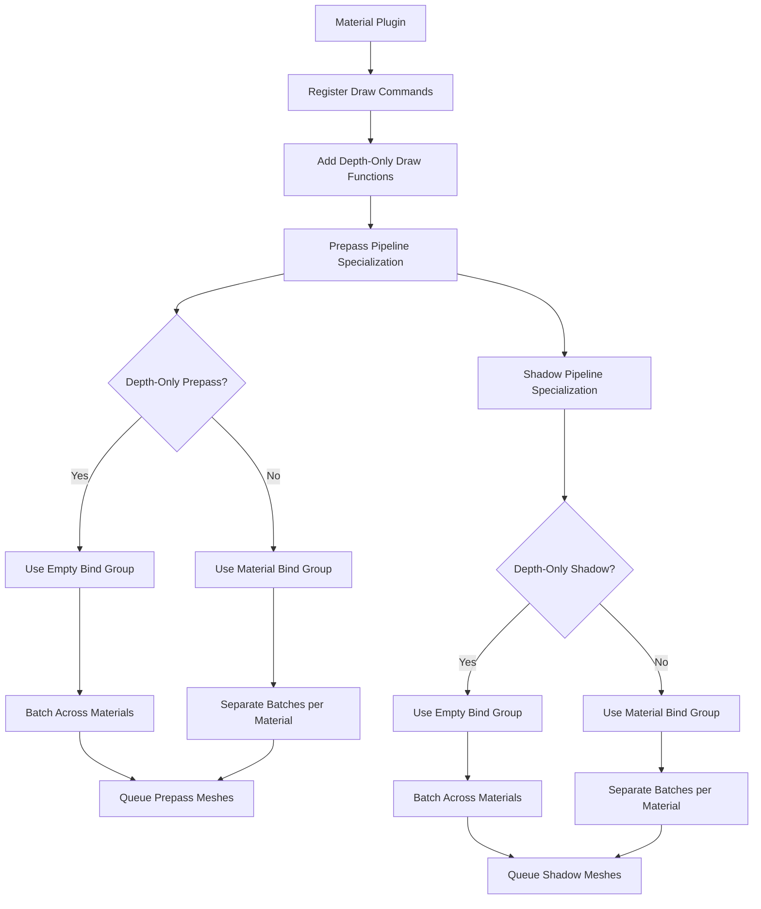

+++
title = "#22813 Batch prepasses that use depth only"
date = "2026-02-06T00:00:00"
draft = false
template = "pull_request_page.html"
in_search_index = true

[taxonomies]
list_display = ["show"]

[extra]
current_language = "en"
available_languages = {"en" = { name = "English", url = "/pull_request/bevy/2026-02/pr-22813-en-20260206" }, "zh-cn" = { name = "中文", url = "/pull_request/bevy/2026-02/pr-22813-zh-cn-20260206" }}
labels = ["A-Rendering", "C-Performance"]
+++

# Title
## Batch prepasses that use depth only

## Basic Information
- **Title**: Batch prepasses that use depth only
- **PR Link**: https://github.com/bevyengine/bevy/pull/22813
- **Author**: tychedelia
- **Status**: MERGED
- **Labels**: A-Rendering, C-Performance, S-Ready-For-Final-Review
- **Created**: 2026-02-05T08:15:58Z
- **Merged**: 2026-02-06T19:45:59Z
- **Merged By**: alice-i-cecile

## Description Translation
For prepasses that don't need to access material data or write normals/motion vectors, we can batch them together. To do so, we store a new draw command that binds an empty bind group in place of the material bindings and add `None` for the material id to the batch set key.

Testing:

```sh
cargo run --example many_cubes --release -- --shadows --material-texture-count 10
```

main:


this:


## The Story of This Pull Request

This PR addresses a performance optimization opportunity in Bevy's rendering pipeline. The core problem was that prepass rendering couldn't efficiently batch draw calls when only depth information was needed, particularly for shadow mapping and simple depth prepasses.

In Bevy's renderer, prepasses are specialized rendering phases that generate intermediate data like depth buffers, normals, and motion vectors before the main render. The existing implementation treated all prepasses similarly, requiring material bind groups even when they weren't actually used. This prevented batching across different materials because each material had a unique bind group, forcing separate draw calls.

The solution introduces a distinction between "full" prepasses that need material data (for normals, motion vectors, etc.) and "depth-only" prepasses that only require depth information. For depth-only cases, the implementation now uses an empty bind group instead of material-specific ones, allowing multiple meshes with different materials to be batched together in a single draw call.

The implementation started by adding new draw function labels for depth-only prepasses. In `material.rs`, two new labels were defined: `PrepassOpaqueDepthOnlyDrawFunction` and `ShadowsDepthOnlyDrawFunction`. These labels are registered in their respective plugins and integrated into the draw function lookup system.

The key technical insight was modifying the pipeline specialization logic in `prepass/mod.rs`. A new helper function `is_depth_only_opaque_prepass()` determines when a prepass only needs depth by checking if the mesh key contains only the `DEPTH_PREPASS` flag. When this condition is met and unclipped depth emulation isn't required, the pipeline specialization uses an empty bind group layout instead of the material-specific layout.

The cache system was extended to store draw function IDs alongside pipeline IDs. Previously, `SpecializedPrepassMaterialViewPipelineCache` only stored `(Tick, CachedRenderPipelineId)`. Now it stores `(Tick, CachedRenderPipelineId, DrawFunctionId)`, allowing the queueing system to know which draw function (depth-only or regular) to use for each cached pipeline.

The queueing logic in `queue_prepass_material_meshes()` and `queue_shadows()` was updated to handle the depth-only case. When a depth-only draw function is detected, the material bind group index is set to `None` in the batch key, allowing batching across different materials. This is a significant optimization because it reduces the number of draw calls when rendering shadows or depth prepasses for scenes with many different materials.

A similar approach was applied to shadow rendering in `render/light.rs`. The shadow specialization logic now checks if the prepass is depth-only (no material reads, no discard operations, no unclipped depth emulation) and selects the appropriate draw function. The shadow queueing then uses `None` for the material bind group index when using the depth-only draw function.

The `MeshPipelineKey` was extended with a `PREPASS_READS_MATERIAL` flag and an `ALL_PREPASS_BITS` mask to properly identify which prepass bits are relevant for determining if material data is needed.

Performance improvements are demonstrated in the PR's example images. The "many_cubes" example with shadows and multiple material textures shows reduced draw call counts and improved batching efficiency. This optimization is particularly valuable for scenes with many objects using different materials but sharing the same depth-only rendering requirements, such as shadow map generation.

## Visual Representation



## Key Files Changed

### `crates/bevy_pbr/src/prepass/mod.rs` (+134/-85)
This file contains the core implementation changes for depth-only prepass batching.

**Key changes:**
1. Added `is_depth_only_opaque_prepass()` helper function to identify depth-only prepasses
2. Modified pipeline specialization to use empty bind group for depth-only prepasses
3. Added new draw command `DrawDepthOnlyPrepass` with empty material bind group
4. Updated cache to store draw function IDs alongside pipeline IDs
5. Enhanced queueing logic to handle depth-only batching

```rust
// New helper function
fn is_depth_only_opaque_prepass(mesh_key: MeshPipelineKey) -> bool {
    mesh_key.intersection(MeshPipelineKey::ALL_PREPASS_BITS) == MeshPipelineKey::DEPTH_PREPASS
}

// Modified pipeline specialization
if is_depth_only_opaque_prepass(mesh_key) && !emulate_unclipped_depth {
    bind_group_layouts.push(self.empty_layout.clone());
} else {
    bind_group_layouts.push(
        material_properties
            .material_layout
            .as_ref()
            .unwrap()
            .clone(),
    );
}

// New draw command
pub type DrawDepthOnlyPrepass = (
    SetItemPipeline,
    SetPrepassViewBindGroup<0>,
    SetPrepassViewEmptyBindGroup<1>,
    SetMeshBindGroup<2>,
    SetPrepassEmptyMaterialBindGroup<3>,
    DrawMesh,
);
```

### `crates/bevy_pbr/src/render/light.rs` (+39/-12)
This file applies similar optimizations to shadow rendering.

**Key changes:**
1. Updated shadow cache to store draw function IDs
2. Added logic to select depth-only draw function for shadows
3. Modified shadow queueing to use empty bind groups for depth-only cases

```rust
// Determine if shadow is depth-only
let is_depth_only_opaque = !item
    .mesh_key
    .intersects(MeshPipelineKey::MAY_DISCARD | MeshPipelineKey::PREPASS_READS_MATERIAL)
    && !emulate_unclipped_depth;
let draw_function = if is_depth_only_opaque {
    item.properties
        .get_draw_function(ShadowsDepthOnlyDrawFunction)
} else {
    item.properties.get_draw_function(ShadowsDrawFunction)
};

// In queueing, conditionally use material bind group
let depth_only_draw_function = material
    .properties
    .get_draw_function(ShadowsDepthOnlyDrawFunction);
let material_bind_group_index = if Some(draw_function) == depth_only_draw_function {
    None
} else {
    Some(material.binding.group.0)
};
```

### `crates/bevy_pbr/src/material.rs` (+17/-0)
This file adds the necessary draw function labels and registers the new draw commands.

**Key changes:**
1. Added new draw function labels for depth-only prepasses and shadows
2. Registered the new draw commands in the plugin system

```rust
// New draw function labels
#[derive(DrawFunctionLabel, Debug, Hash, PartialEq, Eq, Clone, Default)]
pub struct PrepassOpaqueDepthOnlyDrawFunction;
#[derive(DrawFunctionLabel, Debug, Hash, PartialEq, Eq, Clone, Default)]
pub struct ShadowsDepthOnlyDrawFunction;

// Registration in plugin
.add_render_command::<Shadow, DrawDepthOnlyPrepass>()
```

### `crates/bevy_pbr/src/render/mesh.rs` (+9/-1)
This file extends the mesh pipeline key with new flags for prepass classification.

**Key changes:**
1. Added `PREPASS_READS_MATERIAL` flag to identify prepasses that need material data
2. Added `ALL_PREPASS_BITS` mask for easier prepass bit testing

```rust
const PREPASS_READS_MATERIAL            = 1 << 24;
const ALL_PREPASS_BITS                  = Self::DEPTH_PREPASS.bits()
                                        | Self::NORMAL_PREPASS.bits()
                                        | Self::DEFERRED_PREPASS.bits()
                                        | Self::MOTION_VECTOR_PREPASS.bits()
                                        | Self::MAY_DISCARD.bits()
                                        | Self::PREPASS_READS_MATERIAL.bits();
```

## Further Reading

1. Bevy Render Graph Documentation: https://bevyengine.org/learn/book/rendering/render-graph/
2. WebGPU Bind Groups and Batching: https://sotrh.github.io/learn-wgpu/beginner/tutorial6-uniforms/
3. GPU Driven Rendering and Batching Techniques: https://therealmjp.github.io/posts/gpu-driven-rendering/
4. Bevy Material System: https://github.com/bevyengine/bevy/tree/main/crates/bevy_pbr/src