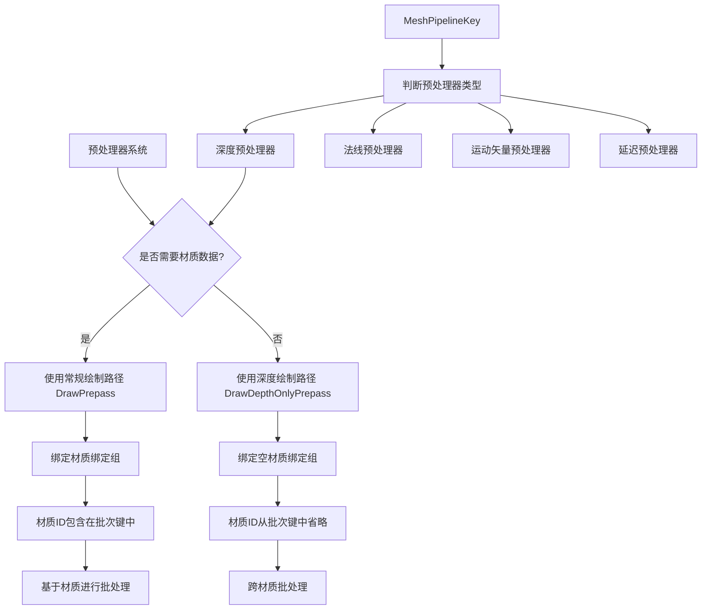

+++
title = "#22813 Batch prepasses that use depth only"
date = "2026-02-06T00:00:00"
draft = false
template = "pull_request_page.html"
in_search_index = false

[extra]
current_language = "zh-cn"
available_languages = {"en" = { name = "English", url = "/pull_request/bevy/2026-02/pr-22813-en-20260206" }, "zh-cn" = { name = "中文", url = "/pull_request/bevy/2026-02/pr-22813-zh-cn-20260206" }}
+++

# Title

## 基本资讯
- **标题**: Batch prepasses that use depth only
- **PR链接**: https://github.com/bevyengine/bevy/pull/22813
- **作者**: tychedelia
- **状态**: 已合并
- **标签**: A-Rendering, C-Performance, S-Ready-For-Final-Review
- **创建时间**: 2026-02-05T08:15:58Z
- **合并时间**: 2026-02-06T19:45:59Z
- **合并者**: alice-i-cecile

## 描述翻译
对于不需要访问材质数据或写入法线/运动矢量的预处理器( prepasses )，我们可以将它们批量处理。为此，我们存储一个新的绘制命令，该命令绑定一个空绑定组(empty bind group)来替代材质绑定，并在批次集键(batch set key)中为材质ID添加`None`。

测试：

```sh
cargo run --example many_cubes --release -- --shadows --material-texture-count 10
```

主分支：


本PR：


## 这个PR的故事

这个PR的核心问题是优化渲染性能，具体来说是为了解决深度预处理器(depth-only prepasses)无法有效批量处理的问题。在Bevy的渲染系统中，预处理器用于生成深度、法线和其他G-buffer数据，但某些预处理器（特别是仅深度预处理器）实际上不需要访问材质数据。

### 问题分析

在原始实现中，所有预处理器都绑定材质绑定组(material bind group)，即使它们实际上不需要材质数据。这导致即使多个对象使用不同的材质，只要它们在同一个深度预处理器中，也无法被批处理。每个材质绑定组都成为一个独立的批次，增加了绘制调用(draw calls)的数量。

问题关键点：
1. 深度预处理器（如阴影贴图生成）只需要顶点位置和深度信息，不需要材质纹理或属性
2. 当前的批处理系统将材质ID作为批次键的一部分，导致相同几何体但不同材质的对象无法批处理
3. 这限制了渲染性能，特别是在具有大量不同材质的场景中

### 解决方案

作者采用了一个直接的方法：对于仅深度预处理器，使用空的绑定组替代材质绑定组，并在批次键中省略材质ID。这样，所有使用仅深度预处理器的几何体都可以被批量处理，无论它们使用什么材质。

具体实现分为几个关键部分：

#### 1. 新的绘制函数和标签

首先，需要定义新的绘制函数类型来处理深度预处理器。在`material.rs`中添加了两个新的绘制函数标签：

```rust
#[derive(DrawFunctionLabel, Debug, Hash, PartialEq, Eq, Clone, Default)]
pub struct PrepassOpaqueDepthOnlyDrawFunction;

#[derive(DrawFunctionLabel, Debug, Hash, PartialEq, Eq, Clone, Default)]
pub struct ShadowsDepthOnlyDrawFunction;
```

这些标签用于区分常规预处理器和深度预处理器。

#### 2. 管道专业化调整

在`prepass/mod.rs`中，关键改变在`PrepassPipeline::specialize`方法中。系统需要识别何时使用空绑定组：

```rust
fn is_depth_only_opaque_prepass(mesh_key: MeshPipelineKey) -> bool {
    mesh_key.intersection(MeshPipelineKey::ALL_PREPASS_BITS) == MeshPipelineKey::DEPTH_PREPASS
}

// 在specialize方法中：
if is_depth_only_opaque_prepass(mesh_key) && !emulate_unclipped_depth {
    bind_group_layouts.push(self.empty_layout.clone());
} else {
    bind_group_layouts.push(
        material_properties
            .material_layout
            .as_ref()
            .unwrap()
            .clone(),
    );
}
```

这里的关键判断逻辑是：如果预处理器是深度预处理器（只需要深度），且不需要模拟未裁剪深度(unclipped depth emulation)，则使用空绑定组布局。

#### 3. 缓存扩展

原来的材质管道缓存只存储了管道ID，现在需要额外存储绘制函数ID，以确定应该使用哪个绘制函数：

```rust
// 之前：
map: MainEntityHashMap<(Tick, CachedRenderPipelineId)>,

// 之后：
map: MainEntityHashMap<(Tick, CachedRenderPipelineId, DrawFunctionId)>,
```

这个改变反映在`SpecializedPrepassMaterialViewPipelineCache`和`SpecializedShadowMaterialViewPipelineCache`中。

#### 4. 新的渲染命令

为了支持空材质绑定组，添加了新的渲染命令`SetPrepassEmptyMaterialBindGroup`：

```rust
pub struct SetPrepassEmptyMaterialBindGroup<const I: usize>;
```

该命令绑定一个空绑定组到指定的绑定点。然后定义了一个新的绘制命令组合：

```rust
pub type DrawDepthOnlyPrepass = (
    SetItemPipeline,
    SetPrepassViewBindGroup<0>,
    SetPrepassViewEmptyBindGroup<1>,
    SetMeshBindGroup<2>,
    SetPrepassEmptyMaterialBindGroup<3>,
    DrawMesh,
);
```

与常规的`DrawPrepass`相比，关键区别在于使用了`SetPrepassEmptyMaterialBindGroup`而不是`SetMaterialBindGroup`。

#### 5. 批处理逻辑调整

在`queue_prepass_material_meshes`和`queue_shadows`函数中，当处理深度预处理器时，将`material_bind_group_index`设置为`None`：

```rust
let material_bind_group_index =
    if Some(draw_function) == depth_only_draw_function {
        None
    } else {
        Some(material.binding.group.0)
    };
```

这允许批处理系统忽略材质差异，将不同材质的几何体批处理在一起。

#### 6. 标志位扩展

为了正确识别哪些预处理器需要读取材质数据，在`MeshPipelineKey`中添加了新标志位：

```rust
const PREPASS_READS_MATERIAL = 1 << 24;
const ALL_PREPASS_BITS = Self::DEPTH_PREPASS.bits()
    | Self::NORMAL_PREPASS.bits()
    | Self::DEFERRED_PREPASS.bits()
    | Self::MOTION_VECTOR_PREPASS.bits()
    | Self::MAY_DISCARD.bits()
    | Self::PREPASS_READS_MATERIAL.bits();
```

### 技术见解

这个PR展示了几个重要的渲染优化技术：

1. **基于使用模式的差异化处理**：不是所有预处理器都需要相同的数据，深度预处理器是一个特例，可以优化。

2. **空绑定组的使用**：当着色器不需要某些数据时，使用空绑定组可以避免不必要的GPU状态切换。

3. **批处理键优化**：通过从批处理键中移除不必要的信息（材质ID），可以增加批处理机会。

4. **条件性专业化**：渲染管道根据使用情况动态专业化，这是现代渲染引擎的关键特性。

值得注意的是，这种优化有几个前提条件：
- 着色器必须能够处理缺少材质数据的情况
- 深度预处理器确实不需要材质数据
- 系统需要正确识别深度预处理器和其他预处理器的区别

### 性能影响

从提供的性能对比图可以看出，这个优化带来了明显的性能提升。在`many_cubes`示例中，使用10个不同材质纹理时，性能有了显著改善。

关键性能收益包括：
- 减少绘制调用数量
- 减少GPU状态切换
- 提高GPU利用率

### 潜在问题和注意事项

1. **未裁剪深度模拟**：当需要模拟未裁剪深度时，仍然需要运行片段着色器，因此不能使用空材质绑定组。

2. **向后兼容性**：这个改变是向后兼容的，因为只增加了新的绘制路径，没有修改现有功能。

3. **着色器复杂度**：着色器需要能够处理空绑定组的情况，可能需要额外的分支或条件编译。

## 视觉表示



## 关键文件更改

### `crates/bevy_pbr/src/prepass/mod.rs` (+134/-85)

**修改内容**：这是主要的修改文件，实现了深度预处理器的批处理逻辑。

**关键修改**：
1. 添加了`is_depth_only_opaque_prepass`函数来判断是否为深度预处理器
2. 修改了管道专业化逻辑，为深度预处理器使用空绑定组
3. 扩展了缓存数据结构以存储绘制函数ID
4. 添加了新的渲染命令`SetPrepassEmptyMaterialBindGroup`
5. 定义了新的绘制命令组合`DrawDepthOnlyPrepass`

**代码示例**：
```rust
// 判断是否为深度预处理器
fn is_depth_only_opaque_prepass(mesh_key: MeshPipelineKey) -> bool {
    mesh_key.intersection(MeshPipelineKey::ALL_PREPASS_BITS) == MeshPipelineKey::DEPTH_PREPASS
}

// 新的绘制命令组合
pub type DrawDepthOnlyPrepass = (
    SetItemPipeline,
    SetPrepassViewBindGroup<0>,
    SetPrepassViewEmptyBindGroup<1>,
    SetMeshBindGroup<2>,
    SetPrepassEmptyMaterialBindGroup<3>,
    DrawMesh,
);
```

### `crates/bevy_pbr/src/render/light.rs` (+39/-12)

**修改内容**：扩展阴影渲染系统以支持深度预处理器批处理。

**关键修改**：
1. 修改了`SpecializedShadowMaterialViewPipelineCache`以存储绘制函数ID
2. 在`specialize_shadows`中为深度阴影选择合适的绘制函数
3. 在`queue_shadows`中为深度阴影设置`material_bind_group_index`为`None`

**代码示例**：
```rust
// 之前的缓存结构
map: MainEntityHashMap<(Tick, CachedRenderPipelineId)>,

// 之后的缓存结构  
map: MainEntityHashMap<(Tick, CachedRenderPipelineId, DrawFunctionId)>,

// 在队列函数中的使用
let material_bind_group_index = if Some(draw_function) == depth_only_draw_function {
    None
} else {
    Some(material.binding.group.0)
};
```

### `crates/bevy_pbr/src/material.rs` (+17/-0)

**修改内容**：添加新的绘制函数标签并注册新的绘制命令。

**关键修改**：
1. 添加了`PrepassOpaqueDepthOnlyDrawFunction`和`ShadowsDepthOnlyDrawFunction`标签
2. 注册了`DrawDepthOnlyPrepass`渲染命令
3. 在`queue_material_meshes`中包含了新的绘制函数

**代码示例**：
```rust
#[derive(DrawFunctionLabel, Debug, Hash, PartialEq, Eq, Clone, Default)]
pub struct PrepassOpaqueDepthOnlyDrawFunction;

#[derive(DrawFunctionLabel, Debug, Hash, PartialEq, Eq, Clone, Default)]
pub struct ShadowsDepthOnlyDrawFunction;

// 注册渲染命令
.add_render_command::<Shadow, DrawDepthOnlyPrepass>()
```

### `crates/bevy_pbr/src/render/mesh.rs` (+9/-1)

**修改内容**：扩展`MeshPipelineKey`以支持预处理器材质读取标志。

**关键修改**：
1. 添加了`PREPASS_READS_MATERIAL`标志位
2. 定义了`ALL_PREPASS_BITS`组合标志

**代码示例**：
```rust
const PREPASS_READS_MATERIAL            = 1 << 24;
const ALL_PREPASS_BITS                  = Self::DEPTH_PREPASS.bits()
                                        | Self::NORMAL_PREPASS.bits()
                                        | Self::DEFERRED_PREPASS.bits()
                                        | Self::MOTION_VECTOR_PREPASS.bits()
                                        | Self::MAY_DISCARD.bits()
                                        | Self::PREPASS_READS_MATERIAL.bits();
```

## 进一步阅读

1. **Bevy渲染架构文档**：了解Bevy的ECS渲染系统如何工作
2. **WebGPU/DirectX12/Vulkan绑定组设计**：理解现代图形API中绑定组的最佳实践
3. **渲染批处理技术**：深入学习渲染批处理的原理和实现
4. **延迟渲染和G-buffer**：了解预处理器在延迟渲染管线中的作用
5. **GPU驱动优化**：了解减少绘制调用和状态切换对性能的影响

相关资源：
- [Bevy渲染管线指南](https://bevy-cheatbook.github.io/features/render-pipelines.html)
- [WebGPU绑定组设计模式](https://webgpufundamentals.org/webgpu/lessons/webgpu-bind-groups.html)
- [现代渲染引擎中的批处理技术](https://developer.nvidia.com/gpugems/gpugems2/part-i-geometric-complexity/chapter-7-hardware-occlusion-queries-made-useful)