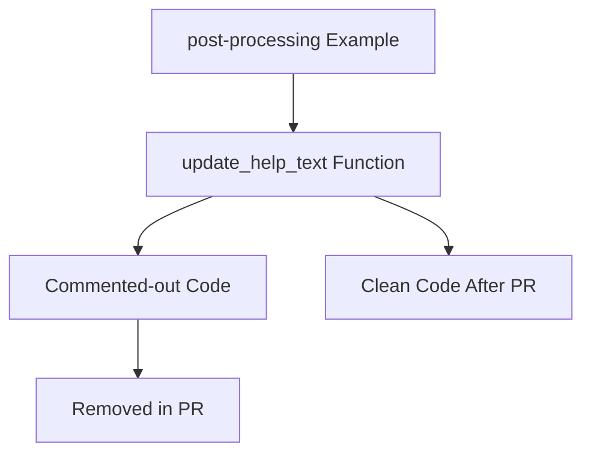

+++
title = "#22815 Remove commented-out code in example `post-processing`"
date = "2026-02-06T00:00:00"
draft = false
template = "pull_request_page.html"
in_search_index = true

[taxonomies]
list_display = ["show"]

[extra]
current_language = "en"
available_languages = {"en" = { name = "English", url = "/pull_request/bevy/2026-02/pr-22815-en-20260206" }, "zh-cn" = { name = "中文", url = "/pull_request/bevy/2026-02/pr-22815-zh-cn-20260206" }}
labels = ["D-Trivial", "A-Rendering", "C-Examples"]
+++

# Title
Remove commented-out code in example `post-processing`

## Basic Information
- **Title**: Remove commented-out code in example `post-processing`
- **PR Link**: https://github.com/bevyengine/bevy/pull/22815
- **Author**: Breakdown-Dog
- **Status**: MERGED
- **Labels**: D-Trivial, A-Rendering, C-Examples, S-Ready-For-Final-Review
- **Created**: 2026-02-05T12:46:22Z
- **Merged**: 2026-02-06T08:07:24Z
- **Merged By**: mockersf

## Description Translation
# Objective

- Remove commented-out code in example `post-processing`

## Testing

- CI

---

## The Story of This Pull Request

This PR addresses a straightforward code maintenance issue in the Bevy game engine's post-processing example. The problem was simple: there was commented-out code that served no functional purpose but cluttered the codebase. While this might seem trivial, commented-out code can create confusion for developers reading the code, especially when it's unclear why the code was commented out or whether it might be needed in the future.

The context here is the `post-processing.rs` example in Bevy's 3D examples directory. Examples in Bevy serve as both demonstration code for users and test cases for the engine's functionality. Keeping examples clean and maintainable is important because developers often copy patterns from examples when building their own applications. Commented-out code in examples can lead to confusion about best practices or suggest that certain approaches are valid when they're actually deprecated or incomplete.

The solution approach was direct and minimal: remove the single line of commented-out code. The developer didn't need to consider alternatives or architectural changes because the code was already non-functional and served no documented purpose. The engineering decision here was purely about code quality maintenance - removing dead code to keep the codebase clean.

Looking at the implementation details, the commented-out line was:
```rust
//let vignette_mode_list = ["Cosine Fourth Law", "Higher-order Powers", "Smoothstep"];
```

This line appeared to be an array of string literals representing different vignette modes, likely from an earlier version of the post-processing example. The comment suggests it was part of a feature that displayed available vignette modes, but the current implementation uses a different approach. The variable `vignette_mode_list` wasn't being used anywhere in the current code, making it safe to remove.

The technical insight here is about code maintenance practices. While individual instances of commented-out code might seem harmless, they accumulate over time and can:
1. Make the code harder to read and understand
2. Create confusion about what code is actually active
3. Waste time when developers try to understand why code was commented out
4. Potentially hide bugs or incomplete features

The impact of this change is minimal in terms of functionality but positive for code quality. By removing this commented-out code, the example becomes slightly cleaner and easier to understand. This aligns with good software engineering practices where code should either be functional or removed, not left in a commented-out state. If the code needs to be restored in the future, it can be retrieved from version control history.

## Visual Representation



## Key Files Changed

**File:** `examples/3d/post_processing.rs`

**Change description:** Removed a single line of commented-out code that was no longer used in the post-processing example.

**Code diff:**
```rust
# File: examples/3d/post_processing.rs
# Before:
fn update_help_text(mut text: Single<&mut Text>, app_settings: Res<AppSettings>) {
    text.clear();
    //let vignette_mode_list = ["Cosine Fourth Law", "Higher-order Powers", "Smoothstep"];
    let text_list = [
        format!(
            "Chromatic aberration intensity: {:.2}\n",

# After:
fn update_help_text(mut text: Single<&mut Text>, app_settings: Res<AppSettings>) {
    text.clear();
    let text_list = [
        format!(
            "Chromatic aberration intensity: {:.2}\n",
```

**Relationship to PR purpose:** This change directly implements the PR's objective of removing commented-out code from the post-processing example. The removed line was an array declaration that appeared to be related to vignette mode options but wasn't actually used in the current implementation.

## Further Reading

1. Bevy's examples directory structure and purpose: https://github.com/bevyengine/bevy/tree/main/examples
2. Rust coding conventions and best practices: https://doc.rust-lang.org/1.0.0/style/README.html
3. Post-processing techniques in game engines: https://en.wikipedia.org/wiki/Post-processing_(video_games)
4. Code maintenance and technical debt concepts: https://martinfowler.com/bliki/TechnicalDebt.html

# Full Code Diff
diff --git a/examples/3d/post_processing.rs b/examples/3d/post_processing.rs
index 25873b6d1df96..e472bcdb97d2f 100644
--- a/examples/3d/post_processing.rs
+++ b/examples/3d/post_processing.rs
@@ -237,7 +237,6 @@ fn update_chromatic_aberration_settings(
 /// [`AppSettings`].
 fn update_help_text(mut text: Single<&mut Text>, app_settings: Res<AppSettings>) {
     text.clear();
-    //let vignette_mode_list = ["Cosine Fourth Law", "Higher-order Powers", "Smoothstep"];
     let text_list = [
         format!(
             "Chromatic aberration intensity: {:.2}\n",