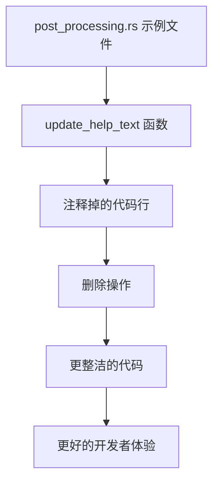

+++
title = "#22815 Remove commented-out code in example `post-processing"
date = "2026-02-06T00:00:00"
draft = false
template = "pull_request_page.html"
in_search_index = false

[extra]
current_language = "zh-cn"
available_languages = {"en" = { name = "English", url = "/pull_request/bevy/2026-02/pr-22815-en-20260206" }, "zh-cn" = { name = "中文", url = "/pull_request/bevy/2026-02/pr-22815-zh-cn-20260206" }}
+++

# Title

## Basic Information
- **标题**: Remove commented-out code in example `post-processing`
- **PR链接**: https://github.com/bevyengine/bevy/pull/22815
- **作者**: Breakdown-Dog
- **状态**: 已合并
- **标签**: D-Trivial, A-Rendering, C-Examples, S-Ready-For-Final-Review
- **创建时间**: 2026-02-05T12:46:22Z
- **合并时间**: 2026-02-06T08:07:24Z
- **合并者**: mockersf

## Description Translation
### 目标
- 移除示例 `post-processing` 中被注释掉的代码

### 测试
- CI

---

## The Story of This Pull Request

这次PR的故事很简单，主要围绕代码清理展开。开发者Breakdown-Dog在review示例代码时，发现了post-processing示例中有一行被注释掉的代码残留。这是一个典型的代码清理任务，虽然改动很小，但对于维护代码质量有实际意义。

在软件工程实践中，被注释掉的代码通常被认为是技术债务（technical debt）的一种形式。这类代码会带来几个问题：首先，它会给阅读代码的开发者造成困惑，不确定这段代码为什么被注释掉——是因为有bug，还是暂时不需要，或者是未来可能要用？其次，它增加了代码文件的大小，降低了可读性。最后，随着时间的推移，被注释的代码可能逐渐与当前代码库不兼容，如果后续开发者误启用这些代码，可能会引入问题。

在这个具体案例中，被注释的代码行是：
```rust
//let vignette_mode_list = ["Cosine Fourth Law", "Higher-order Powers", "Smoothstep"];
```

这行代码在 `update_help_text` 函数中，该函数负责更新示例程序的帮助文本。从上下文看，这个数组可能原本用于显示晕影（vignette）模式的选择列表，但在当前实现中并没有使用。开发者选择直接删除这行注释，而不是保留它作为"将来可能有用"的代码。

从工程角度看，这个决策是正确的。如果未来需要实现晕影模式选择功能，开发者可以重新编写适合当前架构的代码，而不是依赖可能已经过时的注释代码。这也符合"Clean Code"原则中关于删除死代码的建议。

这个PR的另一个值得注意的方面是它的分类标签：D-Trivial（微小改动）、C-Examples（示例代码）。这表明项目维护者对不同类型的PR有明确的分类系统，有助于高效的代码审查流程管理。虽然改动很小，但仍然经过了完整的CI测试流程，确保不会破坏现有功能。

通过这个简单的代码清理，Bevy项目保持了一致的代码质量标准。对于开源项目而言，示例代码特别重要，因为它们是新用户学习和理解框架的第一手资料。保持示例代码的整洁和可读性，有助于降低新用户的学习曲线。

## Visual Representation



## Key Files Changed

### `examples/3d/post_processing.rs`
1. **改动描述**: 删除了 `update_help_text` 函数中一行被注释掉的代码。这行代码定义了一个未使用的字符串数组 `vignette_mode_list`。

2. **代码对比**:
```rust
// Before (修改前):
fn update_help_text(mut text: Single<&mut Text>, app_settings: Res<AppSettings>) {
    text.clear();
    //let vignette_mode_list = ["Cosine Fourth Law", "Higher-order Powers", "Smoothstep"];
    let text_list = [
        format!(
            "Chromatic aberration intensity: {:.2}\n",
```

```rust
// After (修改后):
fn update_help_text(mut text: Single<&mut Text>, app_settings: Res<AppSettings>) {
    text.clear();
    let text_list = [
        format!(
            "Chromatic aberration intensity: {:.2}\n",
```

3. **与PR目标的关系**: 这个改动直接实现了PR的目标——清理示例中被注释掉的代码，提高代码的可读性和可维护性。

## Further Reading

对于想要深入了解相关概念的开发者，可以参考以下资源：

1. **《Clean Code: A Handbook of Agile Software Craftsmanship》** - Robert C. Martin 著，书中详细讨论了代码注释的最佳实践，包括为什么应该避免保留被注释掉的代码。

2. **Bevy示例文档** - [Bevy Examples](https://github.com/bevyengine/bevy/tree/main/examples)，了解Bevy框架的各种示例实现。

3. **Rust编程风格指南** - [Rust Style Guide](https://github.com/rust-dev-tools/fmt-rfcs/blob/master/guide/guide.md)，了解Rust社区的代码风格约定。

4. **技术债务管理** - 阅读关于技术债务识别和管理的文章，理解为什么及时清理无用代码对项目长期健康至关重要。