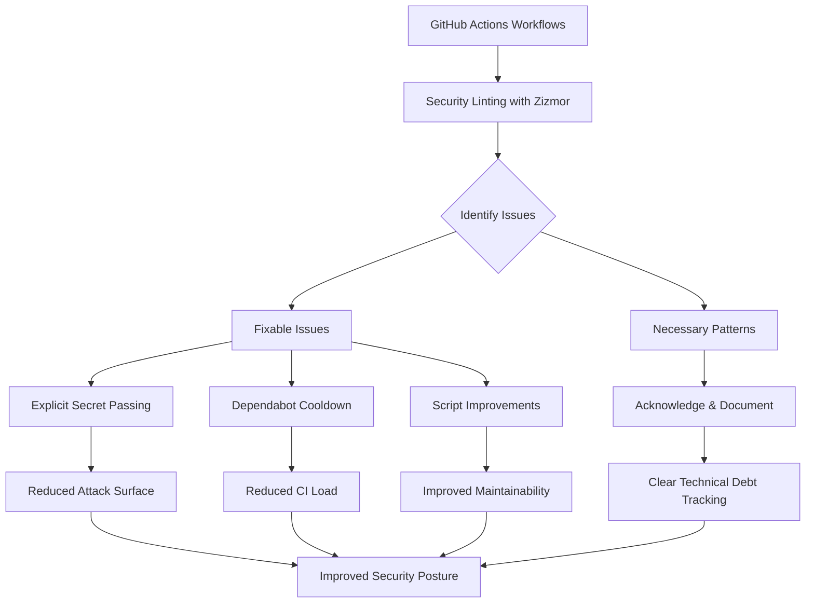

+++
title = "#22817 Address some Zizmor lints"
date = "2026-02-06T00:00:00"
draft = false
template = "pull_request_page.html"
in_search_index = true

[taxonomies]
list_display = ["show"]

[extra]
current_language = "en"
available_languages = {"en" = { name = "English", url = "/pull_request/bevy/2026-02/pr-22817-en-20260206" }, "zh-cn" = { name = "中文", url = "/pull_request/bevy/2026-02/pr-22817-zh-cn-20260206" }}
labels = ["A-Build-System", "C-Code-Quality"]
+++

# Title

## Basic Information
- **Title**: Address some Zizmor lints
- **PR Link**: https://github.com/bevyengine/bevy/pull/22817
- **Author**: BenjaminBrienen
- **Status**: MERGED
- **Labels**: A-Build-System, C-Code-Quality, S-Ready-For-Final-Review
- **Created**: 2026-02-05T16:43:04Z
- **Merged**: 2026-02-06T19:42:02Z
- **Merged By**: alice-i-cecile

## Description Translation

# Objective

Minimize security issues
Real issues don't get drowned out from fixable small issues

## Solution

Apply recommended fixes such as passing secrets explicitly.
Ignore a lint in 2 workflows because it is necessary.

## Testing

Ran Zizmor locally

```
 techn0@IO  ~/source/bevy   main ±  zizmor . --fix=all
🌈 zizmor v1.22.0
 INFO audit: zizmor: 🌈 completed ./.github/actions/install-linux-deps/action.yml
 INFO audit: zizmor: 🌈 completed ./.github/dependabot.yml
 INFO audit: zizmor: 🌈 completed ./.github/workflows/action-on-PR-labeled.yml
 INFO audit: zizmor: 🌈 completed ./.github/workflows/ci-comment-failures.yml
 INFO audit: zizmor: 🌈 completed ./.github/workflows/ci.yml
 INFO audit: zizmor: 🌈 completed ./.github/workflows/dependencies.yml
 INFO audit: zizmor: 🌈 completed ./.github/workflows/docs.yml
 INFO audit: zizmor: 🌈 completed ./.github/workflows/example-run-report.yml
 INFO audit: zizmor: 🌈 completed ./.github/workflows/example-run.yml
 INFO audit: zizmor: 🌈 completed ./.github/workflows/post-release.yml
 INFO audit: zizmor: 🌈 completed ./.github/workflows/security-static-analysis.yml
 INFO audit: zizmor: 🌈 completed ./.github/workflows/send-screenshots-to-pixeleagle.yml
 INFO audit: zizmor: 🌈 completed ./.github/workflows/update-caches.yml
 INFO audit: zizmor: 🌈 completed ./.github/workflows/validation-jobs.yml
 INFO audit: zizmor: 🌈 completed ./.github/workflows/weekly.yml
 INFO audit: zizmor: 🌈 completed ./.github/workflows/welcome.yml
error[dangerous-triggers]: use of fundamentally insecure workflow trigger
  --> ./.github/workflows/ci-comment-failures.yml:6:1
   |
 6 | / on:
 7 | |   workflow_run:
 8 | |     workflows: ["CI"]
 9 | |     types:
10 | |       - completed
   | |_________________^ workflow_run is almost always used insecurely
   |
   = note: audit confidence → Medium

error[dangerous-triggers]: use of fundamentally insecure workflow trigger
  --> ./.github/workflows/example-run-report.yml:10:1
   |
10 | / on:
11 | |   workflow_run:
12 | |     workflows: ["Example Run"]
13 | |     types:
14 | |       - completed
   | |_________________^ workflow_run is almost always used insecurely
   |
   = note: audit confidence → Medium

121 findings (2 ignored, 117 suppressed): 0 informational, 0 low, 0 medium, 2 high
```

## The Story of This Pull Request

This PR addresses security linting issues identified by Zizmor, a GitHub Actions security scanner. The primary goal was to minimize security vulnerabilities in Bevy's CI/CD pipeline while ensuring that legitimate security concerns remain visible and aren't buried under easily fixable warnings.

The developer ran Zizmor locally and identified several issues across the repository's GitHub Actions workflows. The approach taken was pragmatic: fix the straightforward issues that improve security hygiene, while acknowledging that some lint warnings point to necessary patterns that can't be easily changed without breaking functionality.

Two main categories of changes were implemented. First, several workflows were modified to explicitly pass secrets rather than using `secrets: inherit`. This is a security best practice because it limits the exposure of secrets to only what's needed. Second, the Dependabot configuration was updated with cooldown periods to prevent excessive update notifications and reduce CI load.

The `workflow_run` trigger warnings in `ci-comment-failures.yml` and `example-run-report.yml` were left unchanged because they represent necessary workflow patterns for Bevy's CI pipeline. The developer made a conscious engineering decision to accept these warnings rather than refactor the entire workflow structure, which would have been a more substantial change with potential side effects.

One notable technical improvement was in the `send-screenshots-to-pixeleagle.yml` workflow. Previously, this workflow used `secrets: inherit` when called by other workflows, which exposed all secrets to the called workflow. The fix changes this to explicitly pass only the `PIXELEAGLE_TOKEN` secret:

```yaml
# Before:
secrets: inherit

# After:
secrets:
  PIXELEAGLE_TOKEN: ${{ secrets.PIXELEAGLE_TOKEN }}
```

This follows the principle of least privilege and reduces the attack surface. The workflow was also updated to properly declare this secret as a required input, making the dependency explicit and easier to audit.

Another change improved shell script robustness in the same workflow. The script was refactored to use environment variables directly rather than relying on GitHub Actions expression syntax within shell commands:

```yaml
# Before:
metadata='{"os":"${{ inputs.os }}", "commit": "${{ inputs.commit }}", "branch": "'$branch'"}'

# After:
metadata='{"os":"'$os'", "commit": "'$commit'", "branch": "'$branch'"}'
```

This change prevents potential injection vulnerabilities and makes the script more maintainable by using consistent variable access patterns throughout.

The Dependabot changes introduce a 7-day cooldown period for both Cargo and GitHub Actions dependency updates:

```yaml
cooldown:
  default-days: 7
```

This reduces notification fatigue and CI resource consumption by preventing Dependabot from creating multiple PRs in quick succession for the same dependency ecosystem.

The impact of these changes is improved security posture with minimal disruption. The fixes follow established GitHub Actions security best practices while maintaining the existing workflow functionality. The approach demonstrates good security hygiene: addressing low-hanging fruit quickly while acknowledging when certain patterns are necessary despite security tool warnings.

## Visual Representation



## Key Files Changed

### 1. `.github/workflows/send-screenshots-to-pixeleagle.yml` (+9/-3)
This workflow is responsible for sending screenshot artifacts to an external service for comparison. The changes improve security by explicitly declaring required secrets and fixing shell script variable usage.

**Key changes:**
- Added explicit secret declaration in `workflow_call` trigger
- Changed from `secrets: inherit` to explicit secret passing in calling workflows
- Fixed shell script to use environment variables consistently

```yaml
# Before (in workflow_call):
on:
  workflow_call:

# After:
on:
  workflow_call:
    secrets:
      PIXELEAGLE_TOKEN:
        description: "An auth token for pixel-eagle.com"
        required: true
```

```yaml
# Before (in job step):
secrets: inherit

# After:
secrets:
  PIXELEAGLE_TOKEN: ${{ secrets.PIXELEAGLE_TOKEN }}
```

### 2. `.github/workflows/example-run.yml` (+6/-3)
This workflow runs examples and sends screenshots. It now explicitly passes the PIXELEAGLE_TOKEN secret instead of inheriting all secrets.

**Key changes:**
- Updated all calls to `send-screenshots-to-pixeleagle` to explicitly pass the required secret

```yaml
# Before (multiple jobs):
secrets: inherit

# After (example from one job):
secrets:
  PIXELEAGLE_TOKEN: ${{ secrets.PIXELEAGLE_TOKEN }}
```

### 3. `.github/dependabot.yml` (+4/-0)
This configuration file controls automatic dependency updates. Added cooldown periods to reduce update frequency.

**Key changes:**
- Added 7-day cooldown for both Cargo and GitHub Actions dependency updates

```yaml
# Before (cargo section):
- package-ecosystem: cargo
  # ... no cooldown specified

# After:
- package-ecosystem: cargo
  # ...
  cooldown:
    default-days: 7
```

### 4. `.github/workflows/action-on-PR-labeled.yml` (+2/-2)
This workflow handles actions when PRs are labeled. Minor comment improvement for clarity.

**Key changes:**
- Updated comments to emphasize security considerations

```yaml
# Before:
# This workflow has write permissions on the repo
# It must not checkout a PR and run untrusted code

# After:
# This workflow has write permissions on the repo.
# It must not checkout a PR and run untrusted code!
```

### 5. `.github/workflows/welcome.yml` (+2/-2)
This workflow welcomes new contributors. Similar comment improvement for security emphasis.

**Key changes:**
- Updated comments with same security emphasis as action-on-PR-labeled.yml

```yaml
# Before:
# This workflow has write permissions on the repo
# It must not checkout a PR and run untrusted code

# After:
# This workflow has write permissions on the repo.
# It must not checkout a PR and run untrusted code!
```

## Further Reading

1. **GitHub Actions Security Hardening**: [GitHub's security hardening guide](https://docs.github.com/en/actions/security-guides/security-hardening-for-github-actions) provides comprehensive best practices for securing workflows.

2. **Zizmor Documentation**: [Zizmor's official documentation](https://zizmor.gg/) explains the security linting rules and their rationale.

3. **Dependabot Configuration**: [GitHub's Dependabot configuration documentation](https://docs.github.com/en/code-security/dependabot/dependabot-version-updates/configuration-options-for-the-dependabot.yml-file) covers all available options including cooldown periods.

4. **GitHub Actions Secrets Management**: [Best practices for using secrets in GitHub Actions](https://docs.github.com/en/actions/security-guides/encrypted-secrets) explains proper secret handling patterns.

5. **Least Privilege Principle**: The [principle of least privilege](https://en.wikipedia.org/wiki/Principle_of_least_privilege) is fundamental to secure system design and applies directly to secret management in CI/CD systems.

# Full Code Diff
```
diff --git a/.github/dependabot.yml b/.github/dependabot.yml
index ebc98648a0439..95ea93c069249 100644
--- a/.github/dependabot.yml
+++ b/.github/dependabot.yml
@@ -14,9 +14,13 @@ updates:
       accesskit:
         patterns:
           - "accesskit*"
+    cooldown:
+      default-days: 7
   - package-ecosystem: github-actions
     directory: /
     schedule:
       interval: weekly
     labels:
       - "C-Dependencies"
+    cooldown:
+      default-days: 7
diff --git a/.github/workflows/action-on-PR-labeled.yml b/.github/workflows/action-on-PR-labeled.yml
index d1ed10d3819a0..c852e4a2ccfbb 100644
--- a/.github/workflows/action-on-PR-labeled.yml
+++ b/.github/workflows/action-on-PR-labeled.yml
@@ -1,7 +1,7 @@
 name: Action on PR labeled
 
-# This workflow has write permissions on the repo
-# It must not checkout a PR and run untrusted code
+# This workflow has write permissions on the repo.
+# It must not checkout a PR and run untrusted code!
 
 on:
   pull_request_target:
diff --git a/.github/workflows/example-run-report.yml b/.github/workflows/example-run-report.yml
index f99c78e654892..3decce0b025b9 100644
--- a/.github/workflows/example-run-report.yml
+++ b/.github/workflows/example-run-report.yml
@@ -77,7 +77,8 @@ jobs:
       branch: ${{ needs.make-macos-screenshots-available.outputs.branch-name }}
       artifact: screenshots-macos
       os: macos
-    secrets: inherit
+    secrets:
+      PIXELEAGLE_TOKEN: ${{ secrets.PIXELEAGLE_TOKEN }}
 
   comment-on-pr:
     permissions:
diff --git a/.github/workflows/example-run.yml b/.github/workflows/example-run.yml
index 9530d283d18ab..2fcc7c943ce37 100644
--- a/.github/workflows/example-run.yml
+++ b/.github/workflows/example-run.yml
@@ -91,7 +91,8 @@ jobs:
       branch: ${{ github.ref_name }}
       artifact: screenshots-macos
       os: macos
-    secrets: inherit
+    secrets:
+      PIXELEAGLE_TOKEN: ${{ secrets.PIXELEAGLE_TOKEN }}
 
   run-examples-linux-vulkan:
     if: ${{ github.event_name != 'pull_request' }}
@@ -165,7 +166,8 @@ jobs:
       branch: ${{ github.ref_name }}
       artifact: screenshots-linux
       os: linux
-    secrets: inherit
+    secrets:
+      PIXELEAGLE_TOKEN: ${{ secrets.PIXELEAGLE_TOKEN }}
 
   run-examples-on-windows-dx12:
     if: ${{ github.event_name != 'pull_request' }}
@@ -233,4 +235,5 @@ jobs:
       branch: ${{ github.ref_name }}
       artifact: screenshots-windows
       os: windows
-    secrets: inherit
+    secrets:
+      PIXELEAGLE_TOKEN: ${{ secrets.PIXELEAGLE_TOKEN }}
diff --git a/.github/workflows/send-screenshots-to-pixeleagle.yml b/.github/workflows/send-screenshots-to-pixeleagle.yml
index f57402a9f1ce9..24ae7c1b6c175 100644
--- a/.github/workflows/send-screenshots-to-pixeleagle.yml
+++ b/.github/workflows/send-screenshots-to-pixeleagle.yml
@@ -5,6 +5,10 @@ permissions:
 
 on:
   workflow_call:
+    secrets:
+      PIXELEAGLE_TOKEN:
+        description: "An auth token for pixel-eagle.com"
+        required: true
     inputs:
       artifact:
         required: true
@@ -49,9 +53,11 @@ jobs:
         env:
           project: B04F67C0-C054-4A6F-92EC-F599FEC2FD1D
           branch: ${{ inputs.branch }}
+          os: ${{ inputs.os }}
+          commit: ${{ inputs.commit }}
         run: |
           # Create a new run with its associated metadata
-          metadata='{"os":"${{ inputs.os }}", "commit": "${{ inputs.commit }}", "branch": "'$branch'"}'
+          metadata='{"os":"'$os'", "commit": "'$commit'", "branch": "'$branch'"}'
           run=`curl https://pixel-eagle.com/$project/runs --json "$metadata" --oauth2-bearer ${{ secrets.PIXELEAGLE_TOKEN }} | jq '.id'`
 
           SAVEIFS=$IFS
@@ -95,14 +101,14 @@ jobs:
           missing=`cat pixeleagle.json | jq '.missing | length'`
           if [ ! $missing -eq 0 ]; then
             echo "There are $missing missing screenshots"
-            echo "::warning title=$missing missing screenshots on ${{ inputs.os }}::https://pixel-eagle.com/project/$project/run/$run/compare/$compared_with"
+            echo "::warning title=$missing missing screenshots on $os::https://pixel-eagle.com/project/$project/run/$run/compare/$compared_with"
             status=1
           fi
 
           diff=`cat pixeleagle.json | jq '.diff | length'`
           if [ ! $diff -eq 0 ]; then
             echo "There are $diff screenshots with a difference"
-            echo "::warning title=$diff different screenshots on ${{ inputs.os }}::https://pixel-eagle.com/project/$project/run/$run/compare/$compared_with"
+            echo "::warning title=$diff different screenshots on $os::https://pixel-eagle.com/project/$project/run/$run/compare/$compared_with"
             status=1
           fi
 
diff --git a/.github/workflows/welcome.yml b/.github/workflows/welcome.yml
index 4dcdbf67486e1..716f0af82e344 100644
--- a/.github/workflows/welcome.yml
+++ b/.github/workflows/welcome.yml
@@ -1,7 +1,7 @@
 name: Welcome new contributors
 
-# This workflow has write permissions on the repo
-# It must not checkout a PR and run untrusted code
+# This workflow has write permissions on the repo.
+# It must not checkout a PR and run untrusted code!
 
 on:
   pull_request_target:
```