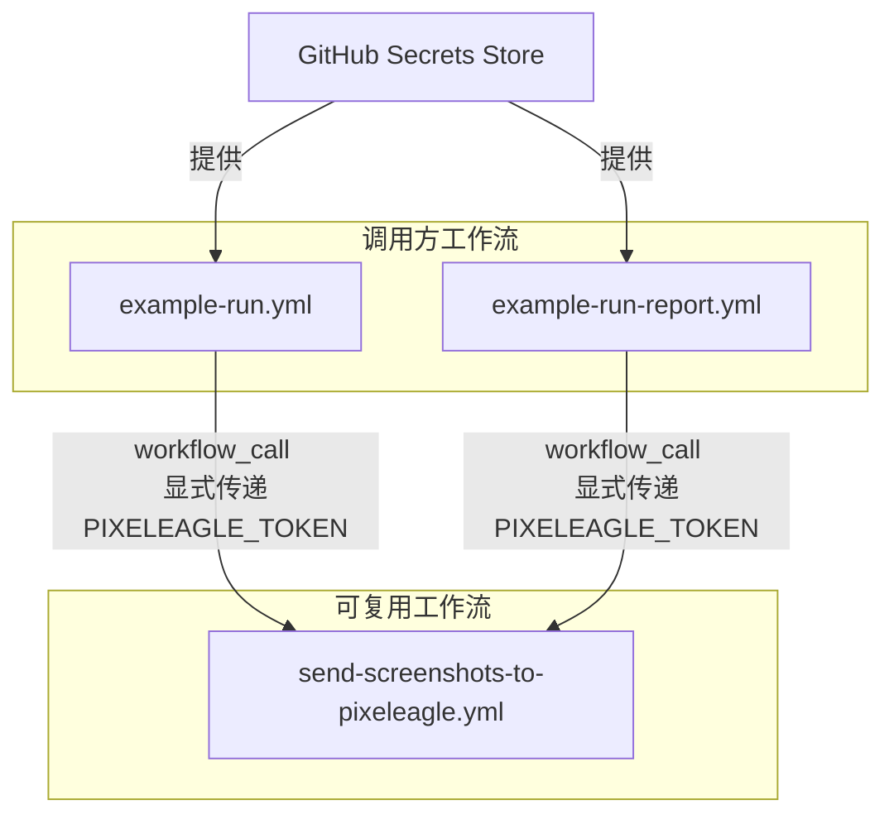

+++
title = "#22817 Address some Zizmor lints"
date = "2026-02-06T00:00:00"
draft = false
template = "pull_request_page.html"
in_search_index = false

[extra]
current_language = "zh-cn"
available_languages = {"en" = { name = "English", url = "/pull_request/bevy/2026-02/pr-22817-en-20260206" }, "zh-cn" = { name = "中文", url = "/pull_request/bevy/2026-02/pr-22817-zh-cn-20260206" }}
+++

# 标题
## 基本信息
- **标题**: Address some Zizmor lints
- **PR链接**: https://github.com/bevyengine/bevy/pull/22817
- **作者**: BenjaminBrienen
- **状态**: 已合并
- **标签**: A-Build-System, C-Code-Quality, S-Ready-For-Final-Review
- **创建时间**: 2026-02-05T16:43:04Z
- **合并时间**: 2026-02-06T19:42:02Z
- **合并者**: alice-i-cecile

## 描述翻译
**目标**

最小化安全风险。
防止可修复的小问题掩盖真正的严重问题。

**解决方案**

应用推荐修复措施，例如显式传递秘密（secrets）。
在两个工作流中忽略一条 lint 规则，因为这是必要的。

**测试**

在本地运行了 Zizmor。

```
 techn0@IO  ~/source/bevy   main ±  zizmor . --fix=all
🌈 zizmor v1.22.0
 INFO audit: zizmor: 🌈 completed ./.github/actions/install-linux-deps/action.yml
 INFO audit: zizmor: 🌈 completed ./.github/dependabot.yml
 INFO audit: zizmor: 🌈 completed ./.github/workflows/action-on-PR-labeled.yml
 INFO audit: zizmor: 🌈 completed ./.github/workflows/ci-comment-failures.yml
 INFO audit: zizmor: 🌈 completed ./.github/workflows/ci.yml
 INFO audit: zizmor: 🌈 completed ./.github/workflows/dependencies.yml
 INFO audit: zizmor: 🌈 completed ./.github/workflows/docs.yml
 INFO audit: zizmor: 🌈 completed ./.github/workflows/example-run-report.yml
 INFO audit: zizmor: 🌈 completed ./.github/workflows/example-run.yml
 INFO audit: zizmor: 🌈 completed ./.github/workflows/post-release.yml
 INFO audit: zizmor: 🌈 completed ./.github/workflows/security-static-analysis.yml
 INFO audit: zizmor: 🌈 completed ./.github/workflows/send-screenshots-to-pixeleagle.yml
 INFO audit: zizmor: 🌈 completed ./.github/workflows/update-caches.yml
 INFO audit: zizmor: 🌈 completed ./.github/workflows/validation-jobs.yml
 INFO audit: zizmor: 🌈 completed ./.github/workflows/weekly.yml
 INFO audit: zizmor: 🌈 completed ./.github/workflows/welcome.yml
error[dangerous-triggers]: use of fundamentally insecure workflow trigger
  --> ./.github/workflows/ci-comment-failures.yml:6:1
   |
 6 | / on:
 7 | |   workflow_run:
 8 | |     workflows: ["CI"]
 9 | |     types:
10 | |       - completed
   | |_________________^ workflow_run is almost always used insecurely
   |
   = note: audit confidence → Medium

error[dangerous-triggers]: use of fundamentally insecure workflow trigger
  --> ./.github/workflows/example-run-report.yml:10:1
   |
10 | / on:
11 | |   workflow_run:
12 | |     workflows: ["Example Run"]
13 | |     types:
14 | |       - completed
   | |_________________^ workflow_run is almost always used insecurely
   |
   = note: audit confidence → Medium

121 findings (2 ignored, 117 suppressed): 0 informational, 0 low, 0 medium, 2 high
```

## 本次 Pull Request 的来龙去脉

本 PR 是一个典型的代码质量与安全维护性工作。其核心目标是使用自动化安全审计工具 Zizmor 扫描 Bevy 项目的 GitHub Actions 工作流配置，并根据其建议进行修复，以降低潜在的安全风险，并保持代码库的整洁。

**问题的本质是降低风险与提升可维护性。** 在现代软件开发中，CI/CD 流水线（特别是 GitHub Actions）拥有对仓库的广泛访问权限，如果配置不当，可能成为攻击向量。Zizmor 等工具可以识别出诸如秘密泄露、不安全的触发器使用等常见问题。然而，如果审计报告充满了大量可自动修复或可忽略的低优先级警告，真正需要人工关注的严重问题（High severity issues）就容易被淹没。因此，定期运行这类工具并处理其发现，是维持项目安全态势（security posture）和代码健康度的标准实践。

**解决方案是分层级的修复策略。** 开发者采用了务实的方法：对于工具能够自动修复或提供明确安全改进建议的问题，直接应用修复；对于因实际业务需求而必须保留的“不安全”模式，则选择性地忽略（ignore）对应的 lint 规则，并在注释中说明原因。这是一种平衡安全要求与功能需求的常见做法。从 PR 描述中的测试输出可以看到，Zizmor 扫描后只剩下 2 个被忽略（ignored）的高级别（high）发现，说明绝大多数可处理的问题已被解决。

**具体实施围绕两个主要方面展开。**
首先，最重要的是**改进秘密（secrets）管理**。原有的几个工作流（如 `example-run.yml`）在调用可复用工作流（reusable workflow）`send-screenshots-to-pixeleagle.yml` 时，使用了 `secrets: inherit`。这种方式虽然方便，但会传递调用方上下文中的所有秘密，违反了“最小权限原则”。PR 将其修改为显式地仅传递所需的一个秘密 `PIXELEAGLE_TOKEN`。这显著缩小了潜在的攻击面。同时，作为被调用方的 `send-screenshots-to-pixeleagle.yml` 也进行了相应修改，在其 `workflow_call` 触发器定义中显式声明需要接收这个秘密，使其接口契约更加清晰和安全。

```yaml
# 修改前 (.github/workflows/example-run.yml 中的一个 job)
    secrets: inherit

# 修改后 (.github/workflows/example-run.yml 中的一个 job)
    secrets:
      PIXELEAGLE_TOKEN: ${{ secrets.PIXELEAGLE_TOKEN }}
```

```yaml
# 修改前 (.github/workflows/send-screenshots-to-pixeleagle.yml 的 on 部分)
on:
  workflow_call:

# 修改后 (.github/workflows/send-screenshots-to-pixeleagle.yml 的 on 部分)
on:
  workflow_call:
    secrets:
      PIXELEAGLE_TOKEN:
        description: "An auth token for pixel-eagle.com"
        required: true
```

其次，PR 对**其他配置进行了优化**。例如，在 `dependabot.yml` 中为包生态系统更新添加了 `cooldown` 配置，这可以防止在短时间内因多个依赖项更新而频繁触发构建，有助于管理 CI 资源消耗。另外，对一些拥有仓库写权限的工作流（如 `action-on-PR-labeled.yml` 和 `welcome.yml`）的注释进行了强调，提醒维护者这些工作流不能检出（checkout）并运行不可信的 PR 代码，因为 `pull_request_target` 事件会授予工作流对基础仓库的写权限和访问高权限秘密的能力，这是一个已知的高风险触发模式，需要极其谨慎地编写其中的脚本。

**忽略必要的警告体现了工程权衡。** 从 Zizmor 的输出可以看到，两个工作流（`ci-comment-failures.yml` 和 `example-run-report.yml`）因使用 `workflow_run` 触发器而产生了错误。`workflow_run` 触发器允许一个工作流在另一个工作流完成后运行，但它运行在默认的 `GITHUB_TOKEN` 权限下，且能访问触发它的那个工作运行的秘密。如果使用不当，可能被利用。然而，在某些场景下（如在一个工作流完成后进行汇总报告），这是必要的模式。PR 作者选择忽略这两个警告，意味着团队评估后认为当前的使用方式是合理且可接受的，但未来若修改这些工作流则需要重新评估其安全性。

**总结来说，** 这个 PR 是一次针对基础设施代码（Infrastructure as Code）的预防性安全加固和代码质量提升。它没有引入新功能，而是通过应用安全工具的最佳实践建议，使现有 CI/CD 流程更健壮、更易于审计。这种将安全左移（Shift Left Security）到配置文件和自动化检查中的做法，是成熟工程团队的标志。最终的代码变更虽然分散在多个文件中，但都服务于同一个核心目标：在确保功能正常运作的前提下，系统地降低风险并改善配置的清晰度。

## 可视化表示



## 关键文件变更

1.  **`.github/workflows/send-screenshots-to-pixeleagle.yml` (+9/-3)**
    -   **变更内容与原因**：此文件定义了一个可复用的工作流。主要变更有两个：1) 在 `on.workflow_call` 下显式声明了所需的 `PIXELEAGLE_TOKEN` 秘密，使接口定义更清晰、更安全；2) 在脚本中，将直接引用输入参数 `${{ inputs.os }}` 和 `${{ inputs.commit }}` 改为使用通过 `env` 上下文设置的变量 `$os` 和 `$commit`，提高了可读性，并修复了原命令中 JSON 字符串拼接可能存在的潜在问题。
    -   **关键代码片段**：
        ```yaml
        # 变更前（部分）：
        on:
          workflow_call:

        # 变更后（部分）：
        on:
          workflow_call:
            secrets:
              PIXELEAGLE_TOKEN:
                description: "An auth token for pixel-eagle.com"
                required: true
        ```
        ```yaml
        # 变更前（部分）：
          run: |
            metadata='{"os":"${{ inputs.os }}", "commit": "${{ inputs.commit }}", "branch": "'$branch'"}'

        # 变更后（部分）：
        env:
          project: B04F67C0-C054-4A6F-92EC-F599FEC2FD1D
          branch: ${{ inputs.branch }}
          os: ${{ inputs.os }}
          commit: ${{ inputs.commit }}
        run: |
          metadata='{"os":"'$os'", "commit": "'$commit'", "branch": "'$branch'"}'
        ```

2.  **`.github/workflows/example-run.yml` (+6/-3)**
    -   **变更内容与原因**：此工作流在多个作业（jobs）中调用了 `send-screenshots-to-pixeleagle.yml`。变更内容是将所有调用处的 `secrets: inherit` 替换为显式传递 `PIXELEAGLE_TOKEN`。这是本次安全改进的核心之一，遵循了最小权限原则。
    -   **关键代码片段**：
        ```yaml
        # 变更前（部分，在多个作业中重复）：
            secrets: inherit

        # 变更后（部分，在多个作业中重复）：
            secrets:
              PIXELEAGLE_TOKEN: ${{ secrets.PIXELEAGLE_TOKEN }}
        ```

3.  **`.github/dependabot.yml` (+4/-0)**
    -   **变更内容与原因**：为 `cargo` (Rust) 和 `github-actions` 生态系统更新的配置添加了 `cooldown: default-days: 7`。这设置了依赖项更新的冷却期，有助于防止 Dependabot 在短时间内因多个依赖更新而创建大量 PR，从而减轻仓库维护者的审阅负担和 CI 系统压力。
    -   **关键代码片段**：
        ```yaml
        # 变更后新增内容：
        updates:
          - package-ecosystem: "cargo"
            # ... 其他配置
            cooldown:
              default-days: 7
          - package-ecosystem: github-actions
            # ... 其他配置
            cooldown:
              default-days: 7
        ```

4.  **`.github/workflows/action-on-PR-labeled.yml` 和 `.github/workflows/welcome.yml` (各 +2/-2)**
    -   **变更内容与原因**：这两个工作流都使用了高权限的 `on: pull_request_target` 触发器。变更仅限于注释（comments），将原来的单行警告拆分为两行，并在第二行结尾加上了感叹号，起到了更强的视觉强调作用。这是一个文档/警示性改进，旨在提醒代码维护者注意此类工作流的安全风险。
    -   **关键代码片段**：
        ```yaml
        # 变更前：
        # This workflow has write permissions on the repo
        # It must not checkout a PR and run untrusted code

        # 变更后：
        # This workflow has write permissions on the repo.
        # It must not checkout a PR and run untrusted code!
        ```

## 进一步阅读

1.  **GitHub Actions 安全加固指南**：GitHub 官方文档中关于安全加固 Actions 的最佳实践，涵盖了权限、秘密管理和触发器等关键话题。
    -   链接：[https://docs.github.com/en/actions/security-guides/security-hardening-for-github-actions](https://docs.github.com/en/actions/security-guides/security-hardening-for-github-actions)
2.  **理解 `pull_request_target` 事件的风险**：这是一篇深入分析 `pull_request_target` 事件潜在滥用方式和安全编写模式的技术博客，对于维护拥有仓库写权限的工作流至关重要。
    -   链接：[https://securitylab.github.com/research/github-actions-preventing-pwn-requests/](https://securitylab.github.com/research/github-actions-preventing-pwn-requests/)
3.  **Zizmor 项目主页**：了解本次 PR 中使用的安全审计工具 Zizmor 的功能、支持的规则集和配置方法。
    -   链接：[https://github.com/Shopify/zizmor](https://github.com/Shopify/zizmor)
4.  **最小权限原则**：网络安全和访问控制中的一个核心概念，解释了为什么只授予必要的权限是重要的。
    -   链接：[https://en.wikipedia.org/wiki/Principle_of_least_privilege](https://en.wikipedia.org/wiki/Principle_of_least_privilege)

# 完整代码差异
diff --git a/.github/dependabot.yml b/.github/dependabot.yml
index ebc98648a0439..95ea93c069249 100644
--- a/.github/dependabot.yml
+++ b/.github/dependabot.yml
@@ -14,9 +14,13 @@ updates:
       accesskit:
         patterns:
           - "accesskit*"
+    cooldown:
+      default-days: 7
   - package-ecosystem: github-actions
     directory: /
     schedule:
       interval: weekly
     labels:
       - "C-Dependencies"
+    cooldown:
+      default-days: 7
diff --git a/.github/workflows/action-on-PR-labeled.yml b/.github/workflows/action-on-PR-labeled.yml
index d1ed10d3819a0..c852e4a2ccfbb 100644
--- a/.github/workflows/action-on-PR-labeled.yml
+++ b/.github/workflows/action-on-PR-labeled.yml
@@ -1,7 +1,7 @@
 name: Action on PR labeled
 
-# This workflow has write permissions on the repo
-# It must not checkout a PR and run untrusted code
+# This workflow has write permissions on the repo.
+# It must not checkout a PR and run untrusted code!
 
 on:
   pull_request_target:
diff --git a/.github/workflows/example-run-report.yml b/.github/workflows/example-run-report.yml
index f99c78e654892..3decce0b025b9 100644
--- a/.github/workflows/example-run-report.yml
+++ b/.github/workflows/example-run-report.yml
@@ -77,7 +77,8 @@ jobs:
       branch: ${{ needs.make-macos-screenshots-available.outputs.branch-name }}
       artifact: screenshots-macos
       os: macos
-    secrets: inherit
+    secrets:
+      PIXELEAGLE_TOKEN: ${{ secrets.PIXELEAGLE_TOKEN }}
 
   comment-on-pr:
     permissions:
diff --git a/.github/workflows/example-run.yml b/.github/workflows/example-run.yml
index 9530d283d18ab..2fcc7c943ce37 100644
--- a/.github/workflows/example-run.yml
+++ b/.github/workflows/example-run.yml
@@ -91,7 +91,8 @@ jobs:
       branch: ${{ github.ref_name }}
       artifact: screenshots-macos
       os: macos
-    secrets: inherit
+    secrets:
+      PIXELEAGLE_TOKEN: ${{ secrets.PIXELEAGLE_TOKEN }}
 
   run-examples-linux-vulkan:
     if: ${{ github.event_name != 'pull_request' }}
@@ -165,7 +166,8 @@ jobs:
       branch: ${{ github.ref_name }}
       artifact: screenshots-linux
       os: linux
-    secrets: inherit
+    secrets:
+      PIXELEAGLE_TOKEN: ${{ secrets.PIXELEAGLE_TOKEN }}
 
   run-examples-on-windows-dx12:
     if: ${{ github.event_name != 'pull_request' }}
@@ -233,4 +235,5 @@ jobs:
       branch: ${{ github.ref_name }}
       artifact: screenshots-windows
       os: windows
-    secrets: inherit
+    secrets:
+      PIXELEAGLE_TOKEN: ${{ secrets.PIXELEAGLE_TOKEN }}
diff --git a/.github/workflows/send-screenshots-to-pixeleagle.yml b/.github/workflows/send-screenshots-to-pixeleagle.yml
index f57402a9f1ce9..24ae7c1b6c175 100644
--- a/.github/workflows/send-screenshots-to-pixeleagle.yml
+++ b/.github/workflows/send-screenshots-to-pixeleagle.yml
@@ -5,6 +5,10 @@ permissions:
 
 on:
   workflow_call:
+    secrets:
+      PIXELEAGLE_TOKEN:
+        description: "An auth token for pixel-eagle.com"
+        required: true
     inputs:
       artifact:
         required: true
@@ -49,9 +53,11 @@ jobs:
         env:
           project: B04F67C0-C054-4A6F-92EC-F599FEC2FD1D
           branch: ${{ inputs.branch }}
+          os: ${{ inputs.os }}
+          commit: ${{ inputs.commit }}
         run: |
           # Create a new run with its associated metadata
-          metadata='{"os":"${{ inputs.os }}", "commit": "${{ inputs.commit }}", "branch": "'$branch'"}'
+          metadata='{"os":"'$os'", "commit": "'$commit'", "branch": "'$branch'"}'
           run=`curl https://pixel-eagle.com/$project/runs --json "$metadata" --oauth2-bearer ${{ secrets.PIXELEAGLE_TOKEN }} | jq '.id'`
 
           SAVEIFS=$IFS
@@ -95,14 +101,14 @@ jobs:
           missing=`cat pixeleagle.json | jq '.missing | length'`
           if [ ! $missing -eq 0 ]; then
             echo "There are $missing missing screenshots"
-            echo "::warning title=$missing missing screenshots on ${{ inputs.os }}::https://pixel-eagle.com/project/$project/run/$run/compare/$compared_with"
+            echo "::warning title=$missing missing screenshots on $os::https://pixel-eagle.com/project/$project/run/$run/compare/$compared_with"
             status=1
           fi
 
           diff=`cat pixeleagle.json | jq '.diff | length'`
           if [ ! $diff -eq 0 ]; then
             echo "There are $diff screenshots with a difference"
-            echo "::warning title=$diff different screenshots on ${{ inputs.os }}::https://pixel-eagle.com/project/$project/run/$run/compare/$compared_with"
+            echo "::warning title=$diff different screenshots on $os::https://pixel-eagle.com/project/$project/run/$run/compare/$compared_with"
             status=1
           fi
 
diff --git a/.github/workflows/welcome.yml b/.github/workflows/welcome.yml
index 4dcdbf67486e1..716f0af82e344 100644
--- a/.github/workflows/welcome.yml
+++ b/.github/workflows/welcome.yml
@@ -1,7 +1,7 @@
 name: Welcome new contributors
 
-# This workflow has write permissions on the repo
-# It must not checkout a PR and run untrusted code
+# This workflow has write permissions on the repo.
+# It must not checkout a PR and run untrusted code!
 
 on:
   pull_request_target: