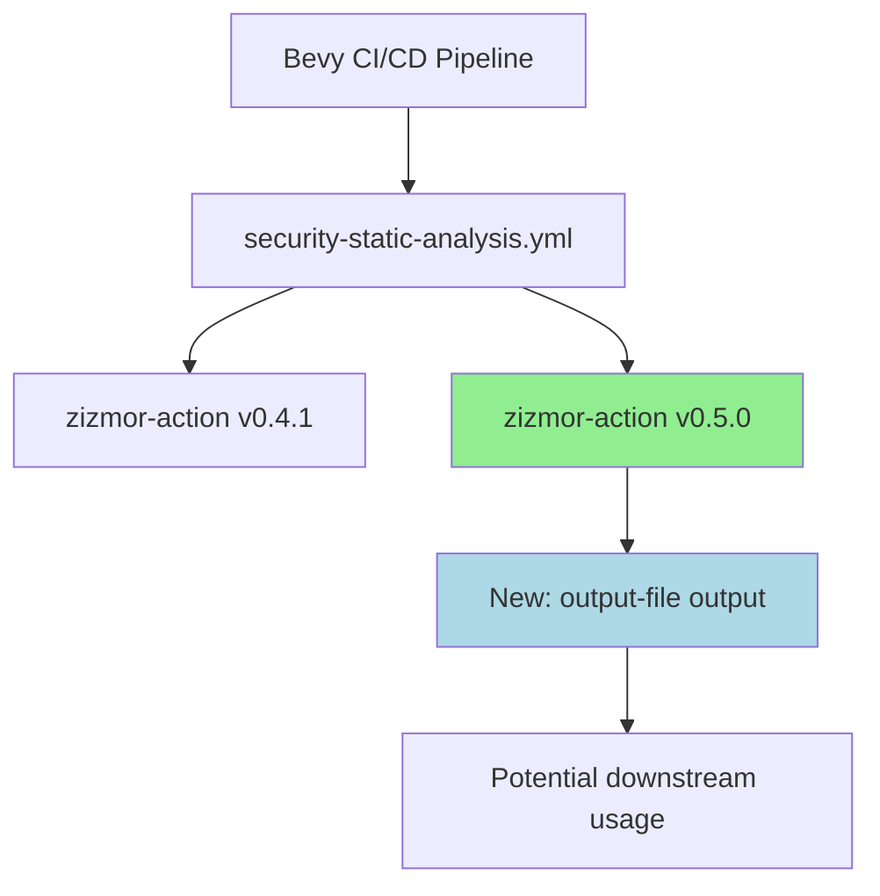

+++
title = "#22823 Bump zizmorcore/zizmor-action from 0.4.1 to 0.5.0"
date = "2026-02-06T00:00:00"
draft = false
template = "pull_request_page.html"
in_search_index = true

[taxonomies]
list_display = ["show"]

[extra]
current_language = "en"
available_languages = {"en" = { name = "English", url = "/pull_request/bevy/2026-02/pr-22823-en-20260206" }, "zh-cn" = { name = "中文", url = "/pull_request/bevy/2026-02/pr-22823-zh-cn-20260206" }}
labels = ["C-Dependencies"]
+++

# Bump zizmorcore/zizmor-action from 0.4.1 to 0.5.0

## Basic Information
- **Title**: Bump zizmorcore/zizmor-action from 0.4.1 to 0.5.0
- **PR Link**: https://github.com/bevyengine/bevy/pull/22823
- **Author**: app/dependabot
- **Status**: MERGED
- **Labels**: C-Dependencies
- **Created**: 2026-02-06T06:52:26Z
- **Merged**: 2026-02-06T08:05:22Z
- **Merged By**: mockersf

## Description Translation
Bumps [zizmorcore/zizmor-action](https://github.com/zizmorcore/zizmor-action) from 0.4.1 to 0.5.0.
<details>
<summary>Release notes</summary>
<p><em>Sourced from <a href="https://github.com/zizmorcore/zizmor-action/releases">zizmorcore/zizmor-action's releases</a>.</em></p>
<blockquote>
<h2>v0.5.0</h2>
<h2>What's Changed</h2>
<ul>
<li>Expose <code>output-file</code> as an output when <code>advanced-security: true</code> by <a href="https://github.com/unlobito"><code>@​unlobito</code></a> in <a href="https://redirect.github.com/zizmorcore/zizmor-action/pull/87">zizmorcore/zizmor-action#87</a></li>
</ul>
<h2>New Contributors</h2>
<ul>
<li><a href="https://github.com/unlobito"><code>@​unlobito</code></a> made their first contribution in <a href="https://redirect.github.com/zizmorcore/zizmor-action/pull/87">zizmorcore/zizmor-action#87</a></li>
</ul>
<p><strong>Full Changelog</strong>: <a href="https://github.com/zizmorcore/zizmor-action/compare/v0.4.1...v0.5.0">https://github.com/zizmorcore/zizmor-action/compare/v0.4.1...v0.5.0</a></p>
</blockquote>
</details>
<details>
<summary>Commits</summary>
<ul>
<li><a href="https://github.com/zizmorcore/zizmor-action/commit/0dce2577a4760a2749d8cfb7a84b7d5585ebcb7d"><code>0dce257</code></a> chore(deps): bump peter-evans/create-pull-request (<a href="https://redirect.github.com/zizmorcore/zizmor-action/issues/88">#88</a>)</li>
<li><a href="https://github.com/zizmorcore/zizmor-action/commit/fb9497493b591ad90176d3ecac5ca4aeff8c9faf"><code>fb94974</code></a> Expose <code>output-file</code> as an output when <code>advanced-security: true</code> (<a href="https://redirect.github.com/zizmorcore/zizmor-action/issues/87">#87</a>)</li>
<li><a href="https://github.com/zizmorcore/zizmor-action/commit/867562a69bb7adcc63dd1e8c003600a58b5f70e2"><code>867562a</code></a> chore(deps): bump the github-actions group with 2 updates (<a href="https://redirect.github.com/zizmorcore/zizmor-action/issues/85">#85</a>)</li>
<li><a href="https://github.com/zizmorcore/zizmor-action/commit/7462f075f718787753331c6d98ca9ef8eb41e735"><code>7462f07</code></a> Bump pins in README (<a href="https://redirect.github.com/zizmorcore/zizmor-action/issues/84">#84</a>)</li>
<li>See full diff in <a href="https://github.com/zizmorcore/zizmor-action/compare/135698455da5c3b3e55f73f4419e481ab68cdd95...0dce2577a4760a2749d8cfb7a84b7d5585ebcb7d">compare view</a></li>
</ul>
</details>
<br />


[](https://docs.github.com/en/github/managing-security-vulnerabilities/about-dependabot-security-updates#about-compatibility-scores)

Dependabot will resolve any conflicts with this PR as long as you don't alter it yourself. You can also trigger a rebase manually by commenting `@dependabot rebase`.

[//]: # (dependabot-automerge-start)
[//]: # (dependabot-automerge-end)

---

<details>
<summary>Dependabot commands and options</summary>
<br />

You can trigger Dependabot actions by commenting on this PR:
- `@dependabot rebase` will rebase this PR
- `@dependabot recreate` will recreate this PR, overwriting any edits that have been made to it
- `@dependabot show <dependency name> ignore conditions` will show all of the ignore conditions of the specified dependency
- `@dependabot ignore this major version` will close this PR and stop Dependabot creating any more for this major version (unless you reopen the PR or upgrade to it yourself)
- `@dependabot ignore this minor version` will close this PR and stop Dependabot creating any more for this minor version (unless you reopen the PR or upgrade to it yourself)
- `@dependabot ignore this dependency` will close this PR and stop Dependabot creating any more for this dependency (unless you reopen the PR or upgrade to it yourself)


</details>

## The Story of This Pull Request

This PR represents a routine dependency update in the Bevy engine's CI/CD pipeline. The project uses GitHub Actions for continuous integration, and like any software project, it needs to keep its dependencies current to benefit from bug fixes, security patches, and new features.

The specific dependency being updated is `zizmorcore/zizmor-action`, a GitHub Action used in the security static analysis workflow. This action appears to be part of the project's security scanning pipeline, helping to identify potential vulnerabilities in the codebase. The PR updates the action from version 0.4.1 to 0.5.0.

Looking at the release notes for version 0.5.0, we see a single functional change: the action now exposes an `output-file` as an output when `advanced-security: true`. This is a relatively minor but useful enhancement that gives downstream workflows access to the generated output file path when advanced security scanning is enabled. This could be used to pass the scan results to subsequent steps in the workflow, such as for further processing, reporting, or archival.

The update was automatically generated by Dependabot, GitHub's dependency management tool. Dependabot monitors project dependencies and automatically creates PRs when updates are available. This automation helps maintain security and stability by ensuring dependencies don't become outdated. The compatibility score badge shows a high compatibility rating (presumably displayed as an image), indicating that this update is unlikely to break existing functionality.

The implementation is straightforward - it's a one-line change that updates the version reference in the workflow file. The change uses a specific commit SHA rather than a version tag, which is a best practice for GitHub Actions to ensure reproducible builds and prevent supply chain attacks that could occur if a version tag were maliciously reassigned.

From an engineering perspective, this type of update is part of normal maintenance. While the change itself is minimal, it's important because:
1. Security tools should be kept current to detect the latest vulnerability patterns
2. New features like the `output-file` output could enable future workflow improvements
3. Dependency updates often include security patches that protect the CI/CD pipeline itself

The PR was merged quickly (within about 1 hour and 13 minutes), which suggests the maintainers have confidence in the compatibility of this update and trust the automated testing that would have run as part of the PR checks.

## Visual Representation



## Key Files Changed

- `.github/workflows/security-static-analysis.yml` (+1/-1)

This is the only file changed in this PR. The modification updates the version of the zizmor-action used in the security static analysis workflow.

```yaml
# File: .github/workflows/security-static-analysis.yml
# Before:
- name: Run zizmor 🌈
  uses: zizmorcore/zizmor-action@135698455da5c3b3e55f73f4419e481ab68cdd95 # v0.4.1

# After:
- name: Run zizmor 🌈
  uses: zizmorcore/zizmor-action@0dce2577a4760a2749d8cfb7a84b7d5585ebcb7d # v0.5.0
```

The change replaces the commit hash from version 0.4.1 to version 0.5.0. The comment is also updated to reflect the new version number. This single-line change updates the entire dependency to the new version, which includes the new `output-file` output feature when `advanced-security: true`.

## Further Reading

1. [GitHub Actions documentation](https://docs.github.com/en/actions) - Official documentation for GitHub Actions
2. [Dependabot documentation](https://docs.github.com/en/code-security/dependabot) - How Dependabot helps manage dependencies
3. [GitHub Advanced Security](https://docs.github.com/en/get-started/learning-about-github/about-github-advanced-security) - Information about GitHub's security features
4. [Secure supply chains for GitHub Actions](https://docs.github.com/en/actions/security-guides/security-hardening-for-github-actions) - Best practices for securing GitHub Actions workflows
5. [Semantic Versioning](https://semver.org/) - Understanding version numbers in dependencies

# Full Code Diff
diff --git a/.github/workflows/security-static-analysis.yml b/.github/workflows/security-static-analysis.yml
index ce609e4c5ff35..db97b812b44fe 100644
--- a/.github/workflows/security-static-analysis.yml
+++ b/.github/workflows/security-static-analysis.yml
@@ -87,4 +87,4 @@ jobs:
           persist-credentials: false
 
       - name: Run zizmor 🌈
-        uses: zizmorcore/zizmor-action@135698455da5c3b3e55f73f4419e481ab68cdd95 # v0.4.1
+        uses: zizmorcore/zizmor-action@0dce2577a4760a2749d8cfb7a84b7d5585ebcb7d # v0.5.0