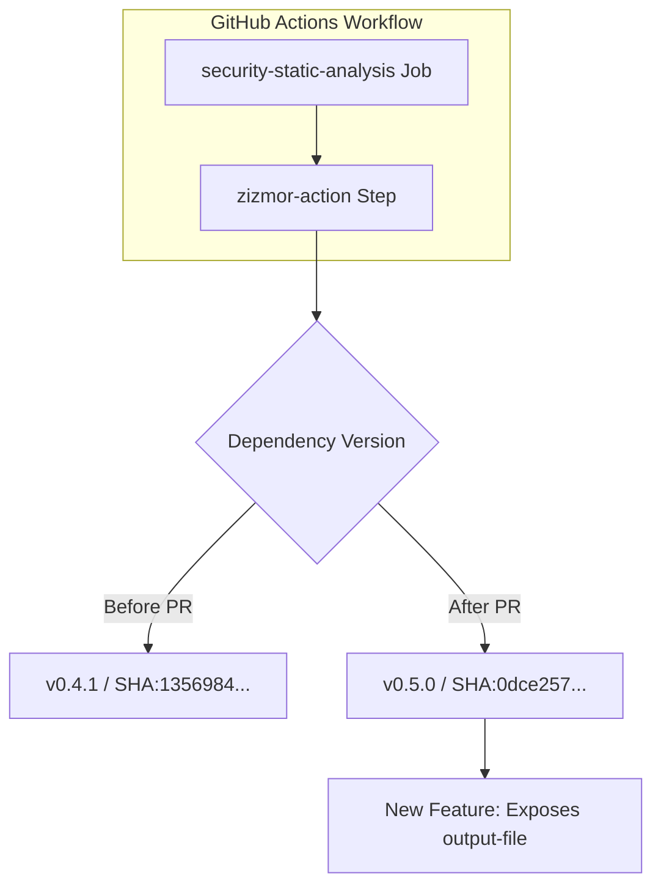

+++
title = "#22823 Bump zizmorcore/zizmor-action from 0.4.1 to 0.5.0"
date = "2026-02-06T00:00:00"
draft = false
template = "pull_request_page.html"
in_search_index = false

[extra]
current_language = "zh-cn"
available_languages = {"en" = { name = "English", url = "/pull_request/bevy/2026-02/pr-22823-en-20260206" }, "zh-cn" = { name = "中文", url = "/pull_request/bevy/2026-02/pr-22823-zh-cn-20260206" }}
labels = ["C-Dependencies"]
+++

# Title
## Basic Information
- **Title**: Bump zizmorcore/zizmor-action from 0.4.1 to 0.5.0
- **PR Link**: https://github.com/bevyengine/bevy/pull/22823
- **Author**: app/dependabot
- **Status**: MERGED
- **Labels**: C-Dependencies
- **Created**: 2026-02-06T06:52:26Z
- **Merged**: 2026-02-06T08:05:22Z
- **Merged By**: mockersf

## Description Translation
Bumps [zizmorcore/zizmor-action](https://github.com/zizmorcore/zizmor-action) from 0.4.1 to 0.5.0.
<details>
<summary>Release notes</summary>
<p><em>Sourced from <a href="https://github.com/zizmorcore/zizmor-action/releases">zizmorcore/zizmor-action's releases</a>.</em></p>
<blockquote>
<h2>v0.5.0</h2>
<h2>What's Changed</h2>
<ul>
<li>Expose <code>output-file</code> as an output when <code>advanced-security: true</code> by <a href="https://github.com/unlobito"><code>@​unlobito</code></a> in <a href="https://redirect.github.com/zizmorcore/zizmor-action/pull/87">zizmorcore/zizmor-action#87</a></li>
</ul>
<h2>New Contributors</h2>
<ul>
<li><a href="https://github.com/unlobito"><code>@​unlobito</code></a> made their first contribution in <a href="https://redirect.github.com/zizmorcore/zizmor-action/pull/87">zizmorcore/zizmor-action#87</a></li>
</ul>
<p><strong>Full Changelog</strong>: <a href="https://github.com/zizmorcore/zizmor-action/compare/v0.4.1...v0.5.0">https://github.com/zizmorcore/zizmor-action/compare/v0.4.1...v0.5.0</a></p>
</blockquote>
</details>
<details>
<summary>Commits</summary>
<ul>
<li><a href="https://github.com/zizmorcore/zizmor-action/commit/0dce2577a4760a2749d8cfb7a84b7d5585ebcb7d"><code>0dce257</code></a> chore(deps): bump peter-evans/create-pull-request (<a href="https://redirect.github.com/zizmorcore/zizmor-action/issues/88">#88</a>)</li>
<li><a href="https://github.com/zizmorcore/zizmor-action/commit/fb9497493b591ad90176d3ecac5ca4aeff8c9faf"><code>fb94974</code></a> Expose <code>output-file</code> as an output when <code>advanced-security: true</code> (<a href="https://redirect.github.com/zizmorcore/zizmor-action/issues/87">#87</a>)</li>
<li><a href="https://github.com/zizmorcore/zizmor-action/commit/867562a69bb7adcc63dd1e8c003600a58b5f70e2"><code>867562a</code></a> chore(deps): bump the github-actions group with 2 updates (<a href="https://redirect.github.com/zizmorcore/zizmor-action/issues/85">#85</a>)</li>
<li><a href="https://github.com/zizmorcore/zizmor-action/commit/7462f075f718787753331c6d98ca9ef8eb41e735"><code>7462f07</code></a> Bump pins in README (<a href="https://redirect.github.com/zizmorcore/zizmor-action/issues/84">#84</a>)</li>
<li>See full diff in <a href="https://github.com/zizmorcore/zizmor-action/compare/135698455da5c3b3e55f73f4419e481ab68cdd95...0dce2577a4760a2749d8cfb7a84b7d5585ebcb7d">compare view</a></li>
</ul>
</details>
<br />


[](https://docs.github.com/en/github/managing-security-vulnerabilities/about-dependabot-security-updates#about-compatibility-scores)

Dependabot will resolve any conflicts with this PR as long as you don't alter it yourself. You can also trigger a rebase manually by commenting `@dependabot rebase`.

[//]: # (dependabot-automerge-start)
[//]: # (dependabot-automerge-end)

---

<details>
<summary>Dependabot commands and options</summary>
<br />

You can trigger Dependabot actions by commenting on this PR:
- `@dependabot rebase` will rebase this PR
- `@dependabot recreate` will recreate this PR, overwriting any edits that have been made to it
- `@dependabot show <dependency name> ignore conditions` will show all of the ignore conditions of the specified dependency
- `@dependabot ignore this major version` will close this PR and stop Dependabot creating any more for this major version (unless you reopen the PR or upgrade to it yourself)
- `@dependabot ignore this minor version` will close this PR and stop Dependabot creating any more for this minor version (unless you reopen the PR or upgrade to it yourself)
- `@dependabot ignore this dependency` will close this PR and stop Dependabot creating any more for this dependency (unless you reopen the PR or upgrade to it yourself)


</details>

## The Story of This Pull Request
这个PR的核心是一个常规的依赖维护操作。Bevy项目使用自动化工具来保持其构建和测试流水线中所依赖的外部工具处于最新状态。具体来说，这次更新针对的是GitHub Actions生态中的一个组件。

### 背景与动机
在`.github/workflows/security-static-analysis.yml`文件中，定义了一个用于安全静态分析的CI/CD作业。这个作业使用了一个名为`zizmorcore/zizmor-action`的第三方GitHub Action。GitHub Actions允许项目复用他人编写的工作流步骤，这极大地提高了开发效率，但同时也引入了对外部代码的依赖。

依赖管理是软件工程中的一项基础且关键的任务。使用过时的依赖可能导致错过安全补丁、性能改进或新功能。Dependabot是GitHub提供的一项服务，它能自动监控项目的依赖项（包括GitHub Actions、npm包、Rust crate等），并在检测到新版本时创建PR。这就是本PR的起源——由Dependabot自动生成，目的是将`zizmor-action`从`v0.4.1`升级到`v0.5.0`。

### 更新内容分析
根据发布的说明，`v0.5.0`版本的主要变更是：当设置 `advanced-security: true` 时，将 `output-file` 暴露为一个输出项。
这意味着该Action的内部功能有了扩展，现在可以将其生成的某个文件路径作为输出，供工作流中的后续步骤使用。例如，后续步骤可以读取这个文件进行分析或上传。虽然Bevy项目当前的工作流文件可能没有立即使用这个新输出，但升级到新版本可以确保未来需要时能够使用，并遵循了保持依赖最新的最佳实践。

值得注意的是，PR描述中引用了完整的变更日志和提交记录，这提供了透明度和可追溯性。兼容性分数徽章显示为“Dependabot compatibility score”，表明Dependabot评估此次升级具有高度兼容性，降低了引入破坏性变更的风险。

### 实施与合并
从技术角度看，这个PR的实施极其简单：只修改了一行代码，即更新Action的引用版本。开发者从使用一个旧的、具体的提交SHA（`135698455da5c3b3e55f73f4419e481ab68cdd95`）切换到了新版本对应的提交SHA（`0dce2577a4760a2749d8cfb7a84b7d5585ebcb7d`）。在GitHub Actions中，通过提交SHA来锁定依赖是推荐做法，这比使用标签（如`@v0.5.0`）更精确，能确保每次运行使用的是完全相同的代码。

PR很快被维护者`mockersf`合并。对于这类由可信自动化工具（Dependabot）发起的、变更极小且风险较低的依赖更新，快速合并是常见的操作，这有助于减少代码库中“待处理更新”的积压。

### 总结
这个PR是一个典型的“维护性”更新。它没有为Bevy引擎本身添加新功能或修复bug，而是维护了其开发基础设施的健康状态。它展示了大型开源项目如何利用自动化工具（Dependabot）来管理庞大的依赖网络，确保安全性和现代性。虽然单个依赖的微小更新看似不起眼，但持续进行这类更新是保证项目长期稳定性和安全性的重要基石。

## Visual Representation


## Key Files Changed
### `.github/workflows/security-static-analysis.yml`
这是一个GitHub Actions工作流配置文件，定义了自动化的安全静态分析任务。此次变更仅更新了其中使用的`zizmor-action`的版本。

**变更内容：**
```yaml
# File: .github/workflows/security-static-analysis.yml
# Before:
      - name: Run zizmor 🌈
        uses: zizmorcore/zizmor-action@135698455da5c3b3e55f73f4419e481ab68cdd95 # v0.4.1

# After:
      - name: Run zizmor 🌈
        uses: zizmorcore/zizmor-action@0dce2577a4760a2749d8cfb7a84b7d5585ebcb7d # v0.5.0
```

**说明：**
`uses`字段指定了要运行的GitHub Action及其版本。变更前指向的是`v0.4.1`标签对应的特定提交哈希。变更后更新为`v0.5.0`版本对应的新提交哈希。注释也相应地从`# v0.4.1`更新为`# v0.5.0`，保持了代码的可读性。这行修改是整个PR的唯一变更，直接达成了依赖升级的目的。

## Further Reading
1.  **GitHub Actions 文档**: [关于 Actions](https://docs.github.com/en/actions/learn-github-actions/understanding-github-actions) 提供了工作流、作业、步骤和动作的核心概念。
2.  **Dependabot 文档**: [关于 Dependabot 版本更新](https://docs.github.com/en/code-security/dependabot/dependabot-version-updates/about-dependabot-version-updates) 详细解释了 Dependabot 如何工作以及如何配置。
3.  **GitHub Actions 版本管理最佳实践**: 社区文章通常建议使用完整的提交 SHA 而非标签来锁定 Action 版本，以确保构建的可重现性和安全性。
4.  **Semantic Versioning (SemVer)**: 了解主版本号、次版本号、修订号（Major.Minor.Patch）的含义，有助于判断依赖更新的风险级别。本次更新是次版本号升级，通常表示增加了向后兼容的新功能。

# Full Code Diff
diff --git a/.github/workflows/security-static-analysis.yml b/.github/workflows/security-static-analysis.yml
index ce609e4c5ff35..db97b812b44fe 100644
--- a/.github/workflows/security-static-analysis.yml
+++ b/.github/workflows/security-static-analysis.yml
@@ -87,4 +87,4 @@ jobs:
           persist-credentials: false
 
       - name: Run zizmor 🌈
-        uses: zizmorcore/zizmor-action@135698455da5c3b3e55f73f4419e481ab68cdd95 # v0.4.1
+        uses: zizmorcore/zizmor-action@0dce2577a4760a2749d8cfb7a84b7d5585ebcb7d # v0.5.0