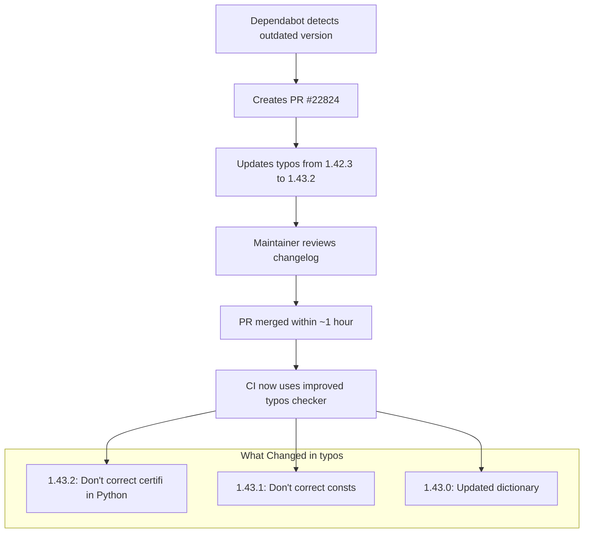

+++
title = "#22824 Dependency Update: Bumping crate-ci/typos from 1.42.3 to 1.43.2"
date = "2026-02-06T00:00:00"
draft = false
template = "pull_request_page.html"
in_search_index = true

[taxonomies]
list_display = ["show"]

[extra]
current_language = "en"
available_languages = {"en" = { name = "English", url = "/pull_request/bevy/2026-02/pr-22824-en-20260206" }, "zh-cn" = { name = "中文", url = "/pull_request/bevy/2026-02/pr-22824-zh-cn-20260206" }}
labels = ["C-Dependencies"]
+++

# Title: Dependency Update: Bumping crate-ci/typos from 1.42.3 to 1.43.2

## Basic Information
- **Title**: Bump crate-ci/typos from 1.42.3 to 1.43.2
- **PR Link**: https://github.com/bevyengine/bevy/pull/22824
- **Author**: app/dependabot
- **Status**: MERGED
- **Labels**: C-Dependencies
- **Created**: 2026-02-06T06:52:46Z
- **Merged**: 2026-02-06T08:05:22Z
- **Merged By**: mockersf

## Description Translation
Bumps [crate-ci/typos](https://github.com/crate-ci/typos) from 1.42.3 to 1.43.2.
<details>
<summary>Release notes</summary>
<p><em>Sourced from <a href="https://github.com/crate-ci/typos/releases">crate-ci/typos's releases</a>.</em></p>
<blockquote>
<h2>v1.43.2</h2>
<h2>[1.43.2] - 2026-02-05</h2>
<h3>Fixes</h3>
<ul>
<li>Don't correct <code>certifi</code> in Python</li>
</ul>
<h2>v1.43.1</h2>
<h2>[1.43.1] - 2026-02-03</h2>
<h3>Fixes</h3>
<ul>
<li>Don't correct <code>consts</code></li>
</ul>
<h2>v1.43.0</h2>
<h2>[1.43.0] - 2026-02-02</h2>
<h3>Features</h3>
<ul>
<li>Updated the dictionary with the <a href="https://redirect.github.com/crate-ci/typos/issues/1453">January 2026</a> changes</li>
</ul>
</blockquote>
</details>
<details>
<summary>Changelog</summary>
<p><em>Sourced from <a href="https://github.com/crate-ci/typos/blob/master/CHANGELOG.md">crate-ci/typos's changelog</a>.</em></p>
<blockquote>
<h1>Change Log</h1>
<p>All notable changes to this project will be documented in this file.</p>
<p>The format is based on <a href="https://keepachangelog.com/">Keep a Changelog</a>
and this project adheres to <a href="https://semver.org/">Semantic Versioning</a>.</p>
<!-- raw HTML omitted -->
<h2>[Unreleased] - ReleaseDate</h2>
<h2>[1.43.2] - 2026-02-05</h2>
<h3>Fixes</h3>
<ul>
<li>Don't correct <code>certifi</code> in Python</li>
</ul>
<h2>[1.43.1] - 2026-02-03</h2>
<h3>Fixes</h3>
<ul>
<li>Don't correct <code>consts</code></li>
</ul>
<h2>[1.43.0] - 2026-02-02</h2>
<h3>Compatibility</h3>
<ul>
<li>Bumped MSRV to 1.91</li>
</ul>
<h3>Features</h3>
<ul>
<li>Updated the dictionary with the <a href="https://redirect.github.com/crate-ci/typos/issues/1453">January 2026</a> changes</li>
</ul>
<h2>[1.42.3] - 2026-01-27</h2>
<h3>Fixes</h3>
<ul>
<li>Don't correct <code>loosing</code></li>
</ul>
<h2>[1.42.2] - 2026-01-26</h2>
<h3>Fixes</h3>
<ul>
<li>Don't correct <code>substituters</code></li>
</ul>
<h2>[1.42.1] - 2026-01-19</h2>
<h3>Fixes</h3>
<ul>
<li>Ignore hex literals with suffixes (e.g. <code>0xffffUL</code>)</li>
</ul>
<h2>[1.42.0] - 2026-01-07</h2>
<!-- raw HTML omitted -->
</blockquote>
<p>... (truncated)</p>
</details>
<details>
<summary>Commits</summary>
<ul>
<li><a href="https://github.com/crate-ci/typos/commit/ad3053d3adbcce7f2e3c60fd4ddfc239787d1eff"><code>ad3053d</code></a> chore: Release</li>
<li><a href="https://github.com/crate-ci/typos/commit/a23d8beec85e2163c4ee7f5f46ba34b896862f7c"><code>a23d8be</code></a> docs: Update changelog</li>
<li><a href="https://github.com/crate-ci/typos/commit/63b278ca9d0887d9baeb1da1682ad64c60e69c7a"><code>63b278c</code></a> Merge pull request <a href="https://redirect.github.com/crate-ci/typos/issues/1497">#1497</a> from epage/certifi</li>
<li><a href="https://github.com/crate-ci/typos/commit/5775fa10aa0a50bddb619ab50618932af1867f31"><code>5775fa1</code></a> feat(config): Don't correct certifi in Python</li>
<li><a href="https://github.com/crate-ci/typos/commit/3141b83b6015e2521c29fa2a0ecd9eb7e0d9472e"><code>3141b83</code></a> docs: Add msrv entry</li>
<li><a href="https://github.com/crate-ci/typos/commit/3a4d65230db538caabac6e156599c8ba8380ff07"><code>3a4d652</code></a> chore: Release</li>
<li><a href="https://github.com/crate-ci/typos/commit/a46f9bfbb601363ad41f1c62b8bbaf4c529d7e71"><code>a46f9bf</code></a> chore: Release</li>
<li><a href="https://github.com/crate-ci/typos/commit/74b2ed6d4f74d6285a2a1f15ed18e87c4dc5ec29"><code>74b2ed6</code></a> docs: Update changelog</li>
<li><a href="https://github.com/crate-ci/typos/commit/56ca4c6c30fabcafc1ccd8868026510367202f2f"><code>56ca4c6</code></a> Merge pull request <a href="https://redirect.github.com/crate-ci/typos/issues/1494">#1494</a> from epage/consts</li>
<li><a href="https://github.com/crate-ci/typos/commit/aa5f433f3bdaad5ab784f274c702389aee8a8e86"><code>aa5f433</code></a> fix(dict): Allow consts</li>
<li>Additional commits viewable in <a href="https://github.com/crate-ci/typos/compare/06d010dfe4c84fdab1a25ea02b57b3585018ba80...ad3053d3adbcce7f2e3c60fd4ddfc239787d1eff">compare view</a></li>
</ul>
</details>
<br />


[](https://docs.github.com/en/github/managing-security-vulnerabilities/about-dependabot-security-updates#about-compatibility-scores)

Dependabot will resolve any conflicts with this PR as long as you don't alter it yourself. You can also trigger a rebase manually by commenting `@dependabot rebase`.

[//]: # (dependabot-automerge-start)
[//]: # (dependabot-automerge-end)

---

<details>
<summary>Dependabot commands and options</summary>
<br />

You can trigger Dependabot actions by commenting on this PR:
- `@dependabot rebase` will rebase this PR
- `@dependabot recreate` will recreate this PR, overwriting any edits that have been made to it
- `@dependabot show <dependency name> ignore conditions` will show all of the ignore conditions of the specified dependency
- `@dependabot ignore this major version` will close this PR and stop Dependabot creating any more for this major version (unless you reopen the PR or upgrade to it yourself)
- `@dependabot ignore this minor version` will close this PR and stop Dependabot creating any more for this minor version (unless you reopen the PR or upgrade to it yourself)
- `@dependabot ignore this dependency` will close this PR and stop Dependabot creating any more for this dependency (unless you reopen the PR or upgrade to it yourself)


</details>

## The Story of This Pull Request

This is a straightforward dependency update PR generated automatically by Dependabot. The PR updates the typos checker tool from version 1.42.3 to 1.43.2 in Bevy's CI workflow. Typos is a spell checker for source code that helps maintain code quality by catching spelling mistakes in code, documentation, and comments.

The update follows semantic versioning and moves from a patch version (1.42.3) to a minor version (1.43.2). Looking at the changelog, we can see the specific changes in this update. Version 1.43.2 fixes a false positive where `certifi` (a legitimate Python package name) was being flagged as a typo. Version 1.43.1 fixes another false positive with `consts` (a common abbreviation for "constants"). Version 1.43.0 includes dictionary updates and raises the Minimum Supported Rust Version (MSRV) to 1.91.

These fixes are important because they reduce false positives in the CI pipeline. When typos incorrectly flags legitimate terms like `certifi` or `consts`, it causes unnecessary CI failures that waste developer time and create noise. By updating to the latest version, Bevy benefits from these improvements without any code changes required.

The PR was merged quickly (within about an hour) because it's a low-risk update to a tool that runs in CI. The maintainer likely reviewed the changelog to verify the changes were safe and then merged the update. The compatibility score badge shows a high compatibility score, indicating minimal risk of breaking changes.

This type of routine dependency maintenance is essential for keeping development tools current. Regular updates ensure the project benefits from bug fixes, performance improvements, and new features while maintaining security and compatibility with the broader ecosystem.

## Visual Representation



## Key Files Changed

**File**: `.github/workflows/ci.yml` (+1/-1)

This file contains the GitHub Actions workflow configuration for Bevy's continuous integration pipeline. The change updates the specific commit hash used for the typos action from version 1.42.3 to 1.43.2.

The change is minimal but important because it ensures the CI pipeline uses the latest version of the typos checker with its bug fixes and improvements. GitHub Actions allows pinning actions to specific commit SHAs for security and reproducibility, which is why we see a hash change rather than just a version number.

```yaml
# Before:
- name: Check for typos
  uses: crate-ci/typos@06d010dfe4c84fdab1a25ea02b57b3585018ba80 # v1.42.3

# After:
- name: Check for typos
  uses: crate-ci/typos@ad3053d3adbcce7f2e3c60fd4ddfc239787d1eff # v1.43.2
```

The comment `# v1.42.3` and `# v1.43.2` helps developers quickly identify which version is being used without having to look up the commit hash. This is a common practice when pinning GitHub Actions to specific commits.

## Further Reading

1. **GitHub Actions documentation**: Understanding how to use and pin actions in workflows
2. **Semantic Versioning**: How version numbers convey meaning about changes (https://semver.org/)
3. **Typos tool documentation**: Learning how to configure and use typos for code quality (https://github.com/crate-ci/typos)
4. **Dependabot documentation**: How automated dependency updates work in GitHub (https://docs.github.com/en/code-security/dependabot)

# Full Code Diff
```diff
diff --git a/.github/workflows/ci.yml b/.github/workflows/ci.yml
index 968ac2397dc98..e6daf76a8f8ec 100644
--- a/.github/workflows/ci.yml
+++ b/.github/workflows/ci.yml
@@ -373,7 +373,7 @@ jobs:
         with:
           persist-credentials: false
       - name: Check for typos
-        uses: crate-ci/typos@06d010dfe4c84fdab1a25ea02b57b3585018ba80 # v1.42.3
+        uses: crate-ci/typos@ad3053d3adbcce7f2e3c60fd4ddfc239787d1eff # v1.43.2
       - name: Typos info
         if: failure()
         run: |
```