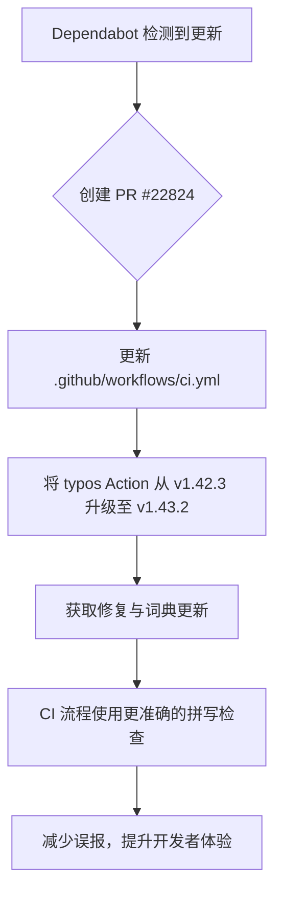

+++
title = "#22824 Bump crate-ci/typos from 1.42.3 to 1.43.2"
date = "2026-02-06T00:00:00"
draft = false
template = "pull_request_page.html"
in_search_index = false

[extra]
current_language = "zh-cn"
available_languages = {"en" = { name = "English", url = "/pull_request/bevy/2026-02/pr-22824-en-20260206" }, "zh-cn" = { name = "中文", url = "/pull_request/bevy/2026-02/pr-22824-zh-cn-20260206" }}
labels = ["C-Dependencies"]
+++

# Title

## Basic Information
- **Title**: Bump crate-ci/typos from 1.42.3 to 1.43.2
- **PR Link**: https://github.com/bevyengine/bevy/pull/22824
- **Author**: app/dependabot
- **Status**: MERGED
- **Labels**: C-Dependencies
- **Created**: 2026-02-06T06:52:46Z
- **Merged**: 2026-02-06T08:05:22Z
- **Merged By**: mockersf

## Description Translation
将 [crate-ci/typos](https://github.com/crate-ci/typos) 从 1.42.3 版本升级到 1.43.2 版本。
<details>
<summary>发布说明</summary>
<p><em>来源：<a href="https://github.com/crate-ci/typos/releases">crate-ci/typos 的发布页面</a>。</em></p>
<blockquote>
<h2>v1.43.2</h2>
<h2>[1.43.2] - 2026-02-05</h2>
<h3>修复</h3>
<ul>
<li>在 Python 中不纠正 <code>certifi</code></li>
</ul>
<h2>v1.43.1</h2>
<h2>[1.43.1] - 2026-02-03</h2>
<h3>修复</h3>
<ul>
<li>不纠正 <code>consts</code></li>
</ul>
<h2>v1.43.0</h2>
<h2>[1.43.0] - 2026-02-02</h2>
<h3>功能</h3>
<ul>
<li>使用 <a href="https://redirect.github.com/crate-ci/typos/issues/1453">2026年1月</a> 的变更更新了词典</li>
</ul>
</blockquote>
</details>
<details>
<summary>更新日志</summary>
<p><em>来源：<a href="https://github.com/crate-ci/typos/blob/master/CHANGELOG.md">crate-ci/typos 的更新日志</a>。</em></p>
<blockquote>
<h1>更新日志</h1>
<p>本项目所有重要的变更都将记录在此文件中。</p>
<p>此格式基于 <a href="https://keepachangelog.com/">Keep a Changelog</a>，
并且此项目遵循 <a href="https://semver.org/">Semantic Versioning（语义化版本控制）</a>。</p>
<!-- raw HTML omitted -->
<h2>[Unreleased] - ReleaseDate</h2>
<h2>[1.43.2] - 2026-02-05</h2>
<h3>修复</h3>
<ul>
<li>在 Python 中不纠正 <code>certifi</code></li>
</ul>
<h2>[1.43.1] - 2026-02-03</h2>
<h3>修复</h3>
<ul>
<li>不纠正 <code>consts</code></li>
</ul>
<h2>[1.43.0] - 2026-02-02</h2>
<h3>兼容性</h3>
<ul>
<li>最低支持的 Rust 版本 (MSRV) 更新至 1.91</li>
</ul>
<h3>功能</h3>
<ul>
<li>使用 <a href="https://redirect.github.com/crate-ci/typos/issues/1453">2026年1月</a> 的变更更新了词典</li>
</ul>
<h2>[1.42.3] - 2026-01-27</h2>
<h3>修复</h3>
<ul>
<li>不纠正 <code>loosing</code></li>
</ul>
<h2>[1.42.2] - 2026-01-26</h2>
<h3>修复</h3>
<ul>
<li>不纠正 <code>substituters</code></li>
</ul>
<h2>[1.42.1] - 2026-01-19</h2>
<h3>修复</h3>
<ul>
<li>忽略带有后缀的十六进制字面量（例如 <code>0xffffUL</code>）</li>
</ul>
<h2>[1.42.0] - 2026-01-07</h2>
<!-- raw HTML omitted -->
</blockquote>
<p>...（内容被截断）</p>
</details>
<details>
<summary>提交记录</summary>
<ul>
<li><a href="https://github.com/crate-ci/typos/commit/ad3053d3adbcce7f2e3c60fd4ddfc239787d1eff"><code>ad3053d</code></a> chore: 发布</li>
<li><a href="https://github.com/crate-ci/typos/commit/a23d8beec85e2163c4ee7f5f46ba34b896862f7c"><code>a23d8be</code></a> docs: 更新更新日志</li>
<li><a href="https://github.com/crate-ci/typos/commit/63b278ca9d0887d9baeb1da1682ad64c60e69c7a"><code>63b278c</code></a> Merge pull request <a href="https://redirect.github.com/crate-ci/typos/issues/1497">#1497</a> from epage/certifi</li>
<li><a href="https://github.com/crate-ci/typos/commit/5775fa10aa0a50bddb619ab50618932af1867f31"><code>5775fa1</code></a> feat(config): 在 Python 中不纠正 certifi</li>
<li><a href="https://github.com/crate-ci/typos/commit/3141b83b6015e2521c29fa2a0ecd9eb7e0d9472e"><code>3141b83</code></a> docs: 添加 msrv 条目</li>
<li><a href="https://github.com/crate-ci/typos/commit/3a4d65230db538caabac6e156599c8ba8380ff07"><code>3a4d652</code></a> chore: 发布</li>
<li><a href="https://github.com/crate-ci/typos/commit/a46f9bfbb601363ad41f1c62b8bbaf4c529d7e71"><code>a46f9bf</code></a> chore: 发布</li>
<li><a href="https://github.com/crate-ci/typos/commit/74b2ed6d4f74d6285a2a1f15ed18e87c4dc5ec29"><code>74b2ed6</code></a> docs: 更新更新日志</li>
<li><a href="https://github.com/crate-ci/typos/commit/56ca4c6c30fabcafc1ccd8868026510367202f2f"><code>56ca4c6</code></a> Merge pull request <a href="https://redirect.github.com/crate-ci/typos/issues/1494">#1494</a> from epage/consts</li>
<li><a href="https://github.com/crate-ci/typos/commit/aa5f433f3bdaad5ab784f274c702389aee8a8e86"><code>aa5f433</code></a> fix(dict): 允许 consts</li>
<li>更多提交记录可在 <a href="https://github.com/crate-ci/typos/compare/06d010dfe4c84fdab1a25ea02b57b3585018ba80...ad3053d3adbcce7f2e3c60fd4ddfc239787d1eff">比较视图</a> 中查看</li>
</ul>
</details>
<br />


[](https://docs.github.com/en/github/managing-security-vulnerabilities/about-dependabot-security-updates#about-compatibility-scores)

只要您不自行修改此 PR，Dependabot 将为您解决所有冲突。您也可以通过评论 `@dependabot rebase` 手动触发变基。

[//]: # (dependabot-automerge-start)
[//]: # (dependabot-automerge-end)

---

<details>
<summary>Dependabot 命令与选项</summary>
<br />

您可以通过评论此 PR 来触发 Dependabot 操作：
- `@dependabot rebase` 将变基此 PR
- `@dependabot recreate` 将重新创建此 PR，覆盖已对其进行的任何编辑
- `@dependabot show <dependency name> ignore conditions` 将显示指定依赖项的所有忽略条件
- `@dependabot ignore this major version` 将关闭此 PR 并阻止 Dependabot 为此主要版本创建更多 PR（除非您重新打开 PR 或自行升级到该版本）
- `@dependabot ignore this minor version` 将关闭此 PR 并阻止 Dependabot 为此次要版本创建更多 PR（除非您重新打开 PR 或自行升级到该版本）
- `@dependabot ignore this dependency` 将关闭此 PR 并阻止 Dependabot 为此依赖项创建更多 PR（除非您重新打开 PR 或自行升级到该版本）


</details>

## The Story of This Pull Request

这个 PR 是一个由 Dependabot 自动创建的依赖项更新。核心问题是保持 Bevy 项目持续集成 (CI) 流程中使用的代码质量工具的时效性。具体来说，是更新 `crate-ci/typos` 这个 GitHub Action，从 1.42.3 版本升级到 1.43.2 版本。

`typos` 是一个用于检查源代码、文档和注释中拼写错误的工具。在 Bevy 这样的大型开源项目中，维护拼写一致性对于代码可读性和专业性很重要。该工具作为 CI 流程的一部分，会在每次提交或拉取请求时自动运行，帮助捕捉并防止拼写错误进入代码库。

这次版本升级的主要驱动力是获取工具的最新改进和错误修复。从变更日志可以看出，新版本包含几个关键更新：1.43.2 版本修复了在 Python 代码中将 `certifi`（一个流行的证书库）误判为拼写错误的问题；1.43.1 版本修复了将 `consts`（`constants` 的常见缩写）误判为拼写错误的问题；1.43.0 版本则根据社区反馈更新了词典。这些都属于减少“误报”(false positives)的修复。如果一个拼写检查工具产生了过多的误报，开发人员可能会开始忽略其警告，或者 CI 会因非实质性问题而失败，这会降低工具的效用和团队的效率。

从工程实践角度看，这个 PR 的解决方案非常直接：更新 CI 配置文件中该 Action 的版本标签。这是一个低风险、高收益的变更。它不涉及修改 Bevy 的任何业务逻辑或核心代码，只影响构建和检查流程。Dependabot 自动处理了版本比较和冲突检测，并显示了一个“兼容性评分”，表明这是一个向后兼容的更新。

实现上，变更集中在 `.github/workflows/ci.yml` 文件中的一个步骤。该步骤原本使用一个固定的 Git SHA（`06d010dfe4c84fdab1a25ea02b57b3585018ba80`，对应 v1.42.3）来引用 `typos` Action，现在更新到了新版本的 SHA (`ad3053d3adbcce7f2e3c60fd4ddfc239787d1eff`，对应 v1.43.2)。使用具体的 SHA 而非标签（如 `@v1.43.2`）是一种最佳实践，可以确保构建的可复现性，因为它锁定了依赖的确切版本，避免了因标签被移动而引入的不确定性。

这个变更的技术影响很明确：Bevy 的 CI 流程现在将使用一个更精确、误报更少的拼写检查器。这将减少因工具自身缺陷导致的 CI 失败，使开发流程更加顺畅。同时，它也体现了良好的开源项目维护习惯——定期更新依赖以获取安全补丁、性能改进和功能更新。维护者 `mockersf` 在短时间内（约 1 小时 15 分钟）合并了此 PR，也表明团队认可此类依赖更新的价值且评估风险较低。

总结来说，这个 PR 虽然改动很小，但展示了现代软件开发中两个重要方面：1）利用自动化工具（如 Dependabot）来管理依赖更新，减轻维护负担；2）重视代码质量工具链的维护，确保其有效性和准确性，从而间接提升整个代码库的质量。

## Visual Representation



## Key Files Changed

- `.github/workflows/ci.yml` (+1/-1)

**描述与原因**：此文件定义了 Bevy 项目的 GitHub Actions 持续集成工作流程。其中的 `Check for typos` 任务使用了 `crate-ci/typos` 这个第三方 Action 来执行拼写检查。本次变更将该 Action 的引用从旧版本 (1.42.3) 的特定提交哈希更新为新版本 (1.43.2) 的提交哈希。这样做的目的是让 CI 流程受益于上游工具的最新错误修复和词典更新。

**关键代码修改**：
```yaml
# File: .github/workflows/ci.yml
# Before:
      - name: Check for typos
        uses: crate-ci/typos@06d010dfe4c84fdab1a25ea02b57b3585018ba80 # v1.42.3

# After:
      - name: Check for typos
        uses: crate-ci/typos@ad3053d3adbcce7f2e3c60fd4ddfc239787d1eff # v1.43.2
```
**与 PR 目的的关系**：这是实现整个 PR 目的的唯一且直接的修改。通过更新这个版本号，Bevy 的 CI 系统就能自动开始使用 `typos` 工具的新版本，从而应用其所有的改进。

## Further Reading
1.  **`crate-ci/typos` 项目主页**: https://github.com/crate-ci/typos - 了解该工具的功能、配置和使用方法。
2.  **GitHub Actions 文档 - 使用 Action**: https://docs.github.com/en/actions/using-workflows/workflow-syntax-for-github-actions#jobsjob_idstepsuses - 理解如何在 workflow 文件中引用第三方 Action，特别是使用提交 SHA 的最佳实践。
3.  **语义化版本控制 (SemVer)**: https://semver.org/lang/zh-CN/ - 理解版本号（如 1.42.3 到 1.43.2）变化的含义，这有助于判断依赖更新的性质和风险。
4.  **Dependabot 文档**: https://docs.github.com/en/code-security/dependabot - 了解 Dependabot 如何自动管理依赖项更新及其配置选项。

# Full Code Diff
diff --git a/.github/workflows/ci.yml b/.github/workflows/ci.yml
index 968ac2397dc98..e6daf76a8f8ec 100644
--- a/.github/workflows/ci.yml
+++ b/.github/workflows/ci.yml
@@ -373,7 +373,7 @@ jobs:
         with:
           persist-credentials: false
       - name: Check for typos
-        uses: crate-ci/typos@06d010dfe4c84fdab1a25ea02b57b3585018ba80 # v1.42.3
+        uses: crate-ci/typos@ad3053d3adbcce7f2e3c60fd4ddfc239787d1eff # v1.43.2
       - name: Typos info
         if: failure()
         run: |