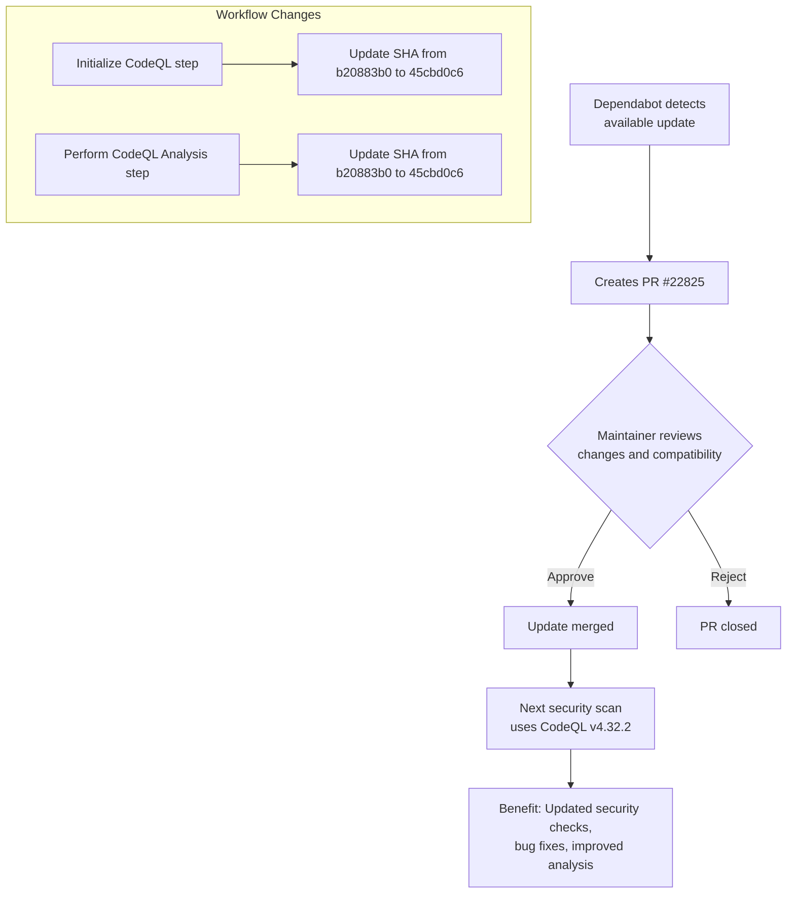

+++
title = "#22825 Bump github/codeql-action from 4.32.0 to 4.32.2"
date = "2026-02-06T00:00:00"
draft = false
template = "pull_request_page.html"
in_search_index = true

[taxonomies]
list_display = ["show"]

[extra]
current_language = "en"
available_languages = {"en" = { name = "English", url = "/pull_request/bevy/2026-02/pr-22825-en-20260206" }, "zh-cn" = { name = "中文", url = "/pull_request/bevy/2026-02/pr-22825-zh-cn-20260206" }}
labels = ["C-Dependencies"]
+++

# Title

## Basic Information
- **Title**: Bump github/codeql-action from 4.32.0 to 4.32.2
- **PR Link**: https://github.com/bevyengine/bevy/pull/22825
- **Author**: app/dependabot
- **Status**: MERGED
- **Labels**: C-Dependencies
- **Created**: 2026-02-06T06:53:00Z
- **Merged**: 2026-02-06T08:04:48Z
- **Merged By**: mockersf

## Description Translation
Bumps [github/codeql-action](https://github.com/github/codeql-action) from 4.32.0 to 4.32.2.
<details>
<summary>Release notes</summary>
<p><em>Sourced from <a href="https://github.com/github/codeql-action/releases">github/codeql-action's releases</a>.</em></p>
<blockquote>
<h2>v4.32.2</h2>
<ul>
<li>Update default CodeQL bundle version to <a href="https://github.com/github/codeql-action/releases/tag/codeql-bundle-v2.24.1">2.24.1</a>. <a href="https://redirect.github.com/github/codeql-action/pull/3460">#3460</a></li>
</ul>
<h2>v4.32.1</h2>
<ul>
<li>A warning is now shown in Default Setup workflow logs if a <a href="https://docs.github.com/en/code-security/how-tos/secure-at-scale/configure-organization-security/manage-usage-and-access/giving-org-access-private-registries">private package registry is configured</a> using a GitHub Personal Access Token (PAT), but no username is configured. <a href="https://redirect.github.com/github/codeql-action/pull/3422">#3422</a></li>
<li>Fixed a bug which caused the CodeQL Action to fail when repository properties cannot successfully be retrieved. <a href="https://redirect.github.com/github/codeql-action/pull/3421">#3421</a></li>
</ul>
</blockquote>
</details>
<details>
<summary>Changelog</summary>
<p><em>Sourced from <a href="https://github.com/github/codeql-action/blob/main/CHANGELOG.md">github/codeql-action's changelog</a>.</em></p>
<blockquote>
<h1>CodeQL Action Changelog</h1>
<p>See the <a href="https://github.com/github/codeql-action/releases">releases page</a> for the relevant changes to the CodeQL CLI and language packs.</p>
<h2>[UNRELEASED]</h2>
<ul>
<li>Update default CodeQL bundle version to <a href="https://github.com/github/codeql-action/releases/tag/codeql-bundle-v2.24.1">2.24.1</a>. <a href="https://redirect.github.com/github/codeql-action/pull/3460">#3460</a></li>
</ul>
<h2>4.32.1 - 02 Feb 2026</h2>
<ul>
<li>A warning is now shown in Default Setup workflow logs if a <a href="https://docs.github.com/en/code-security/how-tos/secure-at-scale/configure-organization-security/manage-usage-and-access/giving-org-access-private-registries">private package registry is configured</a> using a GitHub Personal Access Token (PAT), but no username is configured. <a href="https://redirect.github.com/github/codeql-action/pull/3422">#3422</a></li>
<li>Fixed a bug which caused the CodeQL Action to fail when repository properties cannot successfully be retrieved. <a href="https://redirect.github.com/github/codeql-action/pull/3421">#3421</a></li>
</ul>
<h2>4.32.0 - 26 Jan 2026</h2>
<ul>
<li>Update default CodeQL bundle version to <a href="https://github.com/github/codeql-action/releases/tag/codeql-bundle-v2.24.0">2.24.0</a>. <a href="https://redirect.github.com/github/codeql-action/pull/3425">#3425</a></li>
</ul>
<h2>4.31.11 - 23 Jan 2026</h2>
<ul>
<li>When running a Default Setup workflow with <a href="https://docs.github.com/en/actions/how-tos/monitor-workflows/enable-debug-logging">Actions debugging enabled</a>, the CodeQL Action will now use more unique names when uploading logs from the Dependabot authentication proxy as workflow artifacts. This ensures that the artifact names do not clash between multiple jobs in a build matrix. <a href="https://redirect.github.com/github/codeql-action/pull/3409">#3409</a></li>
<li>Improved error handling throughout the CodeQL Action. <a href="https://redirect.github.com/github/codeql-action/pull/3415">#3415</a></li>
<li>Added experimental support for automatically excluding <a href="https://docs.github.com/en/repositories/working-with-files/managing-files/customizing-how-changed-files-appear-on-github">generated files</a> from the analysis. This feature is not currently enabled for any analysis. In the future, it may be enabled by default for some GitHub-managed analyses. <a href="https://redirect.github.com/github/codeql-action/pull/3318">#3318</a></li>
<li>The changelog extracts that are included with releases of the CodeQL Action are now shorter to avoid duplicated information from appearing in Dependabot PRs. <a href="https://redirect.github.com/github/codeql-action/pull/3403">#3403</a></li>
</ul>
<h2>4.31.10 - 12 Jan 2026</h2>
<ul>
<li>Update default CodeQL bundle version to 2.23.9. <a href="https://redirect.github.com/github/codeql-action/pull/3393">#3393</a></li>
</ul>
<h2>4.31.9 - 16 Dec 2025</h2>
<p>No user facing changes.</p>
<h2>4.31.8 - 11 Dec 2025</h2>
<ul>
<li>Update default CodeQL bundle version to 2.23.8. <a href="https://redirect.github.com/github/codeql-action/pull/3354">#3354</a></li>
</ul>
<h2>4.31.7 - 05 Dec 2025</h2>
<ul>
<li>Update default CodeQL bundle version to 2.23.7. <a href="https://redirect.github.com/github/codeql-action/pull/3343">#3343</a></li>
</ul>
<h2>4.31.6 - 01 Dec 2025</h2>
<p>No user facing changes.</p>
<h2>4.31.5 - 24 Nov 2025</h2>
<ul>
<li>Update default CodeQL bundle version to 2.23.6. <a href="https://redirect.github.com/github/codeql-action/pull/3321">#3321</a></li>
</ul>
<h2>4.31.4 - 18 Nov 2025</h2>
<!-- raw HTML omitted -->
</blockquote>
<p>... (truncated)</p>
</details>
<details>
<summary>Commits</summary>
<ul>
<li><a href="https://github.com/github/codeql-action/commit/45cbd0c69e560cd9e7cd7f8c32362050c9b7ded2"><code>45cbd0c</code></a> Merge pull request <a href="https://redirect.github.com/github/codeql-action/issues/3461">#3461</a> from github/update-v4.32.2-7aee93297</li>
<li><a href="https://github.com/github/codeql-action/commit/cb528be87e3c4226fe0ead29ee5db74127e37ab6"><code>cb528be</code></a> Update changelog for v4.32.2</li>
<li><a href="https://github.com/github/codeql-action/commit/7aee93297421a430700f5e81fe681dbc80a0b4f5"><code>7aee932</code></a> Merge pull request <a href="https://redirect.github.com/github/codeql-action/issues/3460">#3460</a> from github/update-bundle/codeql-bundle-v2.24.1</li>
<li><a href="https://github.com/github/codeql-action/commit/b5f028a984d0af20ea8c4c53f3953cb18bc142c4"><code>b5f028a</code></a> Merge pull request <a href="https://redirect.github.com/github/codeql-action/issues/3457">#3457</a> from github/dependabot/npm_and_yarn/npm-minor-4c1fc3...</li>
<li><a href="https://github.com/github/codeql-action/commit/9702c27ab946a10a0159e2fe3126cb6605c10c8b"><code>9702c27</code></a> Merge branch 'main' into dependabot/npm_and_yarn/npm-minor-4c1fc3d0aa</li>
<li><a href="https://github.com/github/codeql-action/commit/c36c94846f3257550e884e42a408299a64969407"><code>c36c948</code></a> Add changelog note</li>
<li><a href="https://github.com/github/codeql-action/commit/3d0331896c48048637b250518c70ba3138feb437"><code>3d03318</code></a> Update default bundle to codeql-bundle-v2.24.1</li>
<li><a href="https://github.com/github/codeql-action/commit/77591e2c4a43bf190ac768983419eb058187e62f"><code>77591e2</code></a> Merge pull request <a href="https://redirect.github.com/github/codeql-action/issues/3459">#3459</a> from github/copilot/fix-github-actions-workflow-again</li>
<li><a href="https://github.com/github/codeql-action/commit/7a44a9db3f773e2d0f40146c102d01a56721526d"><code>7a44a9d</code></a> Fix Rebuild Action workflow by adding --no-edit flag to git merge --continue</li>
<li><a href="https://github.com/github/codeql-action/commit/e2ac371513fc4422230ee97deafd8392a45d7f0d"><code>e2ac371</code></a> Initial plan</li>
<li>Additional commits viewable in <a href="https://github.com/github/codeql-action/compare/b20883b0cd1f46c72ae0ba6d1090936928f9fa30...45cbd0c69e560cd9e7cd7f8c32362050c9b7ded2">compare view</a></li>
</ul>
</details>
<br />


[](https://docs.github.com/en/github/managing-security-vulnerabilities/about-dependabot-security-updates#about-compatibility-scores)

Dependabot will resolve any conflicts with this PR as long as you don't alter it yourself. You can also trigger a rebase manually by commenting `@dependabot rebase`.

[//]: # (dependabot-automerge-start)
[//]: # (dependabot-automerge-end)

---

<details>
<summary>Dependabot commands and options</summary>
<br />

You can trigger Dependabot actions by commenting on this PR:
- `@dependabot rebase` will rebase this PR
- `@dependabot recreate` will recreate this PR, overwriting any edits that have been made to it
- `@dependabot show <dependency name> ignore conditions` will show all of the ignore conditions of the specified dependency
- `@dependabot ignore this major version` will close this PR and stop Dependabot creating any more for this major version (unless you reopen the PR or upgrade to it yourself)
- `@dependabot ignore this minor version` will close this PR and stop Dependabot creating any more for this minor version (unless you reopen the PR or upgrade to it yourself)
- `@dependabot ignore this dependency` will close this PR and stop Dependabot creating any more for this dependency (unless you reopen the PR or upgrade to it yourself)


</details>

## The Story of This Pull Request

This PR is a straightforward dependency update for the Bevy Engine's GitHub Actions workflow. Dependabot, GitHub's automated dependency management tool, detected that the `github/codeql-action` used in the repository's security static analysis workflow could be updated from version 4.32.0 to 4.32.2 and automatically generated this pull request.

The problem being addressed is keeping security tooling up-to-date. In software development, especially for security scanning tools, staying current with the latest versions is critical because updates often include new security checks, bug fixes, and improvements to analysis accuracy. Outdated security tools might miss newly discovered vulnerabilities or produce false positives that have been addressed in later versions. However, blindly updating dependencies without review can also introduce breaking changes or compatibility issues, which is why these updates are presented as PRs for human review rather than automatically merged.

The solution approach is simple: update the version reference in two places in the workflow file. The engineering decision here follows standard practice for GitHub Actions - using pinned versions with specific commit SHAs rather than floating tags to ensure reproducibility and avoid unexpected changes. When updating, the maintainer changes both the SHA reference and adds a comment with the new version number for clarity.

Looking at the implementation, there are only two changes in a single file. Both changes follow the same pattern: updating the SHA reference for the `github/codeql-action` from the previous version's commit SHA to the new version's commit SHA. This ensures that the workflow uses the exact version 4.32.2 of the CodeQL action. The version update brings several improvements based on the release notes, most notably updating the underlying CodeQL bundle to version 2.24.1, which likely includes updated query packs and analysis capabilities.

From a technical perspective, this update demonstrates several important practices. First, the use of Dependabot for dependency management in GitHub Actions workflows ensures that security tools remain current without requiring manual monitoring. Second, the PR shows the value of automated dependency updates in maintaining security posture. Third, the approach of using commit SHAs rather than version tags provides deterministic builds and prevents "version drift" where different runs might use different minor versions if tags aren't pinned.

The impact of these changes is primarily in the security analysis domain. The Bevy project benefits from the latest CodeQL capabilities, including potentially improved analysis accuracy, new security checks, and bug fixes from the two patch releases (4.32.1 and 4.32.2). Specifically, version 4.32.1 fixed a bug where the CodeQL Action would fail when repository properties couldn't be retrieved, which could prevent workflow failures in edge cases. The update also includes a warning system for private package registry configuration issues, which helps developers identify misconfigurations earlier.

This PR serves as a good example of routine maintenance in a modern software project. It shows how automated tooling like Dependabot can handle dependency updates efficiently, allowing developers to focus on more complex tasks while still maintaining control over when and how dependencies are updated. The quick merge (approximately 1 hour after creation) suggests that the update was considered safe and beneficial, likely due to the patch-level nature of the changes and the high compatibility score shown in the PR description.

## Visual Representation



## Key Files Changed

### `.github/workflows/security-static-analysis.yml` (+2/-2)

This is the only file changed in this PR. It contains the GitHub Actions workflow for running CodeQL static analysis on the Bevy codebase. The workflow is part of the project's security scanning strategy, running automated code analysis to identify potential security vulnerabilities.

**What changed**: Updated the version of the `github/codeql-action` from 4.32.0 to 4.32.2 in two places where the action is invoked.

**Code changes**:

```yaml
# File: .github/workflows/security-static-analysis.yml
# Before (line 45):
-        uses: github/codeql-action/init@b20883b0cd1f46c72ae0ba6d1090936928f9fa30 # v4.32.0

# After:
+        uses: github/codeql-action/init@45cbd0c69e560cd9e7cd7f8c32362050c9b7ded2 # v4.32.2
```

```yaml
# File: .github/workflows/security-static-analysis.yml
# Before (line 73):
-        uses: github/codeql-action/analyze@b20883b0cd1f46c72ae0ba6d1090936928f9fa30 # v4.32.0

# After:
+        uses: github/codeql-action/analyze@45cbd0c69e560cd9e7cd7f8c32362050c9b7ded2 # v4.32.2
```

**Why these changes were made**: The updates ensure that Bevy's security scanning uses the latest version of the CodeQL action, which includes bug fixes and updates to the underlying CodeQL analysis engine. The changes affect both the initialization and analysis phases of the CodeQL workflow, ensuring consistency throughout the security scanning process.

**Relationship to overall PR purpose**: These are the only changes needed to update the CodeQL action version. Both changes are required because the workflow uses the action in two separate steps: one to initialize the CodeQL tools and another to perform the actual analysis.

## Further Reading

1. [GitHub CodeQL Documentation](https://docs.github.com/en/code-security/code-scanning/introduction-to-code-scanning/about-code-scanning-with-codeql) - Official documentation on using CodeQL for code scanning
2. [GitHub Actions Workflow Syntax](https://docs.github.com/en/actions/using-workflows/workflow-syntax-for-github-actions) - Reference for GitHub Actions workflow files
3. [Dependabot Documentation](https://docs.github.com/en/code-security/dependabot) - How to configure and use Dependabot for dependency updates
4. [CodeQL Action Repository](https://github.com/github/codeql-action) - Source code and releases for the CodeQL GitHub Action
5. [Semantic Versioning](https://semver.org/) - Understanding version numbers and what patch updates (like 4.32.0 to 4.32.2) typically include

# Full Code Diff
diff --git a/.github/workflows/security-static-analysis.yml b/.github/workflows/security-static-analysis.yml
index ce609e4c5ff35..0f3d6fde3603c 100644
--- a/.github/workflows/security-static-analysis.yml
+++ b/.github/workflows/security-static-analysis.yml
@@ -42,7 +42,7 @@ jobs:
 
       # Initializes the CodeQL tools for scanning.
       - name: Initialize CodeQL
-        uses: github/codeql-action/init@b20883b0cd1f46c72ae0ba6d1090936928f9fa30 # v4.32.0
+        uses: github/codeql-action/init@45cbd0c69e560cd9e7cd7f8c32362050c9b7ded2 # v4.32.2
         with:
           languages: ${{ matrix.language }}
           build-mode: ${{ matrix.build-mode }}
@@ -70,7 +70,7 @@ jobs:
           exit 1
 
       - name: Perform CodeQL Analysis
-        uses: github/codeql-action/analyze@b20883b0cd1f46c72ae0ba6d1090936928f9fa30 # v4.32.0
+        uses: github/codeql-action/analyze@45cbd0c69e560cd9e7cd7f8c32362050c9b7ded2 # v4.32.2
         with:
           category: "/language:${{matrix.language}}"