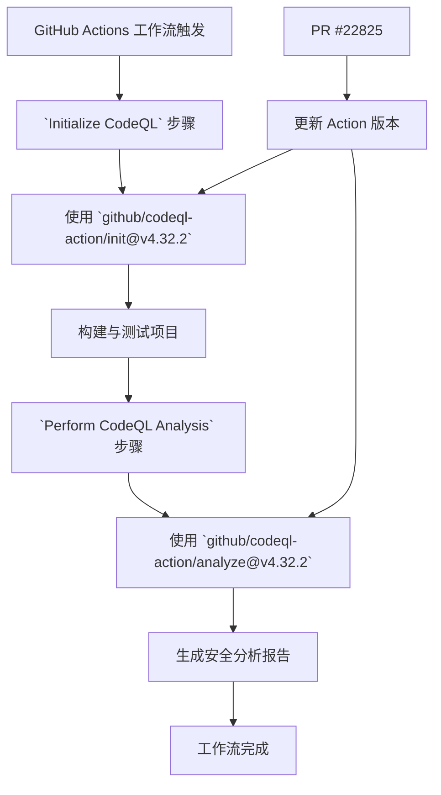

+++
title = "#22825 Bump github/codeql-action from 4.32.0 to 4.32.2"
date = "2026-02-06T00:00:00"
draft = false
template = "pull_request_page.html"
in_search_index = false

[extra]
current_language = "zh-cn"
available_languages = {"en" = { name = "English", url = "/pull_request/bevy/2026-02/pr-22825-en-20260206" }, "zh-cn" = { name = "中文", url = "/pull_request/bevy/2026-02/pr-22825-zh-cn-20260206" }}
+++

# Bump github/codeql-action from 4.32.0 to 4.32.2

## 基本信息
- **标题**: Bump github/codeql-action from 4.32.0 to 4.32.2
- **PR 链接**: https://github.com/bevyengine/bevy/pull/22825
- **作者**: app/dependabot
- **状态**: 已合并
- **标签**: C-Dependencies
- **创建时间**: 2026-02-06T06:53:00Z
- **合并时间**: 2026-02-06T08:04:48Z
- **合并者**: mockersf

## 描述翻译
将 [github/codeql-action](https://github.com/github/codeql-action) 从 4.32.0 升级到 4.32.2。
<details>
<summary>版本说明</summary>
<p><em>源自 <a href="https://github.com/github/codeql-action/releases">github/codeql-action 的版本发布</a>。</em></p>
<blockquote>
<h2>v4.32.2</h2>
<ul>
<li>将默认的 CodeQL 包版本更新至 <a href="https://github.com/github/codeql-action/releases/tag/codeql-bundle-v2.24.1">2.24.1</a>。<a href="https://redirect.github.com/github/codeql-action/pull/3460">#3460</a></li>
</ul>
<h2>v4.32.1</h2>
<ul>
<li>现在，如果在默认设置工作流日志中配置了使用 GitHub 个人访问令牌（PAT）的<a href="https://docs.github.com/en/code-security/how-tos/secure-at-scale/configure-organization-security/manage-usage-and-access/giving-org-access-private-registries">私有包注册表</a>但未配置用户名，将会显示警告。<a href="https://redirect.github.com/github/codeql-action/pull/3422">#3422</a></li>
<li>修复了一个在无法成功检索仓库属性时导致 CodeQL Action 失败的bug。<a href="https://redirect.github.com/github/codeql-action/pull/3421">#3421</a></li>
</ul>
</blockquote>
</details>
<details>
<summary>更新日志</summary>
<p><em>源自 <a href="https://github.com/github/codeql-action/blob/main/CHANGELOG.md">github/codeql-action 的更新日志</a>。</em></p>
<blockquote>
<h1>CodeQL Action 更新日志</h1>
<p>有关 CodeQL CLI 和语言包的相应更改，请参见<a href="https://github.com/github/codeql-action/releases">版本发布页面</a>。</p>
<h2>[未发布]</h2>
<ul>
<li>将默认的 CodeQL 包版本更新至 <a href="https://github.com/github/codeql-action/releases/tag/codeql-bundle-v2.24.1">2.24.1</a>。<a href="https://redirect.github.com/github/codeql-action/pull/3460">#3460</a></li>
</ul>
<h2>4.32.1 - 2026年02月02日</h2>
<ul>
<li>现在，如果在默认设置工作流日志中配置了使用 GitHub 个人访问令牌（PAT）的<a href="https://docs.github.com/en/code-security/how-tos/secure-at-scale/configure-organization-security/manage-usage-and-access/giving-org-access-private-registries">私有包注册表</a>但未配置用户名，将会显示警告。<a href="https://redirect.github.com/github/codeql-action/pull/3422">#3422</a></li>
<li>修复了一个在无法成功检索仓库属性时导致 CodeQL Action 失败的bug。<a href="https://redirect.github.com/github/codeql-action/pull/3421">#3421</a></li>
</ul>
<h2>4.32.0 - 2026年01月26日</h2>
<ul>
<li>将默认的 CodeQL 包版本更新至 <a href="https://github.com/github/codeql-action/releases/tag/codeql-bundle-v2.24.0">2.24.0</a>。<a href="https://redirect.github.com/github/codeql-action/pull/3425">#3425</a></li>
</ul>
<h2>4.31.11 - 2026年01月23日</h2>
<ul>
<li>当使用<a href="https://docs.github.com/en/actions/how-tos/monitor-workflows/enable-debug-logging">启用的 Actions 调试</a>运行默认设置工作流时，CodeQL Action 现在将在从 Dependabot 身份验证代理上传日志作为工作流构件时使用更独特的名称。这确保了构件名称在构建矩阵中的多个作业之间不会冲突。<a href="https://redirect.github.com/github/codeql-action/pull/3409">#3409</a></li>
<li>改进了整个 CodeQL Action 中的错误处理。<a href="https://redirect.github.com/github/codeql-action/pull/3415">#3415</a></li>
<li>添加了对自动从分析中排除<a href="https://docs.github.com/en/repositories/working-with-files/managing-files/customizing-how-changed-files-appear-on-github">生成的文件</a>的实验性支持。此功能当前未为任何分析启用。未来，可能会为某些 GitHub 管理的分析默认启用它。<a href="https://redirect.github.com/github/codeql-action/pull/3318">#3318</a></li>
<li>随 CodeQL Action 版本发布的更新日志摘要现在更短，以避免重复信息出现在 Dependabot PR 中。<a href="https://redirect.github.com/github/codeql-action/pull/3403">#3403</a></li>
</ul>
<h2>4.31.10 - 2026年01月12日</h2>
<ul>
<li>将默认的 CodeQL 包版本更新至 2.23.9。<a href="https://redirect.github.com/github/codeql-action/pull/3393">#3393</a></li>
</ul>
<h2>4.31.9 - 2025年12月16日</h2>
<p>没有面向用户的更改。</p>
<h2>4.31.8 - 2025年12月11日</h2>
<ul>
<li>将默认的 CodeQL 包版本更新至 2.23.8。<a href="https://redirect.github.com/github/codeql-action/pull/3354">#3354</a></li>
</ul>
<h2>4.31.7 - 2025年12月05日</h2>
<ul>
<li>将默认的 CodeQL 包版本更新至 2.23.7。<a href="https://redirect.github.com/github/codeql-action/pull/3343">#3343</a></li>
</ul>
<h2>4.31.6 - 2025年12月01日</h2>
<p>没有面向用户的更改。</p>
<h2>4.31.5 - 2025年11月24日</h2>
<ul>
<li>将默认的 CodeQL 包版本更新至 2.23.6。<a href="https://redirect.github.com/github/codeql-action/pull/3321">#3321</a></li>
</ul>
<h2>4.31.4 - 2025年11月18日</h2>
<!-- raw HTML omitted -->
</blockquote>
<p>...（已截断）</p>
</details>
<details>
<summary>提交记录</summary>
<ul>
<li><a href="https://github.com/github/codeql-action/commit/45cbd0c69e560cd9e7cd7f8c32362050c9b7ded2"><code>45cbd0c</code></a> Merge pull request <a href="https://redirect.github.com/github/codeql-action/issues/3461">#3461</a> from github/update-v4.32.2-7aee93297</li>
<li><a href="https://github.com/github/codeql-action/commit/cb528be87e3c4226fe0ead29ee5db74127e37ab6"><code>cb528be</code></a> Update changelog for v4.32.2</li>
<li><a href="https://github.com/github/codeql-action/commit/7aee93297421a430700f5e81fe681dbc80a0b4f5"><code>7aee932</code></a> Merge pull request <a href="https://redirect.github.com/github/codeql-action/issues/3460">#3460</a> from github/update-bundle/codeql-bundle-v2.24.1</li>
<li><a href="https://github.com/github/codeql-action/commit/b5f028a984d0af20ea8c4c53f3953cb18bc142c4"><code>b5f028a</code></a> Merge pull request <a href="https://redirect.github.com/github/codeql-action/issues/3457">#3457</a> from github/dependabot/npm_and_yarn/npm-minor-4c1fc3...</li>
<li><a href="https://github.com/github/codeql-action/commit/9702c27ab946a10a0159e2fe3126cb6605c10c8b"><code>9702c27</code></a> Merge branch 'main' into dependabot/npm_and_yarn/npm-minor-4c1fc3d0aa</li>
<li><a href="https://github.com/github/codeql-action/commit/c36c94846f3257550e884e42a408299a64969407"><code>c36c948</code></a> Add changelog note</li>
<li><a href="https://github.com/github/codeql-action/commit/3d0331896c48048637b250518c70ba3138feb437"><code>3d03318</code></a> Update default bundle to codeql-bundle-v2.24.1</li>
<li><a href="https://github.com/github/codeql-action/commit/77591e2c4a43bf190ac768983419eb058187e62f"><code>77591e2</code></a> Merge pull request <a href="https://redirect.github.com/github/codeql-action/issues/3459">#3459</a> from github/copilot/fix-github-actions-workflow-again</li>
<li><a href="https://github.com/github/codeql-action/commit/7a44a9db3f773e2d0f40146c102d01a56721526d"><code>7a44a9d</code></a> Fix Rebuild Action workflow by adding --no-edit flag to git merge --continue</li>
<li><a href="https://github.com/github/codeql-action/commit/e2ac371513fc4422230ee97deafd8392a45d7f0d"><code>e2ac371</code></a> Initial plan</li>
<li>其他提交可在 <a href="https://github.com/github/codeql-action/compare/b20883b0cd1f46c72ae0ba6d1090936928f9fa30...45cbd0c69e560cd9e7cd7f8c32362050c9b7ded2">比较视图</a> 中查看</li>
</ul>
</details>
<br />


[](https://docs.github.com/en/github/managing-security-vulnerabilities/about-dependabot-security-updates#about-compatibility-scores)

只要你不自行修改此 PR，Dependabot 将解决所有冲突。你还可以通过评论 `@dependabot rebase` 手动触发 rebase。

[//]: # (dependabot-automerge-start)
[//]: # (dependabot-automerge-end)

---

<details>
<summary>Dependabot 命令和选项</summary>
<br />

你可以通过评论此 PR 来触发 Dependabot 操作：
- `@dependabot rebase` 将 rebase 此 PR
- `@dependabot recreate` 将重新创建此 PR，覆盖已对其进行的任何编辑
- `@dependabot show <dependency name> ignore conditions` 将显示指定依赖项的所有忽略条件
- `@dependabot ignore this major version` 将关闭此 PR 并停止 Dependabot 为此主要版本创建更多 PR（除非你重新打开 PR 或自行升级）
- `@dependabot ignore this minor version` 将关闭此 PR 并停止 Dependabot 为此次要版本创建更多 PR（除非你重新打开 PR 或自行升级）
- `@dependabot ignore this dependency` 将关闭此 PR 并停止 Dependabot 为此依赖项创建更多 PR（除非你重新打开 PR 或自行升级）


</details>

## 本次 Pull Request 的故事

在软件工程实践中，保持依赖项的最新状态是一项关键的维护任务。这不仅关乎获取最新的功能，更重要的是集成安全修复、性能改进和错误修正。PR #22825 就是这样一个由自动化工具 Dependabot 创建的维护性 PR，其唯一目的是将项目中的 `github/codeql-action` 从版本 4.32.0 升级到 4.32.2。

这个 PR 的上下文是 Bevy 游戏引擎的持续集成/持续部署（CI/CD）流水线。具体来说，它修改的是位于 `.github/workflows/security-static-analysis.yml` 的 GitHub Actions 工作流文件。这个工作流负责运行 CodeQL 分析，这是一种用于在代码中识别安全漏洞和编码错误的静态应用程序安全测试（SAST）工具。保持这个 Action 的更新，意味着 Bevy 项目能够利用 CodeQL 引擎最新的检测规则和性能优化，从而更有效地发现潜在的安全问题。

从技术角度看，这个 PR 的实现极其简单直接。它只修改了两行代码，每行对应 CodeQL 工作流中的一个步骤。第一个步骤是 `Initialize CodeQL`，它负责初始化扫描工具；第二个步骤是 `Perform CodeQL Analysis`，它执行实际的分析。在 GitHub Actions 中，`uses` 关键字用于指定要运行的 Action 及其版本。PR 所做的就是将这两个步骤中引用的特定提交哈希（SHA）从 `b20883b0cd1f46c72ae0ba6d1090936928f9fa30`（对应 v4.32.0）更新为 `45cbd0c69e560cd9e7cd7f8c32362050c9b7ded2`（对应 v4.32.2）。使用完整的提交哈希而非标签名是一种更精确的引用方式，可以确保每次运行都使用完全相同的 Action 版本，避免因标签被移动而导致的不确定性。

那么，这次升级具体带来了什么？根据 PR 描述中引用的版本说明，v4.32.2 的主要变更是将默认的 CodeQL 包（bundle）版本更新到了 2.24.1。这个 bundle 包含了 CodeQL 命令行工具、查询库和编译器，是执行分析的核心引擎。而更早的 v4.32.1 版本则包含两个重要更新：首先，它修复了一个在无法成功检索仓库属性时导致 Action 失败的 bug，这直接提高了工作流的健壮性；其次，它增加了一个针对私有包注册表配置错误的警告功能，这有助于开发者更早地发现和修正 CI/CD 环境配置问题。

这个 PR 的合并过程也非常典型。它由 Dependabot 自动创建，在短暂停留后由维护者 `mockersf` 合并。标签 `C-Dependencies` 清晰地表明了其性质。整个过程中没有引发任何代码冲突，这得益于依赖更新的目标单一性。通过合并这个 PR，Bevy 项目在无需人工深入审查每个变更细节的情况下，就自动将其代码安全扫描基础设施保持在了最新状态。这体现了现代软件工程中自动化依赖管理的效率和价值：它让开发者能够将精力集中于核心业务逻辑，同时通过工具确保基础构件的健康和安全。

## 可视化表示



## 关键文件变更

### `.github/workflows/security-static-analysis.yml`
1.  **变更描述及原因**：此文件定义了用于静态安全分析的 GitHub Actions 工作流。PR 更新了其中两个步骤所使用的 `github/codeql-action` 版本，从 4.32.0 升级到 4.32.2。目的是集成该 Action 的最新错误修复和功能更新，确保安全扫描的可靠性和先进性。
2.  **关键代码修改**：
    ```diff
    diff --git a/.github/workflows/security-static-analysis.yml b/.github/workflows/security-static-analysis.yml
    index ce609e4c5ff35..0f3d6fde3603c 100644
    --- a/.github/workflows/security-static-analysis.yml
    +++ b/.github/workflows/security-static-analysis.yml
    @@ -42,7 +42,7 @@ jobs:
     
           # Initializes the CodeQL tools for scanning.
           - name: Initialize CodeQL
    -        uses: github/codeql-action/init@b20883b0cd1f46c72ae0ba6d1090936928f9fa30 # v4.32.0
    +        uses: github/codeql-action/init@45cbd0c69e560cd9e7cd7f8c32362050c9b7ded2 # v4.32.2
             with:
               languages: ${{ matrix.language }}
               build-mode: ${{ matrix.build-mode }}
    @@ -70,7 +70,7 @@ jobs:
               exit 1
     
           - name: Perform CodeQL Analysis
    -        uses: github/codeql-action/analyze@b20883b0cd1f46c72ae0ba6d1090936928f9fa30 # v4.32.0
    +        uses: github/codeql-action/analyze@45cbd0c69e560cd9e7cd7f8c32362050c9b7ded2 # v4.32.2
             with:
               category: "/language:${{matrix.language}}"
    ```
3.  **与 PR 整体目的的关联**：这两处修改是本次 PR 的全部内容，直接实现了将 CodeQL 安全扫描工具升级到指定版本的目标。

## 完整代码差异
diff --git a/.github/workflows/security-static-analysis.yml b/.github/workflows/security-static-analysis.yml
index ce609e4c5ff35..0f3d6fde3603c 100644
--- a/.github/workflows/security-static-analysis.yml
+++ b/.github/workflows/security-static-analysis.yml
@@ -42,7 +42,7 @@ jobs:
 
       # Initializes the CodeQL tools for scanning.
       - name: Initialize CodeQL
-        uses: github/codeql-action/init@b20883b0cd1f46c72ae0ba6d1090936928f9fa30 # v4.32.0
+        uses: github/codeql-action/init@45cbd0c69e560cd9e7cd7f8c32362050c9b7ded2 # v4.32.2
         with:
           languages: ${{ matrix.language }}
           build-mode: ${{ matrix.build-mode }}
@@ -70,7 +70,7 @@ jobs:
           exit 1
 
       - name: Perform CodeQL Analysis
-        uses: github/codeql-action/analyze@b20883b0cd1f46c72ae0ba6d1090936928f9fa30 # v4.32.0
+        uses: github/codeql-action/analyze@45cbd0c69e560cd9e7cd7f8c32362050c9b7ded2 # v4.32.2
         with:
           category: "/language:${{matrix.language}}"


## 扩展阅读
*   **GitHub CodeQL 文档**: [CodeQL 入门](https://docs.github.com/en/code-security/codeql-cli/getting-started-with-the-codeql-cli) - 了解 CodeQL 查询语言和 CLI 工具的基础知识。
*   **GitHub Actions 官方指南**: [GitHub Actions 的工作流程语法](https://docs.github.com/en/actions/using-workflows/workflow-syntax-for-github-actions) - 深入理解 `uses`、`with` 等关键字段的用法。
*   **Dependabot 文档**: [关于 Dependabot 版本更新](https://docs.github.com/en/code-security/dependabot/dependabot-version-updates/about-dependabot-version-updates) - 了解如何配置和维护 Dependabot 以自动化依赖管理。
*   **静态应用程序安全测试 (SAST)**: [OWASP SAST 介绍](https://owasp.org/www-community/Source_Code_Analysis_Tools) - 了解 SAST 在安全开发生命周期中的角色。