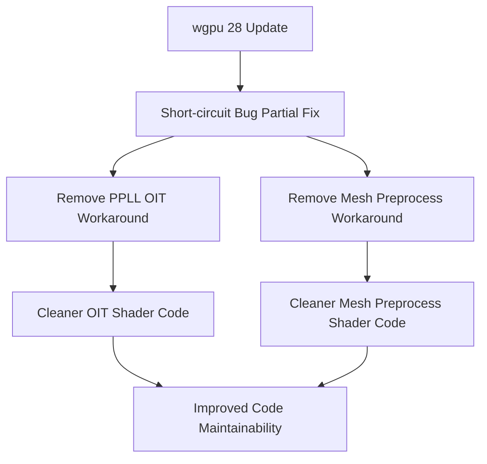

+++
title = "#22827 Remove short circuit logic workaround"
date = "2026-02-07T00:00:00"
draft = false
template = "pull_request_page.html"
in_search_index = true

[taxonomies]
list_display = ["show"]

[extra]
current_language = "en"
available_languages = {"en" = { name = "English", url = "/pull_request/bevy/2026-02/pr-22827-en-20260207" }, "zh-cn" = { name = "中文", url = "/pull_request/bevy/2026-02/pr-22827-zh-cn-20260207" }}
labels = ["A-Rendering", "C-Code-Quality", "D-Straightforward"]
+++

# Remove short circuit logic workaround

## Basic Information
- **Title**: Remove short circuit logic workaround
- **PR Link**: https://github.com/bevyengine/bevy/pull/22827
- **Author**: goodartistscopy
- **Status**: MERGED
- **Labels**: A-Rendering, C-Code-Quality, S-Ready-For-Final-Review, D-Straightforward
- **Created**: 2026-02-06T14:17:07Z
- **Merged**: 2026-02-07T00:30:15Z
- **Merged By**: alice-i-cecile

## Description Translation

wgpu 28 brought a partial resolution of https://github.com/gfx-rs/wgpu/issues/4394, which means we can now use proper short-circuiting logic in control statements.

I found two instances, but if anyone knows about other ones let me know
* in the PPLL OIT implementation
* in the GPU mesh preprocessing

## Testing

Launched the relevant samples to validate that they still work

## The Story of This Pull Request

This PR addresses a specific technical limitation that existed in Bevy's shader code due to a bug in the underlying graphics API implementation. The issue stemmed from a known problem in wgpu (WebGPU implementation in Rust) where short-circuit evaluation in control flow statements didn't work correctly in WGSL shaders. Short-circuit evaluation is the programming language feature where logical operators like `&&` (AND) and `||` (OR) stop evaluating expressions as soon as the result is determined.

Before wgpu version 28, developers couldn't use short-circuit logic in `for` loop conditions or complex conditional expressions. This forced Bevy contributors to implement workarounds in shader code. The workaround involved manually breaking out of loops or splitting complex conditions into separate `if-else` blocks to achieve the same behavior while avoiding the bug.

With wgpu 28's partial resolution of [gfx-rs/wgpu issue #4394](https://github.com/gfx-rs/wgpu/issues/4394), this limitation has been addressed. The PR author identified two instances where these workarounds were no longer necessary and removed them, simplifying the code and bringing it closer to standard WGSL patterns.

The first change affects the Order-Independent Transparency (OIT) implementation using Per-Pixel Linked Lists (PPLL). This technique requires sorting transparent fragments by depth to composite them correctly. The original code had a workaround in two `for` loops that performed insertion and removal operations on a sorted fragment list. Without short-circuit evaluation, the loop conditions couldn't include the comparison that determined when to stop iterating. Instead, the code had to check the condition inside the loop body and use a `break` statement to exit early.

The second change is in the GPU mesh preprocessing shader, which handles indirect rendering parameters. Here, a conditional check that combined two conditions with logical OR had to be split into separate `if` and `else if` blocks. This was necessary because the expression `(instance_index == 0u) || (work_items[instance_index - 1].output_or_indirect_parameters_index != indirect_parameters_index)` would potentially cause undefined behavior when `instance_index` was 0, as accessing `work_items[instance_index - 1]` would be out of bounds without short-circuit evaluation.

The removal of these workarounds makes the code cleaner, more maintainable, and easier to understand. It also potentially improves shader performance slightly by reducing the number of conditional branches and simplifying the control flow. Most importantly, it aligns the code with standard WGSL practices now that the underlying implementation supports the language feature correctly.

The changes are minimal and focused, affecting only the necessary parts of the shader code. The author tested the changes by launching relevant samples to ensure the functionality remained intact, which is a practical approach given that shader changes can be subtle and hard to test comprehensively.

This PR demonstrates a common pattern in graphics programming where workarounds for driver or API bugs become obsolete when the underlying issues are fixed. It's important for maintainers to track these dependencies and clean up technical debt when opportunities arise.

## Visual Representation



## Key Files Changed

### `crates/bevy_core_pipeline/src/oit/resolve/oit_resolve.wgsl`
**What changed**: Removed workarounds for short-circuit evaluation in two `for` loops in the OIT resolve shader.

**Before**:
```wgsl
for(; i > 0; i -= 1) {
    // short-circuit can't be used in for(;;;), https://github.com/gfx-rs/wgpu/issues/4394
    if fragment_node.depth_alpha > fragment_list[i - 1].depth_alpha {
        fragment_list[i] = fragment_list[i - 1];
    } else {
        break;
    }
}
```

**After**:
```wgsl
for (; i > 0 && fragment_node.depth_alpha > fragment_list[i - 1].depth_alpha; i -= 1) {
    fragment_list[i] = fragment_list[i - 1];
}
```

**Relation to PR**: This change leverages the newly available short-circuit evaluation in `for` loop conditions, simplifying the loop logic by moving the comparison into the loop condition itself.

### `crates/bevy_pbr/src/render/mesh_preprocess.wgsl`
**What changed**: Combined separate `if` and `else if` conditions into a single condition using logical OR.

**Before**:
```wgsl
// https://github.com/gfx-rs/wgpu/issues/4394
if (instance_index == 0u) {
    indirect_parameters_gpu_metadata[indirect_parameters_index].mesh_index = input_index;
} else if (work_items[instance_index - 1].output_or_indirect_parameters_index != indirect_parameters_index) {
    indirect_parameters_gpu_metadata[indirect_parameters_index].mesh_index = input_index;
}
```

**After**:
```wgsl
if (instance_index == 0u) || (work_items[instance_index - 1].output_or_indirect_parameters_index != indirect_parameters_index) {
    indirect_parameters_gpu_metadata[indirect_parameters_index].mesh_index = input_index;
}
```

**Relation to PR**: This change uses short-circuit evaluation to safely combine two conditions that share the same action, eliminating code duplication and making the intent clearer.

## Further Reading

1. [WGSL Specification - Control Flow](https://www.w3.org/TR/WGSL/#control-flow): Official WebGPU Shading Language specification covering control flow statements
2. [gfx-rs/wgpu Issue #4394](https://github.com/gfx-rs/wgpu/issues/4394): The original issue tracking the short-circuit evaluation bug in wgpu
3. [Order-Independent Transparency Techniques](https://jcgt.org/published/0002/02/09/): Research paper on various OIT methods including Per-Pixel Linked Lists
4. [Bevy Rendering Architecture](https://bevyengine.org/learn/book/rendering/): Official Bevy documentation on the rendering system
5. [WebGPU Shader Language (WGSL)](https://webgpufundamentals.org/webgpu/lessons/webgpu-shader-modules.html): Tutorial on WGSL shader programming