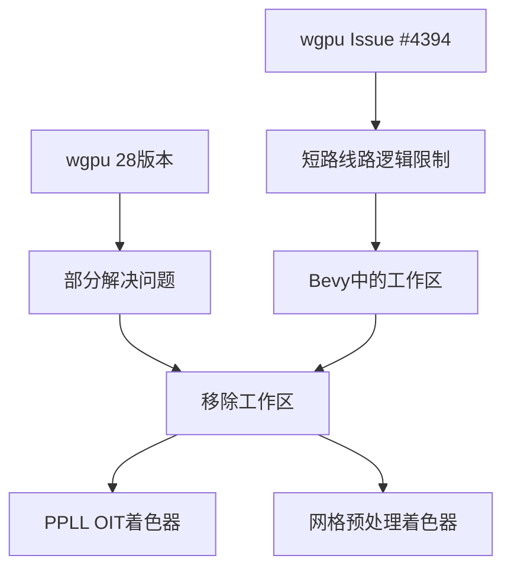

+++
title = "#22827 Remove short circuit logic workaround"
date = "2026-02-07T00:00:00"
draft = false
template = "pull_request_page.html"
in_search_index = false

[extra]
current_language = "zh-cn"
available_languages = {"en" = { name = "English", url = "/pull_request/bevy/2026-02/pr-22827-en-20260207" }, "zh-cn" = { name = "中文", url = "/pull_request/bevy/2026-02/pr-22827-zh-cn-20260207" }}
+++

# 移除短路线路逻辑的工作区修复

## 基本信息
- **标题**: Remove short circuit logic workaround
- **PR链接**: https://github.com/bevyengine/bevy/pull/22827
- **作者**: goodartistscopy
- **状态**: 已合并
- **标签**: A-Rendering, C-Code-Quality, S-Ready-For-Final-Review, D-Straightforward
- **创建时间**: 2026-02-06T14:17:07Z
- **合并时间**: 2026-02-07T00:30:15Z
- **合并者**: alice-i-cecile

## 描述翻译
wgpu 28版本部分解决了 https://github.com/gfx-rs/wgpu/issues/4394，这意味着我们现在可以在控制语句中使用正确的短路线路逻辑。

我找到了两个实例，但如果有人知道其他实例，请告诉我：
* 在PPLL OIT实现中
* 在GPU网格预处理中

## 测试
启动了相关示例以验证它们仍然正常工作

## 这个PR的故事

这个PR处理了一个特定的技术限制的后续清理工作。故事开始于wgpu图形API中的一个已知问题，该问题影响了WGSL着色器语言中短路线路（short-circuit）逻辑的正确使用。

在wgpu 28版本之前，由于issue #4394的存在，开发者在WGSL的for循环条件中无法安全使用短路线路逻辑。短路线路是指在布尔表达式中，当第一个操作数已经能够确定整个表达式的结果时，就不再计算第二个操作数。例如在`a && b`中，如果a为false，就不会计算b。

由于这个限制，Bevy代码库中的WGSL着色器在需要使用短路线路的场景中采用了变通方案。这些变通方案虽然功能正确，但代码不够直观，增加了维护的复杂性。

随着wgpu 28版本部分解决了这个问题，现在可以移除这些变通方案，恢复到更自然、更符合直觉的代码写法。这个PR专注于清理两处受到影响的代码。

第一处修改在PPLL OIT（顺序无关透明）的实现中。原来的代码在插入排序算法中，为了避免在for循环条件中使用短路线路，将条件检查移到了循环体内，并使用break语句来提前退出。这种写法虽然有效，但破坏了循环结构的清晰性。

修改前的代码：
```wgsl
for(; i > 0; i -= 1) {
    // short-circuit can't be used in for(;;;), https://github.com/gfx-rs/wgpu/issues/4394
    if fragment_node.depth_alpha > fragment_list[i - 1].depth_alpha {
        fragment_list[i] = fragment_list[i - 1];
    } else {
        break;
    }
}
```

修改后的代码：
```wgsl
for (; i > 0 && fragment_node.depth_alpha > fragment_list[i - 1].depth_alpha; i -= 1) {
    fragment_list[i] = fragment_list[i - 1];
}
```

这种修改使代码更加简洁，逻辑更清晰。现在循环条件直接表达了"当i大于0且当前片段的深度大于前一个片段的深度时继续循环"的意图，而不是通过循环体内的if-else和break来实现相同的逻辑。

第二处修改在GPU网格预处理着色器中。这里的情况类似，原本的条件逻辑被拆分成两个if语句，以避免在条件表达式中使用短路线路的OR操作符。

修改前的代码：
```wgsl
if (instance_index == 0u) {
    indirect_parameters_gpu_metadata[indirect_parameters_index].mesh_index = input_index;
} else if (work_items[instance_index - 1].output_or_indirect_parameters_index != indirect_parameters_index) {
    indirect_parameters_gpu_metadata[indirect_parameters_index].mesh_index = input_index;
}
```

修改后的代码：
```wgsl
if (instance_index == 0u) || (work_items[instance_index - 1].output_or_indirect_parameters_index != indirect_parameters_index) {
    indirect_parameters_gpu_metadata[indirect_parameters_index].mesh_index = input_index;
}
```

这个修改将两个条件合并为一个表达式，使用了短路线路的OR操作符。当`instance_index == 0u`为true时，整个表达式的结果就已经确定为true，不会计算第二个条件。这不仅是语法上的简化，也更好地表达了原始意图：这两个条件实际上是逻辑上的"或"关系。

从工程角度看，这种清理工作有几个重要意义：
1. **代码质量提升**：更简洁、更易读的代码减少了认知负担
2. **维护性改善**：移除了针对特定版本工作区的注释，代码不再依赖于已解决的问题
3. **性能一致性**：虽然短路线路逻辑在GPU上的性能影响可能有限，但使用标准模式有助于编译器的优化

值得注意的是，作者在PR描述中提到了"部分解决"，这意味着可能还有其他相关的短路线路问题尚未完全解决，或者在不同上下文中仍有限制。作者也主动邀请其他人报告更多需要清理的实例，体现了良好的协作态度。

测试策略是直接的：运行相关示例验证功能正常。对于这种语法层面的清理，功能回归测试是合适的验证方法，因为逻辑没有改变，只是表达方式发生了变化。

## 视觉表示



## 关键文件变更

### 1. `crates/bevy_core_pipeline/src/oit/resolve/oit_resolve.wgsl` (+4/-14)

**变更描述**: 移除了PPLL OIT实现中因短路线路限制而添加的工作区，将for循环体内的条件检查重构到循环条件中。

**关键代码片段**:
```wgsl
// 修改前:
var i = sorted_frag_count;
for(; i > 0; i -= 1) {
    // short-circuit can't be used in for(;;;), https://github.com/gfx-rs/wgpu/issues/4394
    if fragment_node.depth_alpha > fragment_list[i - 1].depth_alpha {
        fragment_list[i] = fragment_list[i - 1];
    } else {
        break;
    }
}

// 修改后:
var i = sorted_frag_count;
for (; i > 0 && fragment_node.depth_alpha > fragment_list[i - 1].depth_alpha; i -= 1) {
    fragment_list[i] = fragment_list[i - 1];
}
```

### 2. `crates/bevy_pbr/src/render/mesh_preprocess.wgsl` (+1/-4)

**变更描述**: 简化了条件逻辑，将两个if语句合并为一个使用短路线路OR操作符的表达式。

**关键代码片段**:
```wgsl
// 修改前:
if (instance_index == 0u) {
    indirect_parameters_gpu_metadata[indirect_parameters_index].mesh_index = input_index;
} else if (work_items[instance_index - 1].output_or_indirect_parameters_index != indirect_parameters_index) {
    indirect_parameters_gpu_metadata[indirect_parameters_index].mesh_index = input_index;
}

// 修改后:
if (instance_index == 0u) || (work_items[instance_index - 1].output_or_indirect_parameters_index != indirect_parameters_index) {
    indirect_parameters_gpu_metadata[indirect_parameters_index].mesh_index = input_index;
}
```

## 进一步阅读

1. [wgpu Issue #4394: Short-circuit evaluation in control flow statements](https://github.com/gfx-rs/wgpu/issues/4394) - 原始问题的讨论和解决过程
2. [WGSL Specification - Control Flow](https://www.w3.org/TR/WGSL/#control-flow) - WGSL语言的控制流规范
3. [Bevy OIT (Order Independent Transparency) Implementation](https://github.com/bevyengine/bevy/tree/main/crates/bevy_core_pipeline/src/oit) - Bevy中顺序无关透明的实现细节
4. [GPU-Driven Rendering Pipelines](https://interplayoflight.wordpress.com/2023/04/18/gpu-driven-rendering-pipelines/) - GPU驱动渲染管线的背景知识，与网格预处理相关