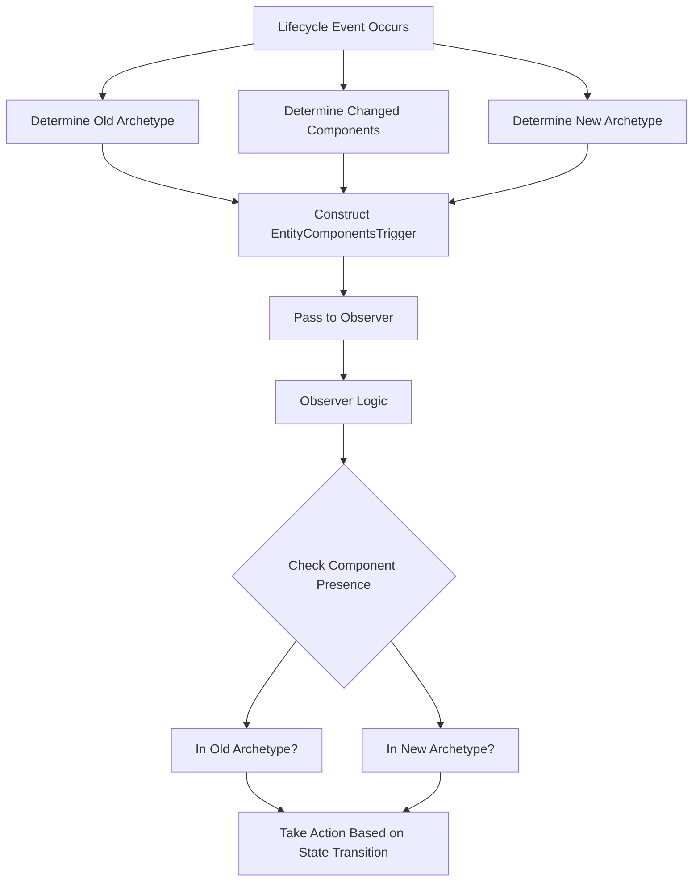

+++
title = "#22828 Make the old and new archetype available in lifecycle observers"
date = "2026-02-09T00:00:00"
draft = false
template = "pull_request_page.html"
in_search_index = true

[taxonomies]
list_display = ["show"]

[extra]
current_language = "en"
available_languages = {"en" = { name = "English", url = "/pull_request/bevy/2026-02/pr-22828-en-20260209" }, "zh-cn" = { name = "中文", url = "/pull_request/bevy/2026-02/pr-22828-zh-cn-20260209" }}
labels = ["A-ECS", "C-Usability", "M-Migration-Guide"]
+++

# Make the old and new archetype available in lifecycle observers

## Basic Information
- **Title**: Make the old and new archetype available in lifecycle observers
- **PR Link**: https://github.com/bevyengine/bevy/pull/22828
- **Author**: chescock
- **Status**: MERGED
- **Labels**: A-ECS, C-Usability, S-Ready-For-Final-Review, M-Migration-Guide
- **Created**: 2026-02-06T14:36:44Z
- **Merged**: 2026-02-09T22:36:29Z
- **Merged By**: alice-i-cecile

## Description

**Objective**

Simplify observers that need to detect when multiple components are added or removed.

In particular, if a module needs to keep track of entities with some component `C` that are not `Disabled`, it will normally start tracking an entity on `Add, C` and `Remove, Disabled` and stop tracking it on `Remove, C` and `Add, Disabled`. But it should *not* start tracking the entity when `C` and `Disabled` are removed together, such as when an entity with both is despawned, and this is difficult to detect today.

Fixes #22700, although with the idea from https://github.com/bevyengine/bevy/issues/22700#issuecomment-3797391974 rather than the solution in the issue description.

**Solution**

Make the old and new archetypes available in lifecycle observers. Wrap them in `Option` so that the old archetype during spawn and the new archetype during despawn can be `None`.

**Showcase**

```rust
fn on_remove_disable(
    on: On<Remove, Disabled>,
    mut cache: ResMut<EntitiesWithA>,
    a_component: ComponentIdFor<A>,
) {
    // The `A` component may have been removed at the same time as `Disabled`,
    // either due to a remove or despawn. Only try to add this entity to our
    // cache if the `A` component is still in the new archetype.
    if on.trigger().new_archetype.is_some_and(|a| a.contains(*a_component)) {
        cache.0.insert(on.entity);
    }
}
```

**Alternatives**

Adding support for `Remove` observers that run *after* the change and `Add` observers that run *before* would solve this issue with a simpler user experience, as they would be able to check the *current* archetype of the entity using ordinary `Query` infrastructure. That would avoid the need for tricks like `ComponentIdFor` and `E: for<'a> Event<Trigger<'a> = EntityComponentsTrigger<'a>>`.

But I believe there are concerns about the performance impact of adding more observer types, so I expect a change like that to be controversial.

## The Story of This Pull Request

This PR addresses a subtle but important problem in Bevy's ECS system: observers couldn't accurately determine the complete state of an entity when multiple components were added or removed simultaneously. The issue was particularly evident when tracking entities that needed to have certain components while lacking others, like tracking entities with component `A` that aren't disabled.

The core problem stems from how lifecycle observers receive information. When an observer triggers on a specific component change, it only receives information about that particular component - not about other components that might be changing at the same time. Consider a scenario where we want to track entities with component `A` but without component `Disabled`. If both `A` and `Disabled` are removed simultaneously (like when an entity is despawned), the observer for `Remove, Disabled` would fire, but it wouldn't know that `A` was also removed. This could lead to incorrect tracking logic where the system tries to track an entity that no longer has the required component.

The solution approach is straightforward: provide observers with the complete archetype information before and after the change. An archetype in Bevy's ECS represents a specific combination of components that entities can have. By exposing both the old and new archetypes, observers can check for the presence of any component in either state.

The implementation required modifying the `EntityComponentsTrigger` struct in `crates/bevy_ecs/src/event/trigger.rs` to include two new optional fields:

```rust
pub struct EntityComponentsTrigger<'a> {
    pub components: &'a [ComponentId],
    pub old_archetype: Option<&'a Archetype>,
    pub new_archetype: Option<&'a Archetype>,
}
```

The fields are `Option<&Archetype>` because during entity spawning, there is no old archetype (it's `None`), and during despawning, there is no new archetype (also `None`). This design maintains consistency with the ECS lifecycle model where spawning is equivalent to starting with an empty entity and adding components, and despawning is equivalent to removing all components and then removing the entity.

Throughout the codebase, every place where `EntityComponentsTrigger` is constructed needed to be updated to provide the appropriate archetype information. This included modifications to:
- Bundle insertion and removal logic
- Entity spawning
- Single-component operations in deferred world
- Entity despawning

The changes ensure that all lifecycle events (Add, Remove, Insert, Replace, Despawn) properly propagate archetype information. For example, in `crates/bevy_ecs/src/bundle/insert.rs`, when components are added via a bundle, the code now captures both the old archetype (before insertion) and the new archetype (after insertion):

```rust
&mut EntityComponentsTrigger {
    components: archetype_after_insert.added(),
    old_archetype: Some(old_archetype),
    new_archetype: Some(new_archetype),
},
```

A key technical consideration is that this change is breaking. Since all fields of `EntityComponentsTrigger` are public, adding new fields constitutes a breaking change that requires users to update their code. The migration guide provides clear instructions: pattern matches need to include `..` to ignore the new fields, and manual constructions need to specify values for `old_archetype` and `new_archetype`.

The testing strategy includes a comprehensive test that validates archetype information flows correctly through different lifecycle events. The test spawns entities, removes components, inserts components, and despawns entities, then verifies that the correct old and new archetypes are reported for each event type.

From a performance perspective, the impact is minimal. The archetype references are already available when the events are triggered, so we're just passing additional references. There's no new allocation or computation required.

Looking forward, this solution works well for the immediate problem but points to a potential future improvement. As mentioned in the alternatives section, a more elegant solution might involve adding new observer types that run at different points in the lifecycle (like Remove observers that run after the change). This would allow observers to use regular query infrastructure instead of needing to check archetypes directly. However, such a change would require careful consideration of performance implications and API design.

The implementation demonstrates good software engineering practices: it solves a concrete problem with minimal API surface changes, maintains backward compatibility where possible, includes comprehensive documentation and examples, and provides thorough testing to ensure correctness.

## Visual Representation



## Key Files Changed

1. **crates/bevy_ecs/src/event/trigger.rs** (+79/-0)
   - Added `old_archetype` and `new_archetype` fields to `EntityComponentsTrigger`
   - Included comprehensive documentation with examples showing how to use the new fields
   - The fields are optional to handle spawn (no old archetype) and despawn (no new archetype) cases

```rust
// Key addition to EntityComponentsTrigger struct
pub struct EntityComponentsTrigger<'a> {
    pub components: &'a [ComponentId],
    pub old_archetype: Option<&'a Archetype>,
    pub new_archetype: Option<&'a Archetype>,
}
```

2. **crates/bevy_ecs/src/observer/mod.rs** (+71/-2)
   - Updated existing tests to include the new fields in `EntityComponentsTrigger` constructions
   - Added a new test `observer_new_old_archetypes` that verifies archetype information flows correctly through different lifecycle events

```rust
// Updated test to include new fields
EntityComponentsTrigger {
    components: &[component_a],
    old_archetype: None,
    new_archetype: None,
}
```

3. **release-content/migration-guides/observer_old_new_archetype.md** (+37/-0)
   - Created migration guide explaining the breaking change
   - Shows how to update pattern matches and manual constructions
   - Provides before/after examples for common use cases

4. **crates/bevy_ecs/src/bundle/insert.rs** (+17/-0)
   - Updated bundle insertion to pass old and new archetypes to Add, Insert, and Replace events
   - Ensures proper archetype tracking during complex bundle operations

5. **crates/bevy_ecs/src/bundle/remove.rs** (+6/-0)
   - Updated bundle removal to pass old and new archetypes to Replace and Remove events
   - Maintains consistent archetype information during component removal

## Further Reading

- [Bevy ECS Documentation](https://bevyengine.org/learn/book/ecs/) - Official Bevy ECS documentation
- [Archetype-Based ECS Pattern](https://en.wikipedia.org/wiki/Entity_component_system#Archetype-based) - Wikipedia article on archetype-based ECS
- [Observer Pattern in Game Development](https://gameprogrammingpatterns.com/observer.html) - Game Programming Patterns chapter on observers
- [Bevy Observers RFC](https://github.com/bevyengine/rfcs/pull/53) - RFC detailing the observer system design