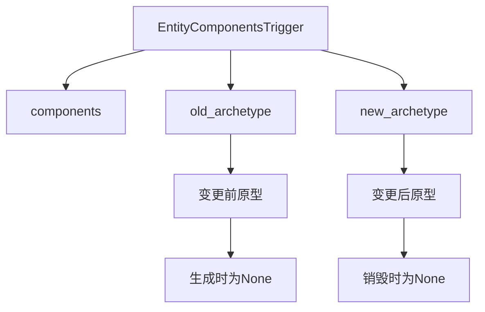

+++
title = "#22828 Make the old and new archetype available in lifecycle observers"
date = "2026-02-09T00:00:00"
draft = false
template = "pull_request_page.html"
in_search_index = false

[extra]
current_language = "zh-cn"
available_languages = {"en" = { name = "English", url = "/pull_request/bevy/2026-02/pr-22828-en-20260209" }, "zh-cn" = { name = "中文", url = "/pull_request/bevy/2026-02/pr-22828-zh-cn-20260209" }}
+++

# Make the old and new archetype available in lifecycle observers

## 基本信息
- **标题**: Make the old and new archetype available in lifecycle observers
- **PR链接**: https://github.com/bevyengine/bevy/pull/22828
- **作者**: chescock
- **状态**: 已合并
- **标签**: A-ECS, C-Usability, S-Ready-For-Final-Review, M-Migration-Guide
- **创建时间**: 2026-02-06T14:36:44Z
- **合并时间**: 2026-02-09T22:36:29Z
- **合并人**: alice-i-cecile

## 描述翻译

### 目标

简化需要检测多个组件被添加或移除的观察者(observer)。

具体来说，如果一个模块需要跟踪具有组件`C`且未禁用(`Disabled`)的实体，它通常会在`Add, C`和`Remove, Disabled`时开始跟踪，在`Remove, C`和`Add, Disabled`时停止跟踪。但*不应该*在`C`和`Disabled`同时被移除时开始跟踪，比如当同时具有这两个组件的实体被销毁(despawn)时，这在目前很难检测。

修复 #22700，但使用的是该issue评论中提出的方案，而非issue描述中的方案。

### 解决方案

在生命周期观察者中提供旧的和新的原型(archetype)。将它们包装在`Option`中，以便在生成(spawn)时旧原型和销毁(despawn)时新原型可以为`None`。

### 示例展示

```rust
fn on_remove_disable(
    on: On<Remove, Disabled>,
    mut cache: ResMut<EntitiesWithA>,
    a_component: ComponentIdFor<A>,
) {
    // `A`组件可能与`Disabled`同时被移除，可能是由于移除操作或销毁。
    // 只有当`A`组件仍然存在于新原型中时，才尝试将此实体添加到缓存中。
    if on.trigger().new_archetype.is_some_and(|a| a.contains(*a_component)) {
        cache.0.insert(on.entity);
    }
}
```

### 替代方案

添加支持在更改*后*运行的`Remove`观察者和在更改*前*运行的`Add`观察者，将能够使用普通的`Query`基础设施检查实体的*当前*原型，从而以更简单的用户体验解决此问题。这样可以避免使用像`ComponentIdFor`和`E: for<'a> Event<Trigger<'a> = EntityComponentsTrigger<'a>>`这样的技巧。

但我认为对添加更多观察者类型的性能影响存在担忧，因此我预计这样的更改会有争议。

## 本次PR的故事

### 问题与背景

在Bevy的ECS系统中，观察者(observer)用于响应组件的变化。然而，在处理多个组件同时发生变化的情况时，现有的观察者机制存在一个限制。例如，考虑这样一个场景：我们需要跟踪所有具有组件`A`且未被禁用(`Disabled`)的实体。逻辑上，当`A`被添加或`Disabled`被移除时，我们应该开始跟踪实体；当`A`被移除或`Disabled`被添加时，应该停止跟踪。

问题出现在多个组件同时变化时。当实体同时具有`A`和`Disabled`组件，并且该实体被销毁时，两个组件会同时被移除。此时，观察者会收到两个事件：`Remove, A`和`Remove, Disabled`。对于`Remove, Disabled`的观察者，它无法知道`A`组件是否也被同时移除了，因此可能会错误地认为实体现在应该被跟踪。

这个问题在issue #22700中被详细描述。开发者需要一种方法来检测在同一个操作中是否有其他组件被添加或移除，以便做出正确的决策。

### 解决方案

这个PR的解决方案是扩展`EntityComponentsTrigger`结构体，使其包含变更前后的原型(archetype)信息。原型是Bevy ECS中描述一组组件组合的数据结构。通过提供旧的和新的原型，观察者可以检查在组件变更前后实体具有哪些组件。

具体实现是在`EntityComponentsTrigger`中新增两个字段：
- `old_archetype: Option<&'a Archetype>` - 变更前实体的原型，对于新生成的实体为`None`
- `new_archetype: Option<&'a Archetype>` - 变更后实体的原型，对于即将销毁的实体为`None`

这两个字段都包装在`Option`中，以处理实体生成（无旧原型）和销毁（无新原型）的边界情况。

### 实现细节

核心修改在`crates/bevy_ecs/src/event/trigger.rs`中，扩展了`EntityComponentsTrigger`结构体：

```rust
pub struct EntityComponentsTrigger<'a> {
    /// 触发此事件的组件
    pub components: &'a [ComponentId],
    
    /// 变更前实体的原型，对于新生成的实体为None
    pub old_archetype: Option<&'a Archetype>,
    
    /// 变更后实体的原型，对于即将销毁的实体为None
    pub new_archetype: Option<&'a Archetype>,
}
```

为了正确设置这些新字段，需要在整个代码库中更新所有创建`EntityComponentsTrigger`的地方。这包括：
1. 组件插入逻辑 (`crates/bevy_ecs/src/bundle/insert.rs`)
2. 组件移除逻辑 (`crates/bevy_ecs/src/bundle/remove.rs`)
3. 实体生成逻辑 (`crates/bevy_ecs/src/bundle/spawner.rs`)
4. 延迟世界操作 (`crates/bevy_ecs/src/world/deferred_world.rs`)
5. 世界可变访问 (`crates/bevy_ecs/src/world/entity_access/world_mut.rs`)

每个地方都需要根据具体操作的类型（添加、插入、替换、移除、销毁）来确定适当的旧原型和新原型。例如，在实体销毁时，新原型为`None`；在实体生成时，旧原型为`None`。

### 技术洞察

这个实现的关键设计决策是使用`Option<&Archetype>`而不是简单的`&Archetype`。这有几个考虑：
1. **边界情况处理**：实体生成和销毁时，不存在相应的原型
2. **语义清晰**：`None`明确表示"无原型"，而不是使用空原型或特殊标记
3. **类型安全**：使用`Option`强制调用方处理边界情况

另一个重要的设计考虑是性能。原型引用是轻量级的，不会增加内存分配开销。观察者可以快速检查原型是否包含特定组件，因为原型内部维护了组件ID的快速查找结构。

### 影响与改进

这个PR的主要改进是使观察者能够更精确地响应组件变化。通过访问旧的和新的原型，观察者可以：
- 检测多个组件是否在同一操作中被添加或移除
- 在适当的时候忽略某些事件（如当相关组件也被移除时）
- 更可靠地维护缓存或索引

对于用户代码的影响是可控的。由于`EntityComponentsTrigger`的所有字段都是公开的(pub)，添加新字段是破坏性变更。因此，PR包含了迁移指南，指导用户如何更新他们的代码：
- 更新模式匹配以包含新字段
- 更新手动创建的`EntityComponentsTrigger`

测试用例也被更新以验证新功能的工作情况，确保旧原型和新原型在各种操作（添加、插入、替换、移除、销毁）中正确设置。

## 视觉表示



## 关键文件变更

### `crates/bevy_ecs/src/event/trigger.rs` (+79/-0)
**变更说明**: 扩展`EntityComponentsTrigger`结构体，添加`old_archetype`和`new_archetype`字段，并提供详细的文档和示例。

**关键代码片段**:
```rust
pub struct EntityComponentsTrigger<'a> {
    /// The components that triggered this event
    pub components: &'a [ComponentId],
    
    /// The archetype of the target entity before this change, or `None` if the entity was just spawned.
    pub old_archetype: Option<&'a Archetype>,
    
    /// The archetype of the target entity after this change, or `None` if the entity will be despawned.
    pub new_archetype: Option<&'a Archetype>,
}
```

### `crates/bevy_ecs/src/observer/mod.rs` (+71/-2)
**变更说明**: 更新测试以使用新的`EntityComponentsTrigger`字段，添加验证新旧原型的测试。

**关键代码片段**:
```rust
// 测试新旧原型的正确设置
world.trigger_with(
    EntityComponentsEvent(entity_1),
    EntityComponentsTrigger {
        components: &[component_a],
        old_archetype: None,  // 新生成的实体，无旧原型
        new_archetype: None,
    },
);
```

### `release-content/migration-guides/observer_old_new_archetype.md` (+37/-0)
**变更说明**: 新增迁移指南，指导用户如何更新代码以适应`EntityComponentsTrigger`的新字段。

**关键代码片段**:
```markdown
// 18.0
let EntityComponentsTrigger { components } = e.trigger();
// 19.0
let EntityComponentsTrigger { components, .. } = e.trigger();
```

### `crates/bevy_ecs/src/bundle/insert.rs` (+17/-0)
**变更说明**: 更新组件插入逻辑，在触发观察者事件时设置新旧原型。

**关键代码片段**:
```rust
&mut EntityComponentsTrigger {
    components: archetype_after_insert.added(),
    old_archetype: Some(old_archetype),
    new_archetype: Some(new_archetype),
},
```

### `crates/bevy_ecs/src/bundle/remove.rs` (+6/-0)
**变更说明**: 更新组件移除逻辑，在触发观察者事件时设置新旧原型。

**关键代码片段**:
```rust
&mut EntityComponentsTrigger {
    components: &components,
    old_archetype: Some(self.old_archetype.as_ref()),
    new_archetype: Some(self.new_archetype.as_ref()),
},
```

## 完整代码差异

```diff
diff --git a/crates/bevy_ecs/src/bundle/insert.rs b/crates/bevy_ecs/src/bundle/insert.rs
index 116480694913b..782edf1dc2d2e 100644
--- a/crates/bevy_ecs/src/bundle/insert.rs
+++ b/crates/bevy_ecs/src/bundle/insert.rs
@@ -167,6 +167,13 @@ impl<'w> BundleInserter<'w> {
 
             if insert_mode == InsertMode::Replace {
                 let archetype = archetype.as_ref();
+                let new_archetype = match archetype_move_type {
+                    ArchetypeMoveType::SameArchetype => archetype,
+                    ArchetypeMoveType::NewArchetypeSameTable { new_archetype }
+                    | ArchetypeMoveType::NewArchetypeNewTable { new_archetype, .. } => {
+                        new_archetype.as_ref()
+                    }
+                };
                 if archetype.has_replace_observer() {
                     // SAFETY: the REPLACE event_key corresponds to the Replace event's type
                     deferred_world.trigger_raw(
@@ -174,6 +181,8 @@ impl<'w> BundleInserter<'w> {
                         &mut Replace { entity },
                         &mut EntityComponentsTrigger {
                             components: archetype_after_insert.existing(),
+                            old_archetype: Some(archetype),
+                            new_archetype: Some(new_archetype),
                         },
                         caller,
                     );
@@ -386,6 +395,7 @@ impl<'w> BundleInserter<'w> {
             caller,
             relationship_hook_mode,
             archetype_after_insert,
+            self.archetype.as_ref(),
             new_archetype,
             deferred_world,
         );
@@ -403,6 +413,7 @@ impl<'w> BundleInserter<'w> {
         caller: MaybeLocation,
         relationship_hook_mode: RelationshipHookMode,
         archetype_after_insert: &ArchetypeAfterBundleInsert,
+        old_archetype: &Archetype,
         new_archetype: &Archetype,
         mut deferred_world: crate::world::DeferredWorld<'_>,
     ) {
@@ -422,6 +433,8 @@ impl<'w> BundleInserter<'w> {
                     &mut Add { entity },
                     &mut EntityComponentsTrigger {
                         components: archetype_after_insert.added(),
+                        old_archetype: Some(old_archetype),
+                        new_archetype: Some(new_archetype),
                     },
                     caller,
                 );
@@ -443,6 +456,8 @@ impl<'w> BundleInserter<'w> {
                             &mut Insert { entity },
                             &mut EntityComponentsTrigger {
                                 components: archetype_after_insert.inserted(),
+                                old_archetype: Some(old_archetype),
+                                new_archetype: Some(new_archetype),
                             },
                             caller,
                         );
@@ -465,6 +480,8 @@ impl<'w> BundleInserter<'w> {
                             &mut Insert { entity },
                             &mut EntityComponentsTrigger {
                                 components: archetype_after_insert.added(),
+                                old_archetype: Some(old_archetype),
+                                new_archetype: Some(new_archetype),
                             },
                             caller,
                         );
```

## 进一步阅读

1. [Bevy ECS 观察者文档](https://bevyengine.org/learn/ecs/observers/)
2. [Bevy 原型(Archetype)系统详解](https://bevyengine.org/learn/ecs/archetypes/)
3. [Rust Option类型官方文档](https://doc.rust-lang.org/std/option/enum.Option.html)
4. [Bevy 破坏性变更和迁移指南](https://bevyengine.org/learn/migration-guides/)