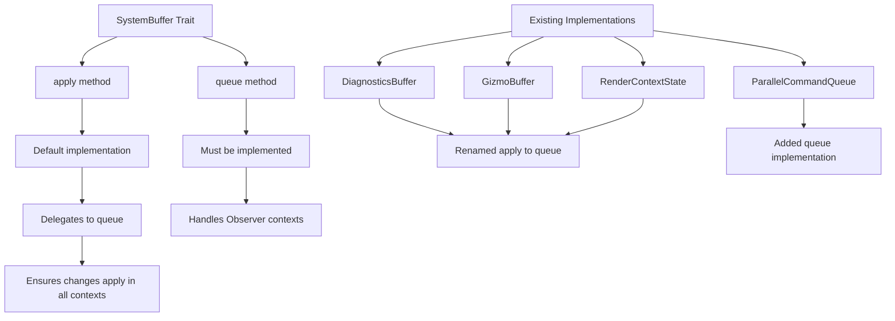

+++
title = "#22832 `SystemBuffer` `apply()` delegates to `queue()`, which now must be implemented"
date = "2026-02-07T00:00:00"
draft = false
template = "pull_request_page.html"
in_search_index = true

[taxonomies]
list_display = ["show"]

[extra]
current_language = "en"
available_languages = {"en" = { name = "English", url = "/pull_request/bevy/2026-02/pr-22832-en-20260207" }, "zh-cn" = { name = "中文", url = "/pull_request/bevy/2026-02/pr-22832-zh-cn-20260207" }}
labels = ["A-ECS", "C-Usability", "M-Migration-Guide", "D-Straightforward"]
+++

# Title
`SystemBuffer` `apply()` delegates to `queue()`, which now must be implemented

## Basic Information
- **Title**: `SystemBuffer` `apply()` delegates to `queue()`, which now must be implemented
- **PR Link**: https://github.com/bevyengine/bevy/pull/22832
- **Author**: kfc35
- **Status**: MERGED
- **Labels**: A-ECS, C-Usability, S-Ready-For-Final-Review, M-Migration-Guide, D-Straightforward
- **Created**: 2026-02-06T21:23:31Z
- **Merged**: 2026-02-07T19:50:40Z
- **Merged By**: alice-i-cecile

## Description Translation
The PR description is already in English, so it's included exactly as-is:

# Objective

- Prevent footguns related to not implementing `queue()` when `SystemBuffer`s are used in `Observer` (and related) patterns. If not implemented, it results in changes to the world not being applied, which can be confusing, and it isn't obvious to users that they also have to implement `queue()` to resolve the problem.
- Address some of #14597

## Solution

- The `SystemBuffer` trait now has its `apply()` default implementation delegate to `queue()`. This should cover the majority of cases where users want `apply()` and `queue()` to have the same behavior, particularly when `apply()` does not apply any structural changes to ECS.
- `queue()` has its empty default implementation removed, requiring implementers to implement it.
- Other `SystemBuffer`s in the codebase have been updated to the best of my ability and understanding of ECS.

## Testing

CI, and ran the following examples: `bloom_3d`, `3d_gizmos`, and `lighting` to ensure rendering was OK (they look fine)

## The Story of This Pull Request

This PR addresses a subtle but significant issue in Bevy's ECS system buffer implementation. The problem stems from how `SystemBuffer` traits interact with different system execution contexts, particularly Observers.

In Bevy, `SystemBuffer` is a trait that allows systems to accumulate changes and apply them later. It has two key methods: `apply()` which applies changes immediately, and `queue()` which queues changes for deferred application via `ApplyDeferred`. The issue was that when `SystemBuffer` was used in Observer systems, only the `queue()` method was called, not `apply()`. If a developer implemented only `apply()` without realizing they also needed `queue()`, their buffer changes would silently fail to apply in Observer contexts.

The root of the problem was the default implementation of `queue()` as an empty method. This meant developers could implement only `apply()` and their code would work in regular systems but fail silently in Observers. The confusion was compounded because there was no clear indication that both methods needed implementation for full compatibility.

The solution takes a pragmatic approach: since most `SystemBuffer` implementations don't make structural ECS changes (adding/removing components, spawning entities), their `apply()` and `queue()` methods typically have identical behavior. The PR changes the trait so that `apply()` now has a default implementation that delegates to `queue()`, and `queue()` becomes a required method that must be implemented.

This design change ensures that:
1. Developers must think about both execution paths when implementing `SystemBuffer`
2. The default behavior (delegating `apply()` to `queue()`) works correctly for the majority of use cases
3. Observer systems will properly apply buffer changes since they now call `queue()`, which must be implemented

The implementation required updating several existing `SystemBuffer` implementations throughout the codebase. In most cases, this meant simply renaming `apply()` to `queue()` and adjusting the method signature to accept `DeferredWorld` instead of `&mut World`. The key insight is that `DeferredWorld` can be used similarly to `&mut World` for non-structural changes, while structural changes require using the command queue via `world.commands()`.

For example, in `DiagnosticsBuffer`, the change was straightforward:
- Before: `fn apply(&mut self, _system_meta: &SystemMeta, world: &mut World)`
- After: `fn queue(&mut self, _system_meta: &SystemMeta, mut world: DeferredWorld)`

The same pattern applied to `GizmoBuffer` and `RenderContextState`. For `ParallelCommandQueue`, a new `queue()` implementation was added that properly handles the command queues from parallel execution.

The migration guide clearly explains the change: developers should implement `queue()` instead of `apply()`, and if their `apply()` doesn't make structural changes, they can simply rename it and adjust the parameter type. For buffers that do make structural changes, both methods need implementation, with `queue()` using the command queue for structural modifications.

This change improves the API's safety by eliminating a silent failure mode while maintaining backward compatibility through the default `apply()` implementation. It's a good example of making APIs harder to misuse by requiring explicit consideration of all execution paths.

## Visual Representation



## Key Files Changed

### `crates/bevy_ecs/src/system/system_param.rs` (+9/-3)
This is the core change that modifies the `SystemBuffer` trait definition. The `apply()` method now has a default implementation that delegates to `queue()`, and `queue()` becomes a required method.

```rust
// Before:
pub trait SystemBuffer: FromWorld + Send + 'static {
    fn apply(&mut self, system_meta: &SystemMeta, world: &mut World);
    fn queue(&mut self, _system_meta: &SystemMeta, _world: DeferredWorld) {}
}

// After:
pub trait SystemBuffer: FromWorld + Send + 'static {
    fn apply(&mut self, system_meta: &SystemMeta, world: &mut World) {
        self.queue(system_meta, world.into());
    }
    fn queue(&mut self, _system_meta: &SystemMeta, _world: DeferredWorld);
}
```

The trait documentation was also updated to clarify that structural changes should use the command queue via `DeferredWorld::commands()` in the `queue()` method.

### `crates/bevy_diagnostic/src/diagnostic.rs` (+2/-2)
Updated `DiagnosticsBuffer` to implement `queue()` instead of `apply()`, with appropriate parameter type changes.

```rust
// Before:
impl SystemBuffer for DiagnosticsBuffer {
    fn apply(
        &mut self,
        _system_meta: &bevy_ecs::system::SystemMeta,
        world: &mut bevy_ecs::world::World,
    ) { /* ... */ }
}

// After:
impl SystemBuffer for DiagnosticsBuffer {
    fn queue(
        &mut self,
        _system_meta: &bevy_ecs::system::SystemMeta,
        mut world: bevy_ecs::world::DeferredWorld,
    ) { /* ... */ }
}
```

### `crates/bevy_ecs/src/system/commands/parallel_scope.rs` (+10/-0)
Added a `queue()` implementation for `ParallelCommandQueue` that properly handles command queues from parallel execution contexts.

```rust
impl SystemBuffer for ParallelCommandQueue {
    #[inline]
    fn queue(&mut self, _system_meta: &SystemMeta, mut world: DeferredWorld) {
        #[cfg(feature = "trace")]
        let _system_span = _system_meta.commands_span.enter();
        for cq in self.thread_queues.iter_mut() {
            world.commands().append(cq);
        }
    }
}
```

### `crates/bevy_gizmos/src/gizmos.rs` (+2/-2)
Updated `GizmoBuffer` to implement `queue()` instead of `apply()`.

```rust
// Before:
impl<Config, Clear> SystemBuffer for GizmoBuffer<Config, Clear>
where
    Config: GizmoConfigGroup,
    Clear: 'static + Send + Sync,
{
    fn apply(&mut self, _system_meta: &SystemMeta, world: &mut World) { /* ... */ }
}

// After:
impl<Config, Clear> SystemBuffer for GizmoBuffer<Config, Clear>
where
    Config: GizmoConfigGroup,
    Clear: 'static + Send + Sync,
{
    fn queue(&mut self, _system_meta: &SystemMeta, mut world: DeferredWorld) { /* ... */ }
}
```

### `crates/bevy_render/src/renderer/render_context.rs` (not in provided diff but mentioned)
Similar changes were made to `RenderContextState` to implement `queue()` and remove the empty `queue()` method.

### `release-content/migration-guides/system_buffer_queue.md` (+33/-0)
Added a comprehensive migration guide explaining the change and providing code examples for updating custom `SystemBuffer` implementations.

## Further Reading

1. [Bevy ECS System Parameters Documentation](https://bevyengine.org/learn/ecs/system-parameters/) - Understanding the broader context of system parameters
2. [Observer Pattern in Bevy](https://bevyengine.org/learn/ecs/observers/) - How observers work and why they require `queue()` implementation
3. [Deferred World and Commands](https://bevyengine.org/learn/ecs/commands/) - Working with deferred execution and command queues
4. [Issue #14597](https://github.com/bevyengine/bevy/issues/14597) - The original issue that identified problems with system buffer implementation patterns