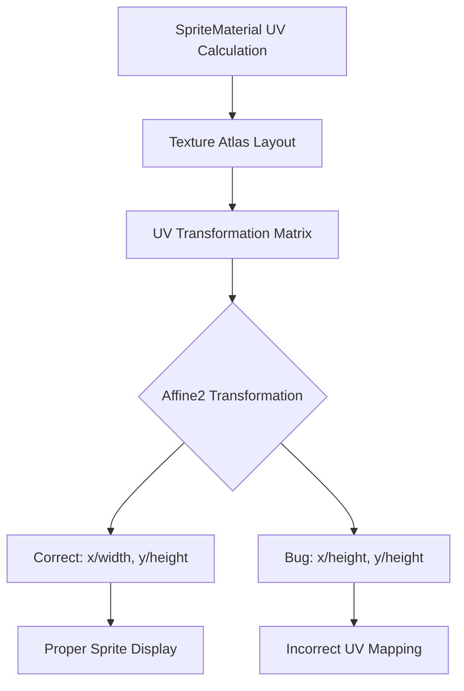

+++
title = "#22836 Fix UV calculation for `SpriteMesh` when using a `TextureAtlasLayout`"
date = "2026-02-07T00:00:00"
draft = false
template = "pull_request_page.html"
in_search_index = true

[taxonomies]
list_display = ["show"]

[extra]
current_language = "en"
available_languages = {"en" = { name = "English", url = "/pull_request/bevy/2026-02/pr-22836-en-20260207" }, "zh-cn" = { name = "中文", url = "/pull_request/bevy/2026-02/pr-22836-zh-cn-20260207" }}
labels = ["C-Bug", "D-Trivial", "A-Rendering"]
+++

# Title

## Basic Information
- **Title**: Fix UV calculation for `SpriteMesh` when using a `TextureAtlasLayout`
- **PR Link**: https://github.com/bevyengine/bevy/pull/22836
- **Author**: JayPavlina
- **Status**: MERGED
- **Labels**: C-Bug, D-Trivial, A-Rendering, S-Ready-For-Final-Review
- **Created**: 2026-02-06T23:31:36Z
- **Merged**: 2026-02-07T00:25:06Z
- **Merged By**: alice-i-cecile

## Description Translation
# Objective

Fixes #22835

## Solution

Divide the x min of the `Rect` by the width instead of the height

## Testing

I confirmed that all of the sprites in my game now look correct

## The Story of This Pull Request

This PR addresses a specific bug in Bevy's sprite rendering system where UV coordinates were calculated incorrectly when using a `TextureAtlasLayout` with `SpriteMesh`. The issue manifested as visual artifacts where sprites would display with incorrect texture mapping, showing the wrong portions of texture atlases.

The problem originated in the `SpriteMaterial` implementation, specifically in how UV transformations were calculated for texture atlas regions. When Bevy processes a texture atlas, it needs to map each sprite's texture coordinates (UVs) to the correct sub-rectangle within the larger atlas texture. This requires calculating a transformation that scales and translates the UV coordinates appropriately.

The bug was straightforward: in the UV transformation matrix calculation, the x-coordinate translation was incorrectly using the rectangle's height instead of its width. This is a classic case of a copy-paste error where the same denominator was used for both axes without considering that x-coordinates should be normalized by width and y-coordinates by height.

The fix changes just one character in the codebase - replacing `.y` with `.x` in a single line. This minimal change demonstrates how small errors can have significant visual consequences in graphics programming. The UV transformation works by first scaling the UV coordinates to match the aspect ratio of the sub-rectangle within the texture atlas, then translating them to the correct position within that atlas.

The impact of this fix is immediate and important for any project using texture atlases with `SpriteMesh`. Texture atlases are commonly used in games to reduce draw calls by packing multiple sprites into a single texture. Without correct UV mapping, sprites would show incorrect visual content, potentially breaking game mechanics that rely on specific sprite appearances.

The fix follows standard computer graphics conventions where texture coordinates are normalized between 0 and 1 across each axis. For a sub-rectangle within a texture atlas defined by `rect` (with coordinates in texture space), the correct transformation should translate by `rect.min.x / texture_width` and `rect.min.y / texture_height`, and scale by `rect.width / texture_width` and `rect.height / texture_height`.

This bug fix is a good example of how important attention to detail is in graphics programming, where a single incorrect value can cause visible artifacts. It also shows the value of having a simple, testable rendering pipeline where developers can verify that their sprites display correctly after changes.

## Visual Representation



## Key Files Changed

**File:** `crates/bevy_sprite_render/src/sprite_mesh/sprite_material.rs`

This file contains the `SpriteMaterial` implementation which handles material properties for sprite rendering. The change fixes a bug in the UV transformation calculation when using texture atlases.

**Key Change:**
```rust
// Before:
uv_transform *= Affine2::from_translation(vec2(
    rect.min.x / rect.size().y,  // Incorrect: dividing x by height
    rect.min.y / rect.size().y,
));

// After:
uv_transform *= Affine2::from_translation(vec2(
    rect.min.x / rect.size().x,  // Correct: dividing x by width
    rect.min.y / rect.size().y,
));
```

The fix corrects the UV coordinate calculation by properly normalizing the x-coordinate offset by the rectangle's width instead of its height. This ensures that when a sprite uses a sub-region of a texture atlas (defined by `rect`), the UV coordinates are correctly mapped to that specific region within the larger texture.

The `rect` represents the sub-region of the texture atlas that contains the sprite's image, with coordinates typically in pixels. The division by `rect.size().x` and `rect.size().y` normalizes these pixel coordinates to the [0, 1] range expected for UV coordinates, relative to the size of the sub-rectangle rather than the entire texture.

## Further Reading

1. **Bevy Sprite Documentation**: The official Bevy documentation on sprites and sprite sheets provides context for how texture atlases work in the engine.
2. **Texture Atlas Optimization**: Resources on texture atlasing techniques for game development explain why packing multiple sprites into a single texture improves rendering performance.
3. **UV Coordinate Systems**: Computer graphics textbooks and tutorials on UV mapping explain how 2D coordinates map texture pixels to 3D (or 2D) geometry.
4. **Affine Transformations**: Linear algebra resources covering affine transformations (translation, scaling, rotation) help understand the transformation matrix used in this fix.

# Full Code Diff
```diff
diff --git a/crates/bevy_sprite_render/src/sprite_mesh/sprite_material.rs b/crates/bevy_sprite_render/src/sprite_mesh/sprite_material.rs
index f4cb84577b75c..70df39130b099 100644
--- a/crates/bevy_sprite_render/src/sprite_mesh/sprite_material.rs
+++ b/crates/bevy_sprite_render/src/sprite_mesh/sprite_material.rs
@@ -140,7 +140,7 @@ impl AsBindGroupShaderType<SpriteMaterialUniform> for SpriteMaterial {
 
             uv_transform *= Affine2::from_scale(ratio);
             uv_transform *= Affine2::from_translation(vec2(
-                rect.min.x / rect.size().y,
+                rect.min.x / rect.size().x,
                 rect.min.y / rect.size().y,
             ));
 
```