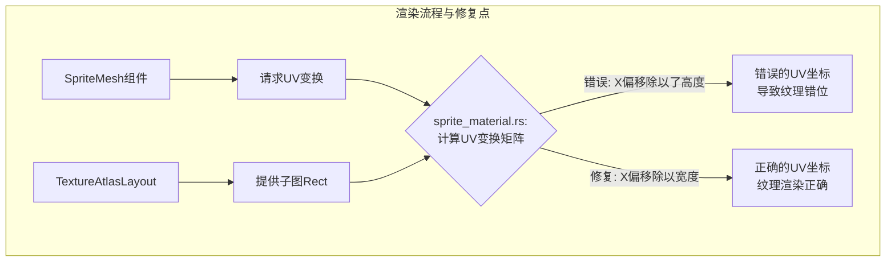

+++
title = "#22836 Fix UV calculation for `SpriteMesh` when using a `TextureAtlasLayout"
date = "2026-02-07T00:00:00"
draft = false
template = "pull_request_page.html"
in_search_index = false

[extra]
current_language = "zh-cn"
available_languages = {"en" = { name = "English", url = "/pull_request/bevy/2026-02/pr-22836-en-20260207" }, "zh-cn" = { name = "中文", url = "/pull_request/bevy/2026-02/pr-22836-zh-cn-20260207" }}
+++

# Title

## 基本资料
- **标题**: Fix UV calculation for `SpriteMesh` when using a `TextureAtlasLayout`
- **PR链接**: https://github.com/bevyengine/bevy/pull/22836
- **作者**: JayPavlina
- **状态**: MERGED
- **标签**: C-Bug, D-Trivial, A-Rendering, S-Ready-For-Review
- **创建时间**: 2026-02-06T23:31:36Z
- **合并时间**: 2026-02-07T00:25:06Z
- **合并者**: alice-i-cecile

## 描述翻译

### 目标
修复 #22835

### 解决方案
将 `Rect` 的 x 最小值除以宽度（width）而不是高度（height）。

### 测试
我确认了游戏中所有的精灵（sprite）现在看起来都正确了。

## 这个Pull Request的故事

在游戏引擎渲染中，正确地将纹理（texture）映射到网格（mesh）表面是一个基础但关键的步骤。这个步骤通过UV坐标（UV coordinates）来完成，它定义了纹理图像的哪一部分对应到网格的哪个顶点。在Bevy引擎中，`SpriteMesh` 组件与 `TextureAtlasLayout` 结合使用时，负责生成这些UV坐标变换矩阵。本次PR修复的就是这个计算过程中的一个低级但影响显著的错误。

**问题与背景**
问题具体记录在issue #22835中。当使用 `TextureAtlasLayout`（一种将多个小图打包进一张大图的技术）时，由 `SpriteMesh` 生成的精灵的UV坐标计算有误，导致纹理贴图错位。想象一下，你的游戏角色皮肤（texture）被错误地拉伸或偏移到了错误的位置，这显然会破坏视觉效果。问题的根源在于计算纹理矩形（`Rect`）的归一化UV偏移量时，用错了分母。

**解决方案与实现**
修复方案非常直接，正如开发者所述：“Divide the x min of the `Rect` by the width instead of the height”。在具体的代码实现中，问题出现在 `crates/bevy_sprite_render/src/sprite_mesh/sprite_material.rs` 文件的 `AsBindGroupShaderType` trait实现里。

计算UV变换（`uv_transform`）的代码需要根据纹理图集（atlas）中的子矩形（rect）来调整UV。这个过程包括两步缩放（scale）和一步平移（translation）。错误发生在平移部分，具体是为x分量计算偏移量时：
- 错误代码：`rect.min.x / rect.size().y` – 将x坐标除以了矩形的高度（y）。
- 正确代码：`rect.min.x / rect.size().x` – 应将x坐标除以矩形的宽度（x）。

这个错误导致了x方向的UV偏移量与纹理的实际宽度不匹配。假设一个子图位于大图x方向50%的位置（即 `rect.min.x` 是纹理宽度的一半），如果错误地除以了高度，当纹理不是正方形时，计算出的UV偏移量就会是错误的，导致最终采样位置偏离预期。

**技术洞察**
1.  **UV坐标系统**：在计算机图形学中，UV坐标通常归一化到 [0, 1] 范围， (0,0) 代表纹理左下角，(1,1) 代表右上角。从像素坐标转换到UV坐标，需要对x和y坐标分别除以纹理的宽度和高度。
2.  **仿射变换（Affine2）**：代码中使用 `Affine2` 矩阵组合来表示UV空间的变换（先缩放，后平移），这是一种高效且标准的图形处理方式。
3.  **错误性质**：这是一个典型的“复制粘贴”或疏忽导致的对称性错误。y分量的计算 `rect.min.y / rect.size().y` 是正确的，但x分量的计算没有遵循同样的逻辑。这类错误在修改或编写具有对称性的代码时容易发生。

**影响与验证**
这个修复确保了使用 `SpriteMesh` 和 `TextureAtlasLayout` 的所有精灵都能正确渲染。正如作者验证的那样，修复后游戏中所有精灵都显示正常。虽然修改只有一行代码，但它纠正了一个核心的渲染逻辑，对依赖此功能的任何项目都是必要的修正。这个案例提醒我们，即使在简单的数学计算中，也需要仔细检查每个变量的物理意义和单位。

## 视觉表达



## 关键文件变更

- `crates/bevy_sprite_render/src/sprite_mesh/sprite_material.rs` (+1/-1)
  - 此文件包含了 `SpriteMaterial` 的着色器类型转换逻辑，特别是计算将纹理图集上的一个矩形区域映射到单位UV空间所需的变换矩阵。修复的代码行正在计算该变换矩阵中的平移分量（translation）。

```rust
// 文件：crates/bevy_sprite_render/src/sprite_mesh/sprite_material.rs
// 修改前（第143行）：
            uv_transform *= Affine2::from_translation(vec2(
                rect.min.x / rect.size().y, // BUG: 错误地将x坐标除以高度
                rect.min.y / rect.size().y,
            ));

// 修改后：
            uv_transform *= Affine2::from_translation(vec2(
                rect.min.x / rect.size().x, // FIX: 将x坐标正确地除以宽度
                rect.min.y / rect.size().y,
            ));
```

## 延伸阅读

1.  Bevy官方文档关于 [Sprite](https://docs.rs/bevy/latest/bevy/sprite/struct.Sprite.html) 和 [TextureAtlas](https://docs.rs/bevy/latest/bevy/sprite/struct.TextureAtlas.html) 的介绍。
2.  计算机图形学基础：纹理映射与UV坐标，可参考《Real-Time Rendering》或相关网络教程。
3.  GitHub Issue #22835：详细描述了该bug引发的具体问题现象。

# 完整代码差异
diff --git a/crates/bevy_sprite_render/src/sprite_mesh/sprite_material.rs b/crates/bevy_sprite_render/src/sprite_mesh/sprite_material.rs
index f4cb84577b75c..70df39130b099 100644
--- a/crates/bevy_sprite_render/src/sprite_mesh/sprite_material.rs
+++ b/crates/bevy_sprite_render/src/sprite_mesh/sprite_material.rs
@@ -140,7 +140,7 @@ impl AsBindGroupShaderType<SpriteMaterialUniform> for SpriteMaterial {
 
             uv_transform *= Affine2::from_scale(ratio);
             uv_transform *= Affine2::from_translation(vec2(
-                rect.min.x / rect.size().y,
+                rect.min.x / rect.size().x,
                 rect.min.y / rect.size().y,
             ));
 