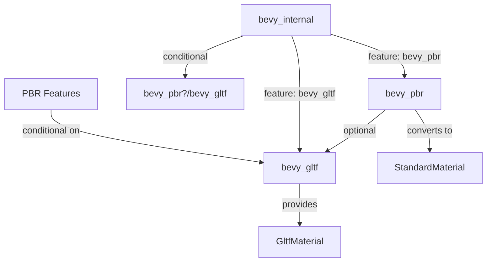

+++
title = "#22838 Make `bevy_gltf` optional for `bevy_pbr`"
date = "2026-02-21T00:00:00"
draft = false
template = "pull_request_page.html"
in_search_index = true

[taxonomies]
list_display = ["show"]

[extra]
current_language = "en"
available_languages = {"en" = { name = "English", url = "/pull_request/bevy/2026-02/pr-22838-en-20260221" }, "zh-cn" = { name = "中文", url = "/pull_request/bevy/2026-02/pr-22838-zh-cn-20260221" }}
labels = ["A-Rendering", "C-Code-Quality", "C-Usability", "D-Straightforward"]
+++

# Title

## Basic Information
- **Title**: Make `bevy_gltf` optional for `bevy_pbr`
- **PR Link**: https://github.com/bevyengine/bevy/pull/22838
- **Author**: Zeophlite
- **Status**: MERGED
- **Labels**: A-Rendering, C-Code-Quality, C-Usability, S-Ready-For-Final-Review, D-Straightforward
- **Created**: 2026-02-07T00:03:51Z
- **Merged**: 2026-02-21T21:20:22Z
- **Merged By**: alice-i-cecile

## Description Translation
# Objective

- `bevy_pbr` no longer strictly requires `bevy_gltf`

## Solution

- Make `bevy_gltf` an optional dependency, and feature gate the usage

## Testing

- `cargo run --example animated_mesh` compiles `bevy_gltf` and displays the fox and grass 
- `cargo run --example 3d_shapes --no-default-features --features default_app,default_platform,3d_api,bevy_pbr,bevy_ui` compiles without `bevy_gltf` or `gltf`

## The Story of This Pull Request

This PR addresses a dependency coupling issue between Bevy's PBR rendering system and its GLTF format support. Previously, `bevy_pbr` had a hard dependency on `bevy_gltf`, which meant that any project using Bevy's PBR rendering was forced to include GLTF support, even if the project didn't need to load GLTF files.

The problem stemmed from architectural coupling between scene format handling and rendering logic. While GLTF materials need to be converted to Bevy's `StandardMaterial` format for rendering, this conversion shouldn't require a hard dependency between the two systems. The goal was to allow `bevy_pbr` to function independently of `bevy_gltf`, giving developers the flexibility to choose their scene format dependencies based on project needs.

The solution implements a straightforward feature-gating approach. The developer made `bevy_gltf` an optional dependency in `bevy_pbr`'s Cargo.toml and added conditional compilation checks around the GLTF-related code. This approach maintains backward compatibility while allowing projects to opt out of GLTF support when it's not needed.

The implementation involved several coordinated changes. First, `bevy_gltf` was marked as optional in the dependencies section of `bevy_pbr/Cargo.toml`. Then, all the PBR feature flags that depended on GLTF features were updated to use conditional syntax (`bevy_gltf?/feature_name`) that only activates when `bevy_gltf` is present. The GLTF module in `bevy_pbr` was wrapped in a `#[cfg(feature = "bevy_gltf")]` attribute, and the function for converting GLTF materials to standard materials was made public with proper documentation.

A key insight from this implementation is the use of Rust's conditional compilation system to manage optional dependencies. The `?` syntax in feature dependencies is particularly useful: `"bevy_gltf?/pbr_transmission_textures"` means this feature only gets enabled if `bevy_gltf` is available AND its `pbr_transmission_textures` feature is enabled. This preserves the existing behavior for users who include `bevy_gltf` while allowing others to exclude it entirely.

The changes also required updating the internal crate's feature definitions to maintain the proper dependency chain. In `bevy_internal/Cargo.toml`, the `bevy_gltf` feature was updated to conditionally depend on `bevy_pbr`'s `bevy_gltf` feature, ensuring that when the `bevy_gltf` feature is enabled at the top level, it properly activates the GLTF support in both crates.

From an architectural perspective, this change improves modularity by separating concerns between scene format handling and rendering. The PBR system can now function with any scene format that can produce `StandardMaterial` instances, not just GLTF. This aligns with Bevy's data-oriented design philosophy, where systems should be decoupled and composable.

The testing approach demonstrates both sides of the change: running the `animated_mesh` example confirms that GLTF support still works when included, while running `3d_shapes` with specific feature flags shows that PBR rendering can function without GLTF. This dual verification ensures the change doesn't break existing functionality while enabling the new flexibility.

The migration guide update is minimal but important - it informs users that `bevy_gltf` is now optional and explains the architectural change. This helps users understand why they might want to adjust their feature selections and how to do so.

This PR represents a good practice in dependency management for game engines: making format support optional reduces binary size and compilation time for projects that don't need specific formats, while maintaining full functionality for those that do. The implementation is clean, focused, and maintains backward compatibility, making it a straightforward but valuable improvement to Bevy's architecture.

## Visual Representation



## Key Files Changed

1. **`crates/bevy_pbr/Cargo.toml`** (+5/-5)
   - Changed `bevy_gltf` from a required dependency to an optional one
   - Updated all PBR feature flags to use conditional syntax (`bevy_gltf?/feature_name`)
   
   ```toml
   # Before:
   bevy_gltf = { path = "../bevy_gltf", version = "0.19.0-dev" }
   pbr_transmission_textures = ["bevy_gltf/pbr_transmission_textures"]
   
   # After:
   bevy_gltf = { path = "../bevy_gltf", version = "0.19.0-dev", optional = true }
   pbr_transmission_textures = ["bevy_gltf?/pbr_transmission_textures"]
   ```

2. **`crates/bevy_internal/Cargo.toml`** (+1/-2)
   - Updated the `bevy_gltf` feature to conditionally depend on `bevy_pbr`'s `bevy_gltf` feature
   - Removed `bevy_gltf` from the `bevy_pbr` feature dependencies
   
   ```toml
   # Before:
   bevy_pbr = [
     "dep:bevy_pbr",
     "bevy_gltf",
     # ... other dependencies
   ]
   bevy_gltf = ["dep:bevy_gltf", "bevy_scene"]
   
   # After:
   bevy_pbr = [
     "dep:bevy_pbr",
     # ... other dependencies (bevy_gltf removed)
   ]
   bevy_gltf = ["dep:bevy_gltf", "bevy_scene", "bevy_pbr?/bevy_gltf"]
   ```

3. **`crates/bevy_pbr/src/lib.rs`** (+2/-0)
   - Added conditional compilation around the GLTF module import and setup
   - Only includes GLTF functionality when the `bevy_gltf` feature is enabled
   
   ```rust
   // Added feature gate for gltf module
   #[cfg(feature = "bevy_gltf")]
   mod gltf;
   
   // ... later in the Plugin implementation:
   #[cfg(feature = "bevy_gltf")]
   if self.gltf_enable_standard_materials {
       gltf::add_gltf(app);
   }
   ```

4. **`crates/bevy_pbr/src/gltf.rs`** (+2/-1)
   - Made the material conversion function public and added documentation
   - This allows the function to be used externally when GLTF support is enabled
   
   ```rust
   // Before:
   fn standard_material_from_gltf_material(material: &GltfMaterial) -> StandardMaterial {
   
   // After:
   /// Converts a [`GltfMaterial`] to a [`StandardMaterial`]
   pub fn standard_material_from_gltf_material(material: &GltfMaterial) -> StandardMaterial {
   ```

5. **`release-content/migration-guides/gltf_pbr.md`** (+2/-0)
   - Updated the migration guide to note that `bevy_gltf` is now an optional dependency
   - Provides context for users about the architectural change

## Further Reading

1. **Rust Cargo Features Documentation**: The official guide to conditional compilation and feature flags in Rust projects
   - https://doc.rust-lang.org/cargo/reference/features.html

2. **Bevy's Modular Architecture**: Documentation on Bevy's plugin system and how to create modular, optional components
   - https://bevyengine.org/learn/book/getting-started/plugins/

3. **GLTF 2.0 Specification**: Understanding the GLTF format that Bevy's `bevy_gltf` crate implements
   - https://www.khronos.org/gltf/

4. **Data-Oriented Design**: Principles behind decoupling systems like rendering and asset loading
   - https://bevyengine.org/learn/book/getting-started/ecs/

5. **Conditional Compilation in Rust**: Detailed guide on `#[cfg]` attributes and feature-based compilation
   - https://doc.rust-lang.org/reference/conditional-compilation.html

# Full Code Diff

```diff
diff --git a/crates/bevy_internal/Cargo.toml b/crates/bevy_internal/Cargo.toml
index bca9db6e5a54b..57a13fb7b6a73 100644
--- a/crates/bevy_internal/Cargo.toml
+++ b/crates/bevy_internal/Cargo.toml
@@ -251,7 +251,6 @@ bevy_anti_alias = ["dep:bevy_anti_alias", "bevy_core_pipeline"]
 bevy_post_process = ["dep:bevy_post_process", "bevy_core_pipeline"]
 bevy_pbr = [
   "dep:bevy_pbr",
-  "bevy_gltf",
   "bevy_light",
   "bevy_material",
   "bevy_core_pipeline",
@@ -268,7 +267,7 @@ bevy_ui_render = ["dep:bevy_ui_render", "bevy_sprite_render", "bevy_ui"]
 bevy_solari = ["dep:bevy_solari", "bevy_pbr"]
 bevy_gizmos = ["dep:bevy_gizmos", "bevy_camera", "bevy_light?/bevy_gizmos"]
 bevy_gizmos_render = ["dep:bevy_gizmos_render", "bevy_gizmos"]
-bevy_gltf = ["dep:bevy_gltf", "bevy_scene"]
+bevy_gltf = ["dep:bevy_gltf", "bevy_scene", "bevy_pbr?/bevy_gltf"]
 
 # Used to disable code that is unsupported when Bevy is dynamically linked
 dynamic_linking = ["bevy_diagnostic/dynamic_linking"]
diff --git a/crates/bevy_pbr/Cargo.toml b/crates/bevy_pbr/Cargo.toml
index b37eebfb9cfa2..0bbb4e906ef43 100644
--- a/crates/bevy_pbr/Cargo.toml
+++ b/crates/bevy_pbr/Cargo.toml
@@ -11,12 +11,12 @@ keywords = ["bevy"]
 [features]
 webgl = ["bevy_light/webgl"]
 webgpu = ["bevy_light/webgpu"]
-pbr_transmission_textures = ["bevy_gltf/pbr_transmission_textures"]
+pbr_transmission_textures = ["bevy_gltf?/pbr_transmission_textures"]
 pbr_multi_layer_material_textures = [
-  "bevy_gltf/pbr_multi_layer_material_textures",
+  "bevy_gltf?/pbr_multi_layer_material_textures",
 ]
-pbr_anisotropy_texture = ["bevy_gltf/pbr_anisotropy_texture"]
-pbr_specular_textures = ["bevy_gltf/pbr_specular_textures"]
+pbr_anisotropy_texture = ["bevy_gltf?/pbr_anisotropy_texture"]
+pbr_specular_textures = ["bevy_gltf?/pbr_specular_textures"]
 experimental_pbr_pcss = ["bevy_light/experimental_pbr_pcss"]
 pbr_clustered_decals = []
 pbr_light_textures = []
@@ -43,7 +43,7 @@ bevy_core_pipeline = { path = "../bevy_core_pipeline", version = "0.19.0-dev" }
 bevy_derive = { path = "../bevy_derive", version = "0.19.0-dev" }
 bevy_diagnostic = { path = "../bevy_diagnostic", version = "0.19.0-dev" }
 bevy_ecs = { path = "../bevy_ecs", version = "0.19.0-dev" }
-bevy_gltf = { path = "../bevy_gltf", version = "0.19.0-dev" }
+bevy_gltf = { path = "../bevy_gltf", version = "0.19.0-dev", optional = true }
 bevy_light = { path = "../bevy_light", version = "0.19.0-dev" }
 bevy_log = { path = "../bevy_log", version = "0.19.0-dev" }
 bevy_image = { path = "../bevy_image", version = "0.19.0-dev" }
diff --git a/crates/bevy_pbr/src/gltf.rs b/crates/bevy_pbr/src/gltf.rs
index 9923a8d74a079..944d906eb9ef2 100644
--- a/crates/bevy_pbr/src/gltf.rs
+++ b/crates/bevy_pbr/src/gltf.rs
@@ -29,7 +29,8 @@ pub(crate) fn add_gltf(app: &mut App) {
         .push(Box::new(GltfExtensionHandlerPbr));
 }
 
-fn standard_material_from_gltf_material(material: &GltfMaterial) -> StandardMaterial {
+/// Converts a [`GltfMaterial`] to a [`StandardMaterial`]
+pub fn standard_material_from_gltf_material(material: &GltfMaterial) -> StandardMaterial {
     StandardMaterial {
         base_color: material.base_color,
         base_color_channel: material.base_color_channel.clone(),
diff --git a/crates/bevy_pbr/src/lib.rs b/crates/bevy_pbr/src/lib.rs
index 4ef2fb6c030d8..c86188eacd9b7 100644
--- a/crates/bevy_pbr/src/lib.rs
+++ b/crates/bevy_pbr/src/lib.rs
@@ -28,6 +28,7 @@ mod atmosphere;
 mod cluster;
 mod components;
 pub mod contact_shadows;
+#[cfg(feature = "bevy_gltf")]
 mod gltf;
 use bevy_render::sync_component::SyncComponent;
 pub use contact_shadows::{
@@ -224,6 +225,7 @@ impl Plugin for PbrPlugin {
             ))
             .add_plugins((ScatteringMediumPlugin, AtmospherePlugin));
 
+        #[cfg(feature = "bevy_gltf")]
         if self.gltf_enable_standard_materials {
             gltf::add_gltf(app);
         }
diff --git a/release-content/migration-guides/gltf_pbr.md b/release-content/migration-guides/gltf_pbr.md
index 0547aec98e90b..7f0b69cbd7732 100644
--- a/release-content/migration-guides/gltf_pbr.md
+++ b/release-content/migration-guides/gltf_pbr.md
@@ -5,6 +5,8 @@ pull_requests: [22569]
 
 Previously, `bevy_gltf` depended on `bevy_pbr`. This meant scene definition was tightly coupled to rendering. This dependency has been inverted, to allow `bevy_gltf` to function without any of the rendering stack present.
 
+`bevy_gltf` is also an optional dependency.
+
 In 0.18, loading a material sub-asset would return a `Handle<StandardMaterial>`.
 
 ```rs
```