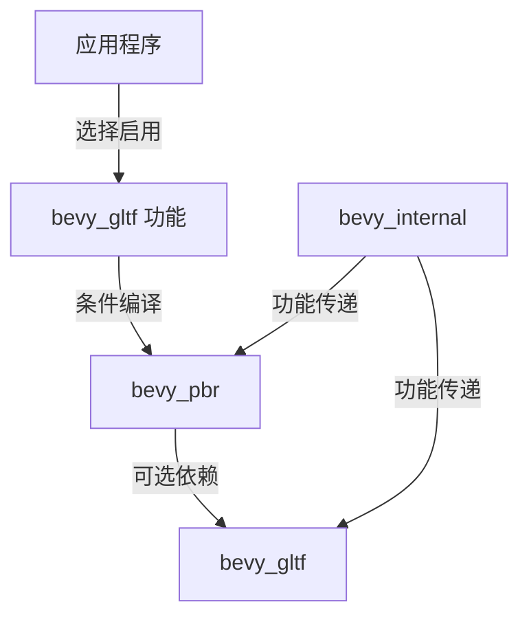

+++
title = "#22838 Make `bevy_gltf` optional for `bevy_pbr`"
date = "2026-02-21T00:00:00"
draft = false
template = "pull_request_page.html"
in_search_index = false

[extra]
current_language = "zh-cn"
available_languages = {"en" = { name = "English", url = "/pull_request/bevy/2026-02/pr-22838-en-20260221" }, "zh-cn" = { name = "中文", url = "/pull_request/bevy/2026-02/pr-22838-zh-cn-20260221" }}
labels = ["A-Rendering", "C-Code-Quality", "C-Usability", "D-Straightforward"]
+++

# Title

## Basic Information
- **Title**: Make `bevy_gltf` optional for `bevy_pbr`
- **PR Link**: https://github.com/bevyengine/bevy/pull/22838
- **Author**: Zeophlite
- **Status**: MERGED
- **Labels**: A-Rendering, C-Code-Quality, C-Usability, S-Ready-For-Final-Review, D-Straightforward
- **Created**: 2026-02-07T00:03:51Z
- **Merged**: 2026-02-21T21:20:22Z
- **Merged By**: alice-i-cecile

## Description Translation

# 目标
- 使 `bevy_pbr` 不再严格依赖 `bevy_gltf`

## 解决方案
- 将 `bevy_gltf` 设为可选依赖，并通过功能开关控制其使用

## 测试
- `cargo run --example animated_mesh` 编译 `bevy_gltf` 并显示狐狸和草地
- `cargo run --example 3d_shapes --no-default-features --features default_app,default_platform,3d_api,bevy_pbr,bevy_ui` 在不依赖 `bevy_gltf` 或 `gltf` 的情况下编译

## The Story of This Pull Request

这个PR解决了一个在Bevy引擎中存在的依赖耦合问题。在之前的版本中，`bevy_pbr`（物理基础渲染模块）强制依赖`bevy_gltf`（GLTF加载模块），即使应用程序并不需要使用GLTF格式的3D模型。这种设计限制了用户的灵活性，增加了不必要的编译时间和二进制体积。

问题的根源在于依赖关系的方向。在0.18版本中，`bevy_gltf`依赖`bevy_pbr`，因为GLTF加载后需要创建PBR材质。但在后续的版本中，这个依赖关系被反转，使得场景定义与渲染逻辑紧耦合。现在需要进一步解耦，让`bevy_pbr`可以独立于`bevy_gltf`运行。

解决方案的核心是通过Rust的Cargo功能标志系统实现条件编译。首先，在`bevy_pbr`的Cargo.toml中，将`bevy_gltf`依赖标记为可选：

```toml
# Before:
bevy_gltf = { path = "../bevy_gltf", version = "0.19.0-dev" }

# After:
bevy_gltf = { path = "../bevy_gltf", version = "0.19.0-dev", optional = true }
```

接着需要处理所有依赖于`bevy_gltf`的功能标志。在`bevy_pbr`中定义了几个与GLTF相关的功能，如`pbr_transmission_textures`、`pbr_multi_layer_material_textures`等。这些功能原本直接依赖`bevy_gltf`的对应功能，现在需要改为可选依赖：

```toml
# Before:
pbr_transmission_textures = ["bevy_gltf/pbr_transmission_textures"]
pbr_multi_layer_material_textures = [
  "bevy_gltf/pbr_multi_layer_material_textures",
]

# After:
pbr_transmission_textures = ["bevy_gltf?/pbr_transmission_textures"]
pbr_multi_layer_material_textures = [
  "bevy_gltf?/pbr_multi_layer_material_textures",
]
```

这里的`?`语法是关键，它表示只有在`bevy_gltf`功能被启用时，才会传递对应的依赖功能。

代码层面也需要相应的调整。在`bevy_pbr/src/lib.rs`中，原本直接导入的`gltf`模块现在需要通过条件编译来控制：

```rust
// Before:
mod gltf;

// After:
#[cfg(feature = "bevy_gltf")]
mod gltf;
```

同样，在`PbrPlugin`的初始化代码中，原本无条件调用的`gltf::add_gltf(app)`现在也需要加上条件编译：

```rust
#[cfg(feature = "bevy_gltf")]
if self.gltf_enable_standard_materials {
    gltf::add_gltf(app);
}
```

这个调整确保了当`bevy_gltf`功能未启用时，相关的GLTF处理代码不会被编译进最终二进制。

一个重要的技术细节是`gltf.rs`文件中的`standard_material_from_gltf_material`函数。这个函数原本是内部使用的，现在需要公开给`bevy_gltf`模块使用，因为当`bevy_gltf`功能启用时，这个模块需要能够调用此函数来转换材质：

```rust
// Before:
fn standard_material_from_gltf_material(material: &GltfMaterial) -> StandardMaterial {

// After:
/// Converts a [`GltfMaterial`] to a [`StandardMaterial`]
pub fn standard_material_from_gltf_material(material: &GltfMaterial) -> StandardMaterial {
```

依赖关系的协调也需要在更高层面处理。在`bevy_internal/Cargo.toml`中，需要调整功能标志的传递逻辑：

```toml
# Before:
bevy_gltf = ["dep:bevy_gltf", "bevy_scene"]

# After:
bevy_gltf = ["dep:bevy_gltf", "bevy_scene", "bevy_pbr?/bevy_gltf"]
```

这里添加了`bevy_pbr?/bevy_gltf`，表示当启用`bevy_gltf`功能时，如果`bevy_pbr`也被使用，则自动启用`bevy_pbr`的`bevy_gltf`功能。

这个更改的实际效果可以从测试中看出。第一个测试验证了启用GLTF功能时的正常行为，第二个测试则演示了如何在不包含GLTF支持的情况下编译和运行3D应用。这对于需要最小化依赖的应用场景（如WebAssembly构建或嵌入式系统）特别有价值。

## Visual Representation



## Key Files Changed

### 1. `crates/bevy_pbr/Cargo.toml`
- **更改描述**：将`bevy_gltf`依赖标记为可选，并调整相关功能标志以使用可选依赖语法
- **代码片段**：
```toml
# 关键更改：添加 optional = true
bevy_gltf = { path = "../bevy_gltf", version = "0.19.0-dev", optional = true }

# 功能标志改为可选依赖
pbr_transmission_textures = ["bevy_gltf?/pbr_transmission_textures"]
pbr_multi_layer_material_textures = [
  "bevy_gltf?/pbr_multi_layer_material_textures",
]
pbr_anisotropy_texture = ["bevy_gltf?/pbr_anisotropy_texture"]
pbr_specular_textures = ["bevy_gltf?/pbr_specular_textures"]
```
- **与PR目的的关系**：这是实现可选依赖的核心更改

### 2. `crates/bevy_internal/Cargo.toml`
- **更改描述**：调整功能标志传递逻辑，确保启用`bevy_gltf`时正确传递依赖
- **代码片段**：
```toml
# Before:
bevy_pbr = [
  "dep:bevy_pbr",
  "bevy_gltf",  # 移除这行
  # ...
]

# After:
bevy_gltf = ["dep:bevy_gltf", "bevy_scene", "bevy_pbr?/bevy_gltf"]  # 添加可选传递
```
- **与PR目的的关系**：协调模块间的功能标志传递

### 3. `crates/bevy_pbr/src/gltf.rs`
- **更改描述**：将内部使用的材质转换函数公开，以便`bevy_gltf`模块调用
- **代码片段**：
```rust
// 添加文档注释并改为pub
/// Converts a [`GltfMaterial`] to a [`StandardMaterial`]
pub fn standard_material_from_gltf_material(material: &GltfMaterial) -> StandardMaterial {
```
- **与PR目的的关系**：使GLTF相关代码在启用功能时可被外部访问

### 4. `crates/bevy_pbr/src/lib.rs`
- **更改描述**：使用条件编译控制GLTF模块的导入和初始化
- **代码片段**：
```rust
// 条件导入模块
#[cfg(feature = "bevy_gltf")]
mod gltf;

// 条件初始化GLTF支持
#[cfg(feature = "bevy_gltf")]
if self.gltf_enable_standard_materials {
    gltf::add_gltf(app);
}
```
- **与PR目的的关系**：实现代码级别的可选依赖

### 5. `release-content/migration-guides/gltf_pbr.md`
- **更改描述**：更新迁移指南，记录`bevy_gltf`现在为可选依赖
- **代码片段**：
```markdown
+ `bevy_gltf` is also an optional dependency.
```
- **与PR目的的关系**：文档更新，帮助用户了解这一变化

## Further Reading

1. **Cargo Features文档**：了解Rust中条件编译和可选依赖的完整用法
   - https://doc.rust-lang.org/cargo/reference/features.html

2. **Bevy引擎模块架构**：理解Bevy的ECS架构和模块设计原则
   - https://bevyengine.org/learn/book/introduction/

3. **GLTF格式规范**：了解GLTF作为3D传输格式的细节
   - https://www.khronos.org/gltf/

4. **条件编译最佳实践**：学习在大型项目中管理可选依赖的模式
   - https://rust-lang.github.io/api-guidelines/flexibility.html#c-feature