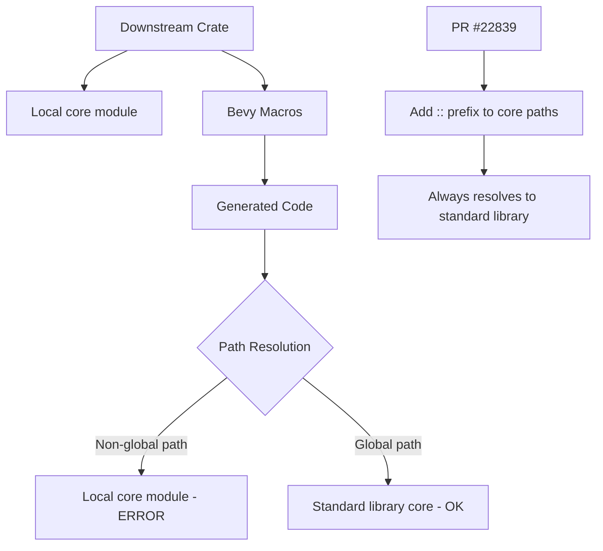

+++
title = "#22839 Fix non-global `core` references in macros"
date = "2026-02-07T00:00:00"
draft = false
template = "pull_request_page.html"
in_search_index = true

[taxonomies]
list_display = ["show"]

[extra]
current_language = "en"
available_languages = {"en" = { name = "English", url = "/pull_request/bevy/2026-02/pr-22839-en-20260207" }, "zh-cn" = { name = "中文", url = "/pull_request/bevy/2026-02/pr-22839-zh-cn-20260207" }}
labels = ["C-Bug", "D-Trivial", "C-Code-Quality", "A-Cross-Cutting", "D-Macros"]
+++

# Title: Fix non-global `core` references in macros

## Basic Information
- **Title**: Fix non-global `core` references in macros
- **PR Link**: https://github.com/bevyengine/bevy/pull/22839
- **Author**: Pedro-0550
- **Status**: MERGED
- **Labels**: C-Bug, D-Trivial, C-Code-Quality, S-Ready-For-Final-Review, A-Cross-Cutting, D-Macros
- **Created**: 2026-02-07T01:14:40Z
- **Merged**: 2026-02-07T02:19:06Z
- **Merged By**: alice-i-cecile

## Description Translation

# Objective
Some user-facing macros generate references to `core` using non-global paths. If a downstream crate has another module named `core` in scope, it shadows the standard library's `core` module and causes a compile error when such macros are used.

This PR ensures all references to `core` in macro outputs use global paths.

## Solution

Added the `::` prefix to `core` paths that didn't already have one.

## Testing
Tested by running compile CI locally.

## The Story of This Pull Request

This pull request addresses a subtle but important namespace collision issue in Bevy's procedural macros. The problem occurs when downstream crates use Bevy's macros while also having their own module named `core`. In Rust, when a local module has the same name as a standard library module, it can shadow the standard library's module if referenced with a relative path.

The issue specifically affects three procedural macro implementations in Bevy's ECS (Entity Component System) module: `derive_component`, `derive_bundle`, and `derive_query_data_impl`. These macros generate code that references items from Rust's standard `core` library, such as `core::mem::offset_of`, `core::iter::empty`, and `core::default::Default::default`. When the generated code uses non-global paths like `core::mem::offset_of`, and a downstream crate has its own `core` module, the compiler will resolve the path to the local `core` module instead of the standard library's `core` module. This leads to compile errors because the local `core` module doesn't contain the expected items like `mem::offset_of`.

The solution is straightforward but requires careful application across multiple macros. By adding the `::` prefix to create global paths (like `::core::mem::offset_of`), we ensure the path always resolves to the crate root's `core` module, which is the standard library's `core` module when Rust's prelude is properly configured. This is a common pattern in Rust macro development to avoid namespace collisions.

The implementation involved modifying 10 lines across three files. Each change follows the same pattern: adding `::` before `core` in paths that were previously relative. For example, in `component.rs`:

- `core::mem::offset_of!(Self, #relationship_member)` becomes `::core::mem::offset_of!(Self, #relationship_member)`
- `core::default::Default::default()` becomes `::core::default::Default::default()`

In `lib.rs`:
- `core::iter::empty()` becomes `::core::iter::empty()`
- `core::mem::MaybeUninit<Self>` becomes `::core::mem::MaybeUninit<Self>`

In `query_data.rs`:
- `core::iter::Iterator<Item = #path::query::EcsAccessType<'_>>` becomes `::core::iter::Iterator<Item = #path::query::EcsAccessType<'_>>`
- `core::iter::empty()` becomes `::core::iter::empty()`

These changes are minimal and focused. They don't affect the macro's functionality or performance—they only change how paths are resolved during compilation. The PR maintains backward compatibility because the new global paths resolve to the same items as the previous relative paths when there's no local `core` module shadowing the standard library.

From an engineering perspective, this fix demonstrates good practice in macro design. When generating code that references standard library items, it's safer to use global paths to avoid unexpected name resolution issues. The fact that this issue wasn't caught earlier suggests that the Bevy team and community don't commonly create modules named `core`, but it's still a valid edge case that needed fixing.

The testing approach mentioned—running compile CI locally—is appropriate for this type of change. Since the fix is purely syntactic and doesn't change behavior, verifying that the code still compiles is sufficient. More extensive testing would be needed if the changes affected runtime behavior.

## Visual Representation



## Key Files Changed

### `crates/bevy_ecs/macros/src/component.rs` (+4/-4)
This file contains the `derive_component` macro and related helper functions for deriving relationships between components. The changes fix `core` path references in generated code for component relationships.

**Key changes:**
```rust
// Before:
core::mem::offset_of!(Self, #relationship_member)
core::default::Default::default()

// After:
::core::mem::offset_of!(Self, #relationship_member)
::core::default::Default::default()
```

### `crates/bevy_ecs/macros/src/lib.rs` (+3/-3)
This file contains the `derive_bundle` macro for creating bundles of components. The changes ensure that iterator creation and `MaybeUninit` references use global paths.

**Key changes:**
```rust
// Before:
core::iter::empty()
core::mem::MaybeUninit<Self>

// After:
::core::iter::empty()
::core::mem::MaybeUninit<Self>
```

### `crates/bevy_ecs/macros/src/query_data.rs` (+4/-4)
This file contains the `derive_query_data_impl` macro for creating query data types. The changes fix `core` path references in iterator-related generated code.

**Key changes:**
```rust
// Before:
impl core::iter::Iterator<Item = #path::query::EcsAccessType<'_>>
core::iter::empty()

// After:
impl ::core::iter::Iterator<Item = #path::query::EcsAccessType<'_>>
::core::iter::empty()
```

## Further Reading

1. **Rust Module System**: The Rust Book's chapter on modules explains path resolution and the `::` prefix: https://doc.rust-lang.org/book/ch07-03-paths-for-referring-to-an-item-in-the-module-tree.html

2. **Procedural Macros**: The Rust Reference on procedural macros: https://doc.rust-lang.org/reference/procedural-macros.html

3. **Bevy ECS Macros**: Bevy's documentation on its ECS macros and how they generate code: https://bevyengine.org/learn/quick-start/ecs/

4. **Name Resolution in Rust**: Detailed explanation of how Rust resolves names, including module shadowing: https://doc.rust-lang.org/nightly/reference/names.html

5. **Common Macro Pitfalls**: Rust API Guidelines on macro design, including avoiding name collisions: https://rust-lang.github.io/api-guidelines/macros.html