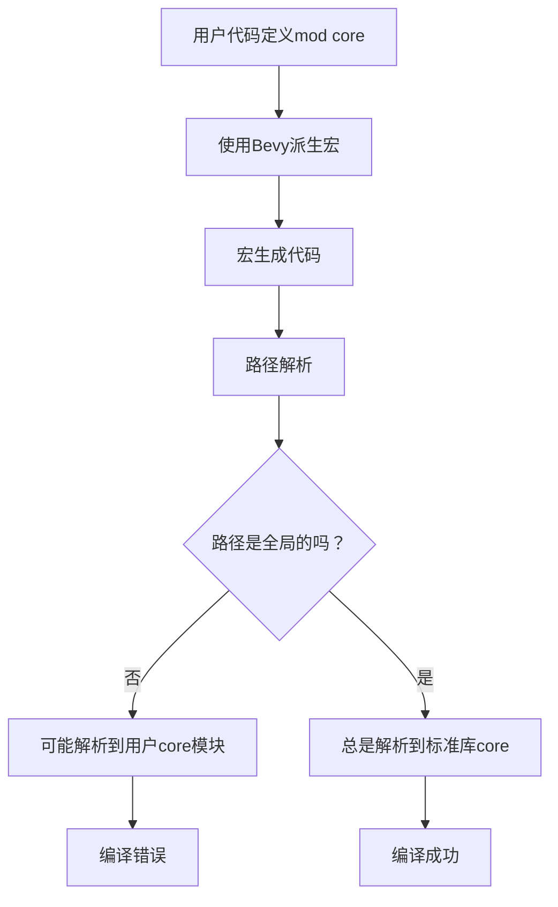

+++
title = "#22839 Fix non-global `core` references in macros"
date = "2026-02-07T00:00:00"
draft = false
template = "pull_request_page.html"
in_search_index = false

[extra]
current_language = "zh-cn"
available_languages = {"en" = { name = "English", url = "/pull_request/bevy/2026-02/pr-22839-en-20260207" }, "zh-cn" = { name = "中文", url = "/pull_request/bevy/2026-02/pr-22839-zh-cn-20260207" }}
+++

# Fix non-global `core` references in macros

## 基本信息
- **标题**: Fix non-global `core` references in macros
- **PR链接**: https://github.com/bevyengine/bevy/pull/22839
- **作者**: Pedro-0550
- **状态**: 已合并
- **标签**: C-Bug, D-Trivial, C-Code-Quality, S-Ready-For-Final-Review, A-Cross-Cutting, D-Macros
- **创建时间**: 2026-02-07T01:14:40Z
- **合并时间**: 2026-02-07T02:19:06Z
- **合并者**: alice-i-cecile

## 描述翻译

### 目标
某些面向用户的宏使用非全局路径生成对`core`的引用。如果下游crate在作用域中有另一个名为`core`的模块，它会遮蔽标准库的`core`模块，导致使用这些宏时出现编译错误。

本PR确保宏输出中对`core`的所有引用都使用全局路径。

### 解决方案
为所有尚未包含`::`前缀的`core`路径添加了`::`前缀。

### 测试
通过在本地运行编译CI进行测试。

## 这个PR的故事

这是一个关于Rust宏作用域和路径解析的典型问题。当开发者使用Bevy ECS的派生宏时，如果他们的代码中恰好定义了一个名为`core`的模块，就会遇到编译错误。这是因为宏生成的代码中使用了相对路径`core::xxx`，这个路径会被本地模块遮蔽。

问题出现在三个宏相关的文件中：`component.rs`、`lib.rs`和`query_data.rs`。这些文件包含了为Bevy的ECS系统生成代码的宏实现。在Rust中，路径解析遵循特定的规则：不带`::`前缀的路径是相对路径，从当前模块开始解析；带`::`前缀的路径是绝对路径，从crate根开始解析。

开发者面临的具体情况是：假设用户在自己的代码中定义了：
```rust
mod core {
    // 一些自定义内容
}
```

然后使用Bevy的派生宏：
```rust
#[derive(Component)]
struct MyComponent;
```

宏扩展后生成的代码会包含`core::mem::offset_of!`这样的调用。在用户的上下文中，这个`core`会解析到用户定义的`core`模块，而不是标准库的`core`，导致编译失败，因为用户模块中没有`mem`子模块。

解决方案很简单但重要：将所有宏生成代码中对标准库`core`的引用改为全局路径`::core`。这样无论用户代码中有没有名为`core`的模块，路径解析都会正确地找到标准库。

技术实现上，这个PR进行了小范围但关键的修改。每个改动都遵循相同的模式：在`core`前添加`::`前缀，确保路径是绝对的。例如在`component.rs`中：
```rust
// 修改前：
core::mem::offset_of!(Self, #relationship_member)
// 修改后：
::core::mem::offset_of!(Self, #relationship_member)
```

这些修改虽然看起来微不足道，但体现了Rust宏开发的一个重要原则：宏应该生成尽可能健壮的代码，避免依赖用户的命名空间结构。使用全局路径可以防止因名称冲突导致的意外行为。

从架构角度看，这个修复确保了Bevy的派生宏在不同使用场景下的一致性。无论用户如何组织他们的模块结构，宏生成的代码都能正确引用标准库功能。这是库代码质量的重要方面，特别是对于像Bevy这样可能被广泛使用的游戏引擎。

值得注意的是，这个PR涉及的是过程宏（proc-macro）的实现。过程宏在编译时运行，生成额外的代码。这意味着宏作者需要特别注意生成代码的健壮性，因为生成的代码会插入到用户的上下文中编译。

这个修复的技术影响是直接的：解决了特定场景下的编译错误。从更广的角度看，它提醒我们在编写宏时要注意路径解析的细节。虽然这个问题可能不会影响所有用户（只有那些定义了`core`模块的用户），但一旦出现，调试起来可能很困难，因为错误信息可能不直观。

## 可视化表示



## 关键文件变更

### `crates/bevy_ecs/macros/src/component.rs` (+4/-4)
这个文件处理`Component`派生宏和相关关系的实现。修改确保了关系访问器和默认值初始化中使用全局路径。

关键修改：
```rust
// 修改前：
core::mem::offset_of!(Self, #relationship_member)
#(#members: core::default::Default::default(),)*

// 修改后：
::core::mem::offset_of!(Self, #relationship_member)
#(#members: ::core::default::Default::default(),)*
```

### `crates/bevy_ecs/macros/src/lib.rs` (+3/-3)
这个文件包含`Bundle`派生宏。修改确保了组件ID收集和内存操作中使用全局路径。

关键修改：
```rust
// 修改前：
core::iter::empty()#(.chain(<#active_field_types as #ecs_path::bundle::Bundle>::component_ids(components)))*
ptr: #ecs_path::ptr::MovingPtr<'_, core::mem::MaybeUninit<Self>>

// 修改后：
::core::iter::empty()#(.chain(<#active_field_types as #ecs_path::bundle::Bundle>::component_ids(components)))*
ptr: #ecs_path::ptr::MovingPtr<'_, ::core::mem::MaybeUninit<Self>>
```

### `crates/bevy_ecs/macros/src/query_data.rs` (+3/-3)
这个文件处理查询数据派生宏。修改确保了迭代器访问方法中使用全局路径。

关键修改：
```rust
// 修改前：
impl core::iter::Iterator<Item = #path::query::EcsAccessType<'_>> {
    core::iter::empty() #(.chain(<#field_types>::iter_access(&_state.#field_aliases)))*
}

// 修改后：
impl ::core::iter::Iterator<Item = #path::query::EcsAccessType<'_>> {
    ::core::iter::empty() #(.chain(<#field_types>::iter_access(&_state.#field_aliases)))*
}
```

## 扩展阅读

1. Rust官方文档 - 模块和路径：https://doc.rust-lang.org/book/ch07-03-paths-for-referring-to-an-item-in-the-module-tree.html
2. Rust过程宏指南：https://doc.rust-lang.org/reference/procedural-macros.html
3. Bevy ECS宏实现：https://github.com/bevyengine/bevy/tree/main/crates/bevy_ecs/macros
4. Rust中的名称遮蔽（shadowing）和路径解析：https://doc.rust-lang.org/rust-by-example/scope/lifetime/explicit.html

## 完整代码差异
```diff
diff --git a/crates/bevy_ecs/macros/src/component.rs b/crates/bevy_ecs/macros/src/component.rs
index 857ec1e31530e..bdc9d84ff4996 100644
--- a/crates/bevy_ecs/macros/src/component.rs
+++ b/crates/bevy_ecs/macros/src/component.rs
@@ -231,7 +231,7 @@ pub fn derive_component(input: TokenStream) -> TokenStream {
                     // Safety: we pass valid offset of a field containing Entity (obtained via offset_off!)
                     unsafe {
                         #bevy_ecs_path::relationship::ComponentRelationshipAccessor::<Self>::relationship(
-                            core::mem::offset_of!(Self, #relationship_member)
+                            ::core::mem::offset_of!(Self, #relationship_member)
                         )
                     }
                 )
@@ -844,7 +844,7 @@ fn derive_relationship(
             #[inline]
             fn from(entity: #bevy_ecs_path::entity::Entity) -> Self {
                 Self {
-                    #(#members: core::default::Default::default(),)*
+                    #(#members: ::core::default::Default::default(),)*
                     #relationship_member: entity
                 }
             }
@@ -912,7 +912,7 @@ fn derive_relationship_target(
             #[inline]
             fn from_collection_risky(collection: Self::Collection) -> Self {
                 Self {
-                    #(#members: core::default::Default::default(),)*
+                    #(#members: ::core::default::Default::default(),)*
                     #relationship_member: collection
                 }
             }
diff --git a/crates/bevy_ecs/macros/src/lib.rs b/crates/bevy_ecs/macros/src/lib.rs
index 2e9889698919b..dbfccf1f00d9a 100644
--- a/crates/bevy_ecs/macros/src/lib.rs
+++ b/crates/bevy_ecs/macros/src/lib.rs
@@ -137,13 +137,13 @@ pub fn derive_bundle(input: TokenStream) -> TokenStream {
             fn component_ids(
                 components: &mut #ecs_path::component::ComponentsRegistrator,
             ) -> impl Iterator<Item = #ecs_path::component::ComponentId> + use<#(#generics_ty_list,)*> {
-                core::iter::empty()#(.chain(<#active_field_types as #ecs_path::bundle::Bundle>::component_ids(components)))*
+                ::core::iter::empty()#(.chain(<#active_field_types as #ecs_path::bundle::Bundle>::component_ids(components)))*
             }
 
             fn get_component_ids(
                 components: &#ecs_path::component::Components,
             ) -> impl Iterator<Item = Option<#ecs_path::component::ComponentId>> {
-                core::iter::empty()#(.chain(<#active_field_types as #ecs_path::bundle::Bundle>::get_component_ids(components)))*
+                ::core::iter::empty()#(.chain(<#active_field_types as #ecs_path::bundle::Bundle>::get_component_ids(components)))*
             }
         }
     };
@@ -173,7 +173,7 @@ pub fn derive_bundle(input: TokenStream) -> TokenStream {
             #[allow(unused_variables)]
             #[inline]
             unsafe fn apply_effect(
-                ptr: #ecs_path::ptr::MovingPtr<'_, core::mem::MaybeUninit<Self>>,
+                ptr: #ecs_path::ptr::MovingPtr<'_, ::core::mem::MaybeUninit<Self>>,
                 func: &mut #ecs_path::world::EntityWorldMut<'_>,
             ) {
             }
diff --git a/crates/bevy_ecs/macros/src/query_data.rs b/crates/bevy_ecs/macros/src/query_data.rs
index af58318e5883b..00dca42c483aa 100644
--- a/crates/bevy_ecs/macros/src/query_data.rs
+++ b/crates/bevy_ecs/macros/src/query_data.rs
@@ -463,8 +463,8 @@ pub fn derive_query_data_impl(input: TokenStream) -> TokenStream {
 
                     fn iter_access(
                         _state: &Self::State,
-                    ) -> impl core::iter::Iterator<Item = #path::query::EcsAccessType<'_>> {
-                        core::iter::empty() #(.chain(<#field_types>::iter_access(&_state.#field_aliases)))*
+                    ) -> impl ::core::iter::Iterator<Item = #path::query::EcsAccessType<'_>> {
+                        ::core::iter::empty() #(.chain(<#field_types>::iter_access(&_state.#field_aliases)))*
                     }
                 }
 
@@ -534,8 +534,8 @@ pub fn derive_query_data_impl(input: TokenStream) -> TokenStream {
 
                 fn iter_access(
                     _state: &Self::State,
-                ) -> impl core::iter::Iterator<Item = #path::query::EcsAccessType<'_>> {
-                    core::iter::empty() #(.chain(<#field_types>::iter_access(&_state.#field_aliases)))*
+                ) -> impl ::core::iter::Iterator<Item = #path::query::EcsAccessType<'_>> {
+                    ::core::iter::empty() #(.chain(<#field_types>::iter_access(&_state.#field_aliases)))*
                 }
             }
 
```