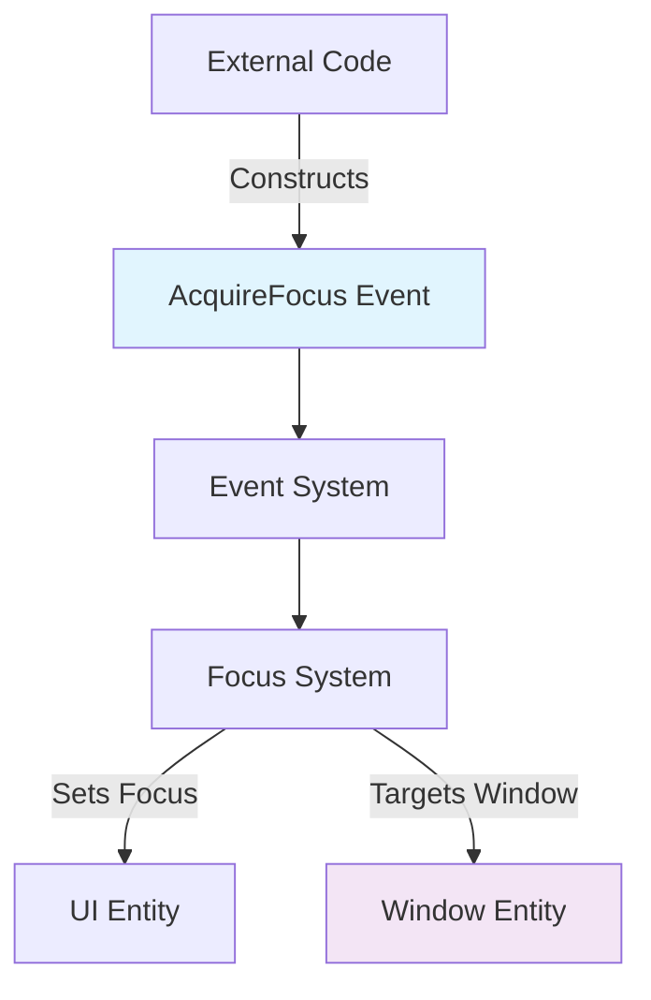

+++
title = "#22841 make acquire_focus possible to use from outside of bevy"
date = "2026-02-09T00:00:00"
draft = false
template = "pull_request_page.html"
in_search_index = true

[taxonomies]
list_display = ["show"]

[extra]
current_language = "en"
available_languages = {"en" = { name = "English", url = "/pull_request/bevy/2026-02/pr-22841-en-20260209" }, "zh-cn" = { name = "中文", url = "/pull_request/bevy/2026-02/pr-22841-zh-cn-20260209" }}
labels = ["D-Trivial", "A-UI", "C-Usability"]
+++

# make acquire_focus possible to use from outside of bevy

## Basic Information
- **Title**: make acquire_focus possible to use from outside of bevy
- **PR Link**: https://github.com/bevyengine/bevy/pull/22841
- **Author**: ada-x64
- **Status**: MERGED
- **Labels**: D-Trivial, A-UI, C-Usability, S-Ready-For-Final-Review
- **Created**: 2026-02-07T02:32:22Z
- **Merged**: 2026-02-09T22:40:25Z
- **Merged By**: alice-i-cecile

## Description Translation

# Objective
fixes #22837

## Solution

add pub

## The Story of This Pull Request

This PR addresses a simple but important API usability issue in Bevy's input focus system. The problem centered around the `AcquireFocus` struct, which is used to programmatically set focus on UI elements. The struct had inconsistent visibility modifiers that prevented external code from constructing instances.

Looking at the original implementation, the `AcquireFocus` struct was defined with two fields:

```rust
pub struct AcquireFocus {
    #[event_target]
    pub focused_entity: Entity,
    /// The primary window entity.
    window: Entity,
}
```

The issue was immediately apparent: while `focused_entity` was marked as `pub` (public), the `window` field remained private. This created a problem because Rust structs require all fields to be accessible when constructing an instance using struct literal syntax. When developers attempted to create an `AcquireFocus` event from outside the `bevy_input_focus` crate, they encountered a compilation error because they couldn't specify the `window` field.

The solution was straightforward: add the `pub` keyword to the `window` field. This change aligns with the existing pattern in the struct where `focused_entity` was already public, and it makes sense for an event struct to be fully constructible by external code. Events in Bevy's ECS system are meant to be created and sent by various systems, so restricting their construction would defeat their purpose.

The technical insight here is about API design consistency. When designing public-facing structs in Rust, especially those meant to be constructed by users, all fields should typically be public or the struct should provide a public constructor function. In this case, since `AcquireFocus` is an event type that users need to instantiate, making both fields public is the correct approach. The alternative would have been to add a `new()` method, but that would add unnecessary boilerplate for a simple data transfer object.

This change also highlights an important principle in API design: visibility should match the intended usage pattern. If a struct is meant to be constructed by external code, either all fields need to be public, or the struct needs to provide a constructor. The previous state where one field was public and another private created an unusable API - the struct looked constructible but wasn't.

The impact of this change is that developers can now properly create and send `AcquireFocus` events from their own code. This enables programmatic focus management in UI systems, which is essential for features like keyboard navigation, accessibility tools, and game menus that need to manage focus state based on game logic.

## Visual Representation



## Key Files Changed

**File**: `crates/bevy_input_focus/src/lib.rs`

**Change description**: Made the `window` field of the `AcquireFocus` struct public to allow external code to construct instances.

**Code diff**:
```rust
// File: crates/bevy_input_focus/src/lib.rs
// Before:
pub struct AcquireFocus {
    #[event_target]
    pub focused_entity: Entity,
    /// The primary window entity.
    window: Entity,
}

// After:
pub struct AcquireFocus {
    #[event_target]
    pub focused_entity: Entity,
    /// The primary window entity.
    pub window: Entity,
}
```

**Relationship to PR purpose**: This single-character change (`pub`) enables the entire purpose of the PR - allowing external code to use the `acquire_focus` functionality by making the struct fully constructible.

## Further Reading

- [Rust Visibility and Privacy Documentation](https://doc.rust-lang.org/reference/visibility-and-privacy.html)
- [Bevy Events System Documentation](https://bevyengine.org/learn/quick-start/events/)
- [Rust Struct Field Visibility Patterns](https://rust-lang.github.io/api-guidelines/type-safety.html#visibility-is-used-to-hide-trait-implementations-c-impl-private)
- [Bevy UI Focus System](https://docs.rs/bevy_ui/latest/bevy_ui/focus/index.html)

# Full Code Diff
```
diff --git a/crates/bevy_input_focus/src/lib.rs b/crates/bevy_input_focus/src/lib.rs
index 03d46a2a3c157..47efd05797875 100644
--- a/crates/bevy_input_focus/src/lib.rs
+++ b/crates/bevy_input_focus/src/lib.rs
@@ -169,7 +169,7 @@ pub struct AcquireFocus {
     #[event_target]
     pub focused_entity: Entity,
     /// The primary window entity.
-    window: Entity,
+    pub window: Entity,
 }
 
 #[derive(QueryData)]
```