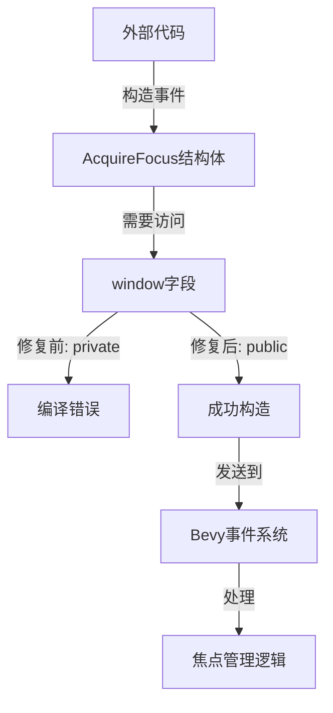

+++
title = "#22841 make acquire_focus possible to use from outside of bevy"
date = "2026-02-09T00:00:00"
draft = false
template = "pull_request_page.html"
in_search_index = false

[extra]
current_language = "zh-cn"
available_languages = {"en" = { name = "English", url = "/pull_request/bevy/2026-02/pr-22841-en-20260209" }, "zh-cn" = { name = "中文", url = "/pull_request/bevy/2026-02/pr-22841-zh-cn-20260209" }}
labels = ["D-Trivial", "A-UI", "C-Usability"]
+++

# Title
make acquire_focus possible to use from outside of bevy

## Basic Information
- **Title**: make acquire_focus possible to use from outside of bevy
- **PR Link**: https://github.com/bevyengine/bevy/pull/22841
- **Author**: ada-x64
- **Status**: MERGED
- **Labels**: D-Trivial, A-UI, C-Usability, S-Ready-For-Final-Review
- **Created**: 2026-02-07T02:32:22Z
- **Merged**: 2026-02-09T22:40:25Z
- **Merged By**: alice-i-cecile

## Description Translation
### Objective
修复 #22837

### 解决方案
添加 pub 修饰符

## The Story of This Pull Request

这是一个非常小而直接的问题修复PR，但它反映了一个在API设计中的重要原则：当系统的一部分被设计为可扩展或可定制时，相关的内部状态需要适当的可见性。

问题#22837报告了一个具体的场景：当开发者尝试在Bevy UI系统外部使用`AcquireFocus`事件时，遇到了编译错误。这是因为`AcquireFocus`结构体的`window`字段是私有的，导致无法从定义该结构体的模块外部构造这个事件。

查看代码背景，我们可以看到`AcquireFocus`是一个UI事件结构体，用于处理输入焦点。在Bevy的ECS架构中，事件是系统间通信的重要机制。当开发者想要手动触发一个焦点获取事件时，他们需要能够构造`AcquireFocus`实例并发送到事件系统中。

```rust
// 之前的代码无法在crate外部工作
pub struct AcquireFocus {
    #[event_target]
    pub focused_entity: Entity,
    /// The primary window entity.
    window: Entity, // 私有字段
}
```

这个问题的根本原因是API设计中的可见性不一致。结构体本身是公开的（`pub struct`），其中一个字段是公开的（`focused_entity`），但另一个关键字段`window`却是私有的。这种混合可见性使得结构体无法在模块外部被完整构造。

解决方案非常简单但必要：将`window`字段的可见性从私有改为公开。这确保了API的一致性，使得结构体的所有必要组件都可以从外部访问。

```rust
// 修复后的代码
pub struct AcquireFocus {
    #[event_target]
    pub focused_entity: Entity,
    /// The primary window entity.
    pub window: Entity, // 现在公开了
}
```

从工程角度来看，这个变化虽然微小，但解决了API可用性的一个关键障碍。在游戏引擎这样的框架中，提供足够的扩展点让开发者能够自定义行为是非常重要的。如果核心事件类型无法在框架外部构造，那么系统的可扩展性就会受到限制。

这个修复也体现了API设计的一个良好实践：如果一个结构体被标记为`pub`，并且预期会在模块外部被构造，那么它的所有必要字段通常也应该有适当的可见性。当然，这不是绝对的规则——有些情况下可能需要保持某些字段私有以维护不变量——但对于`AcquireFocus`这样的简单数据传输对象，所有字段都应该是公开的。

值得注意的技术细节是`#[event_target]`属性。这个属性可能用于标记事件的目标实体，但即使有这个属性，字段仍然需要适当的可见性才能被外部代码访问。属性宏不会自动改变字段的可见性。

这个修复没有引入性能影响或破坏性变化。它纯粹是一个可见性调整，使得现有的API更加完整和可用。对于尝试在Bevy UI系统外部集成焦点管理功能的开发者来说，这个修复解决了实际的开发障碍。

## Visual Representation



## Key Files Changed

**crates/bevy_input_focus/src/lib.rs** (+1/-1)

这是唯一修改的文件。变化非常简单：将`AcquireFocus`结构体的`window`字段从私有改为公开。

1. **修改内容**：将`window`字段的可见性从私有改为公开
2. **代码差异**：
```rust
// 修改前:
pub struct AcquireFocus {
    #[event_target]
    pub focused_entity: Entity,
    /// The primary window entity.
    window: Entity,  // 私有字段
}

// 修改后:
pub struct AcquireFocus {
    #[event_target]
    pub focused_entity: Entity,
    /// The primary window entity.
    pub window: Entity,  // 现在公开了
}
```
3. **与PR目的的关系**：这个直接的变化解决了问题#22837中报告的核心问题，使得`AcquireFocus`事件可以在Bevy UI系统外部被构造和使用。

## Further Reading

1. **Rust可见性规则**：理解Rust的模块系统和可见性修饰符（`pub`, `pub(crate)`, 等）对于设计良好的库API至关重要。
2. **Bevy事件系统文档**：了解Bevy中事件是如何工作的，包括事件的发送、接收和处理。
3. **ECS架构中的系统间通信**：在实体组件系统（ECS）架构中，事件是系统之间进行通信的常用模式，了解这种模式的最佳实践。
4. **API设计原则**：设计易于使用且难以误用的API是库开发中的关键技能，包括适当的封装和信息隐藏决策。